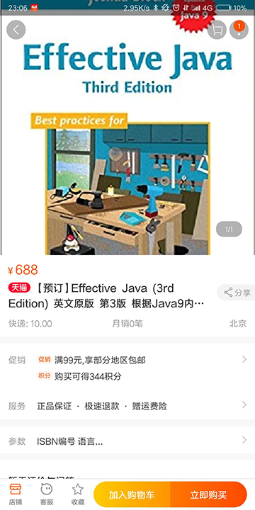

# Effecitive Java ( Third Edition ) 

## CHAPTER 2 : Creating and Destroying Objects 创建和销毁对象

### Item 1 : Consider static factory methods instead of constructors
第一条：考虑用静态工厂方法代替构造器

### Item 2 : Consider a builder when faced with many constructor parameters

### Item 3 : Enforce the singleton property with a private constructor or an enum type 

### Item 4 : Enforce noninstantiability with a private constructor

### Item 5 : Prefer dependency injection to hardwiring resources

### Item 6 : Avoid creating unnecessary objects

### Item 7 : Eliminate obsolete object references

### Item 8 : Avoid finalizers and cleaners

### Item 9 : 

## CHAPTER 3 : Methods Common to All Objects 