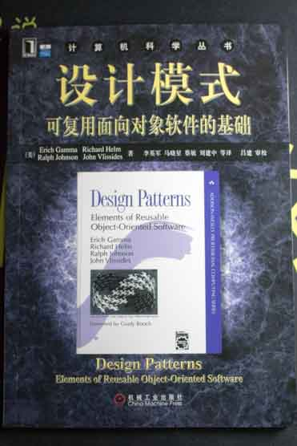
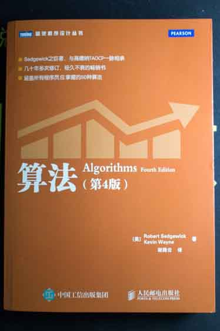

# GitReadingNotes（技术类书籍-读书笔记）

## INDEX

| 编号 | 书名| 进度 |
|:-:|-|:-:|
| 1 | [《Java 核心技术 卷I》（原书第十版）（*Core Java Volume I——Fundamentals (10th Edition)*）](https://github.com/gdut-yy/GitReadingNotes/tree/master/CJV-I10) | 70% |
| 2 | [《Java 核心技术 卷II》（原书第十版）（*Core Java Volume II——Advance Features (10th Edition)*）](https://github.com/gdut-yy/GitReadingNotes/tree/master/CJV-II10) | 0% |
| 3 | [*Effecitive Java (Third Edition)*](https://github.com/gdut-yy/GitReadingNotes/tree/master/EJ3) | 50% |
| 4 | [《Java 编程思想（第4版）》（*Thinking in Java (Fourth Edition)*）](https://github.com/gdut-yy/GitReadingNotes/tree/master/TIJ4) | 50% |
| 5 | [《大话设计模式》](https://github.com/gdut-yy/GitReadingNotes/tree/master/DAHUASHEJIMOSHI) | 80% |
| 6 | [《大话数据结构》](https://github.com/gdut-yy/GitReadingNotes/tree/master/DAHUASHUJUJIEGOU) | 70%  |
| 7 | [《Java 并发编程实战》（*Java Concurrency in Practice*）](https://github.com/gdut-yy/GitReadingNotes/tree/master/JCP) | 0%|
| 8 | [《设计模式：可复用面向对象软件的基础》（*GoF*）](https://github.com/gdut-yy/GitReadingNotes/tree/master/GoF)| 0 % |
| 9 | [《算法导论（原书第3版）》（*Introduction to Algorithms(Third Edition)*）](https://github.com/gdut-yy/GitReadingNotes/tree/master/ItoAlgorithms3)| 0% |
| 10 | [《算法（第4版）》（*Algorithms(Fourth Edition)*）](https://github.com/gdut-yy/GitReadingNotes/tree/master/Algorithms4)| 0% |
| 11 | [《C程序设计语言（第2版·新版）》（*K&R(Second Edition)*）](https://github.com/gdut-yy/GitReadingNotes/tree/master/K&R2)| 80% |

## 后记
无他。

书读多了会忘。

手写笔记不堪入目，遂用 GitHub。

—— 2018年7月26日

## 书目图

### 《Java 核心技术 卷I》（原书第十版）（*Core Java Volume I——Fundamentals (10th Edition)*）

### 《Java 核心技术 卷II》（原书第十版）（*Core Java Volume II——Advance Features (10th Edition)*）

### *Effecitive Java (Third Edition)*

### 《Java 编程思想（第4版）》（*Thinking in Java (Fourth Edition)*）

### 《大话设计模式》

### 《大话数据结构》

### 《Java 并发编程实战》（*Java Concurrency in Practice*）

### 《设计模式：可复用面向对象软件的基础》（*GoF*）

## 《算法导论（原书第3版）》（*Introduction to Algorithms(Third Edition)*）

## 《算法（第4版）》（*Algorithms(Fourth Edition)*）

## 《C程序设计语言（第2版·新版）》（*K&R(Second Edition)*）

