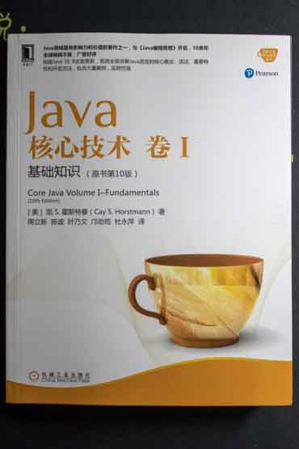

# 《Java 核心技术 卷I》（原书第十版）（*Core Java Volume I——Fundamentals (10th Edition)*）

## 目录

## 第 1 章 Java 程序设计概述
## 第 2 章 Java 程序设计环境
## 第 3 章 Java 的基本程序设计结构、

因为输入是可见的，所以 Scanneer 类不适用于从控制台读取密码。 Java SE 6 特别引入了 Console 类实现这个目的。

	Console cons = System.console();
    String username = cons.readLine("User name:");
    char[] passwd = cons.readPassword("Password:");

## 第 4 章 对象与类

## 第 5 章 继承

### 5.7 反射

	import java.lang.reflect.Constructor;
	import java.lang.reflect.Field;
	import java.lang.reflect.Method;
	import java.lang.reflect.Modifier;
	import java.util.Scanner;
	
	public class ReflectionTest {
	    public static void main(String[] args) {
	        String name = "java.util.Date";
	//        if(args.length>0){
	//            name=args[0];
	//        }else{
	//            Scanner in = new Scanner(System.in);
	//            System.out.println("Enter class name(e.g. java.util.Date):");
	//            name=in.next();
	//        }
	
	        try {
	            Class cl = Class.forName(name);
	            Class supercl = cl.getSuperclass();
	            String modifiers = Modifier.toString(cl.getModifiers());
	            if (modifiers.length() > 0) {
	                System.out.print(modifiers + " ");
	            }
	            System.out.print("class " + name);
	            if (supercl != null && supercl != Object.class) {
	                System.out.print(" extends " + supercl.getName());
	            }
	            System.out.print("\n{\n");
	            printConstructors(cl);
	            System.out.println();
	            printMethods(cl);
	            System.out.println();
	            paintFileds(cl);
	            System.out.println("}");
	        } catch (ClassNotFoundException e) {
	            e.printStackTrace();
	        }
	        System.exit(0);
	    }
	
	    // 打印类中的所有构造器
	    public static void printConstructors(Class cl) {
	        Constructor[] constructors = cl.getDeclaredConstructors();
	
	        for (Constructor c : constructors) {
	            String name = c.getName();
	            System.out.print("    ");
	            String modifiers = Modifier.toString(c.getModifiers());
	            if (modifiers.length() > 0) {
	                System.out.print(modifiers + " ");
	            }
	            System.out.print(name + "(");
	
	            Class[] paramTypes = c.getParameterTypes();
	            for (int j = 0; j < paramTypes.length; j++) {
	                if (j > 0) {
	                    System.out.print(", ");
	                }
	                System.out.print(paramTypes[j].getName());
	            }
	            System.out.println(");");
	        }
	    }
	
	    // 打印类中的所有方法
	    public static void printMethods(Class cl) {
	        Method[] methods = cl.getDeclaredMethods();
	
	        for (Method m : methods) {
	            Class retType = m.getReturnType();
	            String name = m.getName();
	
	            System.out.print("    ");
	
	            // 打印 修饰符，返回类型 和 方法名
	            String modifiers = Modifier.toString(m.getModifiers());
	            if (modifiers.length() > 0) {
	                System.out.print(modifiers + " ");
	            }
	            System.out.print(retType.getName() + " " + name + "(");
	
	            // 打印 参数
	            Class[] paramTypes = m.getParameterTypes();
	            for (int j = 0; j < paramTypes.length; j++) {
	                if (j > 0) {
	                    System.out.print(", ");
	                }
	                System.out.print(paramTypes[j].getName());
	            }
	            System.out.println(");");
	        }
	    }
	
	    // 打印类中的所有域
	    public static void paintFileds(Class cl) {
	        Field[] fields = cl.getFields();
	
	        for (Field f : fields) {
	            Class type = f.getType();
	            String name = f.getName();
	            System.out.print("    ");
	            String modifiers = Modifier.toString(f.getModifiers());
	            if (modifiers.length() > 0) {
	                System.out.print(modifiers + " ");
	            }
	            System.out.println(type.getName() + " " + name + ";");
	        }
	    }
	}

## 第 6 章 接口、lambda 表达式与内部类

## 第 7 章 异常、断言和日志

## 第 8 章 泛型结构

## 第 9 章 集合

## 第 10 章 图形程序设计

## 第 11 章 事件处理

## 第 12 章 Swing 用户界面组件

10 - 12 章先暂时略过

## 第 13 章 部署 Java 应用程序

## 第 14 章 并发

