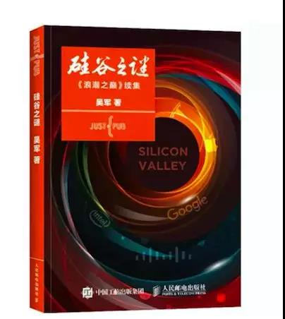

# 《硅谷之谜》 吴军 著

## 书评
吴军，博士，著名自然语言处理和搜索专家，硅谷风险投资人。吴军博士曾经担任Google资深研究员，设计了Google中、日、韩文搜索算法以及Google的自然语言分析器。2010-2012年期间担任腾讯负责搜索和搜索广告等业务的副总裁，后回到Google负责计算机自动问答项目。

一本颠覆人们对信息时代的认识、对创新和创业的理解的好书。作者吴军通过介绍硅谷成功的秘诀，揭示了信息时代的特点和方法论。

## 第一章 硅谷的奇迹
> 硅谷地区面积狭小，人口只占美国总人口的1.5%。但是，就是这样一个地区却创造出了人类科技史和工业史上的奇迹。这些传奇故事每天都在发生，那些传奇人物每天都在不断地涌现。硅谷始终不竭的创新活力，吸引着世界的目光，让人渴望探知“庐山真面目”。

- 第一节 硅谷的明星公司
- 第二节 硅谷的顶尖大学
- 第三节 硅谷的风险投资
- 第四节 硅谷的产业变迁

## 第二章 宛若似真的分析
> 为什么硅谷会出现在旧金山湾区？为什么全世界其他的地方难以复制它的模式，或者说没有出现一个可以和它匹敌的创新中心？目前，各种媒体在分析硅谷时，都做了一些人为的取舍和缩放，故意放大那些冠冕堂皇却并非关键的原因，却又把一些非常重要而拿不上台面的原因给回避掉了，这便产生了误导，以至于很多科技园在试图复制硅谷时都难以成功。

- 第一节 硅谷成功的气候说
- 第二节 斯坦福之说
- 第三节 风险投资说
- 第四节 政府扶持说
- 第五节 知识产权保护说
- 第六节 波士顿地区并没有出现硅谷

## 第三章 硅谷的起源
> IBM 公司恰好在计算机技术刚刚起步时就在美国西海岸开设了研发中心，从而让旧金山湾区占到了天时；而当时在世界气候最好的地方居然空着几十平方公里的土地，可以提供给未来的新技术公司使用，因此又占到了地利；一个诺贝尔奖获得者靠自己的名气聚拢了一批世界上最优秀的技术人才，然后又把他们赶出去办了公司，这件事为湾区日后成为硅谷准备好了人的因素。

- 第一节 硅谷前传
- 第二节 天时与地利
- 第三节 怪才与叛徒
- 第四节 仙童公司

## 第四章 硅谷的发展
> 硅谷在 3.0 时代比以往任何时候都更繁荣，以至于在 2008 —— 2009 年金融危机时它可以独善其身，这似乎已经跳出了世界各地区都难以避免的 “从兴起，到繁荣，再到衰落” 的周期律。在硅谷 3.0 时代，创业不再是一件难事，创业作者们只要做好两件事即可：第一，想出真正有创新的点子，并拥有过硬的技术；第二，以最快的速度去实现它。

- 第一节 硅谷 1.0 —— 信息革命的前夜
- 第二节 硅谷 2.0 —— 信息时代 
- 第三节 硅谷风险投资自身的发展
- 第四节 硅谷 3.0 —— 后互联网时代

## 第五章 硅谷的奥秘（上）——硅谷的独特之处
> 外界谈论硅谷时，总是会提到 “车库文化” 这样一个名词，因为在早期一些介绍硅谷的文章和书中是这样宣传的。其大意是，一些辞职的员工（或尚未全职工作过的年轻人），为了节省办公成本，租下一户人家的车库作为办公室来创业，最后获得了成功。这个说法颇具误导性，是关于硅谷的几个大谎言之一，因为大部分从硅谷走出的伟大公司都不是这样办起来的。

- 第一节 叛逆和宽容
- 第二节 多元文化
- 第三节 拒绝平庸

## 第六章 硅谷的奥秘（下）——硅谷的企业文化和情怀
> 硅谷的人们常常会用一种试错法来尝试新的东西，那里的人常常开动脑子把很多可能性都想到后，不断尝试，直到成功。采样这种方法去创新，需要有人为失败买单，这些买单者通常是大公司、风险投资机构和做事情的那些人。宽容失败带来的好处是，创新者会走通其他人不敢走的路。

- 第一节 宽容失败的文化
- 第二节 工程师文化
- 第三节 不迷信权威
- 第四节 扁平式管理
- 第五节 世界的情怀

## 第七章 工业时代的科学基础
> 思维的形成需要时间，摆脱对一种思维的依赖同样需要时间。虽然现在已经是信息时代，很多人也言必称的信息时代，但是其思维和行为方式依然难以摆脱工业时代形成的拥有生产资料的那种优越感。比如很多地方政府在创办科技园时以提供免费场地作为吸引人才的诱饵，骨子里便还是认定场地这种生产资料在经营活动中会起决定性作用，而真正伟大的公司却不是这样扶植出来的。

- 第一节 牛顿和机械思维
- 第二节 泰勒管理理论
- 第三节 现代工业企业管理制度剖析

## 第八章 信息时代的科学基础
> 对于信息时代企业和商业出现的各种现象，很容易用系统论、信息论和控制论解释清楚。硅谷有幸诞生在三论被提出来之后，因此它采用了一种全新的方法论来指导其发展，这是硅谷成功的根本原因。硅谷成功的奥秘对于中国的借鉴意义在于，我们需要承认各种不确定性，需要利用数据和信息消除它们，而不是采用过去那种顶层设计的方式去解决问题。

- 第一节 三论与管理
- 第二节 从预测到反应，从局部到整体，从控制到通信
- 第三节 信息时代的企业制度剖析
- 第四节 大数据思维和互联网思维的本质