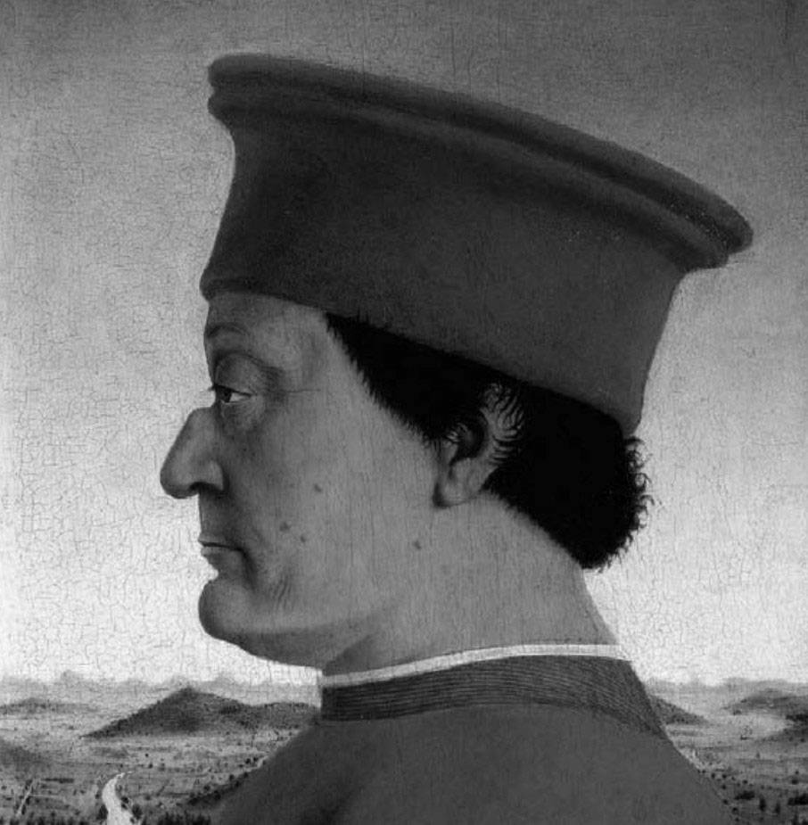
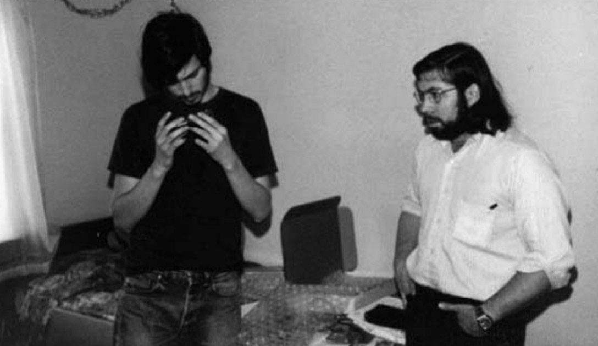
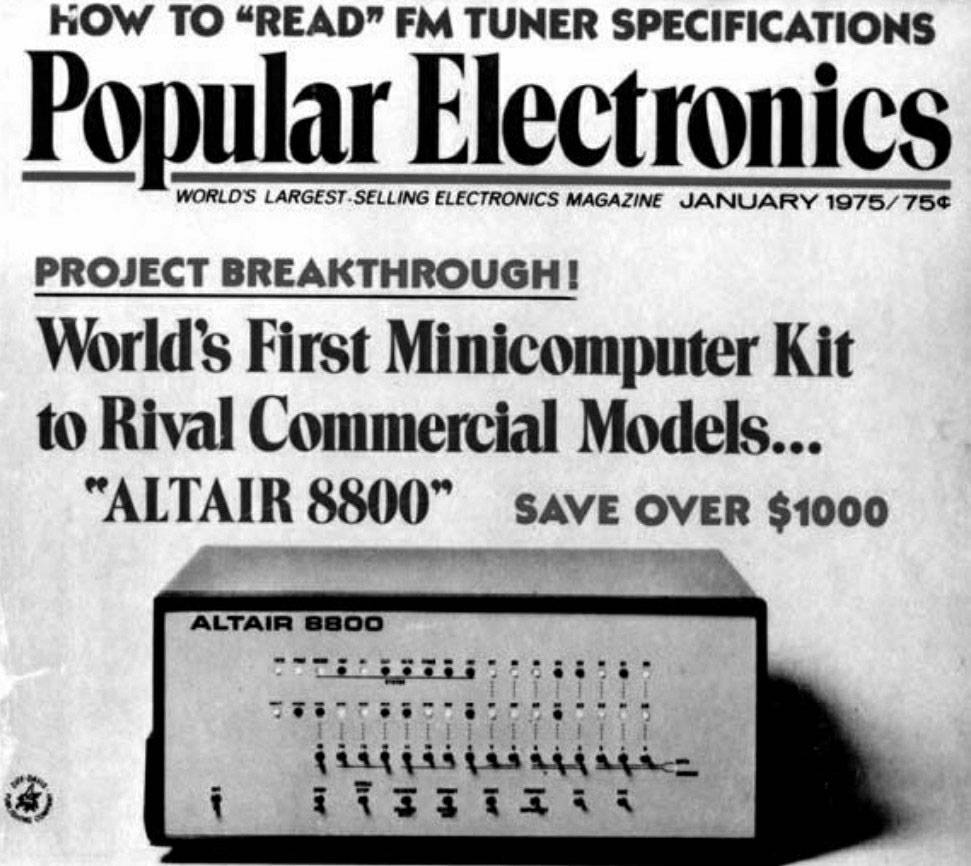
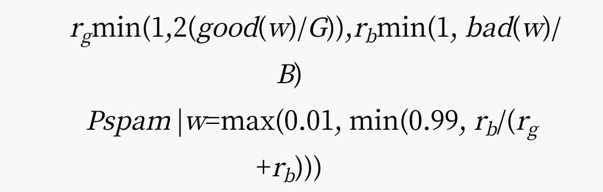
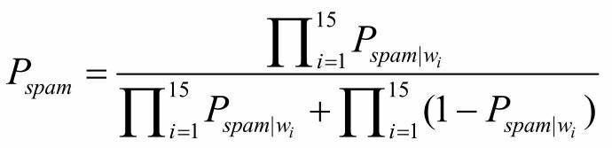

# 《黑客与画家》 Paul Graham 著


## 书评
本书是硅谷创业之父Paul Graham 的文集，主要介绍黑客即优秀程序员的爱好和动机，讨论黑客成长、黑客对世界的贡献以及编程语言和黑客工作方法等所有对计算机时代感兴趣的人的一些话题。书中的内容不但有助于了解计算机编程的本质、互联网行业的规则，还会帮助读者了解我们这个时代，迫使读者独立思考。

2019春节初读于广州图书馆，再读于微信读书。

1-9章相对哲学，10-15作者Lisp吹。

## 第 1 章 为什么书呆子不受欢迎

初中时，我和好友里奇画了一张学校食堂的餐桌分布图，每张桌子都标上了人气指数。这件事的难度并不高，因为选择坐在一起吃饭的人受瞩目程度往往都很接近。我们把所有桌子从A到E分成五等。坐在A桌的人不是校足球队的成员，就是啦啦队的成员。而E桌的好像都有一点轻微的唐氏综合症，那时我们管这种症状叫“弱智”。 

我和里奇坐在D桌。一般来说，只要你不是外貌猥琐，这就是你能分到的最低档次的桌子了。我们把自己的桌子列为D桌，倒不是故意谦虚，而是无法自欺欺人。因为学校里每个人的级别都是明摆着的，我们想骗自己也骗不了。 

我后来认识很多人，读书的时候都被称为书呆子。从他们身上我发现，“书呆子”与“高智商”有强烈的正相关关系。而这些人在中学里都是不受欢迎的学生，你越喜欢读书，就越不受别人的欢迎，因此“书呆子”和“受欢迎”之间，有一种更强烈的负相关关系。这样看来，“高智商”似乎导致了你不受欢迎。 

为什么会这样？要是你眼下还在读中学，你一定会觉得这个问题很蠢。无可争议的事实就是，除了这样意外，似乎很难想象还能有什么别的结果。但是，的确会出现别样的情况。比如，在小学里，聪明的学生就没有受到排挤。再比如，毕业后踏上社会，聪明也不是一件坏事。而且，据我所知，在大多数国家，事情也没用如此严重。只有在典型的美国中学，做一个聪明的学生才是一件麻烦事，你的日子会很不好过。这究竟是为什么？ 

解开这个谜的关键是吧问题换一种提法。为什么聪明的小孩没有让自己变得受欢迎？如果他们真的很聪明，为什么找不到受欢迎的诀窍呢？他们在标准化测试中表现得这么好，为什么就不能再这方面也大获成功呢？ 

有一种观点认为，其他小孩妒忌聪明学生，所以聪明的学生不可能受到欢迎。我倒希望这种解释是对的。回想起来，要是初中里真的有人妒忌我，那么他们一定费了很大力气才把这种妒忌隐藏得无法发现。而且，在任何情况下，如果聪明真的令他人妒忌，这反而会招来女生。因为女生喜欢被其他男生妒忌的男生。 

在我就读过的学校，聪明根本就是无足轻重的一样东西。同学们既不看重它，也不唾弃它。如果别的事情都相同，那么大家还是愿意自己变得聪明一点，因为这总比做个笨人好。但是总的来说，智力在大家心中的分量远远不如相貌、魅力和运动能力的分量重。 

所以，如果智力本身与“受欢迎”无关，为什么聪明的小孩一直不受同龄人的欢迎呢？我认为，答案就是他们真的不想让自己受欢迎。 

如果当时有人告诉我这个答案，我一定会嘲笑他。在学校里不受欢迎，你的日子就很难过，有人甚至因此自杀。所以，要是你跟我说，是我本人不想受欢迎，那就好比你在说，我再沙漠里快渴死了，却又不想喝水。别搞错了，让自己更受欢迎，这才是我要的。 

但是事实上，我并不是那么强烈地渴望这个。我更想追求的是另一件事————聪明。这不仅仅意味着在学校得到好成绩（虽然某种程度上这也挺重要）。我真正想要的是，能够设计奇妙的火箭、写出漂亮的文章、理解编程原理。一句话，我想要做伟大的事情。 

那时，我从没试过将梦想分门别类、一一排序。要是我做了，就会一眼看出聪明是排在最前面的。如果有人许诺，是我一举成为全校最受瞩目的学生，代价是从此智力平庸（请允许我在这里自命不凡），我是绝不会答应的。 

虽然“书呆子”饱受不受欢迎之苦，但是为了解除痛苦而让他们放弃“聪明”，我想大多数人是不会愿意的。对他们来说平庸的智力是不可忍受的。不过，要是换了别的孩子，情况就不一样了，大多数人会接受这笔交易。对于很多人来说，这反而是更上一层楼的机会。即使是那些智力排名在前20%的学生（我在这里假设智力可以测量，那时的人们似乎都相信这一点），谁不愿意用30分的成绩换来别人的友爱和钦佩？ 

我认为，这就是问题的根源。“书呆子”的目标具有两重性。他们毫无疑问想让自己受欢迎，但是他们更愿意让自己聪明。“受欢迎” 并不是你在课后时间随便做一做就能实现的，尤其是在美国的中学中，在这里，所有人为了个人魅力都会进行激烈竞争。 

文艺复兴时期的代表人物阿尔伯蒂有一句名言：“任何一种艺术，不管是否重要，如果你想要在该领域出类拔萃，就必须全身心投入。”我很想知道，世界上是否还有人比美国的中学生在塑造个人魅力方面更加孜孜不倦、精益求精。相比之下，美国海军的海豹突击队（Navy SEALS）成员和神经外科的住院医生都成了懒汉。他们至少还有假期，有些人甚至还有业余爱好。但是，一个美国的青少年在醒着的每一分钟，都在琢磨怎样才能更受欢迎，一年365天，天天如此。 

我并不是说这些青少年有一这样做。某些人确实是，小小年纪就成为了权谋家，但是大多数人不是。我在这里真正想要表达的是，青少年每时每刻都想融入群体之中。 

举例来说，青少年往往很关注服饰。他们这样做并不是有意让自己赢得大众，他们的目的只是要穿得好看。但是穿给谁看呢？无非就是其他小孩。同伴的意见成为他们判别事物的标准，这不仅体现在衣着上，还体现在他们做的几乎每一件事情上，就连走路的姿势也不例外。所以，他们为了把所有事情“做对”，所付出的任何努力，不管是有意还是无意，实际上都等同于努力在使自己变得更受欢迎。 

书呆子没有认识到这一点。他们没有认识到“受欢迎”需要付出如此之多的努力。一般来说，对于那些高度困难的领域，只有身处其中的人，才能意识到成功需要不间断（虽然未必是自觉的）付出。举例来说，大多数人似乎认为，绘画能力与生俱来，画家就像高个子一样，是天生的。事实上，大多数“会画”的人，本身就很喜欢画画，将许许多多时间投入其中，这就是为什么他们擅长画画的原因。同样的，受欢迎也不是天生的，而是要你自己做出来的。 

<div style="margin: 0 auto; width: 50%;">
    
</div>
<p align="center">图1-1 Gateway髙中的象棋俱乐部，1981年。左上角的人就是我 </p>

书呆子不受欢迎的真正原因，是他们脑子里想着别的事情。他们的注意力都放在读书或者观察世界上面，而不是放在穿衣打扮、开晚会上面。他们就像头顶一杯水来踢足球，一边踢球，一边拼命保持不让水洒出来。其他人都在一门心思玩足球，遇到这样的对手，自然能够毫不费力地击败，并且心里还奇怪，对方怎么如此无能。 

就算书呆子心里想着变得与其他小孩一样受欢迎，做起来确是难上加难。因为那些受欢迎的小孩，从小就在琢磨如何受欢迎，打心底里追求这个。但是，书呆子从小琢磨的却是如何更聪明，心底里也是这样追求的。这都是受父母的影响，书呆子被教导追求正确答案，而受欢迎的小孩被教导讨人喜欢。 

到目前为止，我一直把“聪明的学生”和“书呆子”当做同义词，好像它们完全可以换着用。事实上，只有在我上面谈到的这种环境中才能这样使用。所谓“书呆子”，其实只是指这个人的社交能力不够强。但是，你到底需要多“强”的社交技能，取决于你所处的环境。在普通的美国学校中，成为“强人”的标准高得吓人（或者至少是十分特别），即使你不是很“呆”的人，相比之下，也只能算是呆子了。 

仅有很少的聪明小孩，能够分配出足够的心思，去关心如何让自己受欢迎。他们往往碰巧还具有俊俏的外表、运动员的体格，或者受人瞩目的兄弟姐妹。不然的话，你就别无选择，只能成为书呆子了。这就是为什么聪明的小孩在青少年时期，比如11岁到17岁，有着一生中最糟的人生经历。人生的这个时期比其他任何时期更多地受到你受欢迎程度的影响。 

11岁以前，小孩的生活由家长主导，其他孩子的影响有限。孩子们不是不关心小学里其他同学的想法，但是后者不具有决定性影响。小学毕业以后，这种情形开始发生变化。 

到了11岁左右，孩子们逐渐把家庭生活当做寻常事了。他们在同伴中开辟了一个新的世界，并认为那个世界才是重要的。实际上，如果他们在家里与父母发生冲突，反而能在那个新的世界中挣得面子，而他们也确实更在乎那个世界。 

但是，问题在于，孩子们自己创造出来的世界是一个非常原始的世界。如果你听任一群11岁的孩子自行其是，最后就会发生小说《蝇王》中的情景。我同许多美国孩子一样，在学校里就被要求阅读此书。这可能不是巧合，有人可能希望借此向我们之处，我们这些孩子就是“野蛮人”，我们自己创造的世界是一个残酷和愚蠢的世界。对当时的我来说，领会这些意思有点太难了。虽然这本书读起来让人觉得完全可信，但是我一点儿没有读出文字背后的意思。当年，他们还不如直截了当告诉我们，我们这些孩子就是“野蛮人”，我们的世界愚不可及。 

要是不受欢迎仅仅意味着不受到关注，书呆子们可能觉得还能忍受。不幸的是，在学校里不受欢迎等同于被歧视和被欺负。 

为什么会被歧视和欺负？所有现在还在学校里读书的人可能会又一次觉得，怎么会有人问出这么蠢的问题。怎么可能会有其他结果。一般来说，成年人就不会去欺负书呆子。为什么小孩子会这样做呢？ 

一部分原因是，青少年在心理上还没有摆脱儿童状态，许多人都会残忍地对待他人。他们觉得折磨书呆子和拔掉一条蜘蛛腿一样好玩。在一个人产生良知之前，折磨就是一种娱乐。 

孩子们欺负书呆子的另一个原因是为了让自己感到好受一些。当你踩水的时候，你把水踩下去，你的身体就会被托起来。同样，在任何社会等级制度中，那些对自己没自信的人就会通过虐待他们眼中的下等人来突显自己的身份。我已经意识到，正是因为这个原因，在美国社会中底层白人是对待黑人最残酷的群体。 

但是我认为，孩子们欺负书呆子的主要原因业余追求“受欢迎”的心里有关。怎样才能让他自己更受欢迎？个人魅力知识很小的一方面，你应该更多地考虑如何结盟。秘诀就是不停地设法使自己与其他受欢迎的人变得关系更密切。没有什么比一个共同的敌人更能使得人们团结起来了。 

这就好比一个政客，他想让选民忘记糟糕的国内局势，方法就是为国家找出一个敌人，哪怕敌人并不真的存在，他也可以创造一个出来。一群人在一起，挑出一个书呆子，居高临下地欺负他，就会把彼此联系起来。一起攻击一个外人，所有人因此就都成了自己人。这就是为什么最恶劣的倚强凌弱的事件都与团体有关的原因。随便找一个书呆子，他都会告诉你，一群人的虐待比一个人的虐待残酷得多。 

如果其中还有一丝安慰，那就是书呆子不妨记住，这种虐待不是针对个人的。一群孩子成群结伙地欺负你，那并不是因为你做错了什么，而是因为这一伙人需要找一件事一起干，这就好像一群人成群结伙地去打猎一样。他们实际上并不恨你，他们只是需要一个共同的目标。 

因为书呆子是不受欢迎的，处在学校的底层，所以全校学生都把书呆子当作一个可供欺负的安全目标。如果我没记错的话，最受欢迎的孩子并不欺负书呆子，他们不需要靠踩在书呆子身上来垫高自己。大部分的欺负来自处于下一等级的学生，那些焦虑的中间层。 

麻烦的是，这样的人数量庞大。受欢迎的学生的分布并不是金字塔形的，而是像一个倒放的梨子，底部逐渐收窄。最不受欢迎的人数相当少。（我相信，在我们画的餐桌分布图中，称得上D桌的，只有我所在的那一桌。）所以，想要欺负书呆子的人比被欺负的书呆子多得多。 

与不受欢迎的小孩保持距离，可以为你加分；那么与他们关系密切，就会为你减分。我认识的一位女性说，他在高中时对书呆子有好感，但是害怕被人看到她与书呆子说话，因为其他女孩会因此取笑她。不受欢迎是一种传染病，虽然善良的孩子不会去欺负书呆子，但是为了保护自己，也依然会与书呆子保持距离。 

难怪聪明的小孩读中学时往往是不快乐的。他们有其他的兴趣，没有多余的精力用来使自己更受欢迎。你在其他地方有所得，就会在这个地方有所失。不受欢迎使得书呆子成为全校攻击的目标。令人惊奇的是，这种噩梦般的情景并非出自任何有预谋的恶意，而仅仅因为这个特殊的环境。 

对我而言，最糟糕的日子是初中。孩子们内部的世界刚刚形成，一切都很严酷，聪明的孩子与普通的孩子，人与人之间的差异慢慢开始显露。几乎每一个和我讨论过的人都同意，人生的最糟糕时期是在11岁到14岁。 

在我读的学校，八年级的时候（也就是我12~13岁的那一年）曾经发生过一件一起轰动的事情。有一个老师在等校车的时候，偶然听到一群女生在议论某个书呆子如何被欺负，她深感震惊，第二天就向全班发表了言辞恳切的呼吁，请大家不要如此残忍地对待同学。 

她的呼吁并没有产生实际的效果。那时，最触动我的是，她居然对这件事感到震惊。这是不是意味着她以前对此一无所闻？她觉得这一切是不正常的？ 

没错，成年人不知道孩子们内部发生的事。认识到这一点很重要。在抽象意义上，成年人知道孩子的行为有时是极端残酷的，这正如我们在抽象意义上知道贫穷国家的人民生活极端艰难。但是，像所有人一样，成年人不喜欢揪住不放这种令人不快的事实。你不去埋头探寻，就不会发现具体的证据，就会永远以为这件事是抽象的。 

公立学校的老师很像监狱的狱卒。看管监狱的人主要关心的是犯人都待在自己应该待的位置。然后，让犯人有东西吃，尽可能不要发生斗殴和伤害事件，这就可以了。除此之外，他们一件事也不愿多管，没必要自找麻烦。所以他们就听任犯人内部形成各种各样的小集团。根据我读到的材料，犯人内部的关系是扭曲、野蛮、无孔不入的。处在这种人际关系的最底层可不是好玩的事。 

总体上看，我就读的学校与上面说的监狱差不多。校方最重视的事情，就是让学生待在自己应该待的位置。与此同时，让学生有东西吃，避免公然的暴力行为，接下来才是尝试教给学生一些东西。除此之外，校方并不愿意在学生身上多费心思。就像监狱的狱卒，老师们很大程度上对学生是放任自流的。结果，学生就像犯人一样，发展出了野蛮的内部文化。

可是，为什么离开学校以后，真实的世界却能友好地对待书呆子呢？答案似乎很简单，因为那是成年人的世界，他们都成熟了，不会把书呆子挑出来欺负。不过，我觉得这不是主要答案。监狱里的成年人不也照样以强凌弱吗？而且很显然，上层社会的阔太太之间也是如此，在曼哈顿的某些地方，女性之间的交往听起来就像高中时代的延续，同样充满了各种算计和勾心斗角。 

我认为，真实世界的关键并非在于它是由成年人组成的，而在于它的庞大规模使得你做的每件事都能产生真正意义上的效果。学校、监狱、上流社会的女士午餐会，都做不到这一点。这些场合的成员都好像关在封闭的泡沫之中，所作所为只对泡沫内部有影响，对外部没有影响。那么很自然地，这些场合就会产生野蛮的做法。因为他们不具备实际功能，所以也就无所谓采用的形式。 

当你所做的事情能产生真实的效果，那就不仅仅是好玩而已了，发现正确的答案就开始变得重要了，这正是书呆子的优势所在。你马上就能联想到比尔·盖茨。他不善于交际是出了名的，但是他发现了正确的答案，至少从收入上看是如此。 

真实世界的特点是，它极其庞大。如果总体足够大，即使是人数最少的少数派，只要聚在一起，也能产生可观的力量。在真实世界中，书呆子在某些地方聚集起来，形成自己的社区，智力因素成为那里最被看重的东西。有时，这种因素甚至会以相反的形式表现出来，特别实在大学的数理学系，书呆子甚至会夸大笨拙，以显示自己的聪明。约翰·纳什非常钦佩诺伯特·维纳，就学维纳的样子，经过走廊的时候都用手扶着墙走路。

我13岁的那一年，对世界的全部认识，就是身边看到的一切。我以为，我所经历的种种扭曲的事件就是世界的样子。看上去这是一个残酷的世界，也是一个乏味的世界，我不太肯定哪一个更糟一些。 

因为我再这个世界中过得并不好，我觉得一定是自己什么地方做错了。我没有意识到，作为书呆子，我不适应周围环境，某种程度上正说明我领先了一步。书呆子已经在思考的东西，正是真实世界看着的东西。他们与别人不一样，不把所有时间用来玩一种耗尽全力但又毫无意义的游戏。 

我们的感受，有点像一个被重新塞进中学的成年人。他不知道穿什么衣服，听什么音乐，用什么暗语。在别的孩子眼里，他就像一个彻头彻尾的外星人。不过成年人很清楚不用在乎别人怎么想，我们就没有这种自信了。 

许多人似乎认为，聪明的小孩在人生的这个阶段应该与“正常的”小孩待在一起。也许吧。但是，至少在某些情况中，书呆子感到布氏硬度真正原因是其他人都是疯子。我记得读高中的时候，有一次在体育馆观看校运动会的出征大会，啦啦队把对手的模拟像扔到看台上，观众一哄而起，把他撕成碎片。我感到自己仿佛是一个探险家，正在目睹某种奇特的部落仪式。 

如果能回到过去，我会向13岁的我提供一些建议，主要告诉他要昂起头看世界。我在那个年纪根本不知道这一点，而我身边的世界又虚假得像奶油夹心蛋糕一样。不仅是学校，整个小镇都很虚假，不像真实的世界。为什么人们要搬到郊区去住？为了养育下一代！难怪郊区生活是如此地乏味和贫瘠。整个镇子就像一个巨大的幼儿园，所有的一切都是为了教育下一代而有意识地造出来的。 

在我生长的这个地方，感觉整个世界就是这么大，你根本没有别的地方可去，没有别的事情可做。这一点都不令人意外。郊区就是故意这样设计的，与外部世界隔离，不让儿童沾染到外界有害的东西。 

至于学校，不过是这个虚假环境中关住牲口的围栏。表面上，学校的使命是教育儿童。事实上，学校的真正目的是把儿童都关在同一个地方，以便大人们白天可以腾出手来把事情做完。我对这一点没有意见，在一个高度工业化的社会，对孩子不加管束，让他们四处乱跑，无疑是一场灾难。 

让我困扰的，不是把孩子关在监狱里，而是（a）不告诉他们这一点，（b）把这监狱的大部分教给犯人来管理。孩子们被送进来，花6年时间，记住一些毫无意义的事实，还要身处在一个由四肢发达的小巨人管理的世界，那些巨人们只知道追逐一个椭圆形的，棕色的球，好像这是全世界最天经地义的事情。这简直就像一场超现实的鸡尾酒化妆晚会，如果孩子畏缩不前，瑟瑟发抖，他们就会被视为怪人。 

生活在这个扭曲的世界，不仅仅对书呆子，对所有孩子来说，都是充满压力的。就像任何一场战争，胜利方也是要付出代价的。 

成年人肯定不可避免地看到了孩子们在受苦受难。他们为什么不做点什么呢？因为他们认为那是青春期在作祟。成年人对自己说，孩子们不快乐的原因是因为他们身体内部出现了大量的化学物质——激素。激素在血液中奔流，把所有事情都搞得一团糟。整个社会系统一点问题都没有，孩子们到了这个年纪，不可避免地会感觉很糟糕。 

这种看法无所不在，甚至孩子们自己都相信了。但是相信这种话可能一点帮助也没有。你告诉一个人，他的脚天生就是坏的，并不能阻止他去怀疑他可能穿错了鞋子。 

我就不太相信这种理论，凭什么说13岁的小孩自己有问题。如果这是激素过多的生理问题，那就应该普遍存在。可是，蒙古的游牧民族在13岁时难道也是这么空虚吗？我读过许多历史资料，找不到任何一条20世纪之前的历史事实支持这个理论上应该普遍存在的现象。文艺复兴时期的很多青少年学徒看上去过得很开心很投入。当然，他们彼此之间也有争斗和阴谋诡计（米开朗琪罗小时候就曾经被其他小孩打断过鼻子），但是他们并不疯狂。 

就我所知，青少年因为激素而行为失常的理论与美国中产阶级迁至郊区的进程是同步出现的。我认为这不是巧合，青少年是被迫去过这种生活的，他们是被逼疯的。文艺复兴时期的学徒是整天劳碌的牧羊狗，而今天的青少年则是神经兮兮、供人玩耍的哈巴狗。他们的疯狂源于到处都是一片可怕的无聊。 

我读中学的时候，自杀是聪明学生中永恒的话题，虽然在我认识的人当中没有人真的自杀，但是不少人有这样的设想，其中一些人可能还真的尝试过。对于大多数人来说，自杀只是一个姿态。就像其他青少年一样，我们都喜欢有戏剧效果，而自杀看上去就非常富有戏剧性。但是也有部分原因是因为我们的生活真的很悲惨。 

被其他小孩欺负只是问题的一部分。还有别的问题存在，甚至可能是更糟的问题。那就是我们没有得到真正的工作，没能发挥我们的才能。人类喜欢工作，在世界上大多数地方，你的工作就是你的身份证明。但是，我们那时做的所有事情根本就是无意义的，至少那时看来是这样。 

最好的情况下，那些事情也不过是遥远的将来我们可能从事的实际工作的练习。他所面向的目标是如此遥远，以至于当时我们都不知道自己练习这些到底是为了干什么。更常见的情况是，那些事情不过是一系列随意设置的绳圈，你被要求一个个跳过去。你在学习中遇到的文字都是专为考试而设计的，目的就是为了出题，而不是为了讲清楚问题。（南北战争的三个主要原因是··· ··· 等到考试的时候，就会有一道题：请列出南北战争的三个主要原因。） 

而且，没有办法回避那些事情。成年人已经达成共识，认定通往大学的途径就是这样的。逃离这种空虚生活的唯一方法，就是向它屈服。 

过去的社会中，青少年扮演着一个更积极的角色。工业化时代到来前，青少年都是某种形式的学徒，不是在某个作坊，就是在在某个村庄，甚至在某艘军舰上。他们不会被扔到一边，创造自己的小社会。他们是成年人社会的低级成员。 

以前的青少年似乎也更尊敬成年人，因为成年人都是看得见的专家，会传授他们所要学习的技能。如今的大多数青少年，对他们的家长在遥远的办公室所从事的工作几乎一无所知。他们看不到学校作业与未来走上社会后从事的工作有何联系（实际上，还是有那么一点点联系）。 

如果青少年跟尊重成年人，那么成年人也会更接受青少年。经过几年的训练，学徒就能担当更重要的职责。即使是那些刚招收进来的学徒，也能用来送信或打扫场地。 

如今的成年人根本不接受青少年。一般来说，他们都是在办公室工作，所以就在上班的路上，顺路把孩子送到学校去关着，这有点像他们周末外出度假时，把狗送到寄养的地方。 

与此同时，社会发生了什么变化？我们被迫面对一个更严峻的问题。它与当前的其他许多难题有着共同的起因，那就是“专业化”（specialization）。当工作的专业程度越来越高时，我们就必须接受更长时间的训练。工业化时代来临之前，儿童最晚大约在14岁就要参加工作，如果是在农庄（那个时代大多数人生活在农村），参加工作的时间就更早。如今，只要一个青少年读大学，他就要等到21岁或22岁才开始全职工作。如果有更高的学位，比如医学博士或哲学博士，可能要拖到30岁才能完成学业。 

当今的青少年在生产活动中，根本就是毫无用处的。他们只能在诸如快餐店这样的地方充当廉价劳动力，而快餐店也看出来了，充分利用了这个事实。对于除此以外的几乎所有行业，青少年都会带来净损失。但是，他们又太年轻，不能放任不管，必须有人看着他们。最有效的解决方案，就是把他们集中在一个地方，用几个成年人看守所有小孩。 

如果事情只发展到这一步，那么我们就是在描述一个监狱，唯一的区别就是这个监狱不是全日制的。问题在于，许多学校实际上真的停留在这一步。学校的使命据称是教育儿童，但是并没有外在的压力监督他们把这件事做好。所以，大多数学校的教学质量都很糟糕，孩子们根本不把学习当回事，就连认真读书的孩子也是如此。许多时候，我们所有人——包括学生和老师——都只是做做样子，走过场而已。 

我在高中上法语课的时候，课程内容包括阅读雨果的长篇小说《悲惨世界》。我觉得，学生中不可能有人的法语水平高到可以自己读懂这本巨著。所以，像班上的其他人一样，我参考了Cliff's Notes的导读本。后来，学校有一次专门针对《悲惨世界》的测验，我发现里面的问题都很奇怪，到处都是很长的单词，老师上课时从没有用过这些词。这些题目是从哪里来的？原来也是出自Cliff's Notes。老师们也在使用这个导读本，我们双方都在敷衍了事。 

公立学校肯定也有很优秀的老师。我读四年级时遇到的Mihalko老师就是一个精力充沛、充满想象力的老师。他使得那个学年如此令人难忘，以至于三十年后，他的学生依然在谈论这段往事。但是，像他这样的老师只是个别现象，无法改变整个体系。 

几乎所有在任何团体中都存在等级关系。成年人在真实世界中形成的团体，一般来说，都存在某个共同目标，团体的领导者往往由最善于实现目标的人担任。学校就不一样，大多数情况下，学生内部形成的团体没有一个共同目标。但是，等级关系却不会缺席，所以孩子的等级是凭空创造出来的。 

我们有一个专门的短语描述这种情况，即在没有任何严肃标准的前提下，产生排名的情况。我们会说情况“倒退至人缘比赛”（degenerates into a popularity contest）。这正是大多数美国学校中发生的事情。某个人的排名不是根据他的真正能力，而主要根据他专供排名的能力。这就像路易十四的宫廷。没有外在的对手，孩子们就互相把对方当做对手。

如果存在对于真正能力的外部测试，待在等级关系的底层也不会那么痛苦。球队的新人并不会怨恨老队员的球技，他希望有一天自己也能如此，所以很高兴有机会向老队员求教。老队员可能也会因此产生一种传帮带的光荣感（noblesse oblige）。最重要的是，老队员的地位是通过他们本身出色的能力获得的，而不是通过排挤他人获得的。 

宫廷中的等级关系就完全是另一回事了。这种类型的团体贬低了每一个成员的人格。底层成员对上层成员毫无敬意，而上层成员也没有传帮带的光荣感。这里的一切就是杀与被杀的关系。 

美国中学学生的内部，就是这种关系的社会。因为除了每天把小孩聚集在某个地方，关上几个小时以外，学校并没有其他的真实目的，所以学生内部形成这种关系也就很自然了。我当时并没有意识到，直到不久前才恍然大悟，校园生活的两大恐怖之处——残忍和无聊——也是出于同样的原因。

美国公立学校的平庸并不仅仅是让学生度过了不快乐的六年，还带来了严重后果。这种平庸直接导致学生的叛逆心理，使他们远离那些原本应该要学习的东西。 

许多书呆子可能都与我一样，直到高中毕业多年后，才去读中学里的指定读物。但是，我错过的绝不仅仅只是几本书而已。我对许多美好的字眼都嗤之以鼻，比如“人格”、“正直”，因为成年人贬低了这些词。在他们嘴里，这些词似乎都是同一个意思——“听话”。一些孩子因为具备所谓的“人格”和“正直”，而受到夸奖，可是他们不是呆的像一头大笨牛，就是轻浮得像一个不动脑筋的吹牛者。如果“人格”和“正直”就是这种样子，我宁愿不要它们。 

我误解最深的一个词就是“老成”（tact）。成年人使用这个词，含义似乎就是“闭上嘴巴，不要说话”。我以为它与“缄默”（tacit）和“不苟言笑”（taciturn）有着相同的词根，字面意思就是安静。我就是对自己发誓，我绝不要变成“老成”的人，没有人能够让我闭上嘴巴。可是事实上，这个词的词根语“触觉”（tactile）相同，他真正的意思是熟练的碰触。“老成”的反义词是“笨拙”（clumsy）。进入大学以后，我才搞明白了这个词。 

在这场激烈的人缘争斗中，书呆子并不是唯一输家。他们不受欢迎，只是因为他们分心去干别的事了。还有一些孩子则是主动放弃，因为他们对这个过程感到厌恶。 

青少年都不喜欢孤独一人，即使具有叛逆心理的青少年也是如此。所以，当他们选择退出这个系统时，他们往往会一群人一起退出。在我读过的学校，叛逆心理的主要焦点在于毒品的使用，尤其是大麻。这帮孩子穿着黑色的演唱会T恤，被称为“怪人”（freak）。 

怪人和书呆子属于同一个联盟，他们之间有很多相同之处。虽然在怪人的群体中，绝不学习是一个很重要的价值观（至少看上去如此），但是从整体上看，怪人还是比其他孩子聪明。我本人更多地属于书呆子阵营，但是我有很多怪人朋友。 

怪人使用毒品，是为了建立他们之间的社交纽带，至少一开始如此。因为毒品是非法的，所以一起用的话，就创造了一种共同反叛的标志。 

我在这里并不是说糟糕的学校教育是孩子使用毒品的唯一原因。只要你碰过毒品，一段时间以后，毒品就会自行推动你的行为。而且毫无疑问，有些怪人使用毒品的根本原因是为了逃避其他问题，比如家庭问题。但是，至少在我的学校，大部分孩子使用毒品的主要原因是出于叛逆心理。14岁的孩子开始抽大麻，并不是因为他们听说这样有助于忘记烦恼，而是因为他们想要加入一个不同的团体。 

不当的管制导致叛逆，这并不是新鲜事。即使毒品本身就是麻烦的来源，学校本身依然无法推卸主要责任。

校园生活的真正问题是空虚。除非成年人意识到这一点，否则无法解决这个问题。可能意识到这个问题的成年人，是那些读书时就是书呆子的人。你想让你的孩子读八年级的时候和你一样不快乐吗？我可不想。那好，有什么事是我们可以做的？肯定有的。现行体系中没有什么事是必然的。它是现在这个样子，大部分是因为没人去改变它。 

你也许会说，成年人很忙。观看孩子在学校的文艺表演是一回事，着手改革教育制度又是另一回事。可能只有少数人由精力从事改革工作。那么我要说，我觉得最难的部分，其实是能否意识到你该做什么。 

还在学校里读书的书呆子不应该屏息凝神，等着全副武装的成年人某一天乘直升飞机从天而降来拯救你。也许会有这么一天，但是肯定不会很快到来。任何对生活立竿见影的改变，可能还是来自于书呆子自己。 

哪怕你什么也改变不了，但是仅仅是理解自己的处境，也能使得痛苦减轻一些。书呆子并不是失败者。他们只是在玩一个不同的游戏，一个更接近于真实世界状况的游戏。成年人明白这一点。成功的成年人，几乎都声称自己在高中属于书呆子。 

对于书呆子来说，意识到学校并非全部的人生，也是很重要的事情。学校是一个很奇怪的、人为设计出来的体系，一半像是无菌室，一半像是野蛮洪荒之地。它就像人生一样，里面无所不包，但又不是事物的真实样子。它只是一个暂时的过程，只要你向前看，你就能超越它，哪怕现在你还是身处其中。 

如果你觉得人生糟透了，那不是因为体内激素分泌失调（你父母相信这种说法），也不是因为人生真的糟透了（你本人相信这种说法）。那是因为你对成年人不再具有经济价值（与工业社会以前的时期相比），所以他们把你扔在学校里，一关就是好几年，根本没有真正的事情可做。任何这种类型的组织都是可怕的生存环境。你根本不需要寻找其他的原因就能解释为什么青少年是不快乐的。

我在这篇文章中发表了一些刺耳的意见，但是我对未来是乐观的。我们认定无法解决的难题，事实上完全可以解决。青少年并不是洪水猛兽，也并非天生就不快乐。这一点对于青少年和成年人，应该都是令人鼓舞的消息。

## 第 2 章 黑客与画家

读完计算机系的研究生，我就去了艺术学校，学习绘画。许多人很吃惊：一个喜欢计算机的人，居然还喜欢画画！他们似乎觉得，摆弄计算机和画画是两件截然不同的事情——计算机是冰冷的、精确的、井然有序的，而画画是某种原始欲望热烈狂放的表达方式。

这种看法是错的。计算机和画画有许多共同之处。事实上，在我知道的所有行业中，黑客与画家最相像。

黑客与画家的共同之处，在于他们都是创作者。与作曲家、建筑师、作家一样，黑客和画家都是试图创作出优秀的作品。他们本质上都不是在做研究，虽然在创作过程中，他们可能会发现一些新技术（那样当然更好）。

我一直不喜欢“计算机科学”（computer science）这个词。主要原因是根本不存在这种东西。计算机科学就像一个大杂烩，由于某些历史意外，很多不相干的领域被强行拼装在一起。这个学科的一端是纯粹的数学家，他们自称“计算机科学家”，只是为了得到国防部研究局（DARPA）的项目资助。中间部分是计算机博物学家，研究各种专门性的题目，比如网络数据的路由算法。另一端则是黑客，只想写出有趣的软件，对于他们来说，计算机只是一种表达的媒介，就像建筑师手里的混凝土，或者画家手里的颜料。所以，在“计算机科学”的名下，数学家、物理学家、建筑师都不得不待在同一个系里。

有时，黑客做的事情被称为“软件工程”（software engineering），但是这个词也是误导的。与其说优秀的软件设计师是工程师，还不如说是建筑师。建筑学和工程学之间的区别并不是很严格的，但就是存在区别。这表现在“做什么”和“怎么做”：建筑师决定做什么，工程师想出怎么做。

当然，“做什么”和“怎么做”不应该分得太开。如果你决定做一件事，却不知道怎么做，你就是在自找麻烦。但是，只是单纯地决定如何实现某种规格，那肯定不是黑客。黑客的最髙境界是创造规格。虽然看起来，做到这一点的最好方法就是先做出一个样品把规格实现了。

也许有一天，“计算机科学”分裂成几个独立的部分。这可能是一件好事，如果我本人的领域——黑客——能够独立出来，那就更好了。

把不同类型的工作捆绑在一起，可能是为了行政管理的方便，但是却容易引起混淆。这是我不喜欢“计算机科学”这个词的又一个原因。中间部分“计算机科学家”的工作，也许还可以被称为计算机的实验科学。但是，两端的数学家和黑客，并不是在做计算机的科学研究。

数学家看来并不在乎自己搞的是计算机还是数学。他们很高兴来到这个新地方，然后就开始埋头证明新的定理，与数学系的数学家干的事情完全一样。不一会儿，他们可能就忘了办公楼外的牌子上写的是“计算机科学系”。但是对于黑客，“计算机科学”这个标签是一个麻烦。如果黑客的工作被称为科学，这会让他们感到自己应该做得像搞科学一样。所以，大学和实验室里的黑客，就不去做那些真正想做的事情（设计优美的软件），而是觉得自己应该写一些研究性的论文。

要是黑客写论文，最好的情况下，写出来的也只是一些补充性的描述，不会具有太大的实际价值。黑客先开发了一个很酷的软件，然后就写一篇论文，介绍这个软件。论文变成了软件成果的展示。这种结合是错误的，常常会产生问题。为了配合论文研究性的主题，你很容易就把工作重点从开发优美的软件转移为开发一些丑陋的东西。

优美的软件并不总是论文的合适题材。首先，科学研究必须具有原创性。写过博士论文的人都知道，确保自己正在开垦新领地的方法，就是去找那些没有人要的土地。其次，科学研究必须是能够产生大量成果的，而那些不成熟的、障碍重重的领域最容易写出许多篇论文，因为你可以写那些为了完成工作、你不得不克服的障碍。没有什么比一个错误的前提更容易产生大量待解决的问题了。人工智能（AI）领域的大部分情况，都符合这条“如何凭空创造出问题”的规律。如果你假定，使用一系列的谓词逻辑（predicate logic）表达式，再加上代表抽象概念的参数，就能表达人类的知识，那么，你就可以写出许许多多的论文，解释如何完成这项工作。这就像电视剧《我爱露西》（I Love Lucy）的男主角Ricky Ricardo的话：“露西，这下够你好好解释的了。”

创造优美事物的方式往往不是从头做起，而是在现有成果的基础上做一些小小的调整，或者将已有的观点用比较新的方式组合起来。这种类型的工作很难用研究性的论文表达。

那么，为什么大学和实验室还把论文数量作为考核黑客工作的指标呢？这种事情其实在日常生活中普遍存在，比如，我们使用简单的标准化测试考核学生的“学术能力倾向”（scholastic aptitude），再比如，我们使用代码的行数考核程序员的工作效率。这样的考核容易实施，而容易实施的考核总是首先被采用。

黑客真正想做的是设计优美的软件，考核这种工作是非常困难的。你本人需要有良好的设计感，才能去考核别人的设计是否良好。但是，你觉得你有“良好的设计感”，与你实际是否具有，不存在相关关系，甚至可能存在负相关。

唯一有效的外部考核就是时间。经过岁月的洗礼，优美的东西生存发展的机会更大，丑陋的东西往往会被淘汰。不幸的是，这种考核需要的时间可能比一个人的生命还要长。塞缪尔·约翰逊说过，人们对一个作家的评价，需要100年才能达成一致。你必须先等他的那些有影响力的朋友都死了，然后再等他的追随者都死了，才能对他有一个公正的评价。

我想，名望有很大的随机性，黑客对此只好听天由命了。在这一点上，他们与其他创作者并无不同。事实上，相比而言，他们还是幸运的。暂时性的、一窝蜂式的时代风潮对画家的影响要比对黑客的影响大得多。

人们无法考核你的工作，甚至误解你的工作，都不是最糟的事。更大的危险是你自己也会误解自己的工作。因为你总是从相关领域寻找新思想，如果你发现自己读的是计算机科学系，很自然地，你就会以为“计算机科学”与其他“理论科学”并无不同，你的工作属于“理论计算机科学”所涉及的那种理论的应用研究。读研究生期间，我潜意识里一直有一种很不舒服的感觉，觉得自己应该多学一点理论，不应该期末考试结束还不到三个星期，就把所有东西忘得一干二净，那样真是不可饶恕。

现在，我意识到自己错了。黑客搞懂“计算理论”（theory of computation）的必要性，与画家搞懂颜料化学成分的必要性差不多大。一般来说，在理论上，你需要知道如何计算“时间复杂度”和“空间复杂度”（time and space complexity）；如果你要写一个解析器，可能还需要知道状态机（state machine）的概念；除此以外，并不需要知道特别多的理论。这些可比画家必须记住的颜料成分少很多。

我发现，黑客新想法的最佳来源，并非那些名字里有“计算机”三个字的理论领域，而是来自于其他创作领域。与其到“计算理论”领域寻找创意，你还不如在绘画中寻找创意。

举例来说，我在大学受到的教育是，在上机编程之前，应该先在纸上把程序搞清楚。可我自己一直不是这样编程的，我喜欢直接坐在计算机前编程，而不是在纸上编程。更糟的是，我不是耐心地一步步写出整个程序，确保大体上是正确的，而是一股脑不管对错，先把代码堆上去，再慢慢修改。书上说，调试（debugging）是最后的步骤，用来纠正打字的错误和疏忽。可是我的工作方法看上去却像编程就是在调试。

很长一段时间内我都为此事沮丧，就像小学里老师教我怎么拿铅笔，我却总是学不会的那种感觉。如果我那时看到其他创作领域，比如绘画或者建筑，我就会想到，自己的方法其实有一个正式的名称：打草稿。我现在认为，大学里教给我的编程方法都是错的。你把整个程序想清楚的时间点，应该是在编写代码的同时，而不是在编写代码之前，这与作家、画家和建筑师的做法完全一样。

明白这一点对软件设计有重大影响。它意味着，编程语言首要的特性应该是允许动态扩展（malleable）。编程语言是用来帮助思考程序的，而不是用来表达你已经想好的程序。它应该是一支铅笔，而不是一支钢笔。如果大家都像学校教的那样编程，那么静态类型（static typing）是一个不错的槪念。但是，我认识的黑客，没有一个人喜欢用静态类型语言编程。我们需要的是一种可以随意涂抹、擦擦改改的语言，我们不想正襟危坐，把一个盛满各种变量类型的茶杯，小心翼翼放在自己的膝盖上，为了与一丝不苟的编译器大婶交谈，努力地挑选词语，确保变量类型匹配，好让自己显得礼貌又周到。

创作者不同于科学家，明白这一点有很多好处。除了不用为静态类型烦恼以外，还可以免去另一个折磨科学家的难题，那就是“对数学家的妒忌”。科学界的每一个人，暗地里都相信数学家比自己聪明。我觉得，数学家自己也相信这一点。最后的结果就是科学家往往会把自己的工作尽可能弄得看上去像数学。对于物理学这样的领域，这可能不会有太大不良影响。但是，你越往自然科学的方向发展，它就越成为一个严重的问题。

一页写满了数学公式的纸真是令人印象深刻啊。（小窍门：用希腊字母表示变量名会令人印象更深刻。）因此，你就受到巨大的诱惑，去解决那些能够用数学公式处理的问题，而不是去解决真正重要的问题。

如果黑客认识到自己与其他创作者——比如作家和画家——是一类人，这种诱惑对他就不起作用。作家和画家没有“对数学家的妒忌”，他们认为自己在从事与数学完全不相关的事情。我认为，黑客也是如此。

如果大学和实验室不允许黑客做他们想做的事情，那么适合黑客的地方可能就是企业。不幸的是，大多数企业也不允许黑客做他们想做的事情。大学和实验室强迫黑客成为科学家，企业强迫黑客成为工程师。

直到最近我才发现这一点。雅虎收购Viaweb的时候，他们问我想做什么。我对商业活动从来都没有太大兴趣，就回答说我想继续做黑客。等我来到雅虎以后，发现在他们看来，“黑客”的工作就是用软件实现某个功能，而不是设计软件。在那里，程序员被当作技工，职责就是将产品经理的“构想”（如果这个词是这么用的话）翻译成代码。

这似乎是大公司的普遍情况。大公司这样安排的原因是为了减少结果的标准差。因为实际上只有很少一部分黑客懂得如何正确设计软件，公司的管理层很难正确识别到底应该把设计软件的任务交给谁。所以，大部分公司不把设计软件的职责交给一个优秀的黑客，而是交给一个委员会，黑客的作用仅仅是实现那个委员会的设计。

如果某一天你想要去赚大钱，那么记住上面这一点，因为这是创业公司能够成功的原因之一。大公司为了避免设计上的灾难，选择了减少设计结果的标准差。但是当你排斥差异的时候，你不仅将失败的可能性排除在外，也将获得高利润的可能性排除在外。这对大公司来说不是问题，因为生产特别优秀的产品不是它们的获胜手段。大公司只要做到不太烂，就能赢。

所以，如果你的竞争优势是在软件设计方面，并且你的对手是一家大公司，它大到由一群产品经理来设计软件，那么你的对手将永远无法赶上你。不过说实话，这样的机会不容易找到。你很难单单依靠软件设计就与大公司展开竞争。这就好比你很难攻入城堡与对手面对面地徒手搏斗。比如，就算写一个比微软的Word更好的文字处理软件不是难事，但是微软公司有自己的城堡，它的操作系统是垄断的，你根本无法对它构成威胁，它甚至都不会注意到你的存在。

真正竞争软件设计的战场是新兴领域的市场，这里还没有人建立过防御工事。只要你能做出大胆的设计，由一个人或一批人同时负责设计和实现产品，你就能在这里战胜大公司。微软公司自己一开始就是这样走向成功的，苹果公司和惠普公司也是如此。我觉得几乎所有的创业公司都是这样取得成功的。

所以，开发优秀软件的方法之一就是自己创业。但是，这样做会遇到两个问题。一个是自己开公司的话，必须处理许许多多与开发软件完全无关的事情。我创立Viaweb的时候，如果有四分之一时间可以用于开发，就感到很幸运了。我在其他四分之三时间所做的事情，从单调乏味到惊悚恐怖，无所不包。我来说一个比较，有一次董事会开到一半，我不得不离开去补牙。我记得坐在牙医诊所的椅子上，等着医生开动牙钻的那段时间，与刚才待在公司的时间相比，简直感觉像是在度假一样。

创业的另一个问题是赚钱的软件往往不是好玩的软件，两者的重叠度不髙。设计编程语言是很好玩的事情，事实上，微软的第一个产品就是一种编程语言。但是，如今没有人会出钱买编程语言。如果你想赚钱，你可能不得不去干那些很麻烦很讨厌的事情，因为这些事情没人愿意义务来干。

所有创作者都面临这个问题。价格是由供给和需求共同决定的。好玩的软件的需求量，比不上解决客户麻烦问题的软件的需求量。在小剧场里演出的酬劳，比不上穿着卡通大猩猩服装、在展览会上为厂商站台的酬劳。写小说的回报比不上写广告文案的回报。开发编程语言的收入，比不上把某些公司老掉牙的数据库连上服务器的收入。

黑客如何才能做自己喜欢的事情？我认为这个问题的解决方法是一个几乎所有创作者都知道的方法：找一份养家糊口的“白天工作”（day job）。这个词是从音乐家身上来的，他们晚上表演音乐，所以白天可以找一份其他工作。更一般地说，“白天工作”的意思是，你有一份为了赚钱的工作，还有一份为了爱好的工作。

几乎所有的创作者在职业生涯的早期都有一份“白天工作”。画家和作家尤其显著。如果幸运的话，你能找到一份与你的“真正工作”非常相关的“白天工作”。音乐家似乎常常是在唱片行工作。同样地，钻研某种编程语言或操作系统的黑客，很可能会得到一份使用这些工具的“白天工作”。

当我说，黑客解决生计问题的方法是找一份“白天工作”，然后在其余时间开发优美的软件，我并没有说这是一个新方法。开源软件界的黑客早就这样做了。我想说的其实是，幵源软件的这种工作模式可能就是正确的模式，因为它已经被其他领域的创作者都验证过了。

令我惊讶的是，雇主都很犹豫，不愿意手下的黑客为开源软件项目工作。但是，在Viaweb，要是你不愿意这样干，我们会很犹豫要不要雇用你。我们面试程序员的时候，主要关注的事情就是业余时间他们写了什么软件。因为如果你不爱一件事，你不可能把它做得真正优秀，要是你很热爱编程，你就不可避免地会开发你自己的项目。

因为黑客更像创作者，而不是科学家，所以要了解黑客，不应该在科学家身上寻找启示，而是应该观察其他类型的创作者。那么，从画家身上，我们还能借鉴到什么对黑客的启示呢？

有一件事情是可以借鉴的（至少可以确认），那就是应该如何学习编程。画家学习绘画的方法主要是动手去画，黑客学习编程的方法也理应如此。大多数黑客不是通过大学课程学会编程的，他们从实践中学习，13岁时就自己动手写程序了。即使上了大学，黑客学习编程依然主要通过自己写程序。

画家的作品都会保留下来，你观察这些作品，就能看出他们是怎么一步步通过实践学习绘画的。如果你把一个画家的作品按照时间顺序排列，就会发现每幅画所用的技巧，都是建立在上一幅作品学到的东西之上。某幅作品如果有特别出色之处，你往往能够在更早的作品上发现一个小规模的初期版本。

我想大多数创作者都是这样学习和工作的，作家和建筑师似乎都是如此。也许对于黑客来说，采取像画家这样的做法很有好处：应该定期地从头开始，而不要长年累月地在一个项目上不断工作，并且试图把所有的最新想法都以修订版的形式包括进去。

黑客通过实践学习编程，这又是一个标志，说明黑客与科学家的区别有多大。科学家就不会通过干活来学习科学，而是通过做实验和解题来学习。科学家研究的基础都是现有的很完美的成果，在这个意义上，他们的第一步只是在复制别人已经做过的工作。最后，他们才会从某一个点开始，进行自己的原创性工作。但是，黑客就不一样，从一幵始做的就是原创性工作，根本没有他人完美的成果可以依靠。所以，黑客的出发点是原创，最终得到一个优美的结果；而科学家的出发点是别人优美的结果，最终得到原创性。

创作者另一个学习的途径是通过范例。对画家来说，博物馆就是美术技巧的图书馆。几百年来，临蓽大师的作品一直是传统美术教育的一部分，因为临摹迫使你仔细观察一幅画是如何完成的。

作家也是这样学习写作的。富兰克林（Benjamin Franklin）通过总结和模仿艾迪生和斯梯尔的文章，学会了写作。雷蒙·钱德勒（Raymond Chandler）也是如此学会了写作侦探小说。

同样地，黑客可以通过观看优秀的程序学会编程，不是看它们的执行结果，而是看它们的源代码。开源运动最鲜为人知的优点之一，就是使得学习编程变得更容易了。我学编程的时候，不得不主要依靠教材上的范例。那时可以搞到的源码，主要来自于Unix，但是就连Unix也不是开源的。大部分阅读Unix源码的人都是通过约翰·莱昂斯那本书的非法影印本。该书虽然是1977年写的，但是在1996年之前都不被允许公开出版。

还有一个可以借鉴绘画的地方：一幅画是逐步完成的。通常一开始是一张草图，然后再逐步填入细节。但是，它又不单纯是一个填入细节的过程。有时，原先的构想看来是错的，你就必须动手修改。无数古代油画放在X光下检视，就能看出修改痕迹，四肢的位置被移动过，或者脸部的表情经过了调整。

绘画的这个创作过程就值得学习。我认为黑客也应该这样工作。你不能盼望先有一个完美的规格设计，然后再动手编程，这样想是不现实的。如果你预先承认规格设计是不完美的，在编程的时候，就可以根据需要当场修改规格，最终会有一个更好的结果。

（大公司的内部结构，使得它们很难这样做。这是又一个创业公司占优之处。）

眼下想必每个人都知道，过早优化（premature optimization）是一件危险的事情。我认为，我们应该对“过早设计”（premature design）也抱有同样的担忧，不要太早决定一个程序应该怎么做。

合适的工具能够帮助我们避免这种危险。一种好的编程语言，应该像油画颜料一样，能够使得我们很从容地改变想法。动态类型语言在这一点上就是蠃家，因为你不必提前就设置好各种变量的数据类型。不过我认为，编程语言灵活性的关键还不在这里，而在于这种语言应该非常抽象。最容易修改的语言就是简短的语言。

我接下来要说的是，一幅优秀的绘画作品必须比它应该有的样子更好，这可能听起来有点矛盾。举例来说，图2-1所示达·芬奇的作品《女性肖像》（Ginevra de' Benci）现在保存在美国国家美术馆。你可以看到，达·芬奇在少女的头后面摆了一片树枝。他很仔细地画出了树枝上的每一片叶子。许多画家也许会觉得，那不过是放在背景里的衬托物，没有人会仔细看的，不妨简单处理一下就可以了。

<div style="margin: 0 auto; width: 50%;">
    
</div>
<p align="center">图2-1 达·芬奇的《女性肖像》（Ginevra de' Benci），1474年</p>

但是达·芬奇不这样想。他对作品每一部分的认真程度完全不取决于预料中会不会有人仔细看这个部分。他就像篮球巨星迈克尔·乔丹（Michael Jordan），每一球都一丝不苟，绝不降低对自己的要求。

坚持一丝不苟，就能取得优秀的成果。因为那些看不见的细节累加起来，就变得可见了。当人们从达·芬奇的《女性肖像》前面走过的时候，他们的注意力往往立刻就被它吸引住了，那时他们甚至还没有看到说明的标签牌，没有意识到这是达·芬奇的作品。所有那些看不见的细节合并在一起，就使得这样东西产生了惊人的效果，仿佛上千个细微的声音都以同一个音调在歌唱。

同样地，优秀的软件也要求对美的狂热追求。如果你查看优秀软件的内部，就会发现那些预料中没有人会看见的部分也是优美的。我对待代码的认真程度远远超过我对待其他事情，如果我以这种态度对待日常生活的每件事，那么我就够资格找心理医生开处方药了。看到代码前面的缩进乱七八糟，或者看到丑陋的变量名，都会把我逼疯的。

如果黑客只是一个负责实现领导意志的技术工人，职责就是根据规格说明书写出代码，那么他其实与一个挖水沟的工人是一样的，从这头挖到那头，仅此而已。但是，如果黑客是一个创作者，他从事的就不是机械性的工作，他必须具备灵感。

黑客就像画家，工作起来是有心理周期的。有时候，你有了一个令人兴奋的新项目，你会愿意为它一天工作16个小时。等过了这一阵，你又会觉得百无聊赖，对所有事情都提不起兴趣。

为了做出优秀的工作，你必须把这种心理周期考虑在内。只有这样，你才能根据不同的事情找出不同的应对方法。你有一辆手动变速的汽车，你把它开上山，有时不得不松开离合器，防止汽车熄火。同样，暂时放手有时也能防止热情熄火。对于画家和黑客这样的创作者，有些工作需要投入巨大的热情，另一些工作则是不需要很操心的日常琐事。在你厌倦的时候再去做那些比较容易的工作，这是个不错的主意。

对于编程，这实际上意味着你可以把bug留到以后解决。消灭bug对我来说属于轻松的工作，只有在这个时候，编程才变得直接和机械，接近社会大众想象中的编程的样子。消灭bug的过程就像解一道数学题，已知许许多多的约束条件，你只要根据条件对方程求解就可以了。你的程序应该能产生x结果，但是却产生了y结果。哪里出错了？你知道自己最后肯定能解决这个问题，所以做起来就很轻松，就好像刷墙一样，接近于休闲了。

用绘画的例子作为参考，不仅能教会我们如何管理自己的工作，还能教会我们如何与他人一起工作。历史上许多伟大的艺术品都是多人一起合作的结果，尽管最后在博物馆展出的时候，墙上可能只会写出一个人的名字。达·芬奇曾经在韦罗基奥（Verrocchio）的画室当学徒，后者当时正在画《基督的洗礼》（Baptism of Christ），达·芬奇的工作是完成整幅画之中的一个天使。多人一起完成一幅作品是当时的普遍做法，并不罕见。后来，米开朗基罗坚持要一个人画完罗马的西斯廷大教堂（Sistine Chapel）天顶壁画中的所有人物，他还因此被认为特别死心眼。

就我所知，当多个画家共同创作一幅作品时，每个人画的部分都是不一样的。通常来说，大师负责画主要人物，助手们负责画次要人物和背景。但是，你肯定找不到某个部分是两个人一起画的。

我认为，这也是多人共同开发一个软件的正确模式。需要合作，但是不要“合”得过头。如果一个代码块由三四个人共同开发，就没有人真正“拥有”这块代码。最终，它就会变得像一个公用杂物间，没人管理，又脏又乱，到处堆满了冗余代码。正确的合作方法是将项目分割成严格定义的模块，每一个模块由一个人明确负责。模块与模块之间的接口经过精心设计，如果可能的话，最好把文档说明写得像编程语言规范那样清晰。

就像绘画作品一样，大多数软件是为人类用户准备的。所以，黑客必须像画家一样，时刻考虑到用户的人性需要，这样才能做出伟大的产品。你必须能够站在用户的角度思考问题，也就是说你必须学会“换位思考”。

很小的时候，我就被不断告知，要设身处地为他人着想。现实中，这必然意味着你要做其他人需要的事情，而不是你自己想做的事情。这样看上去好像对我很不利，所以我暗下决心不让自己变成这样的人。

但是，我完全错了。事实表明，从他人的角度思考问题正是成功的奥秘所在。“换位思考”并不就意味着你要做自我牺牲。实际上，这是完全不同的两回事。了解别人对于事情的看法，并不代表你为他的利益服务。某些情况下，比如打仗的时候，了解对手正是为了打击对手。

大多数创作者都是为人类用户而创作。为了吸引用户，你必须理解用户需要什么。举例来说，几乎所有最伟大的绘画作品都是画人的，因为人类总是对自身感兴趣的。

普通黑客与优秀黑客的所有区别之中，会不会“换位思考”可能是最重要的单个因素。有些黑客很聪明，但是完全以自我为中心，根本不会设身处地为用户考虑。这样的人很难设计出优秀软件，因为他们不从用户的角度看待问题。

判断一个人是否具备“换位思考”的能力有一个好方法，那就是看他怎样向没有技术背景的人解释技术问题。我们大概都认识这样一些人，他们在其他方面非常聪明，但是把问题解释清楚的能力却惊人低下。如果聚会上，外行人问他们“什么是编程语言”，他们会这样回答：“哦，高级语言就是编译器的输入代码，用来产生目标码。”高级语言？编译器？目标码？……如果对方不知道什么是编程语言，那么他显然也不会知道这些概念。

软件的部分功能就是解释自身。为了写出优秀软件，你必须假定用户对你的软件基本上一无所知。你要明白，用户第一次使用你的软件的时候，不会预先做好功课，他们没有任何准备就开始用了，所以软件的使用方式最好能符合用户的直觉，别指望用户去读使用手册。在这方面，我见过的最佳系统是1984年原始的Macintosh电脑。它做到了那时别的软件都做不到的事情：它真的能用。

源代码也应该可以自己解释自己。如果我只能让别人记住一句关于编程的名言，那么这句名言就是《计算机程序的结构与解释》一书的卷首语：

> 程序写出来是给人看的，附带能在机器上运行。

“换位思考”不仅是为了你的用户，也是为了你的读者。这对你是有利的，因为你也会读自己写的东西。许多黑客六个月后再读自己的程序，却发现根本看不懂它是怎么运行的。我认识好几个人，因为这种经历而发誓不再使用Perl语言。

在某些地方，自行其道、完全不替读者着想，被看成是高水平、高智商的表现，甚至都发展成了一种风尚。但是，我不觉得“换位思考”与智商之间存在任何联系。在数学和自然科学领域，你不用学习怎么向别人表达自己，也能取得很好的成就。而那些领域的人普遍很聪明，所以人们很自然地就把“聪明”与“不懂得换位思考”联系了起来。但是，世界上还有许许多多很笨的人，也同样不懂得“换位思考”。

最后，如果编程是与绘画和写作同一类的工作，黑客是否有机会像伟大艺术家一样备受推崇、流芳后世呢？毕竟生命只有一次，你可能想用它来做一些伟大的事情。

很遗憾，这个问题很难回答。声望这个东西，总是经过漫长的时滞以后才会确立，它就像遥远星系发出的光，经过了许多光年才能被我们看到。那些如今声名显赫的绘画作品，来自于五百年前的画家的卓越工作。在那些画家生前，没人像我们今天那样看重这些作品。1465年的人们也许会感到非常奇怪，后世的人们提起乌尔比诺城（Urbino）不可一世的费德里科公爵，最主要的原因居然是弗朗切斯卡把他的鼻子画得非常独特（见图2-2）。

<div style="margin: 0 auto; width: 50%;">
    
</div>
<p align="center">图2-2 皮埃罗·德拉·弗朗切斯卡（Piero della Francesca）的作品《蒙特费特罗家族的费德里科》（Federico da Montefeltro），1465～1466年（局部）</p>

所以，虽然我必须承认，眼下看来艺术家比黑客更酷，但是我们不应忘记，古时候绘画蓬勃发展的那些黄金年代，画家也不是像今天这样酷的。

我们能够有把握说的就是，现在正是编程的黄金年代。大多数领域的伟大作品都诞生于很早以前。1430年到1500年之间的绘画杰作，至今仍然是不可超越的。莎士比亚出现的时候，戏剧这种文艺体裁才刚发展起来，专门表演戏剧的场所“戏院”才刚刚诞生。他把戏剧这种艺术形式提升到一个难以触及的高度，让后世的每一个剧作家都不得不生活在他的阴影之中。德国雕塑大师丢勒（Albrecht Dürer）、英国小说家简·奥斯丁（Jane Austen）都是这样的大师。

我们看到这种模式一再反复出现。一种新的媒介刚刚诞生的时候，人们热情髙涨、兴奋不已，短短几代人就探索清楚了这种媒介的大部分可能性，把它的能量发挥到极致。编程目前好像就处在这个阶段。

在达·芬奇的年代，绘画并不是一件很酷的事情，达·芬奇用自己的工作推动绘画成为一种伟大的表达方式。同样，编程到底能够有多酷，取决于我们能够用这种新媒介做出怎样的工作。

## 第 3 章 不能说的话

翻开老照片，看到以前的样子，你会不会感到难为情？我当时真的是穿成这样吗？是的，你没看错，你就是穿成这样。我们穿衣服的时候，根本不知道自己看上去有多傻，还以为很时尚。所谓“时尚”，本质上就是自己看不见自己的样子。好比我们在地球上，却感觉不到地球在动。 

但真正令人惊恐的是，流行一时的不仅有衣服，还有道德观念。明明是专横武断、毫无依据的错误观点，但是大多数人却深信不疑，受到影响而不自知。这是非常危险的。流行的衣服，其实是很难看的衣服；流行的道德观念，其实不是善而是恶。但是，如果别人都穿流行的衣服，而你不穿，你就会遭到嘲讽；如果别人都遵守流行的道德观念，而你不遵守，结果则要严重得多，你会被解雇、流放、监禁，甚至被杀。 

要是能坐上时间机器回到过去，不管哪一个年代，有一件事都是不会改变的，那就是“祸从口出”。你一定要小心自己说的话。自以为无害的言论会给你惹来大麻烦。今天，说地球围绕太阳运转真是再平常不过了，如果换在17世纪的欧洲，这么说就大难临头了。伽利略说了这样的话，结果遭到了宗教法庭的审判。 

书呆子就是那样惹上麻烦的。他们穿着不流行的衣服，讲着不合适的话。他们觉得自己说出了正确的观点，实际上却惹来了麻烦。习俗的力量不足以束缚他们。 

历史的常态似乎就是，任何一个年代的人们，都会对一些荒谬的东西深信不疑。他们的信念还很坚定，只要有人稍微表示一点怀疑，就会惹来大麻烦。 

我们这个时代是否有所不同？只要读过一点历史，你就知道答案几乎确定无疑，就是“没有不同”。即使有那么一丝微小的可能，有史以来第一次，我们这个时代的所有信念都是正确的，那也是出于惊人的巧合，而不是因为我们真找到了正确的方向。 

一想到现在我们言之凿凿的东西，在未来人们的眼里却是荒诞不经，怎能不令人感叹呢！如果未来有人坐着时间机器来到我们这个时代，哪些话是他小心翼翼避免说出口的？我的这篇文章就想探讨这件事。我不仅要展示一些当前的“异端邪说”，让每个人都大吃一惊，还要找出适用于所有年代的通用法则，判断哪些话是不能说的。 

### 你是一个随大流的人吗 

让我先问你一个问题：大庭广众之下，你有没有什么观点不愿说出口？如果回答是没有，那么你也许应该停下来想一想了。你的每一个观点都能毫不犹豫地说出口，你自己深深赞同这些观点，并且你也确信肯定会获得别人的赞同，这是否太过于巧合了？一种可能是，也许事情并没有这么巧合，你的观点就是从别人那里听来的，别人告诉你什么，你就相信了什么，你把别人灌输的观点当作了自己的观点。 

另一种可能是，你的思想观点确实是独立思考得到的，碰巧与社会主流的思想观点一模一样。这种情况的可能性似乎不大，因为这意味着，如果别人犯错了，你也必须碰巧犯一个同样的错误。为了防止他人复制，古代制作地图的工匠会故意在地图上画错一个小地方。如果你的地图与他的地图一样，就说明不太可能是你自己独立制作的。 

与历史上别的年代一样，我们的思想几乎肯定也是一张有错误的地图。如果你也犯下与别人一样的错误，那么这个错误不太可能完全来自于你自己。这就像1972年喇叭裤刚刚开始流行，某人声称他觉得喇叭裤很时尚，你觉得这是他完全自发产生的观点吗？ 

如果别人告诉你应该相信什么，你就真的相信了，那么你就会和别人一样犯下同样的错误。如果你是南北战争前的南方庄园主，你会与北方开战；如果你是20世纪30年代的德国人，你会相信希特勒。 

有时候，别人会对你说：“要根据社会需要，改造自己的思想(well-adjusted)。”这种说法隐含的意思似乎是，如果你不认同社会，那么肯定是你自己的问题。你同意这种说法吗？事实上，它不仅不对，而且会让历史倒退。如果你真的相信了它，凡是不认同社会之处，你连想都不敢想，马上就放弃自己的观点，那才会真正出问题。 

### 真话 

到底什么话是我们不能说的？为了找到答案，首先，我们可以看看，周围的人因为说了什么而陷入麻烦。 

当然，这里要注意，并不是所有不能说出口的话都是我们要找的答案。实际上，只有同时满足两个条件才行。第一个条件是，这些话不能说出口；第二个条件是，它们是正确的，或者看起来很可能正确，值得进一步讨论。如果达不到第二个条件，大部分情况下你都不会有麻烦。你说2+2等于5，或者匹兹堡的市民身高三米，都不会有事的。这些明显错误的言论也许会被当成笑话，或者更糟一点，被当成你发疯的证据，但是肯定不会惹恼任何人。触怒他人的言论是那些可能会有人相信的言论。我猜想，最令人暴跳如雷的言论，就是被认为说出了真相的言论。 

如果伽利略说帕多瓦城（Padua）的人身高三米，他只会被当作一个古怪的疯狂科学家。但是，他说地球围绕太阳运转，性质就完全不一样了。教廷知道，这种话会让人们开始思考。 

回顾历史，我们会发现很多这样的例子。人们因为说真话而给自己惹来麻烦。许多的言论，今天的人们看来再平常不过，但是放在过去都是不能说的。以此推断，未来的人们很可能会发现，他们觉得很平常的话，在我们今天这个时代都是不能说的。现在有没有伽利略这样的人和事？很可能是有的。 

为了找出那些“不能说的话”，让我们问自己，它们会不会是真的？OK，当你发现某些言论很可疑时，你可以这样想，那些话听上去真是大逆不道（或者其他类似的形容词），但是有没有可能是真的？这就是找出“不能说的话”的第一种方法：判断言论的真伪。 

### 异端邪说 

除了真话以外，“不能说的话”还有一种可能。有些想法，纯粹因为非常特别，而不能说出口。比如，某个话题极其富有争议，不管是对是错，没有人敢在公开场合谈论它。我们怎样才能发现这种情况呢？ 

我们把这种不一定正确、但是极富争议的言论称为“异端邪说”。关注“异端邪说”，是找出“不能说的话”的第二种方法。历史上的每一个年代，都会给“异端邪说”贴一些标签，目的是在人们开始思考它们是否为真之前就把它们封杀。“亵渎神明”、“冒犯圣灵”、“异端”都是西方历史上常见的标签，当代的标签则是“有伤风化”、“不得体”、“破坏国家利益”等。以前时代的标签在今天已经不可避免地失去了杀伤力，最多只能用于讽刺。伹是在以前，它们真的有巨大的威力。 

举例来说，“失败主义者”（defeatist）这个词，今天看来并没有特别的政治含义，只是指某个人比较悲观，不相信自己会成功。但是在1917年的德国，这个词却是一件锐利的武器，鲁登道夫将军（Erich Luderdorff）将所有政治对手都称为“失败主义者”，指责他们奉行 投降主义，赞成签订第一次世界大战停战协议，从而用这个借口把他们清除出政府。第二次世界大战初期，英国首相丘吉尔及其支持者也广泛使用这个词压制反对声音。1940年那一年，任何反对丘吉尔对攻作战策略的人一律被称为“失败主义者”。这个标签贴得对不对？根本没人考虑这个问题。被贴上标签、受到打压后，人们都噤若寒蝉了。这真是很理想的压制反对声音的方法。 

如今，当然也有这样的标签，从万金油式的“不适当”（inappropriate）到可怕的“制造分裂”（divisive），不胜枚举。好在不管是哪个年代，分辨这样的标签应该是比较容易的。你只要看看人们怎么称呼那些自己不赞成、但是又不算错的观点就行了。当一个政治家说自己的对手是错的，这是直截了当的批评。但是，如果他不谈论对错，却使用“制造分裂”或者“对种族问题不敏感”这样的标签攻击对手，那么我们就应该多加注意了。

所以，如何找出那些我们自以为正确却会被未来人们耻笑的话？方法就是关注这些标签！比如，有一个标签叫做“性别歧视”，你问自己哪些想法属于“性别歧视”。然后，把头脑中跳出来的那些想法按照先后顺序列出来，再逐个追问，它们真的属于“性别歧视”吗？ 

这样的自问自答是不是太主观了？表面上确实很主观，但是实际上不是。因为最先从你头脑中跳出来的想法，往往就是最困扰你、很可能为真的想法。你已经注意到它们，但还没有认真思考过。 

1989年，一些聪明的研究人员设计了一个实验，给放射科医生看胸部X光片，请他们判断病人有没有肺癌迹象。研究人员记录了医生检査X光片时的眼球运动。研究发现，即使那些医生漏掉了一个癌症病灶，他们的目光通常也会在那个地方停留一会。这说明他们的头脑深处已经意识到那里有问题，但是这种深层的反应没有上升为自觉的意识。我认为，类似的思维机制存在于每个人的头脑中，很多看似叛逆的“异端邪说”，早就“潜伏”在我们的思维深处。如果我们暂时关闭自我审查意识，它们就会第一个浮现出来。

### 时空差异 

如果我们可以通晓未来，那么找出当代的那些表面上正确、实际上可笑的想法是一件很容易的事。伹是，不可能做到这一点。幸运的是，我们可以找到一种几乎有同样效果的替代方法：回顾过去。我们可以去找那些过去被认为理所当然，如今却被认为不可思议的事情，这是用来找出我们自己正在犯下的错误的第三种方法。 

过去和现在之间的变化有时候代表了一种进步。在物理学领域，如果我们与前人看法不一样，那是因为我们是对的，他们是错的。但是，物理学是一门硬科学（hardscience），换了其他学科，我们很快就无法确定谁对谁错了。如果你遇到的是社会问题，请问过去的看法与现在的看法哪一个更正确？很多时候你无法回答，因为过去与现在之间的变化往往不是因为对错，而是因为社会观念变了。比如，法定结婚年龄的变化。 

我们可以自以为是地相信，当代人比古人更聪明、更高尚。但是，了解的历史越多，就越明白事实并非如此。古人与我们是一样的人，他们既不是更勇敢，也不是更野蛮，而是像我们一样通情达理的普通人。不管他们产生怎样的想法，都是正常人产生的想法。 

所以，我们就有了找出“不能说的话”的第三种方法：将当代观念与不同时期的古代观念diff一下。diff得到的结果，有一些用当代标准衡量是很令人震惊的。古人认为可以说的话，我们认为是不可以说的。但是，你有把握断言你比古人更正确吗？ 

甚至也不用参照历史，当代世界是多种文化并存的世界。东方文化与西方文化存在巨大的差异，各种文化的价值观念和禁忌之处都不一样。所以，你也可以将我们的观念与其他文化的观念diff—下。（做到这一点的最好方法，就是亲自去看一看。） 

你可能会因此发现互相冲突的观点。一种文化认为，认同x观点是骇人听闻的，而另一种文化认为，不认同x观点才是骇人听闻的。不过通常来说，禁忌是单方面的。x观点在一种文化中不允许说出口，而在其他文化中说不说都可以。我的判断是，认为x观点骇人听闻的一方更可能是错误的一方。 

有一些行为或观点，比如谋杀，在所有年代、所有地方都受到禁止或基本禁止。我认为，只有它们才是真正错误的行为或观点。如果某个观点在大部分时空都是不受禁止的，只有我们这个社会才把它当作禁忌，那么很可能是我们出错了。 

举例来说，20世纪90年代早期，“政治正确”的潮流一度登峰造极。在这股潮流的推动下，哈佛大学向教职员工发了一本小册子，上面说除了其他规定以外，请尽量避免赞扬同事或学生的衣着，那样做是不合适的。“你的衬衫很不错”(nice shirt）这一类的话都不能说。我想，这种规定在全世界古往今来的各种文化之中是很罕见的。在别的地方，赞美他人的衣着更可能被看作是有礼貌的表现，而不是一种非礼。这个事件也许是一个较为温和的例子，说明了1992年马萨诸塞州的坎布里奇存在着一种古怪的禁忌。要是未来的人们坐着时间机器碰巧在那个时间来到那里，这就是他们“不能说的话”。

### 道貌岸然 

当然，如果未来的人们真的坐着时间机器，回到马萨诸塞州的坎布里奇，他们可能需要一本特别的参考手册，里面写满了与哈佛大学有关的事情。因为那个地方的人讲究得不得了，有着许多莫名其妙的规定。那里的居民绝不容忍字母i上面少了一点，或者字母t上面少了一横。在那里，你有保证自己的每一句话都观点正确、语法无误的法定义务。这倒是提示了我们，还有第四种寻找“不能说的话”的方法：寻找那些一本正经的卫道者，看看他们到底在捍卫着什么。 

孩子的大脑就是我们所有“不能说的话”的一面反射镜。我们似乎认定，孩子的思想应当是光明纯洁的。为了保证孩子不受外界“不良”思想的影响，我们对那些思想迸行消毒和屏蔽，把世界描述成光明的样子，向孩子们灌输，将他们的心灵塑造成我们想象中的样子。

小孩子说脏话就是一个很好的切入点，你可以从这个小小的侧面来思考这个问题。我的许多朋友现在都开始为人父母了。他们一个个都变得非常小心，不在孩子面前使用“fuck”、“shit”这样的脏话，以免孩子学会这些词。但是，这些词是日常语言的一部分，成年人一天到晚都在用。所以，孩子从家长那里得到一个错误的印象，以为它们是没人用的。为什么家长要这样伪装呢？因为他们觉得孩子不应该知道成年人语言的所有内容，只需知道一部分适合儿童的词就行了。我们喜欢孩子们看上去天真无邪。

就是因为这个原因，大多数成年人故意让孩子对世界有一个错误的认识。最鲜明的例子之一就是圣诞老人。我们觉得，小孩子相信圣诞老人，真是太可爱了。我本人其实也是这样想。但是，扪心自问，我们向孩子灌输圣诞老人的神话，到底是为了孩子，还是为了我们自己？ 

我在这里不讨论这样做是否正确。家长想要塑造孩子的心灵，把他们装扮成可爱的小宝宝，这可能是无法避免的。我也可能这样做。但是，就本文而言，这样做会产生一个重要结果，那就是孩子“被迫”在一个精心设计的环境中长大。他的头脑或多或少是纯洁无暇的，一点也不知道那些“不能说的话”，从来没有被真实的社会生活“污染”过。孩子眼里的世界是不真实的，是一个被灌输进他们头脑的假想世界。将来当孩子长大以后接触社会，就会发现小时候以为真实的事情，在现实世界中是荒唐可笑的。 

那些“不能说的话”就是这样被阻止进入我们头脑的。你可以想象一下，假定有一个康拉德式的当代人物，他在非洲当雇佣兵，然后去了尼泊尔当医生，后来又到迈阿密经营夜总会。具体干什么并不重要，反正他就是一个见多识广的人。现在，我们把这个人的头脑，与一个在美国郊区长大的、乖巧守规矩的16岁女生的头脑，做一个比较。前者的所思所想会不会令后者惊骇不已？他知道真实世界是什么样，而知道的，或者至少体现在她言行上的，不过是父母精心灌输的一个假想世界。两者减一下，我们就可以知道不能说的到底是哪些话了。 

### 机制 

我还想到了第五种方法，可以找出“不能说的话”，那就是去观察禁忌是如何产生的。某种道德观念到底是怎么出现的，又是怎么被其他人接受的？如果我们能够理解它的产生机制，可能就可以应用于我们自己的时代。 

流行的道德观念与其他普通的流行时尚的产生方式似乎是不一样的。一般来说，流行的时尚产生于某个有影响力的人物，他突发奇想，接着其他人纷纷模仿。15世纪晚期，欧洲流行一种宽头鞋（broad-toed shoe），原因是当时的法国皇帝査理八世长了六根脚趾。20世纪20年代，著名电影明星Frank Cooper决定改名，他把Frank改成一个印第安纳州工业小镇的名字Gary，以便突出自己粗犷硬朗的铁汉形象，结果导致这个名字风靡一时，很多父母都为儿子取名为Gary。但是，流行的道德观念不是这样，它们往往不是偶然产生的，而是被刻意创造出来的。如果有些观点我们不能说出口，原因很可能是某些团体不允许我们说。 

那些团体神经越紧张，它们所产生的禁止力量就越大。伽利略因为宣传日心说而遭到教廷的审判，这件事讽刺的地方在于，他只是在宣传哥白尼的观点，而后者却安然无恙。事实上，哥白尼不仅不反对教廷，还是一个虔诚的天主教教士，他把自己的著作献给教皇。不幸的是，伽利略正赶上教廷内部反对派上台，宗教改革被压制，任何非正统的思想遭受到前所未有的严厉控制和禁止。 

为了在全社会制造出一个禁忌，负责实施的团体必定既不是特别强大也不是特别弱小。如果一个团体强大到无比自信，它根本不会在乎别人的抨击。美国人或者英国人对外国媒体的诋毁就毫不在意。但是，如果一个团体太弱小，就会无力推行禁忌。有一种行为怪癖叫做“嗜粪症”（coprophila），它的患者人数以及影响势力眼下似乎就不太强大，无法把自己的观点推广给其他人。 

我猜想，道德禁忌的最大制造者是那些权力斗争中略占上风的一方。你会发现，这一方有实力推行禁忌，同时又软弱到需要禁忌保护自己的利益。 

大多数的斗争，不管它们实际上争的是什么，都会以思想斗争的形式表现出来。16世纪的英国宗教改革（English Reformation）本质上是为了争夺权力和财富，但是却表现为英国人要求自主的精神与罗马教廷腐化的控制之间的斗争。思想斗争更容易争取支持者。不管哪一方获胜，他们所代表的思想也就被认为获得了胜利，仿佛上帝通过选择胜利的一方表示了自己的倾向。 

我并不是说斗争从来就与思想无关，而是要强调，不管实际上是否有思想斗争，斗争总是会以思想斗争的形式表现出来。正如刚刚过气的时尚并非一点儿也不时尚，失败一方的思想其实也并非一无是处。比如希特勒就很推崇写实派艺术（representational art），但是希特勒是失败者，所以写实派一直得不到认同，直到近年才开始复兴。

虽然，流行的思想观点与流行的服饰产生方式不尽相同，但是，它们的传播途径却很相似。第一批的接受者总是带有很强的抱负心，他们有自觉的精英意识，想把自己与普通人区分开来。当流行趋势确立以后，第二批接受者就加入进来了，人数比上一批庞大得多，恐惧心在背后驱使着他们。他们接受流行，不是因为想要与众不同，而是因为害怕与众不同。

所以，如果你要寻找“不能说的话”，可以观察流行的产生方式，试着预测它会禁止哪些话。哪一个团体势力强大，却又精神高度紧张？这种团体喜欢压制什么样的思想观点？近来有没有什么社会斗争，失败的一方是哪一方，受到他们牵连的是什么样的思想观点？如果一个先锋人物想要挣脱当前的流行（比如上一代人的观点）脱颖而出，他会支持什么样的思想观点？随大流的人对什么样的思想观点抱有恐惧心？ 

这个方法的缺点是不全面，无法找出所有“不能说的话”。因为，我知道有些禁忌不是由于社会斗争而产生的，它们深深植根于过去的历史之中。但是，这个方法与前面四个方法结合在一起，会找出大量我们难以想象的“不能说的话”。 

### 为什么这样做 

有人可能会问，为什么要去找出“不能说的话”？为什么要故意打探那些龌龊的、见不得人的思想观点？你明知那里有挡住去路的石头，为什么还要把它们翻过来看个究竟呢？ 

首先，我这样做与小孩子翻石头是出于同样的原因：纯粹的好奇心。我对任何被禁止的东西都有特别强烈的好奇心。我要亲眼看一下，然后自己做决定。 

其次，我这样做是因为我不喜欢犯错。如果像其他时代一样，那些我们自以为正确的事情将来会被证明是荒谬可笑的，我希望自己能够知道是哪些事情，这样可以使我不会上当。 

再次，我这样做，是因为这是很好的脑力训练。想要做出优秀作品，你需要一个什么问题都能思考的大脑。尤其是那些似乎不应该思考的问题，你的大脑也要养成思考它们的习惯。 

优秀作品往往来自于其他人忽视的想法，而最被忽视的想法就是那些被禁止的思想观点。举例来说，自然选择学说（natural selection）是一种伟大的理论。它的观点非常简单，你会奇怪为什么以前没有人想到。这是因为它与传统观点的差异实在太明显了，可能引发轩然大波，所以其他人不敢去想。达尔文也因此不得不非常小心，他只想当一个生物学家，不想陷入宗教争论。 

在科学领域，质疑他人的结论和公认的假设是尤其重要的一件事，会提供巨大的科学创造的优势。科学家（或者至少是优秀科学家）做事的方式，准确地说，就是寻找传统观点无法自圆其说的地方，然后试着拆开那里，看个究竟，瞧瞧里面到底出了什么问题。新的理论就是这样产生的。换言之，一个好的科学家，并不仅仅是避开传统观点，还要努力打破传统观点。科学家就是要自找麻烦。这应该是任何学者的研究方式，但是科学家似乎特别愿意一探究竟。 

为什么？可能仅仅是因为科学家比其他领域的学者更聪明。如果有必要的话，大多数物理学家有能力拿到法国文学的博士学位，但是反过来就不行，很少存在法国文学的教授有能力拿到物理学的博士学位。或者，另一种原因是，在科学中，命题的真伪更显而易见，所以这使得科学家能够更勇敢地质疑传统观点。（这句话也可以这样说，因为科学命题的真伪更显而易见，所以你想在科学界谋职，就不得不训练自己的智力，去发现解决那些真正的问题，而不能仅仅当一个政治家，通过搞人事关系和派系斗争立足。） 

不管是哪一个原因，看来存在一个很清晰的关联关系：智力越高的人，越愿意去思考那些惊世骇俗的思想观点。这不仅仅因为聪明人本身很积极地寻找传统观念的漏洞，还因为传统观念对他们的束缚力很小，很容易摆脱。从他们的衣着上你就可以看出这一点：不受传统观念束缚的人，往往也不会穿流行的衣服。 

做一个异端是有回报的，不仅是在科学领域，在任何有竞争的地方，只要你能看到别人看不到或不敢看的东西，你就有很大的优势。眼下的美国汽车工业对于市场份额下降怨天尤人。但是，这件事再明显不过了，任何人只要略做观察，就能迅速说出美国汽车公司走下坡路的原因：它们生产烂车。更糟的是，长期以来，它们一直这样做，所以现在美国车完全是在吃品牌的老本，也就是说，消费者购买凯迪拉克汽车，不是因为汽车本身，而是因为它的品牌。实际上，现在的凯迪拉克早已不是1970年时的凯迪拉克了。但是，我想没人敢这么说。否则，这些汽车公司早就把问题解决了。

训练自己去想那些不能想的事情，你获得的好处会超过所得到的想法本身。这就像田径比赛之前要傲一些伸展运动，把肢体活动开。你要把身体伸展到极限，远超过跑步所需要的那种程度，这样一来，比赛的时候才能跑得更快。同样，如果你能“远远地”跳出传统思维，提出让别人一听就脑袋轰一声炸开的惊人观点，那么你就在“小小地”跳出传统思维方面不会有任何困难。要知道，人们把后面的这种情况称为“创新”。 

### 守口如瓶 

一旦发现了“不能说的话”，下一步怎么办？我的建议就是别说，至少也要挑选合适的场合再说，只打那些值得打的仗。 

假设未来的某一天，世界上爆发了一场运动，黄颜色被禁止了。任何东西都不得涂成黄色，违者就是“黄色分子”（yellowist），以破坏社会稳定罪论处。橙色可以容忍，但也很可疑。有一天，你终于觉醒了，意识到错的不是黄颜色，而是这个社会。如果公开这样说，就会被打成“黄色分子”，无数正义人士义愤填膺，对你口诛笔伐。如果你以此作为人生目的，一定要为黄颜色平反昭雪，现在的局面可能正中你下怀。但是，如果你的兴趣主要是别的事情，变成他人眼里的“黄色分子”对你是极大的干扰。与笨蛋辩论，你也会变成笨蛋。 

这时你要明白，自由思考比畅所欲言更重要。如果你感到一定要跟那些人辩个明自，绝不咽下这口气，一定要把话说清楚，结果很可能是从此你再也无法自由理性地思考了。我认为这样傲不可取，更好的方法是在思想和言论之间划一条明确的界线。在心里无所不想，但是不一定要说出来。我就鼓励自己在心里默默思考那些最无法无天的想法。你的思想是一个地下组织，绝不要把那里发生的事情一股脑说给外人听。“格斗俱乐部”的第一条规则，就是不要提到格斗俱乐部。 

1638年，英国诗人弥尔顿（John Milton）准备第一次访问意大利。曾经担任英国驻威尼斯大使的沃顿爵士（Hemy Wootton）告诉弥尔顿要记住一句座右铭“i pensieri stretti & il viso sciolto”。字面意思是“守口如瓶，笑脸相迎”，也就是说，你要对每一个人微笑，但是不要说出自己的真实想法。这是很明智的建议。因为弥尔顿是一个喜欢争论、好打嘴仗的人，而当时罗马教廷的宗教裁判所非常强势，所以沃顿爵士才会这样建议他。需要记住的是，弥尔顿的时代与我们的时代并没有本质不同。每个时代都有自己的忌讳，如果你触犯它们，就算没有坐牢，至少也会为自己惹来麻烦，干扰了正常生活。 

我承认，“守口如瓶”看上去是一种怯儒的行为。每当我读到山达基教会（Scientology）的信徒对批评者骚扰不断，或者抗议以色列侵犯人权的人士被贴上“反犹太人”的标签，或者研究人员受到DMCA诉讼威胁，我内心就有一个声音在高喊：“好吧，你们这些混蛋，让我们来说清楚。”可是问题在于，“不能说的话”太多了，如果口无遮栏，你就没时间做正事了。为了与他人论战，你不得不变成一个语言学家，比如诺姆·乔姆斯基。 

“守口如瓶”的真正缺点在于，你从此无法享受讨论带来的好处了。讨论一个观点会产生更多的观点，不讨论就什么观点也没有。所以，如果可能的话，你最好找一些信得过的知己，只与他们畅所欲言、无所不谈。这样不仅可以获得新观点，还可以用来选择朋友。能够一起谈论“异端邪说”并且不会因此气急败坏的人，就是你最应该认识的朋友。 

### 笑脸相迎？ 

你的策略，简单说，就是不赞同这个时代的任何一种歇斯底里，但是又不明确告诉别人到底不赞同哪一种歇斯底里。狂热分子试图引诱你说出来真心话，但是你可以不回答。如杲他们不放手，一定要你回答“到底是赞成还是反对我们”，你不妨以不变应万变：“我既不反对也不赞成。” 

不过，更好的回答是“我还没想好”。哈佛大学校长拉里·撒墨尔斯（Larry Summers）被逼表态时，就是这样说的。他后来解释说：“别想在我身上做石蕊试验。”人们喜欢讨论的许多问题实际上都是很复杂的，马上说出你的想法对你并没有什么好处。 

假设社会上充斥着反对“黄色分子”的人，他们只要看谁不顺眼，就大肆攻击。你看不下去，准备出手反击。这时，有几种方法可以使你免于被贴上“黄色分子”的标签。你可以参考战争史上的局部战争案例，避免正面对抗敌人的大部队，只打一些小规模的局部战争。比如，从远处用弓箭骚扰他们就是很好的方法。 

具体来说，一种方法就是逐步把辩论提升到一个抽象的层次。假定总的来说，你反对言论审查制度。公开质疑的时候，你一定要小心，不要提到具体的被审査的电影或者书籍。否则，对手就会一把抓住那部电影或那本书籍，声称你支持的其实不是言论自由，而是那些被审查的内容。你不要直接攻击某个标签，而要攻击它的“元标签”（meta-label）。所谓“元标签”，就是对某个标签的抽象描述。如果人们开始讨论元标签，那么原来的标签反而不会受到注意了。举例来说，“政治正确”（political correctness）就是一个“元标签”，是许多特定现象的总称。这个词现在被广泛使用，其实这恰恰意味着“政治正确”的时代正在开始消亡，因为它使得你可以从总体上攻击这个现象，而不会受到指控，不会被说成支持某一种特定的“政治不正确”现象。 

另一种反击的方法就是使用隐喻（metaphor）。20世纪50年代，美国众议院的“非美委员会”（Un-American Activities Committee）以遏制共产主义为名，大肆迫害文艺界和政治界的进步人士。剧作家阿瑟·米勒创作了戏剧《萨勒姆的女巫》（The Crucible）进行反击。 

虽然在戏中他一句也没有提到“非美委员会”，但是观众一眼就可以看出，他在讽刺现实，将搜捕共产党间谍比喻为莫须有的捉女巫。“非美委员会”根本无法做出回应，你总不能为审判女巫辩护吧？阿瑟·米勒的隐喻太贴切了，直到今天，“非美委员会”的行为还经常被描述为“搜捕女巫”（witch-hunt）。

所有反击方法之中，最好的一种可能就是幽默。狂热分子都有一个共同点：缺乏幽默感。他们无法平静地对待笑话。在幽默王国中，他们闷闷不乐，就像满身笨重盔甲的骑士走进了溜冰场，无所适从。一个现实的例子就是，维多利亚女王时代的英国人讲究宫廷礼仪，迂腐守旧，人们把这当作笑话看待，结果它好像就真的被笑话击垮了。它在当代的化身“政治正确”也将得到同样的命运。“我很高兴自己写了《萨勒姆的女巫》，”阿瑟·米勒写道，“但是回想起来，我常常希望自己有那种气质，写一出反映当时情况的荒诞喜剧。”

### 永远质疑 

一个荷兰朋友建议我，把荷兰作为具有宽容精神的社会的例子。没错，历史上，荷兰人确实长期具有相对开放的思想。几个世纪以来，这个地势低洼的欧洲国家一直是言论相对自由的地方。在那里，你可以放心说出其他地方不能说的话。这帮助它成为学术和工业的中心。（言论自由与这两者紧密结合的历史，比大多数人意识到的还要长。）哲学家笛卡儿虽然被认为是法国人，但是他的思想大部分是在荷兰境内形成的。 

但是，我还是怀疑。荷兰这个国家到处都是法规和管制，有许许多多的事情都是明确禁止的。在这种情况下，你真的可以畅所欲言吗？ 

荷兰人认为自己思想开放，但是这种想法本身却什么也证明不了。有谁认为自己的思想不开放？美国郊区的中产阶级白人家庭普遍家教严格，限制孩子与外界多接触，可是在那里长大的女孩子也认为自己思想开放呢。不管问谁，人们都会说同样的话：“我们心态很开放，愿

意接受新思想。”但是实际上，人们脑子里有一根界线，早就认准了什么是对的，什么是错的。换言之，在他们看来，所有观点都是可以讨论的，除了那些错的观点。

如果你的数学不好，那么你自己会知道，因为考试的时候你得不出正确答案。但是，如果你的思想很保守，你自己不会知道，而且你很可能还会持有相反的看法。请记住，所谓“流行”（传统观念也是一种流行），本质上就是自己看不见自己的样子。否则就不会有流行了。对于那些被流行抓住的人，流行就不再是流行，而是应该要做的正确事情。只有保持一定的距离才能观察到人们观念的变化，发现流行（也就是人们自以为正确的事情）到底是什么。 

时间就是一种产生距离的简单方法。实际上，新的流行让旧的流行更容易被观察到，因为对比之下，旧的流行会显得很荒唐。从钟摆波动的一端望去，上一个周期的端点就显得特别遥远。 

不过，想要摆脱你自己的时代的流行，需要一点自觉。没有了时间所产生的距离，你不得不自已创造距离。你不要让自己成为人群的一分子，而要尽可能地远离人群，观察正在发生的事情，特别注意那些被压制的思想观点。比如，有些软件提供“互联网过滤”功能（Webfilter），防止孩子和雇员看到色情的、暴力的、宣扬仇恨的网站。什么才算是色情和暴力？什么叫做“宣扬仇恨”？这种功能听上去很像出自小说《1984》。 

各种各样的标签可能是外部线索的最大来源，帮助你发现这个时代流行的是什么。如果一个命题是错的，这就是它所能得到的最坏评价，足够批判它了，根本不用再加上任何其他标签。伹是，如果一个命题不是错的，却被加上各种标签，进行压制和批判，那就有问题。因为只要不是错的观点，就不应该被压制讨论。所以每当你看到有些话被攻击为出自XX分子或XX主义，这就是一个明确的信号，表明背后有问题。不管在1630年还是在2030年，都是如此。当你听到有人在用这样的标签，就要问为什么。 

如果你发现自己也在用这些标签，那就更要问为什么。你不仅要远距离观察人群，更要远距离观察你自己。顺便提一句，这可不是激进的想法，儿童和成年人的主要差别就在这里。儿童精疲力竭时，可能会大发脾气，因为他不知道为了什么；成年人则会了解是个人的身体状况问题，与外界无关，说一句“没关系，我只是累了”。我想，通过类似的机制，一个人完全可以识别和抵制外界流行的道德观念，把它们与内心世界相分离。 

如果你想要清晰地思考，就必须远离人群。但是走得越远，你的处境就会越困难，受到的阻力也会越大，因为你没有迎合社会习俗，而是一步步地与它背道而驰。小时候，每个人都会鼓励你不断成长，变成一个心智成熟、不再耍小孩子脾气的人。但是，很少有人鼓励你继续成长，变成一个怀疑和抵制社会错误潮流的人。 

如果自己就是潮水的一部分，怎么能看见潮流的方向呢？你只能永远保持质疑。问自己，什么话是我不能说的？为什么？

## 第 4 章 良好的坏习惯

在大众眼里，“黑客”（hacker）就是入侵计算机的人。可是，在程序员眼里，“黑客”指的是优秀程序员。这两个含义其实是相关的。对于程序员来说，“黑客”这个词的字面意思主要就是“精通”，也就是他可以随心所欲地支配计算机。 

更麻烦的是，“黑”（hack）这个词也有两个意思，既可以用作赞美，也可以用作羞辱。如果你解决问题的方式非常丑陋笨拙，这叫做你很“黑”。如果你解决问题的方式非常聪明高超，将整个系统操纵在股掌之间，这也叫做你很“黑”。日常生活中，前一种意思更多见，可能因为丑陋的做法总是多于聪明的做法。 

信不信由你，“黑”的这两个意思也是相关的。丑陋的做法与聪明的做法存在一个共同点，那就是都不符合常规。你用胶带把包裹绑在自行车上，那是不符合常规的丑陋做法；你提出充满想象力的新概念，推翻欧几里德空间（Euclidean space），那是不符合常规的聪明做法。从“丑陋”到“聪明”，它们之间存在一种连续性渐变。 

早在计算机出现之前，黑客就存在了。费曼为曼哈顿计划工作时，喜欢破解存放机密文件的保险箱，觉得这样很有趣。这种传统持续至今。读研究生时，我有一个黑客朋友，他费尽心力配齐了一整套的开锁工具（现在，他在管理一个对冲基金，那个行业与开锁并非毫无关系。）。

有时，你很难向当局解释为什么有人喜欢做这种事。我的另一个朋友，曾经因为入侵计算机，受到了政府的调查。最近，这种行为已经被认定为一种犯罪，但是联邦调查局发现，通行的调査方法不适用于黑客。警方总是从犯罪动机开始调查。常见的犯罪动机不外乎毒品、金钱、性、仇恨等。满足智力上的好奇心并不在FBI的犯罪动机清单之上。说实话，这个概念对他们来说完全陌生。 

总体来看，黑客是不服从管教的，这往往会激怒管理当局。但是，不服从管教，其实是黑客之所以成为优秀程序员的原因之一。当公司的CEO装模作样发表演说时，他们可能会嘲笑他；当某人声称某个问题无解时，他们可能也会嘲笑他。如果硬要他们服从管教，他们也就无法成为优秀程序员了。 

不过，有些人的这种态度不是真的，而是装出来的。某些年轻程序员注意到了知名黑客的怪癣，就会模仿，好使自己显得更聪明。这种装出来的不服从再加上故作姿态挑毛病的态度，不仅仅令人恼火，而且实际上会延缓创新的进程。 

但是，即使考虑到黑客令人恼火的种种怪癖，他们不服从管教的性格依然是利大于弊。我希望人们能理解，能更多地看到这种性格的长处。

举例来说，好莱坞的电影人一直大惑不解，为什么黑客不喜欢版权法。在黑客网站Slashdot上面，版权是永恒的讨论热点。为什么程序员那么关心版权，而不是其他事情？ 

部分原因是，有些公司为了防盗版而使用了禁止复制的技术。这等于交给黑客一把锁，他的第一反应肯定是如何才能打开它。但是，这里面还有更深层次的原因，对于版权和专利这样的制度，黑客深感担忧。他们感到，保护“知识产权”的力度不断增大，已经威胁到了他们完成工作所必需的“思想自由”。在这一点上面，他们的看法是正确的。 

只有深入了解当前的技术，黑客才能构想下一代技术。知识产权的拥有者也许会说，不，谢谢，我们不需要你的帮助，我们自己就能开发下一代技术。他们错了，在计算机工业的历史上，新技术往往是由外部人员开发的，而且所占的比例可能要高于内部人员。1977年，IBM公司内部肯定有一些部门正在开发下一代电脑。他们没有料到的是，真正的下一代电脑不是诞生于IBM实验室，而是由两个与他们完全不相干的长头发年轻人在旧金山的一间车库里开发出来的。这两个年轻人，一个是史蒂夫·乔布斯，另一个是史蒂夫·沃兹尼亚克（图4-1）。差不多同一时间，计算机工业的几大巨头聚在一起，合作研发官方版的下一代操作系统Multics。但是，另外两个年轻人——26岁的肯·汤普森和28岁的丹尼斯·里奇——觉得Multics过分复杂，就另起炉灶，写出了一个自己的操作系统。他们参照Multics，为它取了一个搞笑式的名字Unix。

<div style="margin: 0 auto; width: 50%;">
    
</div>
<p align="center">图4-1 1975年，乔布斯和沃兹尼亚克 </p>

最新的版权法设置了前所未有的障碍，禁止外部人员了解专有技术的内部细节，从而也就禁止了外部人员从这个途径产生新构想。过去，厂商使用专利，防止你出售他们产品的复制品，但是他们无法阻止你把产品拆开，了解内部的工作原理。最新的版权法将后面的这种行为定义为一种犯罪。如果我们不可以研究当前的技术，不能思考如何改进它，那么我们怎样才能开发出新技术呢？

具有讽刺意味的是，这种局面正是黑客自己造成的。计算机是《版权法》修改的根本原因。历史上，机器内部的控制系统一直是物理装置:齿轮、杠杆和连接器等。但是，计算机的出现使得机器的控制系统逐渐变成了软件，产品的价值也由软件来决定。我这里所说的软件是一个统称，包括数据（data）在内。胶木唱片上的歌曲属于数据，是用物理方法压制在塑料盘片上的；iPod里的歌曲也属于数据，它储存在硬盘里面。 

数据在本质上就是容易复制的。互联网的出现使得复制品更容易流通。难怪那些公司感到害怕了。但是，如同往常一样，恐惧影响了他们的判断。他们推动政府通过了严厉的法律，保护知识产权，作为对新技术的回应。立法者的原意可能是好的。但是，他们也许没有意识到，这样的法律弊大于利。 

为什么程序员如此激烈地反对这样的法律？如果我是立法者，肯定对这种神秘现象有兴趣。这就好比如果我是一个农夫，半夜突然听到鸡舍有动静，肯定会去看个究竟。黑客都是聪明人，很少出现所有人意见一致的情况。如果他们都说有问题，那么也许真的就是什么地方出了问题。 

那些法律有没有可能是错的？虽然它们原意是维护美国的利益，但是实际上却适得其反？想一想吧，理查德·费曼喜欢破解保险箱，真的很符合美国人性格。很难想象，当时的德国政府会有同样的幽默感。也许这不是巧合。 

黑客是不服从管教的，这就是他们的本性。这也是美国人的本性。硅谷出现在美国，而不是出现在法国、德国、英国、日本，这绝非偶然。后面那些国家的人们总是按部就班地行事。 

我曾经住在意大利的佛罗伦萨。住了几个月以后，我发现自己内心真正寻找的地方其实是我刚刚离开的地方。佛罗伦萨之所以著名，完全是因为这个城市在1450年的显赫地位，它是那时的纽约，形形色色疯狂而有抱负的人们来到这里。现在，这样的人都去了美国。（所以，我又回到了美国。） 

对于适当的不服从管教，保持宽容不会有太大的坏处，反而很有利于美国的国家优势，它使得美国不仅能吸引聪明人，还能吸引那些很自负的人。黑客永远是自负的。如果黑客有自己的节日，那就是4月1日愚人节，你可以放心地作弄其他人。黑客的这种自行其是的特点，很大程度上说明了，为什么不管是出色的工作还是糟透了的工作，黑客都用同一个词形容。如果他们做出了一个东西，他们自己总是无法百分百确定那到底是什么东西。有可能完全没用，但是只要那些出错的地方还算正常，那么就是一个信号，表明这个东西还有希望。在人们心目中，编程是非常精确、有条不紊的，这真是非常奇怪的想法。计算机确实是非常精确、有条不紊的，但是黑客的所作所为完全出于兴趣，想到哪里就做到哪里，没有明确的计划，只求开心。 

在黑客世界中，有些最典型的解决问题的方法实际上与玩笑也相差不远。IBM推出个人电脑的时候，懒得自己开发操作系统，就与微软公司签了一个很大方的授权协议，将微软的DOS作为默认操作系统，每卖出一台电脑，微软都可以提成，并且还可以把DOS授权给其他公司使用。这份授权协议的结果无疑让IBM感到非常吃惊。另一个例子是Michael Rabin遇到难题的时候，会把问题重新定义成一个较简单的形式，同时一定会假想一个对手正在与他比赛谁能更快地解决问题。

很自负的人必须培养出敏锐的感觉，及时发现周围情势的变化，知道怎样才能脱身。最近，黑客就感觉不太对，大气候变了。对于不服从管教，政治气氛变得严厉了。

近来一系列的政策变化，使得这个国家的公民自由范围不断收缩减小。对于黑客来说，这是非常不好的兆头。普通人肯定会感到大惑不解，为什么黑客如此在乎公民自由？为什么程序员会比牙医、销售员、园艺师更在乎呢？ 

让我以政府官员听得懂的语言来解释这件事情。公民自由并不仅仅是社会制度的装饰品，或者一种很古老的传统。公民自由使得国家富强。如果将人均国民生产总值与公民自由的关系画成图，你会发现它们是很清楚的正相关关系。公民自由真的是国家富强的原因，而不是结果吗？我认为是的。在我看来，一个人们拥有言论自由和行动自由的社会，往往最有可能采纳最优方案，而不是采纳最有权势的人提出的方案。专制国家会变成腐败国家，腐败国家会变成贫穷国家，贫穷国家会变成弱小国家。经济学里有一条拉弗曲线（Laffer curve），认为随着税率的上升，税收收入会先增加后减少。我认为政府的力量也是如此，随着对公民自由的限制不断上升，政府的力量会先增加后减小。至少现在看来，我们的政府很可能蠢到会真的把这个实验付诸实施，亲自验证一下这个观点。但是，税率提高了还能再降下来，而一旦这个实验铸成大错，就悔之晚矣，因为极权主义制度只要形成了，就很难废除。 

这就是为什么黑客感到担忧。政府侵犯公民自由，表面上看，并不会让程序员的代码质量下降。它只是逐渐地导致一个错误观点占上风的世界。黑客对于公民自由是非常敏感的，因为这对他们至关重要。他们远远地就能感到极权主义的威胁，好比动物能够感知即将来临的暴风雨。 

如果正如黑客所担忧的，近来那些旨在保护国家安全和知识产权的措施最终却成为一枚导弹，不偏不倚瞄准了美国的优势所在，那可真是太讽剌了。不过，这种事情早有先例：人们惊慌失措时采取的措施到头来产生了适得其反的效果。 

有一种东西，叫做美国精神（American-ness），生活在国外的人最能体会到这一点。如果你想知道哪些事情可以滋养或者削弱这种精神，不妨去问问黑客，他们是最敏感的焦点人群，因为在他们身上，比我知道的其他人群，更能体现出这种精神。真的，他们可能比那些政府里掌管美国的人更懂得什么叫做美国精神。那些政客开口必谈爱国主义，总是让我想起黎塞留（Richelieu）或者马萨林（Mazarin），而不是杰弗逊或者华盛顿。 

如果读美国开国元勋的自述，你会发现他们听起来很像黑客。“反抗政府的精神，”杰弗逊写道，“在某些场合是如此珍贵，我希望它永远保持活跃”。 

你能想象今天的美国总统也这么说吗？这些开国元勋就像直率的老祖母，用自己的言辞让他们的那些不自信的继承者感到了惭愧。他们提醒我们不要忘记自己从何而来，提醒我们，正是那些不服从管教的人们，才是美国财富与力量的源泉。 

那些占据高位、本能地想要约束黑客、强迫黑客服从的人们，请小心你们的要求，因为你们真有可能成为千古罪人。

## 第 5 章 另一条路

1995年的夏天，我和我的朋友罗伯特·莫里决定创业。那时，正赶上网景公司的股票即将上市，各种公关活动如火如荼，媒体都在谈论网络商务。当时大约有30家左右的网上商店，全部是手工制作网页。如果网络商务真要大规模发展，必须用专门的软件制作网上商店，所以我们决定动手写这样的软件。 

第一周，我们打算写一个传统的桌面软件。没过几天，我们就想了另外一个方法：可以让软件在服务器上运行，浏览器作为操作界面。我们试着重写，让所有操作都通过网络完成。那时已经很清楚了，这就是我们的方向。如果软件运行在服务器上，一切都会简单得多，无论对于用户，还是对于我们。 

事实证明我们是正确的。我们的公司后来被雅虎收购，现在的名字是Yahoo Store。我们的软件是最受欢迎的网上商店生成器，用户超过2万人。

创立Viaweb的时候，我们对别人说软件运行在服务器上，几乎没人懂这是什么意思。直到一年后，Hotmail开始运作，人们才有点儿明白这个概念。现在，大家都知道了这是一个可行的方法，而且我们还有了专门的名字：应用服务供应商（Application Service Provider），简称ASP。我认为，大量的下一代软件都将采用这个模式。甚至最大的输家——微软公司，看来也明白了，部分软件从桌面消失将是不可避免的。如果软件从桌面移到服务器上，对于开发者来说，一切将发生根本性的变化。本文将站在先行者的角度，描述我们正在经历的种种令人惊叹的变化。由于软件转移到服务器的趋势才刚刚开始，所以我下面所写的是对未来的憧憬。 

### 下一个潮流？ 

回顾桌面软件时代，我想我们会为人们忍受的种种不便惊叹不已。这就好像汽车刚诞生的时候，车主忍受的不便会令现在的人们惊叹不已一样。汽车诞生的头二三十年，你想当车主，非得成为汽车专家不可。但是汽车用处太大了，很多不是专家的人也想拥有它们。 

计算机现在就处在这个阶段。一旦拥有了桌面电脑，你就被迫不情愿地学习很多东西，了解它的内部运作机制。超过一半的美国家庭拥有电脑，我妈妈就有一台，用来收发邮件和记账。几年前，她收到苹果公司的一封来信，上面说她可以优惠购买新版的操作系统。老太太被这些术语吓坏了。一个65岁的妇女，只用电脑收发邮件和记账，却被迫要和操作系统打交道，搞清楚要不要安装一个新版本，这真是太过分了。普通用户根本没必要知道“操作系统”这个词，更不要说“驱动程序”和“补丁”了。 

现在，可以有另一种方法发布软件，用户再也不会被迫当上系统管理员了。互联网软件运行在服务器上，用户界面就是网页。对于普通用户来说，使用这种新型软件将更容易、更便宜、更机动、更可靠，通常也比桌面软件更强大。 

使用互联网软件，除了软件本身，大多数用户不需要知道别的事情。所有那些乱七八糟、经常变动的东西，都放在服务器端，由精通此道的专业人员维护。所以，大多数时候，你不需要一台全功能的电脑（即本身可以运行软件的电脑）。你所需要的设备只要有键盘、屏幕、浏览器就够了，可能还有无线网卡。这样的设备没准就是指手机。不管它是什么，它肯定是一种消费类电子产品，价格大概在200美元左右，所以人们主要根据外观选择购买。你支付的上网费会超过硬件费用，就好像现在你的电话费超过电话机的价格一样。 

数据在客户端与服务器之间走一个来回大概耗时0.1秒，所以与用户密集互动的软件（比如Photoshop）仍然会把数据处理的部分放在桌面端。但是看看大多数人使用计算机的目的，你会发现0.1秒的时滞根本不成问题。我妈妈其实真的不需要一台桌面电脑，完全可以用互联网软件替代。像她这样的电脑用户有很多。 

### 用户的胜利 

我家附近，一辆汽车的保险杠贴着一张粘纸，上面写着“太麻烦，不如死”（death before inconvenience）。大多数人，在大多数时候，总是选择最省事的做法。如果互联网软件能够击败桌面软件，一定是赢在更方便这一优势上。无论从用户的角度还是从开发者的角度来看都是如此。 

使用那些纯粹的互联网软件，你只需要一个能够上网的浏览器即可。所以，它不受地域限制，在任何地方都可以使用。但是，如果你使用安装在计算机上的桌面软件，那么就只能在这台计算机上使用。更糟的是，你的文件也存在这台计算机上。随着互联网越来越深入人心，桌面模式的弊端也就越来越明显。 

最典型的例子就是网络界面的Email。大家现在都认定，随时随地都应该可以收发Email。如果Email是这样，为什么日程表不能这样呢？如果你能看到同事的文档，为什么不能编辑它呢？为什么你的数据非得禁锢在一台遥远写字桌上的电脑里呢？ 

“你的电脑”这个概念正慢慢成为过去时，取而代之的是“你的数据”。你应该可以从任何电脑上获取你的数据。或者更准确地说，在任何终端设备上获取你的数据，终端设备不一定是电脑。 

终端设备不应该存储数据，它们应该像电话那样。事实上，终端设备最后可能就会变成电话，或者反过来，电话变成终端设备。终端越做越小后，你可以每天把它带在身上，就更没理由把数据存储在上面了，万一遗失或者被窃就很麻烦。把PDA遗忘在出租车上无异于损失一块硬盘，唯一的区别是你的数据现在掌握在别人手里，而不是被擦掉了。 

有了互联网软件，你的数据和软件本身都不保存在终端设备上，不用安装就能使用。既然不用安装，也就不用担心安装出错了，再也不会有应用软件与操作系统不兼容的问题了，因为软件与你使用的操作系统彻底无关。 

由于没有安装这一步，所以在“购买”之前试用互联网软件将变得非常普遍、非常容易。只要联上网站，应该就能免费试用该网站提供的服务。Viaweb的整个网站处处都是鼓励用户试用的提示。 

试用demo之后，就可以登记成为正式用户了，只需要填一个很简单的表单。这应该是用户需要做的最后一点“多余的事情”了。使用互联网软件，你不需要为新版本付出额外的费用，或者做额外的准备工作，甚至可能你都不知道软件已经升级了。 

现在，升级不再对用户形成大的冲击。久而久之，软件变得更强大了。这需要开发者付出一定的努力。他们必须正确地设计软件，使得它能够平滑升级，不让使用者感到困惑。这就是互联网软件面临的新问题，不过解决办法是有的。 

所有用户都使用同样版本的互联网软件，bug一发现就会立刻得到纠正。所以，它的bug应该比桌面软件少得多。在Viaweb，我记得未解决的bug最多一次也总共只有十个，大部分问题都是一发现就得到了解决，不会遗留下来。这要比桌面软件小一个或几个数量级。 

互联网应用程序能够同时被多人使用，所以非常适合团队协作性的工作。大多数用户现在还不了解软件协同办公，否则估计他们会强烈要求大部分应用程序都具备这个功能。举例来说，允许两个用户同时编辑一个文档是一项很有用的功能。Viaweb允许多个用户同时制作一个站点，主要原因倒不是因为用户要求，而是考虑到这是开发软件的正确方式，但是最后发现大多数用户都希望这样。 

如果使用互联网软件，数据会更安全。即使硬盘损坏的风险依然存在，但是与用户没有关系，他们可以从此不关心这件事。风险发生在机房。互联网软件的运营方会备份数据，不仅因为它们的系统管理员很关心这一类事情，还因为一且数据丢失，公司将面临极大的麻烦。如果用户自己的硬盘坏了，他们不会发狂，因为不能去责怪别人；如果一家公司丢失了他们的数据，他们会怀着超乎寻常的怒火，冲着这家公司发飙。最后，互联网软件不太容易感染病毒。如果客户端只运行一个浏览器，病毒运行的概率就比较小，本机的数据不会遭到破坏。而专门攻击服务器端的病毒比较容易防御。 

对于用户来说，使用互联网软件不会有太大的压力。我觉得，大多数Windows用户使用桌面软件的时候都感到紧张，会有相当大的心理压力。释放这种压力，对你的产品将是一种巨大的推动。 

### 代码之城 

对于开发者来说，互联网软件与桌面软件最显著的区别就是，前者不是一个单独的代码块。它是许多不同种类程序的集合，而不是一个单独的巨大的二进制文件。设计桌面软件就像设计一幢大楼，而设计互联网软件就像设计一座城市：你不仅需要设计建筑物，还要设计道路、路标、公用设施、警察局、消防队，并且制定城市发展规划和紧急事件的应对方案。

Viaweb的软件包括：与用户直接对话的一些大型应用程序、被这些大型程序使用的程序、常驻后台报告系统出错的程序、重新启动出错部分的程序、生成统计报告或数据库索引的程序（偶然运行）、回收资源或者移动及恢复数据的程序（手动运行）、伪装成用户的程序（为了测试系统和发现bug）、诊断网络故障的程序、完成备份的程序、对外提供服务界面的程序、实时显示服务器状态和访问数据的程序（很受用户欢迎，对我们也是必不可少的）、修改后的开源软件程序（包括修正bug）以及许许多多的配置和设定文件。在我们被雅虎买下以后，Trevor Blackwell写过一个令人叹为观止的程序，可以在不关闭网站的情况下，将网上商店转移到另一个机房的服务器上。此外，还有向系统管理员发出传呼信号的程序，向用户发传真和电子邮件的程序，引导完成信用卡交易的程序，在套接字、通信管路、HTTP请求、SSH、UDP数据包、共享内存、文件之间互相通信的程序。一部分Viaweb服务器上故意不安装某些程序，因为保证Unix系统安全的关键之一就是不运行那些不需要的东西，降低服务器被侵入的可能性。 

光有软件还不够，我们还花了许多时间琢磨服务器应该如何配置。我们自己搭服务器，不仅为了省钱，也是为了让机器完全满足我们的需要。我们还考虑哪些ISP连接主干网的带宽比较大。我们一直与RAID供应商保持联系。 

但是，硬件需要考虑的地方，不仅仅在于怎么才能避免出问题，还在于怎样才能最大地发挥它们的作用。只要你控制了硬件，就能为用户提供更多的功能。如果你的产品是桌面软件，你就只能规定硬件的最低配置，无法为了某一个功能而要求用户增加硬件。但是，如果你控制了服务器，你就能轻而易举地增加功能，使用户可以发出寻呼、发送传真、通过电话操作网站、使用信用卡付款等。你所需要做的只是安装相关的硬件。我们总是在寻找通过硬件增加新功能的方法，因为这可以赢得用户，还可以让我们超越那些不直接控制硬件的竞争者（他们要么出售桌面软件，要么通过ISP分销互联网软件）。

由于互联网应用程序由多种软件而不是单独一个二进制文件构成，所以可以使用多种编程语言开发。如果你的产品是桌面软件，一般来说，你总是被迫采用与操作系统一致的语言，也就是C和C++。所以，这些语言就被认为是“正统的”软件开发语言（非技术人员尤其可能这样想，比如经理层和风险投资家）。但是，这其实是一个伪信号（artifact），不能因为桌面软件是这样开发的，就认定所有软件都是这样开发的。对于互联网软件，你可以使用任何你想用的语言。当今，许多顶尖黑客使用的语言与C和C++大相径庭：Perl，Python，甚至还有Lisp。 

对于互联网软件，没人规定只能使用某些语言开发，因为所有的硬件都控制在你手里，你想要用什么语言，就能用什么语言。不同的语言适合不同的任务，你应该根据不同场合，挑选最合适的工具。尤其是在竞争者存在的情况下，“可以这样做”就变成了“必须这样做”（详见后文），因为如果你不利用语言的优势，那就会听任对手超过你。 

我们的大多数竞争者使用C和C++，这使得他们的软件明显不如我们，因为（不考虑其他原因）他们无法解决CGI脚本不能识别用户状态的问题。如果用户想要修改表单的部分内容，你不得不把表单的所有内容都放在同一个页面上，然后在最下面放一个“更新”按钮。正如我将在第12章中解释的，通过使用Lisp这种许多人眼中的教学语言，我们使得Viaweb编辑器更接近桌面软件带给用户的体验。 

### 软件的发布 

互联网软件带来的最大变化之一，就是软件发布方式的改变。对于桌面软件来说，发布新版本是一个很痛苦的过程，整个公司不得不使尽全力，满头大汗地挤出一大块巨型代码。从过程和结果上来看，无异于一次分娩。 

互联网软件则完全不同，就像你写给自己用的程序一样，修改起来很方便。软件的发布过裎可以分解为一系列的渐进式修改，而不是猛地推出一个大幅变动的版本。常见的桌面软件可能一年发布一到两个新版本，而我们在Viaweb经常是一天发布三到五个版本。 

一旦采用了这种新模式，你就会知道发布方式对软件开发的影响有多么重大。桌面软件开发之中的许多棘手问题，都是源自于它的那种灾难性的发布方式。 

如果一年发布一个新版本，你很可能会以打包方式处理bug，把它们留着，然后一次性全部解决。在发布新版本前，你可能会修改和更换一半的代码，从而又引入无数新的bug。接着，质量监控人员（Quality Assurance）开始测试新代码，逐一列出新发现的bug，你再按照这张清单把它们一个个消除。通常没办法把清单全部做完，它随时都在增长，说实话，谁也不确定它到底会有多长。这就好像在足球场上捡小石块一样费劲，你永远不知道为什么软件内部会出这么多问题。最好的结果也不过是，你得到了一个统计学意义上“合格”的版本。 

对于互联网软件来说，大部分的变化都是细微和渐进的，所以引入bug的机会比较小。而且，在发布前测试的时候，你知道应该最仔细地测试哪个部分——显然就是你修改过的部分。这使得你对代码的掌握变得牢固得多。一般来说，这时候你确实是对软件内部的情况一清二楚。当然，这不是说你把所有代码都装在了脑子里，而是说你阅读代码的时候，非常自如流畅，不会像侦探破案那样苦思冥想，而是像飞行员那样，瞄一眼仪表板，就对飞行状况胸有成竹。 

桌面软件导致了bug的宿命论。你很清楚，发布出去的软件肯定有bug，你甚至早就准备好了应对机制（比如发布补丁）。既然如此，bug再多一点又何妨？没过多久，你要发布下一个版本了，你明知其中某个操作完全不能使用，但还是照样发布。苹果公司前几年就干过这种事。他们必须发布新版操作系统了，压力越来越大，发布日期已经推迟了四次，无法再推了，可是有些部分还一点儿没写（比如CD和DVD操作的部分）。怎么办？他们就把没写完的操作系统发布出去了，用户必须日后自己动手安装缺失的部分。 

互联网软件的发布规则是：它运行不了，你就无法发布；一且它能运行了，你就可以立刻发布。 

这个行业的老手可能会想：你说得好听！软件运行不了，就不发布，但是如果你已经对外承诺了明确的发布日期，到时却没有准备好，怎么办？这个问题听起来有道理，但是事实上，你不会对互联网软件做出这样的承诺，因为它根本没有“版本”这个概念。你的软件是连续性渐变的，某些更新也许比较重大，但是“版本”这个概念不适用于互联网软件。 

如果你还没忘记Viaweb的旧事，你可能会觉得我这么说听上去很奇怪，因为那时我们总是宣布将有新版本推出。这只是公关伎俩啦，我们知道媒体喜欢听到版本号。如果你发布一个大的版本更新（版本号的第一位数发生变动），它们就会以大篇幅报道；如果你发布一个小的版本更新（版本号小数点后发生变化），它们最多只用一段话提一下。 

我们的一些竞争对手的产品是桌面软件，确实有版本号。对我们来说，这种发布方式只表明他们的落后，但是他们却因此把媒体的目光都吸引过去了。我们不想做局外人，所以也开始为自己的软件加上版本号。什么时候需要媒体宣传了，就开出一张单子，上面总结了自从上次“发布”以来，我们新增的所有功能，然后在上面填一个新的版本号，发出一个新闻稿，宣布新版本已经准备就绪了。真是神奇啊，从来没有人看穿我们的把戏。 

到被收购的时候，我们已经这样干了三次，所以已经到了第四版。如果我没记错的话，那时是4.1版。Viaweb变成Yahoo Store以后，媒体的曝光就没有那么必要了。所以，虽然软件一直没有中断开发，但是版本号却悄悄地被放弃了。 

### 软件bug 

互联网软件的另一个技术优势在于，你能再现大部分的bug。用户的数据都在你的硬盘上。如果某个用户使用软件时出错了，你就不必像开发桌面软件那样苦苦猜测到底发生了什么事情。一般来说，只要用户通过电话向你描述一番，你就能把问题再现出来。如果你的程序中有自动侦测错误的代码，那么不用等到用户找上门，你可能已经知道哪里出错了。 

互联网软件每时每刻都在被使用。你的代码一上线，就会经历严酷考验。bug很快就会浮出水面。 

软件公司有时会受到指责，因为他们竟然把发现bug的任务交给用户去完成。说实话，我其实提倡这种做法。对于互联网软件，这样做的好处很多，因为它的bug相对比较少，而且处理周期比较短。我们连续不断地发布新版本，所以bug就比较少。我们能够再现用户遇到的问题，又能在修复后立刻发布，使得用户不用等很长时间，所以大部分bug的处理周期都比较短。我们的bug数量一直不多，以至于没有必要使用一个正式的bug追踪系统。 

当然，在发布之前，你应该对修改之处进行测试，避免出现重大的bug。难免会有一些bug成为漏网之鱼，不过它们纯属罕见情况下才会发生的个案，在真正接到用户投诉之前，几乎不会影响到什么人。只要你能立刻解决bug，对于普通用户来说，他们就会觉得你的软件几乎是亳无问题的。我觉得，普通的Viaweb用户可能一个bug都没遇到过。 

解决新代码的bug要比解决历史遗留代码的bug容易。在自己刚刚写好的代码中，找出bug往往会比较快。有时，你只要看到出错提示，就知道问题出在哪里，甚至都不用看源码，因为潜意识中你已经在担心那个地方可能会出错。如果你要解决的bug出自于6个月前写好的代码（假定你一年发布一个新版本，那么6个月就是发现bug的平均时间），那么就麻烦了，就要大费周章了。那时，你对代码也已经不熟悉了，就更可能采用危险的方式解决问题，甚至引入更多的bug。 

早一点发现bug就不容易形成复合式bug，也就是互相影响的两个bug。举例来说，一个bug是楼梯很滑，另一个bug是扶手松了，那么只有当这两个bug互相作用时，才会导致你从楼梯上摔下来。在软件中，复合式bug是最难发现的bug，往往也会导致最大的损失。传统的方法是：“把软件彻底拆开，将所有bug统统清理干净。”这样做难免产生一大堆的复合式bug。如果软件是经常性发布，每次只有小幅度的变化，那么就不容易产生复合式bug。这就好比做扫除：你一直在打扫大厅，掉落在地板上的东西会被立刻清理，省得它们时间一长与其他东西粘在一起。 

有一种编程方法叫做“函数式编程”（functional programming），它对你会有帮助，可以避免一些副作用。函数式编程在学术文献中研究得比较多，在商业软件中用得比较少。但是，对于互联网软件，它却很有用。很难用纯粹的“函数式编程”完成整个程序，但是它可以用来编写一些重要的部分，使得这些部分易于调试，因为它们不包含“状态”（state），非常便于不断进行小幅的修改和测试。我大量使用这种方法开发Viaweb的编辑器，我们自己的脚本语言RTML就是一种纯粹的函数式编程语目。 

桌面软件行业的人可能很难相信，找出Viaweb的bug几乎成了一种游戏。因为软件发布以后，大多数bug都是罕见情况下才会发生的个案，受到影响的用户往往都是高级使用者，他们喜欢试验那些不常用的、难度大的操作。高级使用者对bug的容忍度比较高，尤其如果这些bug是在开发新功能的过程中引入的，而这些新功能又正是他们所需要的，他们就更能理解了。事实上，因为bug不多，你只有经过一些复杂的过程以后才会遇到它们，所以高级使用者往往因为发现了bug感到很得意。他们打电话给客服时，多半是一副胜利者的口吻，而不是怒气冲冲的样子，好像他们击败我们得分了一样。 

### 客户支持 

当你可以再现错误时，你开展客服支持的方式就变了。大多数软件公司将客户支持看作提高客户满意度的一种方式。在这些公司看来，要么是客户打电话来，报告一个已知的bug，要么是客户执行了错误的操作，你必须判断出他到底什么地方做错了。这两种情况对公司的知识积累都没有太大益处。所以，你开始觉得客户支持是一件令人头痛的事情，决定将客服人员与开发人员尽可能分离。 

Viaweb不是这样。我们的客户支持是免费的，因为我们希望知道用户的反应。如果他们使用时遇到困难，我们希望立刻知道，这样就能再现错误、解决问题、发布新版本。 

所以，Viaweb的开发人员总是与客服人员保持密切联系。客服人员坐在距离程序员只有9米的地方，知道自己可以随时打断程序员的工作，提交新证实的bug的报告。遇到重大bug，我们就算在开董事会，也会马上回来修改程序。 

我们的这种方法让所有人都感到满意。客户很高兴，拨打厂商服务热线是免费的，而且还被当作通风报信的人，受到郑重对待。客服人员也喜欢这样，因为这使得他们可以帮助用户，而不是对着用户读操作手册；程序员喜欢这样，因为他们能够再现bug，而不是通过模糊不清的二手报吿了解bug。 

我们的政策是当场修复bug，这改变了客服人员与黑客之间的关系。在大多数软件公司，客服人员是低工资的边缘人，黑客则是呼风唤雨的主宰者。这些公司有各种各样的bug报告流程，伹是几乎都是单向式的：使用者打电话给客服人员报告bug，客服人员填写某种形式的表格，传递给程序员（可能会经质量监控部门之手），程序员把bug写入待解决问题的清单。Viaweb不是这样，在收到使用者的bug报告之后一分钟内，程序员就会对站在身边的客服人员说：“没错，你是对的，这是一个bug。”客服人员从黑客嘴里听到“你是对的”，会感到欢欣鼓舞。客服人员告诉我们发现bug的时候，他们心里怀着期待，就好像小猫想让别人知道自己抓住了一只老鼠一样。这也使得客服人员在判断bug严重性时格外小心，因为这关系到他们的声誉。 

我们被雅虎收购后，客服人员被移到离程序员很远的地方。直到那时，我们才意识到客户支持实际上就是质量监控，也是某种程度的市场营销。除了记录bug，客服人员还必须大概了解相关知识，回答与bug相关的一些问题、解释令使用者迷惑不解的功能等。有时，他们也扮演了使用者的代理人，我们会问他们哪个新功能是用户更想要的，他们总是能做出正确的回答。 

### 全身心投入 

能够即时发布软件，对开发者是一个巨大的激励。步行上班途中，我经常会想哪些地方还需要变动，然后当天就予以实现。一些重大功能也是这样来的。即使某个功能要花两个星期（或者更长时间）开发，我也很确定，一旦写完就可以立刻看到效果。 

如果软件的新版本要等到一年后才能发布，我就会把大部分新构思束之高阁，至少过上一段时间再来考虑。但是，构思这种东西有一个特点，那就是它会导致更多的构思。你有没有注意过，坐下来写东西的时候，一半的构思是写作时产生的？软件也是这样。实现某个构思，会带来更多的构思。所以，将一个构思束之高阁，不仅意味着延迟它的实现，还意味着延迟所有在实现过程中激发的构思。事实上，将一个构思束之高阁，甚至会限制新构思的产生。因为你看一眼堆放在一边、还没有实现的构思，就会想“我已经为下一个版本准备了很多新东西要实现了”，你就懒得再思考更多的新功能了。 

大公司的做法不是立刻实现新功能，而是先对新功能做一个计划。我们在Viaweb就是因为这个原因而遇到了麻烦。投资者和分析家会问，你们对未来有何计划。真实的回答是，我们没有任何计划。我们有改进的想法，但是如果我们想到应该怎么改进，就已经把它实现了。接下来六个月我们要做什么？所有能想到的最佳改进。我不知道自己是否有胆量公开这么说，但这是实话。计划这个词，只是将构思束之高阁的另一种表达方式。只要想到好的构思，我们就立刻着手实现。 

Viaweb和其他许多软件公司一样，大部分代码都有明确的负责人，而且只有一个。如果你负责某件事，那就真的是你负责。除了你以外，没有人能批准（他们甚至都不知道）这部分代码的发布。如果你出错了，没有人会提醒你，唯一的代码保护机制就是你的羞耻心，你不想被同事当成傻瓜，这就足矣。我这么说或许会让人误以为Viaweb的代码是漫不经心地编写出来的。实际上我们的开发进度很快，但是把代码放到服务器上发布之前，我们会深思熟虑。提高软件可靠性的关键在于开发时全神贯注，而不是降低开发速度。正是因为飞行员全神贯注，他才能在夜间让一架18吨重的飞机以225公里的时速平安降落在航空母舰的甲板上，做得比小孩子切面包还要安全。 

当然，这样写软件也有局限。它适用于小型的、由优秀可靠程序员组成的开发团队，不适用于大型的、充斥大量平庸之辈的软件公司，在那里不是程序员想出好的构思，而是一个委员会集体批准坏的构思。 

### 逆向的《人月神话》

幸好开发互联网软件需要的程序员比较少。我曾在一家中等规模的桌面软件公司工作，那里的工程部规模就超过100人，但是其中只有13人负责产品开发，剩下的人负责软件发布、软件移植以及其他事情。开发互联网软件，你最多只需要那13个人，因为不存在软件发布、软件移植以及其他事情。 

Viaweb的开发者只有3个人。我一直在不停地招聘，压力很大，因为我们要把公司卖掉。我们很清楚地知道，买家不愿花大价钱买下一个只有3个程序员的公司。（解决方法：雇更多的人，在公司内创设其他项目，让他们去做。） 

开发软件需要的程序员人数减少，不仅意味着省下更多的钱。正如《人月神话》一书中所指出的，向一个项目增加人手，往往会拖慢项目进程。随着参与人数的增加，人与人之间需要的沟通呈现指数式增长。人数越来越多，开会讨论各个部分如何协同工作所需的时间越来越长，无法预见的互相影响越多越大，产生的bug也越多越多。幸运的是，这个过程的逆向也成立：人数越来越少，软件开发的效率将指数式增长。我不记得我们在Viaweb开过讨论如何编程的会议。步行去吃午饭的路上，我们就能把该说的话说完，从来没有例外。 

如果要说有什么缺点，就是由于开发人员比较少，每个程序员都必须承担一点儿系统管理的责任。当你在服务器上发布软件时，必须有人监控服务器，但是由于人员太少，监控员只能由开发人员兼任。Viaweb有许多系统组件，变动非常频繁，导致应用软件和系统软件之间的界线很难区分。硬性指定一条界线将限制我们的开发。所以，虽然我们总是安慰自己，公司运营很快就能走上正轨，一两个月后就能平稳发展，那时就可以雇一个专职的系统管理员让他专门负责服务器了，但是这个愿望一直没有实现。 

只要你还在很活跃地开发产品，就免不了要亲自做系统管理，我认为没有其他可能。如果你梦想写完代码，向服务器递交（check in），然后就可以回家，一天工作结束，这在互联网软件身上肯定没有实现的可能。互联网软件是活的，每时每刻都在你的服务器上运行。一个严重的bug影响的可能不是一个用户，而是所有用户。如果某个bug破坏了硬盘上的数据，更是必须马上修复，诸如此类。我们的心得是，第一年之后就不必每分钟都盯着服务器了，但是对新变动的部分一定要密切关注。不要在半夜里发布代码，然后回家睡觉。 

### 关注用户 

互联网软件不仅把开发者与他的代码更紧密地联系在了一起，而且把开发者与他的用户也更紧密联系在了一起。财务软件公司Intuit的销售方式很出名，他们的销售员会在软件零售店里向顾客做自我介绍，然后请求顾客跟他们回公司，以便进一步了解软件。如果你亲眼见到某人第一次使用你的软件，你就会知道软件的哪个地方最打动他。

软件应该做到用户认为它可以做到的事情。但是，你不知道用户到底怎么想，除非你亲眼看到他们如何使用你的软件，相信我，看到和看不到大不相同。互联网软件能够让你前所未有地了解用户行为。你不必再人为挑选一个小型的用户样本，进行重点观察。每个用户的每一次点击你都可以看到。所以，你不得不仔细斟酌到底要看哪些行为，因为你不应该侵犯用户的隐私。但是，即使是最常见的统计项目，也能提供大量信息。 

因为你能得到用户数据，所以就不用依赖基准测试了。基准测试不过是在模拟用户，而你现在能看到真实的用户。你想知道应该优化什么地方，那就登录到服务器，看看什么程序最消耗CPU。你也会知道什么时候应该停止优化，当我们后来发现Viaweb编辑器的瓶颈是内存而不是CPU时，就知道可能应该停止优化了，因为我们没办法压缩用户数据的大小。（唉，其实是有办法的，但是做起来很不容易。） 

效率对互联网软件至关重要，因为硬件费用由你支付。你的资本支出成本除以服务器所能支持的最大用户数量，就是你为每个用户付出的成本。如果你的软件效率高，你就能比同样硬件配置的竞争对手多发展用户，获得更多的利润。我们在Viaweb的时候，每个用户的硬件成本大约是5美元，现在应该更低，可能比把第一个月的账单寄给他们的成本还要低。如果软件效率足够高，每个用户的硬件成本现在可以接近免费。

关注用户不仅有助于优化程序，还有助于指导你的设计。Viaweb的脚本语言RTML允许高级用户自定义页面风格。我们发现RTML有点像留言本，用户通过它向我们提建议，因为只有当预设的页面风格不能满足用户需求时，他们才会使用RTML。举例来说，编辑器的工具栏原先是横跨页面的，但是许多使用RTML的用户将它放在左下方，于是我们也就把工具栏的默认位置调整为左下方了。 

最后，通过关注用户，你可以知道他们在使用软件的过程中什么时候遇到了麻烦。因为顾客总是对的，所以这表明你需要修正软件。推广Viaweb的关键，就是允许访问者在线试用。这可不是仅仅展示几张图片，而是真的让你使用我们的产品。只需要五分钟，你就能自己搭建起一个真实可用的网上商店。 

几乎所有我们的新客户都是通过在线试用发展起来的。我想大多数互联网软件都是如此。如果用户坚持从头到尾成功地完成在线试用，那么表明他们喜欢这个产品。如果他们感到很困惑或者很乏味，就不会坚持试用到底。所以，只要我们能让更多的访问者坚持完成在线试用，我们的用户增长率就会提升。 

我研究了用户点击行为，发现在某一个地方，在线试用的用户会停止前进，改为点击浏览器的“后退”按钮。（如果你写过互联网软件，你会发现“后退”按钮是设计中最费脑筋的问题之一，很有意思。）所以，我就在那个地方加了一条提示，告诉用户已经接近终点了，提醒他们不要点击“后退”按钮。这时，互联网软件的另一个好处就体现出来了，你做了修改，马上就可以得到反馈。完成在线试用的用户比例从60%立刻上升到了90%。由于新增付费用户的数量是完成在线试用的用户数量的一个函数，所以与修改前相比，我们的收入增长了将近50%。

### 金钱问题

20世纪90年代早期，我读过一篇文章，它称应该让用户像订报纸那样按照使用时间长短订购软件的使用权。第一眼看上去，这种说话好像很滑稽。但是后来，我意识到这个观点是对的，因为它反映了软件开发的现实：软件开发不是静态的，而是一个持续不断的动态过程。按照传统的软件销售模式，厂商每推出一个新版本，就会强迫现有用户重新出钱购买，然后安装升级，只有这样厂商才能持续不断获得收入。我认为，如果公开收取软件的订阅费，而不是让用户购买软件的所有权，操作起来会更自然、更简便。“订报纸模式”正是互联网软件天然的收费模式。

互联网软件不可能用自由软件的模式经营，只能由商业性公司来经营。因为经营互联网软件要承担很大的风险，会产生大量支出，没有人会免费做这件事情的。 

对于软件公司来说，互联网软件是一个很理想的收入来源。你每个季度的销售额不是从零开始，而是拥有一个持续的现金流。因为互联网软件每时每刻都可以升级，所以你不用担心做错什么事。事实上，你不可能真的做错什么事，因为如果用户痛恨你对软件的修改，你马上就会知道。你也不会有坏账的烦恼，如果谁不付钱，你就停止对他的服务。此外，你也不可能遇到盗版问题。 

没有盗版是一种“优势”，但也是一个问题。一定数量的盗版对软件公司是有好处的。不管你的软件定价多少，有些用户永远都不会购买。如果这样的用户使用盗版，你并没有任何损失。事实上，你反而赚到了，因为你的软件现在多了一个用户，市场影响力就更大了一些，而这个用户可能毕业以后就会出钱购买你的软件。 

只要有可能，商业性公司就会采用一种叫做“价格歧视”（price discrimination）的定价方法，也就是针对不同的客户给出不同的报价，使得利润最大化。软件的定价特别适合采用价格歧视，因为软件的边际成本接近于零。这就是为什么很多软件的Sun服务器版本比Intel服务器版本更贵的原因，因为如果一个公司购买Sun服务器，就表明它很有钱，不在乎对设备的投资，那么为什么不向它开个高价呢？盗版实质上是一种价格歧视，只不过针对的是最底层的消费者。我觉得，软件公司明白这个道理，所以故意对某些盗版行为睁一只眼闭一只眼。由于互联网软件无法盗版，所以软件公司必须想出其他策略推广软件。 

相比桌面软件，互联网软件卖得更好，因为它易于销售。你可能认为，购买商品时，人们是先做出决定，然后再购买，好像这个行为分成两个独立的步骤。创立Viaweb之前，我也是这样想的，不过我从未对这个问题进行过深入思考。事实上，第二步对第一步有反作用，如果某样商品购买起来很困难，人们就会改变主意，放弃购买。反过来也成立，如果某样东西易于购买，你就会多买一点。自从有了亚马逊网上书店，我买的新书比什么时候都多。互联网软件提供的服务可能是世界上购买起来最方便的东西，如果你试用完demo再买，那就更是如此了。购买时，除了输入信用卡号码以外，用户不应该再被要求做其他事。（要求用户做得越多，你担的风险就越大。） 

软件公司有时会采用分销模式，让ISP分销互联网软件。这样做很不好。服务器必须在你自己的控制之中，因为你需要不断改进硬件和软件。如果你放弃对服务器的直接控制，你就放弃了互联网软件的大部分优势。我们的几个竞争对手就采用分销模式，那是作茧自缚。我常常想，这可能因为他们受到某些西装革履、衣冠楚楚的家伙的压制。后者只看到分销管道的销售潜力是多么令人兴奋，却没有意识到这将毁了他们正在销售的产品。通过ISP分销互联网软件，就好比让自动售货机出售寿司。 

### 目标客户 

谁是互联网软件的目标客户？Viaweb一开始就把个人和小企业当作目标客户。我认为这是互联网软件的通行规则。这些客户决策比较灵活，又需要低成本的新技术，所以他们更愿意尝试新事物。 

互联网软件往往也是大公司的最佳选择。（虽然大公司反应迟钝，不一定能意识到这一点。）最好的内部网（intranet）就是互联网（Internet）。如果一家公司采用互联网软件，那么这家公司的软件系统将表现得更出色，服务器将得到更好的管理，员工可以不受地域限制使用这个系统。

反对者往往声称互联网软件不安全。如果员工可以很容易地登录，那么坏人也可以很容易地登录。一些大型批发商就不太愿意使用Viaweb，觉得不能把客户的信用卡资料交给我们，而是放在自己的服务器上更安全。可能没法很婉转地向他们表达我们的观点，但是事实上，他们的服务器就是没我们的安全，我们对数据的保护几乎肯定比他们好。想想看，谁能雇到更高水平的网络安全专家，是一个所有业务就是管理服务器的技术型创业公司，还是一家服装零售商？不仅因为我们有技术水平更出色的员工，还因为我们比他们更关心数据的安全。如果一家服装零售商的服务器被入侵，最多只影响到这家公司本身，这件事也很可能在公司内部被掩盖起来，最严重的情况下可能还会有一个员工被解雇。但是，如果我们的服务器被入侵，就有成千上万家公司可能受到影响，这件事也许还会被当作新闻发表在业内新闻网站CNet上面，使得我们的生意做不下去，不得不关门歇业。 

如果你想把钱藏在安全的地方，请问你是选择放在家中床垫下面，还是放在银行？这个比喻对服务器管理的方方面面都适用，不仅是安全性，还包括正常运行时间、带宽、负载管理、备份等，都是我们占优。只有把这些事情都做对，我们才能保证自己生存下去。服务器管理对我们是生死攸关的大事，玩具制造商如何看待对人体不安全的玩具，或者食品制造商如何看待感染了沙门氏菌的食品，我们就如何看待有缺陷的服务器管理。 

某种程度上，使用互联网软件的大公司就好像把它的IT部门外包出去了。虽然听起来很激进，但是我认为这样做很好。比起自己雇用系统管理员，外包可以让这些公司得到更好的服务。非IT公司的内部系统管理员没有行业竞争压力，日久天长就会变得工作效率低下、不负责任。要让员工表现优秀，必须有竞争压力。销售员必须面对消费者，程序员必须面对竞争对手的软件，但是内部系统管理员就像老年单身汉，能够激励他的外部压力几乎没有。我们在Viaweb就有足够的外部压力，使得我们努力前进，不会被别人甩在后面。我们直接接到客户的电话，而不只是同事的电话。如果服务器被入侵，我们会急得跳起来。即使过了这么多年，我现在想起当时的情景，肾上腺素还是会迅速上升。 

所以，互联网软件通常也是大公司的正确选择。可是，大公司太迟钝，不到最后一刻想不通这一点，就像以前他们迟迟没有发现桌面电脑才是计算机发展的方向一样。这也是大公司往往会购买很贵商品的原因之一，所以你高额投入，向大公司推销你的商品，也就变得值得了。 

有钱的客户倾向于更贵的选择，即使便宜的选择更符合他们的需要，他们也不会买。这种现象普遍存在。原因就是，那些索要高价的人将更多的钱投入推销。Viaweb不采用这种做法。互联网咨询公司从我们手里抢走了几个高端商家。他们说服这些商家，让他们相信更好的选择就是，花50万美元，将网上商店开在自己的服务器上。结果是意料之中的，当圣诞节购物高峰来临时，服务器的负载陡然上升，这些商家一个接一个地发现，他们的选择并不是那么正确。Viaweb的系统远比大多数商家自己搭建的系统更高级更先进，但是我们付不起高额的宣传费，无法让他们明白这一点。我们的宣传费每月只有300美元，无法派遣一个衣冠楚楚、言之凿凿的团队到客户公司做演示。 

有一段时间，我们构思了一种新类型的服务，名叫“Viaweb黄金版”。它比我们普通类型的服务贵十倍，但是功能一模一样，唯一的区别就是有专人穿着西装面对面把它卖给你。我们从未把这个构思付诸实践，但是我很肯定，要是真推出的话，一定会有商家购买。 

大公司付出的高价之中，很大一部分是商家为了让大公司买下这个商品而付出的费用。（如果国防部花1000美元买一个马桶座圏，部分原因是要让国防部买下它本身就需要花很多钱。）这就是为什么公司内部的局域网软件明明不可取、但是还会继续存在并且不断发展的一个原因。这样的软件更昂贵，但是你对这个难题就是无能为力。所以，最好的安排就是把个人和小企业客户放在第一位。其他的客户该来的时候就会来。 

### 桌面电脑 

在服务器上运行软件并不是新鲜事。事实上，旧有的模式就是这样，大型机的应用程序都是在服务器上运行的。如果这个模式真那么好，为什么以前没有获得成功呢？为什么随着桌面电脑的兴起，大型机变得黯然失色呢？ 

刚开始的时候，桌面电脑似乎对大型机不构成威胁。最早的桌面电脑用户只是一些黑客或者业余爱好者（那时，别人就是这么称呼黑客的）。他们喜欢微型计算机的原因只是价格便宜。有史以来第一次，个人拥有了自己的电脑。“个人电脑”（PC）这个词现在是日常语言的一部分，但是当它刚出现的时候，听上去简直就是痴心妄想，就像今天我们听到“个人卫星”（personal satellite）时的那种感觉。 

为什么桌面电脑大获全胜？主要是因为它们的软件更出色。为什么它们的软件更出色？原因可能是这些软件是小公司写出来的。

我认为，许多人没有意识到最早的创业公司是多么脆弱和踌躇。许多创业公司的出现完全出于偶然。几个朋友在一起，白天都要上班或者上学，利用业余时间做出一个产品原型，如果这个东西看上去有市场，那么可能就会开公司。在这个雏形阶段，任何重大的阻碍都会把公司扼杀在摇篮中。为大型机开发软件要求大量的前期投入。买一台开发用机已经很贵了，而且因为客户是大公司，所以你还需要一支看上去很气派的销售队伍，这样才能把软件卖出去。创立一家公司专门开发大型机软件是一项艰巨的任务，比你自己利用晚上的业余时间在苹果电脑上写一个东西艰巨得多。所以，只有很少几家为大型机开发应用程序的创业公司。 

桌面电脑的出现，带动一大批新软件纷纷涌现，因为对于初生的创业公司来说，开发桌面软件更可行。桌面电脑本身相对便宜，客户又主要是个人，通过电脑商店或者邮寄就可以销售。 

把桌面电脑推入主流市场的软件是VisiCalc，它是第一个电子表格程序，是由两个人在自家阁楼里写出来的，它能做到大型机都做不到的事。在那个时候，VisiCalc太先进了，人们为了能够使用这个软件，纷纷去购买苹果电脑。这标志了一个新时代的开始，桌面电脑开始成为主流，因为许多创业公司为它写软件。

现在看上去，互联网软件也有这个趋势，因为也有许多创业公司在做这件事。电脑的价格越来越便宜，你可以同我们一样，用一台桌面电脑当作服务器，开始自己的创业。廉价芯片正在侵蚀工作站（你现在甚至很少听到这个词）的市场份额，并且占领了大部分的服务器市场。雅虎公司的服务器能够承受互联网上最高的工作负载，伹是这些服务器的芯片与你的桌面电脑是一样的，都是Intel公司低价的处理器。一旦你写出自己的软件，只要搭建一个网站就能销售。几乎所有我们的用户都是听了他人的推荐或者看了媒体的报道。 

Viaweb是一家典型的处于起步阶段的创业公司。我们对开公司这件事都心存恐惧。开始的头几个月，我们安慰自己：就把这一切当作一个实验，随时都可以收拾摊子一走了事。幸运的是，除了一些技术问题，我们几乎没有遇到太大的障碍。写完软件，我们就把开发用的桌面电脑当作了服务器，插上电话线，就与外部世界连接在了一起。这个阶段，我们唯一的支出就是食品和房租。 

现在，创业公司有更多的理由选择互联网软件创业，因为开发桌面软件越来越乏味了。如果你现在开发桌面软件，就不得不接受微软公司的授权条款，调用它的API，为它那个bug百出的操作系统伤透脑筋。历尽了千辛万苦，你最终写出了一个大受欢迎的软件，这时你可能会发现，你所做的一切其实只是在为微软公司做市场调查。 

如果某家公司想要开发一个平台，吸引他人在此之上创业，这家公司必须使得黑客本人愿意使用这个平台。这意味着它必须是便宜的，而且有着良好的设计。苹果公司的Mac电脑自从一问世，就在黑客之中很流行，许多黑客为它写软件。你在Windows身上就很少看到这种现象，因为黑客不喜欢使用Windows。现在，善于写软件的那类人更喜欢使用Linux或者FreeBSD操作系统。 

我想，要是为桌面电脑写软件，我们就不会成立创业公司了。因为桌面软件必须能运行在Windows上，要给Windows写软件就不得不使用它，可是我们对它并没有兴趣。有了互联网就可以绕过Windows，直接在Unix系统上发布软件，用户通过浏览器使用。这种趋势将会迅猛发展，很像20年前PC刚刚诞生时的情景。

### 微软公司 

回想桌面电脑刚刚出现的时候，人人都对巨无霸IBM心存敬畏。现在很难想象那种感觉，但是我对此记忆犹新。现在，令人敬畏的巨无霸是微软公司，我想它面对新技术的威胁不会像IBM那样疏忽大意，自以为高枕无忧，毕竟微软的成功就是利用了IBM的疏忽。 

我在前文提到，我的母亲并不真的需要一台桌面电脑。大多数用户都是如此。这对微软是一个问题，它也知道这一点。如果软件都在服务器端运行，就没有人要用Windows了。微软该怎么办？它会利用对桌面电脑操作系统的垄断，阻止或者限制这种新一代的软件吗？ 

我预计微软会推出某种服务器和桌面电脑的混合产品，让它的桌面操作系统专门与由它控制的服务器协同工作。至少它也会把文件放在服务器上，需要的用户可以自己去下载。我觉得微软不会把运算都放到服务器端，让客户只要有浏览器就行了，它不会走得那么远，除非走投无路了。如果只需要一个带浏览器的终端设备就能完成所有工作，你就不需要微软了。要是微软不能控制终端设备，它就只剩下一条路，就是把用户推向它自己的互联网软件。 

互联网对于微软来说，就像《一千零一夜》神话中被关在瓶子里的妖怪，我想微软会有一段很艰难的时期，会千方百计防止妖怪从瓶子里钻出来。未来会出现无数不同类型的终端设备，要想全部控制它们实在是太难了。如果微软专攻某些终端设备，那么竞争者可以为其他终端设备提供应用程序，从而获得击败微软的机会。 

在互联网软件的世界，微软并不会因为它在桌面软件世界的成功而自动得到一席之地。也许通过努力它能为自己争取到一个席位，但是我不认为它会主宰这个新的世界，取得桌面软件领域那样的地位。 

除了微软自己，没有人能让微软遭受严重挫折。随着互联网软件的崛起，微软不仅要面对新的技术问题，还要面对它自己毫无根据、一厢情愿的旧思维。微软需要把它现有的商业模式拆除，建设一个新模式，我看不到它有正视这个问题的任何迹象。它一心一意地坚持桌面软件模式，固然把它带到现在的地位，但是现在开始将成为它继续前进的障碍。IBM曾经有过同样的处境，它没有正确应对。在很晚的阶段，它才进入微机市场，并且三心二意没有倾注全力，因为大型机是IBM的主要利润来源，发展微机就等于扼杀这头金牛，所以它感到很纠结。微软也同样感到纠结，因为它想保住桌面软件。看来金牛也会成为沉重负担。 

我并不是说，互联网软件世界不会产生主宰者。最终，可能会有这样一家公司诞生。但是，我想这需要相当相当长的时间，在此之前则是一段欣欣向荣的混战时期，正如微机诞生的早期。这是创业公司的黄金时代，小公司竞相争艳，做出很酷的产品，使得自己快速发展起来。 

### 创业公司 

典型的创业公司行动快速，看上去不是那么正式，只有很少几个人，资金也有限。这几个人勤奋工作，技术放大了他们的决策。如果他们赌赢了，那就是一场大胜利。 

开发互联网软件的创业公司会把与创业有关的每一件事做到极致。只用更少的人、更少的钱，就可以把软件写出来，并且开始运作。你必须打破常规、快速行动，循规蹈矩不可能成功。你完全能够在只有三个人的情况下让产品开始运营，你们唯一的办公场所就是一间公寓，里面放着一台连着ISP的服务器。我们就是这样做的。 

纵观创业公司的历史，你会发现它们变得越来越小，越来越快，越来越不像正规的企业。I960年，所谓“开发软件”就是IBM公司的那种形式，满满一屋子的人，他们都戴着牛角质眼镜架，系着细细黑黑的领带，勤勉地埋头写代码，每人每天可以完成十行。到了1980年，“开发软件”变成了8到10人的一个小组，他们穿着牛仔裤上班，在VT100终端上打字。现在，“开发软件”则是两个人坐在客厅里，一人捧一台笔记本电脑。（牛仔裤如今已经不能算是不正式的服装了。） 

创业公司的压力很大，不幸的是，这一点在互联网软件业也发挥到了极致。许多软件公司的开发者都有一段睡在桌子底下（或者类似经历）的日子，尤其是在初创期。令人惊恐的是，对于互联网软件来说，这样的日子没有尽头，什么都不足以阻止这种事情成为常态。对于桌面软件来说，睡桌子底下的经历经常可以告一段落，等到软件发布了，我们就都回家睡上一个星期。互联网软件永远没有收工的那一天，如果你愿意，可以一直干下去，每天忙上16个小时。而且，你能够做到这一点，意味着竞争者也能做到这一点，所以长时间工作变成了一种必需，不得不如此。因为你能做到，所以你必须做到。这简直就是逆向的帕金森定律。 

除了长期加班，更可怕的事情是沉重的压力。传统上，程序员和系统管理员有不同的工作职责。程序员关注bug，系统管理员关注系统的基础设施。程序员可能一整天都在伏案编写代码，然后到了某个时间，就下班回家，不再去想代码了。系统管理员则是永远都无法把工作抛到脑后，可能凌晨4点就会被叫到机房，不过好在大多数时候他们的工作都不是很复杂。互联网软件的出现使得这两种工作结合在一起，因此把它们各自不同的工作压力也合在一起。程序员变成了系统管理员，但是工作职责的范围却没有明确界定，使得工作压力陡然增加。 

我们创立Viaweb时，一开始的六个月都在编写代码。与其他创业公司一样，在这个早期阶段我们的工作时间也是很长的。换作桌面软件公司，度过这个艰苦阶段之后，一切就会变得轻松了，但是当我们结束这个阶段、打开服务器迎接访问者时，才发现与后来的日子相比，第一阶段的编程简直像在度假。雅虎收购Viaweb，我们第一位的收获当然是金钱，第二位的收获就是能够卸下这些沉重的责任，让一家更大的公司去承担。 

桌面软件迫使用户变成系统管理员，互联网软件则是迫使程序员变成系统管理员：用户的压力变小了，程序员的压力变大了。这未必是坏事。如果你的创业公司正在与一家大公司竞争，这一点就很有利。互联网软件提供了一种天然的途径，使得你可以用较少的人力完成较多的工作，从而超过竞争对手。创业公司对这一点应该感到心满意足。

### 勉强够用的网页 

有一件事可能会打消你通过互联网软件创业的念头，那就是网页作为用户界面，功能实在是太弱了。我承认，这确实是一个问题。我们真的想改造HTML语言和HTTP协议，对许多地方进行加强。不过必须指出，目前阶段的网页刚好能满足需要。 

以第一代微型计算机作为类比。那些机器上的处理器，本来的生产目的是用在诸如交通信号灯这样的电子设备上的，而不是用作计算机CPU。但是，像Altair的设计者爱德华·罗伯茨这样的人，意识到这些处理器刚好能满足需要。你把一块芯片、存储器（第一台Altair的内存是256字节）、前面板的指示灯和开关组合在一起，就有了一台可以运行的电脑。能够拥有自己的电脑是非常令人兴奋的事情，所以许多人想买一台，即使它的性能实际上非常低下。 

网页刚诞生的时候，也不是为了用作应用程序的界面，它只是刚好能满足需要。对于相当一部分使用者来说，打开浏览器就能使用软件本身，这已足够吸引人了，用户操作界面的丑陋和不方便并不是一个严重的问题。也许你使用HTML语言无法写出最美观的电子表格，但是你能写出一个可以供多人在不同地点、不同终端设备上同时使用的电子表格，而且不用安装任何软件，只要有浏览器就可以。你还可以写出数据实时更新，或者一且满足某些条件就会自动发出传呼信号的电子表格。更重要的是，你能用它创造出各种各样甚至还没有名字也没有人想到过的新东西。VisiCalc可不是某个大型机软件的微机版，而是完完全全的一种薪新的软件。 

<div style="margin: 0 auto; width: 50%;">
    
</div>
<p align="center">图5-1 Popular Electronics杂志，1975年一月号</p>

当然，互联网软件不一定非做成互联网软件，它也可以做成某种形式的桌面软件。但是，我很肯定，这不是好主意。你自然可以轻易地假设所有人都会安装你的桌面软件，这样就不用考虑很多麻烦问题了，没过多久，你马上就对这一点深信不疑了，所有人肯定真的都会安装你的软件。要是他们不安装，你就惨了。 

相比之下，互联网软件不需要做任何关于安装的假设，只要能上网的地方，它就能运行。这个优势已经很大了，随着各种上网设备的迅速发展，优势还会继续扩大。你的软件能用，又不必安装，用户就会喜欢你，你的日子也好过得多，因为你不会被各种各样桌面端的问题烦死。我感到，自己对互联网的观察不会输给其他任何人，但是我也无法预料网络终端设备会怎么发展。一个网页制作比较规范统一的时代也许会到来，但是在什么时候呢？

一切最终会变成什么样子？我不知道。如果你把赌注押在互联网软件上，你也不必担心这个问题。只要人们继续上网，互联网软件就输不了。互联网也许不是唯一的提供软件的途径，但是它现在就能发挥作用，并还将持续很长一段日子。互联网软件的开发成本低，即使是最小型的公司，也可以很容易地制作和发布。互联网软件做起来很辛苦，还有许多特别大的压力，但是这样只会使得创业公司成功的机会变大。 

### 为什么不尝试一下？ 

E.B.怀特曾经从一个农民朋友那里听到一则趣闻。许多农场用电篱笆防止奶牛逃跑，但是不少电篱笆其实并没有通电。不过奶牛们已经吃过苦头，显然学会了不去碰电篱笆，这时不通电也能起到效果。“奶牛们，行动吧！”他写道，“趁着统治者打鼾时，夺回你们的自由！” 

如果你是一个黑客，并且梦想自己创业，可能会有两件事情令你望而却步，不敢真正开始采取行动。一件是你不懂得管理企业，另一件是你害怕竞争。可是实际上，这两件事都是没有通电的电篱笆。 

首先，管理企业其实很简单，只要记住两点就可以了：做出用户喜欢的产品，保证开支小于收入。只要做到这两点，你就会超过大多数创业公司。随着事业的发展，你自己就能琢磨出来其他的诀窍。 

刚开始的时候，你可能入不敷出，但是只要亏损不持续太久，你就不会有事。如果初期阶段缺少资金，这至少有助于你养成勤俭节约的习惯。开支越小，就越不会超支。幸运的是，编写一个互联网软件是非常便宜的。我们的总支出就不超过1万美元，现在应该更便宜了。其中，我们不得不花了几千美元买了一台服务器，又花了更多钱购买SSL。（那时唯一出售SSL软件的公司就是网景。）现在，你可以租到一台强大得多的服务器，上面已经安装好了SSL，而费用比我们当时的带宽费还要少。如今，开发一个互联网软件的费用比购买一把高级办公椅还要便宜。

至于如何做出用户喜欢的产品，下面是一些通用规则。从制造简洁的产品开始着手，首先要保证你自己愿意使用。然后，迅速地做出1.0版，并且不断以改进，整个过程中密切倾听用户的反馈。用户总是对的，但是不同的用户要求不一样。低端的用户要求简化操作和清晰易懂，高端的用户要求你增加新功能。软件最大的好处就是让一切变得简单。但是，做到这一点的方法是正确设置默认值，而不是限制用户的选择。如果竞争对手的产品很糟糕，你也不要自鸣得意。比较软件的标准应该是看对手的软件将来会有什么功能，而不是现在有什么功能。无论何时，你都要使用自己的软件。Viaweb的主要功能是建立网上商店，但是我们也使用它建立自己的网站。不要只因为对方的头衔是市场专家、设计师或产品经理，就盲目听从他们的话。如果他们的观点真的很好，那就听从他们，关键是你要自己判断，不要盲从。只有懂得设计的黑客，才能设计软件，不能交给对软件一知半解的设计师。如果你不打算自己动手设计和开发，那就不要创业。 

其次，让我们来看看竞争。你所害怕的大概不是与你一样的黑客，而是那些像模像样，有着办公室、商业计划、销售员的公司，对不对？可是实际上，他们害怕你胜过你害怕他们，而且这一点上，他们并没有错。几个黑客搞懂如何租用办公室，或者如何雇用销售人员，要比那些公司（不管大公司还是小公司）搞懂如何正确写出软件容易得多。我在这两种地方都待过，所以知道这些。Viaweb被雅虎收购后，我突然发现自己在为一家大公司工作，那感觉就好像在齐腰深的水中艰难行走。我无意贬低雅虎。它拥有一些很好的黑客和顶尖的管理人才。对于一家大公司来说，它可谓是出类拔萃了。但是，它的生产效率仅仅相当于小型创业公司的十分之一。没有任何一家大公司能做得更好。微软公司的恐怖之处在于，它大到可以开发任何软件，就像一座能够行走的大山。 

<div style="margin: 0 auto; width: 50%;">
    
</div>
<p align="center">图5-2 比尔·盖茨，1977年 </p>

不要被微软吓到。你能做到它做不到的事情，正如它能做到你做不到的事情一样。开发互联网软件不需要得到任何人的许可，没有人能够阻止你。你不需要去申请许可证，不需要在零售店的货架上谋得一席之地，也不需要卑躬屈膝地求人家，将你的软件与操作系统捆绑在一起。你能够通过浏览器发布软件，没有人能在你和浏览网站的用户之间插上一脚。 

你也许不会相佶，但是我向你保证，微软公司害怕你。它的那些目中无人的中层管理人员也许不是这样想的，但是比尔·盖茨肯定是，因为1975年，上一次发布软件的新方式出现时，他也曾经跟你一样白手起家。 

## 第 6 章 如何创造财富

如果你想致富，应该怎么做？我认为最好的办法就是自己创业，或者加入创业公司。几百年来，这一直是致富的可靠途径。“创业公司”（startup）这个词诞生于20世纪60年代，但是它与中世纪集资进行的航海冒险活动其实也相差无几。 

创业公司往往与技术有关，所以“高技术创业公司”这个短语几乎就是同义重复。创业公司其实就是解决了某个技术难题的小公司。 

许多人对此一无所知，但也发了财。这就好像你不用学习物理学也能成为一个出色的棒球投球手。但是，我认为理解这些原理，有助于你取得成功。为什么创业公司必须是小公司？当创业公司不断变大时，它是否不可避免地失去创新能力？为什么创业公司往往选择在新技术领域创业？为什么如此之多的创业公司在开发新药或计算机软件，而不是在卖玉米油或者洗衣粉？ 

### 一个命题 

从经济学观点看，你可以把创业想象成一个压缩过程，你的所有工作年份被压缩成了短短几年。你不再是低强度地工作四十年，而是以极限强度工作四年。在高技术领域，这种压缩的回报尤其丰厚，工作效率越高，额外报酬就越高。 

下面举一个简单的例子说明这个经济学命题。如果你是一个20多岁的优秀黑客，每年的薪水大约是8万美元。这意味着，平均来看，你必须每年至少为公司带来8万美元利润，这样才能保证公司没有亏钱。但是，你的真正工作时间其实可以是公司上班时间的2倍，如果你全神贯注，每小时的产出可以提高3倍。如果再把大公司里令人讨厌的中间管理层除去（他们经常以主管的身份妨碍你的工作），你的效率可以再提高2倍。还有一个可以提高效率的地方：你不用再完成强行指派给你的工作，尽可以根据自己的愿望，做出最能发挥你聪明才智的成果。假定这会把工作效率再增加三倍。将这些因子放在一起做乘法，你的工作效率将是在公司时的36倍。如果一个优秀黑客在大公司里的身价是每年8万美元，那么一个勤奋工作、摆脱杂事干扰的聪明黑客，他的工作相当于每年新创造300万美元的价值。 

这个计算是很粗糙的，有很大的误差。我不会争论这些数字是否准确，但是计算的根据是靠得住的。我没有说放大因子不多不少正好是36，但肯定是大于10的，在个别情况下甚至高达100。 

如果你觉得一个程序员一年做出300万美元的利润不太可能，那么不要忘记，我们谈的是他在极限情况下可以创造多少利润。这时，他的休闲时间为0，工作强度之大足以危害到健康。 

创业公司不是变魔术。它们无法改变创造财富的法则，它们只是代表了财富创造曲线远端上的一点。这里有一个守恒定律：如果你想赚100万美元，就不得不忍受相当于100万美元的痛苦。比如，你终生为邮政局工作，省下每一分工资，那也是赚到100万美元的一种方法。可是，不难想象为邮政局工作50年是何等漫长的压力。创业公司将你所有的压力压缩到三四年。承受较大的压力通常会为你带来额外的报酬，但是你还是无法逃避基本的守恒定律。如果创业那么轻松，那么所有人就都去创业了。 

### 运气的成分 

每年300万美元在大多数人眼里是一笔大钱，但是在另一些人眼里却不值一提。300万美元算什么？我的目标是成为比尔·盖茨那样的亿万富翁。 

现在先不考虑比尔·盖茨，因为名人不适合用来举例子，媒体只报道那些最有钱的人，而他们往往属于特例。比尔·盖茨很聪明，有决断力，工作也很勤奋，但是单单这样还不足以让你成为他。你还需要非同一般的好运气。 

任何公司的成功历程中，运气都是一个很大的随机因素。那些你在报纸上读到的成功人士固然很聪明，很努力，但是他们的运气也不坏。比尔·盖茨肯定既聪明又努力，但是微软公司碰巧是历史上最大商业错误之一——DOS操作系统的授权协议——的受益者。毫无疑问，比尔·盖茨肯定竭尽全力才诱导IBM犯下这个大错，他也淋漓尽致地利用了对手的错误，但是只要IBM方面有一个人稍微有一点脑子，微软公司的历史就将完全不同。当时，与IBM相比，微软只是一家不起眼的小公司，一家小小的零件供应商罢了。如果IBM按照常理要求独家购买微软的产品，不许微软向第三方提供，微软也只能乖乖地签字。这对微软来说是一笔丢不得的大买卖，而IBM能够很容易地从其他公司搞到一个操作系统。 

结果却是，IBM尽全力帮助微软控制了个人电脑的标准。从那时起，微软只要不停地做出产品就可以了，它从来不用做出有商业风险的决策。微软只要抱着授权协议不放，快速地复制新产品就行了。 

如果IBM没有犯下这个错误，微软依然会是一家成功的公司，但是不会膨胀得这么大这么快。比尔·盖茨依然将成为富翁，但是只会排在《福布斯400富豪榜》接近末尾的地方，与其他年纪相仿的人位置差不多。 

致富的方法有许多种，本文只谈论其中的一种，也就是通过创造有价值的东西在市场上得到回报，从而致富。其他许多种的致富方法包括赌博、投机、婚姻、继承、偷窃、敲诈、诈骗、垄断、行贿、游说、造假、开矿等。获得最可观的财富往往会涉及其中的几种方法。 

通过创造有价值的东西而致富，这种方法的优势不仅仅在于它是合法的（许多其他方法如今都是不合法的），还在于它更简单。你只需要做出别人需要的东西就可以了。 

### 金钱不等于财富 

创造有价值的东西就是创造财富。你最好先搞清楚什么是财富。财富与金钱并不是同义词。财富存在的时间与人类历史一样长久，甚至更长久，事实上蚂蚁也拥有财富。金钱是一种历史相对较短的发明。 

财富是最基本的东西。我们需要的东西就是财富，食品、服装、住房、汽车、生活用品、外出旅行等都是财富。即使你没有钱，你也能拥有财富。如果有一台魔法机器，能够按照你的命令变出汽车，为你洗衣做饭，提供其他你想要的东西，那么你就不需要钱了。要是你身处南极洲内陆，再多的钱对你也是无用的，因为没有东西可买，你真正需要的是财富。 

财富才是你的目标，金钱不是。但是，如果财富真的这么重要，为什么大家都把挣钱挂在嘴边呢？部分原因是，金钱是财富的一种简便的表达方式：金钱有点像流动的财富，两者往往可以互相转化。但是，它们确实不是同样的东西，除非你打算伪造货币，否则使用“挣钱”这个词会不利于理解如何才能挣钱。 

金钱是专业化的副产品。在一个高度分工的社会，你需要的大部分产品无法自己制造。你需要土豆、铅笔、住房以及别的东西，你不得不让别人来提供。 

那么，你怎样才能让别人去种土豆并把它提供给你呢？方法就是给出对方需要的东西作为回报。但是直接与他人进行物物交换，你能得到的东西有限。如果你本人制作小提琴，而附近的农民对它都不感兴趣，那么你怎样交换食品呢？ 

当社会分工越来越精细后，人们发现解决方法就是把贸易过程分为两步。不是直接用小提琴交换土豆，而是先用小提琴交换金钱（比如银子），然后再用金钱交换你需要的东西。金钱就是交换中介，它必须数量稀少，并且便于携带。历史上，充当金钱的最常见交换媒介就是贵金属，但是现在我们使用另一种东西充当交换媒介，那就是美元。只要政府保证美元能够流通，那么它不需要物理形式的存在，就能充当交换媒介。 

交换媒介的优点是，它使得交易可以进行下去。缺点是，它往往模糊了交易的实质。人们觉得做生意就是为了挣钱，但是金钱其实只是一种中介，让大家可以更方便地获得自己想要的东西。大多数生意的目的是为了创造财富，做出人们真正需要的东西。

### 大饼谬论 

许多人从小就认定世界上的财富总额是固定不变的，这样想的人数量多得惊人。任何一个正常的家庭，在某个时刻所拥有的财富总是一个固定的值。但是，家庭的财富总额与世界的财富总额不是一回事。 

谈到财富总额的时候，财富经常被形容为一个大饼。政治家说：“你无法把饼做得更大。”如果指的是某个家庭银行账户上的金钱数量或者政府某年的税收，这样说是对的。确实无法把饼做得更大，你分到的越多，别人分到的就越少。 

小时候我就对这一点深信不疑：如果富人拿走了所有的钱，那么其他人就变得更穷了。许多成年人至今都是类似看法的信徒。每当有人提到x%的人口占有了y%的财富，他的言下之意往往就包含了这种错误的观点。如果你打算创业，那么不管你是否意识到了，你都是在着手推翻这种大饼谬论。 

这里令人混淆的地方就是金钱有其抽象含义的一面。金钱不是财富，而只是我们用来转移财富所有权的东西。所以，虽然在某些特定的情况下（比如某个家庭当月的收入），你能用来与他人交换的金钱数量是固定不变的，但是大多数情况下，世界上可供交换的财富不是一个恒定不变的量。人类历史上的财富一直在不停地增长和毁灭（总体上看是净增长)。

假设你拥有一辆老爷车，你可以不去管它，在家中悠闲度日，也可以自己动手把它修葺一新。这样做的话，你就创造了财富。世界上因为多了一辆修葺一新的车，财富就变得更多了一点，对你尤其是如此。这可不是隐喻的用法，如果你把车卖了，你得到的卖车款就比以前更多。 

通过修理一辆老爷车，你使得自己更富有。与此同时，你也并没有使得任何人更贫穷。所以，这里明显不是一个面积不变的大饼。事实上，当这样观察的时候，你会很好奇，为什么有人会觉得大饼的面积无法增大。 

孩子在不知不觉中就懂得了这个道理。如果一个小孩想赠送另一个小孩一件礼物，但是又没有钱，他就会自己动手做。只不过一般情况下小孩子的动手能力不足，相比店里买来的礼物，他们自己做出来的东西从外观上就显得比较粗链。说实话，我们自己为父母做的松松垮垮的烟灰缸恐怕就很难在市场上卖出去。 

### 手工艺人 

最可能明白财富能被创造出来的人就是那些善于制作东西的人，也就是手工艺人。他们做出来的东西直接放在商店里卖。但是，随着工业化时代的来临，手工艺人越来越少。目前还存在的最大的手工艺人群体就是程序员。 

程序员坐在电脑前就能创造财富。优秀软件本身就是一件有价值的东西。这里不存在大规模的流水线制造业，所以不用担心问题被混淆。你输入的文字符号就是一件完整的制成品。如果某人坐在电脑前，写出了一个不那么糟糕的浏览器（顺便说一句，这是一件很值得做的事），世界就会变得富有得多。 

公司就是许多人聚在一起创造财富的地方，能够制造更多人们需要的东西。当然，有些雇员（比如收发室和人事部的员工）并不直接参与制造过程，但是程序员不然。他们真正地面对产品，一行行地写代码把产品做出来。所以，在程序员看来，事情再明显不过，财富就是被做出来的，而不是某个想象出来的神秘人物分发的大饼。 

另一件程序员看来显而易见的事情就是创造财富的速率存在巨大的差异。Viaweb的一个程序员有着惊人的生产力，我记得看着他工作了整整一天，拿出来的产品估计使得公司的市场价值增加了几十万美元。一个优秀程序员连续工作几个星期可能可以创造价值100万美元的财富。同样的时间内，一个平庸的程序员不仅无法创造财富，甚至还可能减少财富（比如引入了bug）。 

这就是为什么如此之多的最优秀程序员都是自由主义者的原因。我们这个世界，你向下沉沦或者向上奋进都取决于你自己，不能把原因推给外界。许许多多不创造任何财富的人——比如本科生、记者和政客——一听到最富有的5%人口占有全社会一半以上的财富，往往会认定这是不公平的。一个有经验的程序员很可能也认为这是不公平的。因为最顶尖的5%的程序员写出了全世界99%的优秀软件。 

创造出来的财富不一定非要通过出售实现价值。至少直到最近，科学家一直在把他们创造的财富真正地捐献给社会。青霉素的发现使得我们所有人都变得更富有，因为从此我们死于细菌感染的可能性变小了。人们需要的东西就是财富，治愈疾病肯定就是人们需要的东西。黑客经常开发开源软件让所有人免费使用，以此把自己的工作捐献给社会。FreeBSD操作系统使我变得更富有。我自己的电脑就在使用FreeBSD，雅虎公司所有的服务器都是如此。 

### 工作是什么 

在工业化国家，一个人至少在二十多岁之前，总是从属于这样或那样的某个组织。经过这么多年，你已经习惯了自己属于这样一群人，早上全部起床，都来到同样几幢建筑物，开始做自己正常情况下没兴趣做的事情。这样的组织变成了你身份标志之一：姓名、年龄，头衔、组织名称。如果你要做自我介绍或者他人要描述你，结果无非就是，张三，10岁，某某小学的学生，或者，张三，20岁，某某大学的学生。 

当张三从学校毕业后，他应该要找工作。找工作其实就是加入另一个组织。表面上，这个组织与大学很相像。你先挑选想去的公司，然后向它递交申请。如果它觉得你不错，你就能加入了。你早上起床，来到一个新的地点，也是几幢建筑物，开始做你正常情况下没兴趣做的事情。仅有的区别就是，上班的日子不如上学的日子有趣，但是有人付钱给你，而不是你付钱给学校。但是，上学和上班的相似之处要大于它们的不同。张三，20岁，某某大学的学生，现在变成了，张三，22岁，某某公司的程序员。 

事实上，张三的生活比他意识到的发生了更大的变化。虽然公司和学校都是类似的社会组织，但是如果你深入观察现实，就会发现很大的区别。 

公司一切行为的目的都是盈利，从而生存下去。创造财富是大多数公司盈利的手段。公司的业务高度专业化，掩盖了它们都是在创造财富的这种相似性，你不要觉得只有制造业公司在创造财富。财富的一个重要元素就是地理位置。还记得前文假设的那台魔法机器吗？它会变出汽车，为你洗衣做饭，等等。但是，如果这台机器在美国，而你在中亚的某个地方，那么它对你也没多大用处。我们说，财富就意味着人们需要的东西，那么把商品送到顾客手中也是人们需要的。许许多多不生产物质商品的公司都是在如此创造财富。几乎所有情况下，公司的存在目的就是满足人们的某种需要。 

当你为一家公司工作时，这也是你所做的事情。但是，公司内部的各种层级使得这一点有时不容易觉察到。你在公司内部所做的工作是与许多人一起合作完成的，你只是其中的一分子。你觉得自己是为公司的需要而工作，可能不会觉察到你其实是为了满足顾客的某种需求而工作。你的贡献也许不是直接性的，但是公司作为一个整体必须提供某种人们需要的东西，否则不可能盈利。如果公司一年付给你的薪水是x美元，那么总的来说，你为公司提供的劳动必须至少价值一年x美元，否则公司的支出就会大于收入，最后只好关门歇业。 

一个大学毕业生总是想“我需要一份工作”，别人也是这么对他说的，好像变成某个组织的成员是一件多么重要的事情。更直接的表达方式应该是“你需要去做一些人们需要的东西”。即使不加入公司，你也能做到。公司不过是一群人在一起工作，共同做出某种人们需要的东西。真正重要的是做出人们需要的东西，而不是加入某个公司。 

对于大多数人来说，最好的选择可能是为某个现存的公司打工。但是，理解这种行为的真正含义对你没有什么坏处。工作就是在一个组织中，与许多人共同合作，做出某种人们需要的东西。 

### 更努力地工作 

大公司会使得每个员工的贡献平均化，这是一个问题。我觉得，大公司最大的困扰就是无法准确测量每个员工的贡献。大多数时候它只是在瞎猜。在大公司中，你只要一般性地努力工作，就能得到意料之中的薪水。你不能明显无能或懒惰，但是谁也没觉得你会把全部精力投入工作。 

但是，现实是你在工作上投入的精力越多，就越能产生规模效应。在某些行业，那些真正拼命工作的员工能够创造出比普通员工多十倍甚至百倍的财富。比如，程序员全力开发一个崭新的软件，要比让他常规地维护和更新一个现有的软件能创造更多价值，这等于开辟了一个新的收入来源。 

成立公司的目的不是奖励那些全部精力投入工作的员工。你不能对老板说，我打算十倍努力地工作，请你把我的薪水也增加十倍吧！因为公司已经假定你在全力工作了。但是，真正的问题实际上在于公司无法测量你的贡献。 

销售员是一个例外。他们产生的收入很容易测量，他们的薪水往往是销售额的一个百分比。如果一个销售员想更努力地工作，他马上就可以这样做，并且自动按比例得到更多的报酬。 

除了销售员以外，还有一个职位，大公司可以雇到顶级人才，那就是高级的管理职位。原因也是一样的，因为这个职位的贡献能够被测量，高级经理对整家公司的表现负责。普通员工的表现往往很难测量，所以也没人要求他们做出突出表现。高级经理就不一样了，他们像销售员一样，不得不用数字证明自己。一个表现糟糕的CEO是不能推托说自己已经尽了全力的。如果公司的表现不好，就是他的表现不好。 

如果一家公司真正能够按照贡献付薪，它将取得巨大成功。许多雇员会更努力地工作。更重要的是，这样一家公司将吸引那些工作特别努力的人，从而超越竞争对手。 

但公司不可能对每个人都像销售员那样付薪。销售员是单独工作的，大多数雇员则是集体工作。假设有一家公司制造某种消费品，工程师为它实现各种功能，设计师为它设计一个漂亮的外壳，营销人员让顾客相信这是值得拥有的商品。请问如何评价每个人对这个商品销售额的贡献？还有，上一代产品的工作人员为这个公司树立了质量可靠的形象，请问最新产品的销售额有多少应该归功于他们？根本没有办法把所有人的贡献一一分解清楚。如果你能读懂消费者心理，你会发现消费者把所有上面这些因素放在一起看待。 

你想更努力地工作，但是你的工作与其他许多人的工作混杂在一起，这样就产生了问题。在大公司中，个人的表现无法单独测量，公司里其他人会拖累你。 

### 可测量性和可放大性 

要致富，你需要两样东西：可测量性和可放大性。你的职位产生的业绩，应该是可测量的，否则你做得再多，也不会得到更多的报酬。此外，你还必须有可放大性，也就是说你做出的决定能够产生巨大的效应。 

单单具备可测量性是不够的。比如，血汗工厂的工人报酬是按照计件制计算的，这是一个只有可测量性、没有可放大性的例子。你的表现可以被测量，并且据此得到回报，但是你没有决策的权力。你能做的唯一决策就是以多快的速度完成工作。即使你做到最快，回报可能也只增加一到二倍。 

在电影中扮演主角就是一种同时具备可测量性和可放大性的工作。你的表现可以用电影的总收入测量，同时也决定了电影的成败，所以也就具备了可放大性。 

CEO也是一种同时具备可测量性和可放大性的工作。公司的表现就是CEO的表现，所以它具备可测量性。CEO的决策决定了整个公司的方向，所以它具备可放大性。 

我认为，任何一个通过自身努力而致富的个人，在他们身上应该都能同时发现可测量性和可放大性。我能想到的例子就有CEO、电影明星、基金经理、专业运动员。有一个办法可以发现是否存在可放大性，那就是看失败的可能性。因为收入和风险是对称的，所以如果有巨大的获利可能，就必然存在巨大的失败可能。CEO、电影明星、基金经理、运动员的头顶都悬着一把宝剑，随时可能掉下来。一旦他们搞砸了，他们就完了。如果你有一个令你感到安全的工作，你是不会致富的，因为没有危险，就几乎等于没有可放大性。 

但是，如果你想同时具备可测量性和可放大性，不一定非当上CEO或电影明星不可。你只需要成为某个攻克难题的小团体的一部分就可以了。 

### 小团体=可测量性 

就算你无法测量每个员工的贡献，但是你可以得到近似值，那就是测量小团队的贡献。 

整家公司产生的收入是可以测量的，如果公司只有一个员工，那么就可以准确知道他的贡献了。所以，公司越小，你就越能准确估计每个人的贡献。一家健康的创业公司可能只有10个员工，那么影响收入的人员因子最多也只有10。 

因此，创业或加入一家创业公司最可能实现前文的情况，那就是你对老板说，我打算十倍努力地工作，请你把我的薪水也增加十倍吧！但是，有两个区别。第一个区别是你的要求并非向老板提出，而是直接向顾客提出（毕竟老板只是顾客的代理人）。第二个区别是你并非一个人完成这个任务，而是在一个小团体中与其他几个有同样抱负的人一起合作完成。 

一般情况下，小型团队都由多人组成。只有表演或写作这样的特殊工作，你才会一个人单干。你最好找出色的人合作，因为他们的工作和你的一起平均计算。 

大公司就像巨型的古罗马战舰，一千个划船手共同划桨，推动它前进。但是，两个因素使得它快不起来。一个因素是，每个划船手看不到自己更努力划桨有何不同；另一个因素是，一千人的团队使得任何个人的努力都被大大地平均化了。 

如果你从一千人中随便挑出10个人，把他们放在一条小船上，他们很可能会划得更快。胡萝卜和大棒同时形成对他们的激励。身强力壮的划船手看到他个人对船的前进速度有显著影响，就会受到激励。如果有人偷懒，其他人很容易发现，并会对他提出抱怨。 

如果你从大船上挑选出10个最优秀的划船手，把他们组成一个团队，这时，十人小船的优势才会真正显示出来。小团队带来的各种额外激励会在他们身上发挥得淋漓尽致。这里最重要的是你挑选出了最优秀的划船手，每个人都是一千人中排在最前面的顶尖高手。对他们来说，将自己的工作与其他高手的工作平均化要比与平庸之辈的工作平均化让人满意多了。 

这就是创业公司的真正意义。理想情况下，你与其他愿意更努力工作的人一起组成一个团队，共同谋取更高的回报（相比他们为大公司工作的情况）。因为创业公司的团队往往是自发形成的，许多有抱负的创始人彼此之间早就相识（至少听说过对方），所以他们对彼此贡献的评估要比一般的小团体更准确。创业公司不仅仅是十个人的团队，而且是十个同类人的团队。 

乔布斯曾经说过，创业的成败取决于最早加入公司的那十个人。我基本同意这个观点，虽然我觉得真正决定成败的其实只是前五人。小团队的优势不在于它本身的小，而在于你可以选择成员。我们不需要小村庄的那种“小”，而需要全明星第一阵容的那种“小”。 

团队越大，每个人的贡献就越接近于整体的平均值。所以，在不考虑其他因素的情况下，一个非常能干的人待在大公司里可能对他本人是一件很糟的事情，因为他的表现被其他不能干的人拖累了。当然，许多因素都会产生影响，比如这个人可能不太在乎回报，或者他更喜欢大公司的稳定。但是，一个非常能干而且在乎回报的人，通常在同类人组成的小团队中会有更出色的表现，自己也会感到更满意。 

### 高科技=可放大性 

创业公司为每个人提供了一条途径，同时获得可测量性和可放大性。因为创业公司是小团队，所以具备可测量性。因为创业公司通过发明新技术盈利，所以具备可放大性。 

什么是技术？技术就是某种手段，就是我们做事的方式。如果你发现了一种做事的新方式，它的经济价值就取决于有多少人使用这种新方式。技术就是钓鱼的鱼竿，而不是那条鱼。这就是创业公司与餐馆或理发店的区别。餐馆煎鸡蛋，理发店剪头发，每次只能为一个顾客提供服务，但是如果你解决了一个热门的技术难题，别人都会使用你的解决方案。这就是可放大性。 

回顾历史，大多数因为创造财富而发财的人都是通过开发新技术而实现的。你不可能通过煎鸡蛋或剪头发而致富，因为使用你的服务的人是有限的。13世纪，佛罗伦萨人发明了精纺布，那是当时的高科技产品，这种新技术造就了佛罗伦萨的繁荣。17世纪，荷兰人掌握了造船术和航海知识，那也是当时的高科技，因此荷兰人主宰了欧洲前往远东的航线。

小团队天生就适合解决技术难题。技术的发展是非常快的，今天很有价值的技术，几年后可能就会丧失价值。小团队在如今这个时代可谓如鱼得水，因为他们不受官僚主义和繁琐管理制度的拖累。而且，技术的突破往往来自非常规的方法，小团队就较少受到常规方法的约束。 

大公司也能开发出新技术，就是开发得比较慢而已。大公司的规模决定了它们无法快速行动，也无法测量并奖励表现优异的员工。所以在现实中，大公司开发出来的新技术只出现在那些需要大规模资本投入的领域，比如微处理器、电厂、大型民用飞机等，因为在这些领域内创业公司没有能力与之竞争。不过，即使在这些领域，大公司还是依仗创业公司提供零部件和构思。 

生物科技类和软件类的创业公司很显然都是解决高难度技术问题的。我认为，就算看上去与技术无关的商业类公司，其实也是解决技术问题的。比如，麦当劳是快餐连锁集团，它的发展依靠的就是设计出了一个快餐服务体系，可以复制到全世界每一个角落。每一家麦当劳连锁店都必须严格遵守操作规定，这使得它就像软件一样运作。所以，麦当劳其实也符合“一次开发，普遍适用”的模式。沃尔玛也是如此，它的创始人Sam Walton并不是因为经营零售业而致富，而是因为设计出了一种新型商店。 

选择公司要解决什么问题应该以问题的难度作为指引，而且此后的各种决策都应该以此为原则。Viaweb的一个经验法则就是“更上一层楼”。假定你是一个手脚敏捷的小男孩，身后有一条壮硕的大狗正在追你。你跑到楼梯口，这时应该上楼还是下楼？我觉得应该上楼。如果下楼的话，大狗可能跑得跟你一样快。上楼的话，大狗的庞大身躯就将成为劣势。不错，跑上楼你会比较吃力，但是大狗会感到更吃力。 

在实际操作中，这就意味着我们故意选择那些很困难的技术问题。假定软件有两个候选的新功能，它们创造的商业价值完全相同，那么我们总是选择较困难的那个功能。不是因为这个功能能带来更多的收入，而是因为它比较难。我们很乐于迫使那些又大又慢的竞争对手跟着我们一起走进沼泽地。创业公司就像游击队一样，喜欢选择不易生存的深山老林作为根据地，政府的正规军无法追到那种地方。我还记得创业初期我们是多么筋疲力尽，整天都为一些可怕的技术难题绞尽脑汁。但是，我还是感到相当高兴，因为那些问题连我们都觉得这么困难，那么竞争对手就更会认为是不可能解决的。 

这不仅是创业公司运作的好方法，更是创业公司的本质。风险投资商（VC）知道这个道理，为它起了一个名字——进入壁垒（bairiers to entry）。如果你有一个新点子去找VC，问他是否投资，他首先就会问你几个问题，其中之一就是其他人复制你的模式是否很困难。也就是说，你为竞争对手设置的壁垒有多高。你最好做出令人信服的解释，阐明你的技术难以复制的原因。否则一旦大公司看到了，它们就会做出自己的版本，再加上它们的品牌、资本、经销能力，一夜之间就把你的市场全部抢走。那时你就像来到开阔地带的游击队，会被正规军一举歼灭。

设置“进入壁垒”的方法之一就是申请专利。但是专利的保护程度可能不高。竞争对手通常能找到绕过专利的方法。如果找不到，它们可能就不找了，直接侵犯你的专利，等着你去起诉它们。大公司不害怕打官司，这对它们是家常便饭。它们很清楚，打官司的成本高昂又很费时。你听说过Philo Famsworth这个人吗？他是电视机的发明者，可是没有人知道他，因为他的公司没有从电视机上面赚到钱。赚到钱的公司是RCA，发明电视机给Philo Farnsworth带来的后果就是一场长达10年的专利诉讼。

俗话说得好，最好的防御就是进攻。如果你开发出来的技术是竞争对手难于复制的，那就够了，你不需要依靠其他防御手段了。一开始就选择较难的问题，此后的各种决策都选择较难的那个选项。 

### 潜规则 

如果创业就是比别人工作得更勤奋、赚到更多的钱，那么很显然人人都想去创业。而且一定程度上，创业也比较有趣。我觉得许多人都不喜欢大公司处事按部就班、会议没完没了、人际关系冰冷、管理层瞎指挥…… 

但创业是有一些潜规则的，其中一条就是很多事情由不得你。比如，你无法决定到底付出多少。你只想更勤奋工作2到3倍，从而得到相应的回报。但是，真正创业以后，你的竞争对手决定了你到底要有多辛苦，而他们做出的决定都是一样的：你能吃多少苦，我们就能吃多少苦。 

另一条潜规则是，创业的付出与回报虽然总体上是成比例的，但是在个体上是不成比例的。我在前面说过，对于个人来说，付出与回报之间存在一个很随机的放大因子。你努力30倍，最后得到的回报在现实中并不是30倍，而是0到1000倍之间的一个随机数。假定所有创业者都努力30倍，最后他们得到的总体平均回报是30倍，伹中位数却是0。大多数创业公司都以失败告终，其中并不都是很烂的项目（互联网泡沫时期曾经出现过专门介绍狗粮的门户网站）。一种很普遍的情况是，某个创业公司确实在开发一个很好的产品，但是开发时间太长了一点，结果资金都用完了，只好关门散伙。 

创业公司不像能经受打击的黑熊，也不像有盔甲保护的螃蟹，而是像蚊子一样，不带有任何防御，就是为了达到一个目的而活着。蚊子唯一的防御就是，作为一个物种，它们的数量极多，但是作为个体，却极难生存。 

创业公司如同蚊子，往往只有两种结局，要么赢得一切，要么彻底消失。你通常不知道自己会是哪一个结局，只有等到最后一刻才会明了。有好几次Viaweb都接近失败了，我们的发展轨迹就像正弦函数的波形。幸运的是，我们在波形的最高点被收购了，但是真是差一点就倒闭了。在我们去加州拜访雅虎总部讨论公司出售事宜的同时，我们还不得不借了一间会议室专门安慰一位投资人，防止他撤出新一轮融资，因为没那笔钱我们就完蛋了。 

创业公司这种大起大落的特点不是我们想要的。Viaweb的黑客都是极度厌恶风险的人。如果有别的方式可以让努力与回报成正比，又不存在风险的因素，我们将很乐于尝试。我们宁愿以百分之百的把握去赚100万美元，也不愿以20%的把握去赚1000万美元，尽管后者理论上的期望值比前者高出一倍。很不幸的是，如今的商界不存在百分之百把握赚到100万美元的可能。 

保险的做法就是在早期卖掉自己的创业公司，放弃未来发展壮大（但风险也随之增大）的机会，只求数量较少但是更有把握的回报。我们曾经遇到过一个这样的机会，但是自以为是地将它放过了，事后才觉得自己很愚蠢。此后，我们就急不可耐地盼着把公司卖掉。在第二年里，只要有任何人对Viaweb流露出稍微一点点的兴趣，我们就试着努力把公司卖给他。但是，始终没有买家，所以我们不得不继续把公司开下去。 

早期收购Viaweb是一桩很合算的交易，但是收购方对便宜货没有兴趣。一家大到有能力收购其他公司的公司必然也是一家大到变得很保守的公司，而这些公司内部负责收购的人又比其他人更保守，因为他们多半是从商学院毕业的，没有经历过公司的创业期。他们宁愿花大钱做更安全的选择，所以向他们出售一家已经成功的创业公司要比出售还处在早期阶段的创业公司更容易，即使会让他们付出多得多的价码。 

### 用户数量 

我认为，如果你的公司有机会被收购，那将是不错的选择。管理一家公司与创立一家公司是不同的两件事。当情况基本稳定下来以后，不妨让大公司来接手。这在财务上也是明智的选择，卖掉公司你的风险就分散了，这就好像有一个理财师建议你用所有钱投资一支波动性很高的股票，你会怎么想？ 

那么，怎样才能把公司卖掉呢？基本上，不管是否想出售公司，你要做的事情都是一样的（比如多赚钱）。但是，被收购本身就是一门学问，我们在Viaweb花了很多时间研究它。 

潜在的买家会尽可能地拖延收购。收购这件事最难的地方就是让买方真正拿出钱。大多数时候，促成买方掏钱的最好办法不是让买家看到有获利的可能，而是让他们感到失去机会的恐惧。对于买家来说，最强的收购动机就是看到竞争对手可能收购你。我们发现这会使得CEO们连夜行动。次强的动机则是让他们担心如果现在不买你，你的高速成长将使得未来的收购耗资巨大，甚至你本身可能变成一个他们的竞争对手。 

在这两种收购动机中，归根结底的因素都是用户数量。你以为买家在收购前会做很多研究，搞清楚你的公司到底值多少钱，其实根本不是这么回事。他们真正在意的只是你拥有的用户数量。 

事实上，买家假定用户知道谁有最好的技术。虽然这听上去很蠢，但是用户是你证明自己创造了财富的唯一证据。财富就是人们需要的东西，如果没人使用你的软件，可能不是因为你的推广活动很失败，而是因为你没有做出人们需要的东西。

风险投资商有一张清单，上面写满了各种表示不应该收购的危险信号。排在榜首的信号中有一个就是公司由技术顽童掌控，只想解决有趣的技术问题，不考虑用户的需要。你开办创业公司不是单纯地为了解决问题，而是为了解决那些用户关心的问题。 

所以，我认为你应该和买家一样，也把用户数量当作一个测试指标。像优化软件一样优化公司，用户数量就是判断公司表现好坏的指标。做过软件优化的人都知道，优化难点就是如何测出系统的表现。如果凭空猜测软件最慢的是哪一部分以及怎样让它快起来，那估计百分百会猜错。

用户数量也许不是最好的测量指标，但应该也相差不远了。买家关心它，收入依赖它，竞争对手恐惧它，记者和潜在用户则是被它打动。无论你的技术水平有多高，用户数量都比你自己的判断更能准确反映哪些问题应该优先解决。 

此外，将公司管理视同软件优化还能帮助你避免VC担心的另一个陷阱——开发某种产品的时间过长。现在，黑客都已经熟知这一点，并总结出一个术语“过早优化”（premature optimization）。尽快拿出1.0版，然后根据用户的反映而不是自己的猜测进行软件优化。 

你必须时刻牢记的最基本的原则就是，创造人们需要的东西，也就是创造财富。如果你想通过创造财富使得自己致富，那么你必须知道人们需要什么。很少有公司真的关注如何使顾客更满意。有多少次，你走进一家商店，或者打电话给某个公司，你的心中怀着担忧和恐惧？当你听到“你的意见对我们很重要，请不要挂断”，你真的觉得事情会得到圆满解决吗？ 

餐馆有一道菜烧糊了，它还赔得起，因为只影响到一桌顾客。但是在科技行业中，你开发的新技术是供所有人使用的，一旦你的技术与使用者的需要有差距，影响就会被成倍放大。你要么令大量顾客满意，要么令大量顾客不满。你越能满足他们的需要，你创造的财富也就越多。 

### 财富和权力 

创造财富不是致富的唯一方法。在人类的历史长河中，它甚至不是最常见的方法。就在几个世纪前，财富的主要来源还是矿石、奴隶、农奴、土地、牲畜，而快速获得财富的方法只有继承、婚姻、征服、没收。所以，很自然地，财富的名声不好。 

从那时到现在，两件事情出现了变化。第一个变化是法律。在相当长的历史时期内，你的财富得不到保护，统治者和他的手下可以设法将它占为己有。伹是，变化出现在中世纪的欧洲。新兴的商人和制造业者开始在城市中崛起，他们团结起来对抗当地的封建领主。人类历史上第一次出现强盗无法夺走平民血汗钱的情况。这对第二个变化起到了巨大的推动作用，甚至可能是第二个变化发生的主要原因。这第二个变化就是工业化的来临。 

关于工业革命的起因，已经有大量的文献论述过。但是，创造财富的人能够心安理得地享用自己的财富，这确实是工业革命的一个必要条件（可能不是充分条件）。—个反面证据就是，试图违背这个条件的国家经济都出现了倒退，比如20世纪六七十年代的英国工党政府（它的后果相对不太严重）。没有财富的激励，技术革新就会逐渐停顿。 

还记得从经济学观点看什么是创业公司吗？简单说，就是可以让人更快速工作的地方。你不再是慢慢地积累50年的普通工资，而是要尽快地将这笔钱赚到手。所以，政府禁止个人积累财富实际上就是命令人民减慢工作的速度。他们同意让你在50年里赚到300万美元，但是不同意让你在2年里赚到这些钱，即使前提是你拼命努力工作。这样的政府就像一家大公司的老板，你无法对他说，我打算十倍努力地工作，请你把我的薪水也增加十倍吧！更严重的是，他永远是你的老板，即使你自己创业也避不开他。 

缓慢工作的后果并不仅仅是延迟了技术革新，而且很可能会扼杀技术革新。只有在快速获得巨大利益的激励下，你才会去挑战那些困难的问题，否则你根本不愿意去碰它们。开发新技术是非常痛苦的经历，正如爱迪生所说，百分之一的灵感加上百分之九十九的汗水。没有财富的激励，就不会有人愿意去做技术革新。工程师愿意接受普通薪水去做一些诱人的项目（比如战斗机和登月火箭），而与日常生活关系更密切的技术革新（比如电灯泡和半导体）只能由创业者来发明。 

创业公司并不只是过去二十年发生在硅谷的事情。如今，通过创造财富而致富已经成为了普遍的模式。每一个这样做的人差不多都应用了同样的诀窍：可测量性和可放大性。前者来自小团队的合作，后者来自开发新技术。无论是13世纪的佛罗伦萨，还是今天的加州，它们都是一样的。 

理解这些有助于回答一个重要的问题：为什么欧洲在历史上变得如此强大？是因为欧洲优越的地理位置，还是因为欧洲人天生就比较优秀，或者是宗教原因？答案（或者至少是近因）可能就是欧洲人接受了一个威力巨大的新观点：允许赚到大钱的人保住自己的财富。 

一旦自己的财产有了保证，那些想致富的人就会愿意去创造财富，而不是去偷窃。由此导致的新技术不仅被转化成财富，还被转化成军事力量。隐形飞机的理论是由前苏联数学家提出的，但是因为前苏联没有计算机工业，它就只能是一个理论，无法变成产品。前苏联没有足够快的硬件来完成设计飞机所需要的大量计算。 

冷战、第二次世界大战、近代的大多数战争都说明了这个道理。要鼓励大家去创业。只要懂得藏富于民，国家就会变得强大。让书呆子保住他们的血汗钱，你就会无敌于天下。 

## 第 7 章 关注贫富分化

当人们非常想把某件事做好的时候，有些人会做得比其他人好得多。达·芬奇的作品就比博格宁等同时代二流画家的作品优秀很多。同样的差距也存在于侦探小说家身上，雷蒙德·钱德勒的作品就比普通作家的作品好得多。顶级的国际象棋大师与普通的象棋俱乐部成员下一万盘棋，一盘都不会输。 

与下棋、画画、写小说一样，赚钱也是一种专门的技能。但是，出于某种原因，我们以完全不同的态度对待这种技能。如果某些人善于下棋或写小说，没有人会有意见；伹是，如果某些人善与赚钱，报纸上就会有社论出来说这是不对的。 

为什么？赚钱看上去与其他技能没有本质不同，为什么人们的反应如此强烈？ 

我认为有三个原因使得我们对赚钱另眼相看。第一，我们从小被误导的对财富的看法；第二，历史上积累财富的方式大多名声不好；第三，担心收入差距拉大将对社会产生不利影响。就我所知，第一点是错的，第二点已经过时了，第三点通不过现实的检验。有没有可能，在现代社会中，收入差距拉大实际上是一种健康的信号？ 

### 财富的老爹模式 

五岁时，我不知道电力是电厂生产的，以为插座就是发电的地方。同样，很多孩子以为财富是直接从父母口袋里流出来的，不知道财富是创造出来的。 

由于孩子们接触到钱的方式就是这样的，他们往往会误解财富，把财富与钱混为一谈。他们认为财富的总量是不变的，某个权威负责分配财富（所以理应平均分配），没有意识到财富是创造出来（而且创造得不太均等）。 

事实上，财富与金钱是两个概念。金钱只是用来交易财富的一种手段，财富才是有价值的东西，我们购买的商品和服务都属于财富。你到海外旅行时，不用看当地人的银行账户就会知道你来到的是富国还是穷国。你只要看看他们的财富就行了：建筑、街道、服装、健康状况等。 

财富从何而来？人类创造出来的。回到农业时代，这个概念就更容易理解。那时大多数人都务农，许多东西都需要自己生产出来。房屋、牲畜、谷仓等都是每个家庭自己生产出来的。这就很明显地说明，财富总量不是固定不变的，不像大饼那样会被分光。如果你想要更多的财富，自己生产就可以了。 

这在今天的社会也成立，虽然已经很少有人直接创造财富供自己使用了（少量的家务活除外）。我们大多数人都在为其他人创造财富，然后用创造出来的财富交换金钱，再用金钱交换我们需要的另一种财富。 

孩子没有能力创造财富，他们享有的一切都来自别人无偿的给予。既然得到财富不要求对应的付出，那么它当然应该平均分配。大多数家庭都是这样，如果兄弟姐姝中有人多得到了一份，其他孩子就会喊：“不公平！” 

进入社会以后，你不能总是靠父母养活。如果你需要什么东西，要么你自己做出来，要么做其他东西与需要的人交换金钱，再用金钱去买你想要的东西。在真实世界中，财富是你必须自己创造出来的东西（小偷和投机者除外），而不是等着老爹买给你。由于每个人创造财富的能力和欲望强烈程度都不一样，所以每个人创造财富的数量很不平等。 

你做别人需要的东西或事情，然后得到报酬。有些人报酬较高，原因很简单，因为他们做得更好。大明星要比普通演员多赚许多钱，普通演员可能也有大明星的实力，但是人们在电影院选择看什么电影时总是被大明星吸引过去。 

当然，做出人们需要的东西并不是赚钱的唯一方法。抢银行、索贿、垄断市场也能搞到钱，并且是某些富豪最大的财富来源，但是这些手段不能代表财富的全部，更不是贫富分化的主要原因。每个人的技能不同，导致收入不同，这才是贫富分化的主要原因，正如逻辑学的“奥卡姆剃刀”原则所说，简单的解释就是最好的解释。 

在美国，一些大型上市公司的CEO的收入大概是普通人的100倍。职业棒球选手的年收入是普通人的72倍，职业篮球选手的年收入则是普通人的128倍。报纸的社论用恐怖的语调引用这样的统计数据。但是我觉得，想象一个人的产出是另一个人的100倍是一件毫无困难的事情。在古罗马时代，根据奴隶的技能不同，他们的价格会相差50倍。上述收入差距还没有考虑激励因素或者现代科技带给你的生产力放大效应。  

那些专门把运动员和CEO的收入拿出来说事的社论让我想到了中世纪的基督教教士。他们宁愿高谈阔论地球是不是圆的，也不愿亲自研究一下现实中的证据。一个人的工作具有多少价值不是由政府决定的，而是由市场决定的。

“他一个人的价值真的等于我们100个人的价值吗？”社论作者这样问道。回答取决于你怎么定义“价值”。如果你同意“价值”可以定义为实现自身技能而得到的报酬，那么回答显然就是“对的”。 

确实有一些CEO的收入太高，不合理，但是有没有CEO的收入不足以体现他所创造的财富的呢？乔布斯就是这样的例子。他拯救了濒临崩溃的苹果公司，扭转了危机，削减了成本，成功决策了下一代产品，很少有人能做到这些事情。他的收入就低于他的工作所创造的价值。如果我们不考虑CEO的例子，只说职业篮球运动员的收入，那么应该不会有太大争论，大家都会同意，篮球运动员的身价反映了市场供需状况，并没有不合理的地方。 

第一眼看上去，你可能会觉得难以接受，人与人之间创造财富能力的差别真的会这么巨大吗？理解这一点的关键就在于重新思考我们上面提过的那个问题，他一个人的价值真的等于我们100个人的价值吗？你想一想，一个篮球队会同意用一个运动员交换100个普通人吗？如果苹果公司不是由乔布斯掌管，而是由一个100人组成的委员会掌管，那么这家公司的下一代产品会是什么样？人与人之间的差别并不是那么稳定的线性关系。也许CEO和运动员的技能和决心只比普通人高出10倍（倍数不重要），但是人与人之间就是存在着重大差别。 

当我们说一些工作报酬过高，另一些工作报酬过低，我们的真实想法到底是什么？在自由竞争的市场经济中，价格由买家的需求决定。如果人们喜欢棒球甚于喜欢诗歌，那么棒球运动员的收入就是要比诗人的收入高。如果说某种工作的报酬过低，那就相当于说人们的需求不正确。

当然，人们确实会需求不正确的东西。这有什么好奇怪的呢？你不觉得声称某种工作报酬过低的说法更奇怪吗？如果你觉得由于人们的需求不正确，导致某些工作的报酬过低而且不公平，那么这个世界一定会让你感到非常遗憾，人们就是喜欢看电视真人秀，而不是莎士比亚作品，人们就是喜欢吃玉米热狗，而不是水煮蔬菜，这是不是很不公平呀？要是你觉得不公平的话，那你就同把蓝颜色说成最漂亮的颜色、把方的说成圆的那样蛮不讲理。  

“不公平”这三个字就是“老爹模式”的独门标志。为什么别的情况下人们不会想到这三个字？因为要是你现在还处于“老爹模式”，认为财富就是从某个口子流出来、被大家分享的东西，而不是来源于满足他人的需求的创造活动，那么当你注意到有些人赚钱比其他人多得多时，你就会不偏不倚地得出“不公平”这个结论。 

当我们讨论“收入分配不公平”时，我们还要问问收入从何而来，收入背后的财富到底是谁生产出来的。如果收入完全根据个人创造的财富数量而分配，那么结果可能是不平均的，但是很难说是不公平的。 

### 偷窃 

很多人对贫富分化不满意的第二个原因就是，在大部分的人类历史中，积累财富最常见的方法其实是偷窃。游牧社会是偷别人的牲口，农业社会是征税（和平时期）和直接掠夺（战争时期）。 

在战争中，胜利的一方将失败的一方的财产全部占为己有。1060年，征服者威廉占领英格兰，将当地贵族的财产全部分给他的随从，这是战争导致财富分配变化的一个例子。1530年，亨利八世将修道院的财产分给大臣，这是政治斗争导致财富分配变化的一个例子。不管是战争还是政治斗争，本质上都属于偷窃。 

在控制程度更高的社会，统治者和官僚阶层用税收代替直接充公。但是，根本的一点并没有变，那就是致富的方法不是创造财富，而是以统治者的强权进行搜刮掠夺。 

随着欧洲中产阶级的崛起，这一切开始发生变化。按照我们现在的理解，中产阶级就是既不富裕也不贫穷的那部分人，但是在中世纪，中产阶级其实是一个独立的团体。封建社会只有两个阶级：贵族与农奴（为贵族服务的人）。中产阶级是一个新的第三类团体，他们出现在城镇中，以制造业和贸易为生。 

从公元10世纪和11世纪开始，小贵族和获得自由的农奴聚集在城镇中，遂渐形成了与封建领主对抗的强大力量。中产阶级主要通过创造财富谋生，这一点与农奴相同。（在热那亚和比萨这样的港口城市，中产阶级也会包括海盗。）伹是，与农奴不同的是，中产阶级有强烈动机大量创造财富。农奴创造的所有财富都属于他的主人，所以大量创造财富对农奴来说意义不大。城镇的出现使得那里的人们可以独立生活，保住自己创造出来的财富。 

一且通过创造财富而使致富成为可能，社会从整体上就会快速地变得更富有。中世纪人们所需要的一切东西几乎都是由中产阶级生产出来的。工业革命后，其他两个阶级实际上消失了，他们的名称被用来指中产阶级的两端。（根据原始定义，比尔·盖茨不是富豪阶层，而是中产阶级。） 

但是，创造财富真正取代掠夺和贪污成为致富的最佳方式，并不是发生在中世纪，而是发生在工业革命时代。至少在英国，当更快的致富方式出现后，贪污才逐渐不流行了（事实上，贪污从那时开始才被叫做“堕落”）。

17世纪的英国很像今天的第三世界，当官是公认的发财职业。那个年代要赚大钱仍然主要通过贪污，而不是经商。到了19世纪，情况就变了，虽然存在大量贪污受贿（今天依然如此），但是政府遂渐被一些将良心和名誉看得比金钱更重要的人所控制。技术的发展使得通过创造而积累财富的速度第一次有可能超过通过偷窃而积累财富的速度。19世纪典型的富人不是宫廷朝臣，而是实业家。  

中产阶级的出现使得财富总量不再是一个固定不变的值，财富的分配也不再是一种零和游戏。苹果公司的两个创始人乔布斯和沃兹尼亚克没有使得他人变得更贫穷就赚到了钱。事实上，他们创造出来的东西使得人类的物质生活变得更富有。他们只能这样做，否则不会有人付钱给他们的。 

即使情况已经发生变化，但是由于人类历史上主要的致富方式长期以来都是偷窃，所以我们依然对有钱人抱有一种怀疑态度。理想主义的大学生从小受到历史上知名作家的影响，长大后不知不觉保留了孩提时对财富的看法。这是一个双重误解的例子，就是对一个已经过时的情况持有错误的看法。 

巴尔扎克说过：“每一笔巨大财富的背后，都隐藏着罪行。”这句话被广泛引用，但是他其实说的是另一个意思，如果巨大财富没有明显的来源，那可能就来源于精心安排的犯罪活动，由于掩盖得太好，使得罪行被人遗忘了。如果我们正在谈论11世纪的欧洲，那么这样的误读反而是正确的。但是，巴尔扎克生活在19世纪的法国，那里的工业革命当时已经很发达了。巴尔扎克很清楚，你不用偷窃也可以发财。起码他自己就是这样做的，他写出受欢迎的小说，从而赚到了钱。 

### 技术的杠杆效应 

技术的发展是否加剧了贫富分化？首先，技术肯定加剧了有技术者与无技术者之间的生产效率差异，毕竟这就是技术进步的目的。一个勤劳的农民使用拖拉机比使用马可以多耕六倍的田。但是，前提条件是他必须掌握如何使用新技术。 

我自己就亲眼目睹过技术的这种杠杆效应不断扩大。高中时，我通过割草和在冰激淋店当服务员赚钱，它们是我能找到的仅有的工作。现在的高中生可以通过开发软件或制作网站赚钱。不过，只有少数高中生具备这种能力，其余的人还是只能去冰激淋店当服务员。 

我清楚地记得，技术的进步使得我在1985年终于可以拥有一台自己的电脑了。只过了几个月，我就开始接一些编程的零活赚钱了。1985年之前我就做不到这一点，那时也没有自由程序员这种工作。但是，苹果公司推出了强大而且便宜的个人电脑，使得一切成为可能，这本身就是在创造财富。程序员马上接了上去，使用苹果公司的产品，再去创造更多的财富。 

正如这个例子所反映的，技术对生产效率的提高不是线性的，而可能是多项式形态（polynomial）的。所以，随着时间推移，我们应该会看到个人生产效率总是保持增长。这种增长会使得贫富差距不断扩大吗？这取决于你指的是什么“差距”。 

技术应该会引起收入差距的扩大，但是似乎能缩小其他差距。一百年前，富人过着与普通人截然不同的生活。他们住在大房子里，有许多仆人服侍，穿着华丽但是不舒适的服装，乘着马车旅行（因此还有马厩和马夫）。现在，由于技术的发展，富人的生活与普通人的差距缩小了。 

汽车就是一个很好的例子。如果富人不购买普通汽车，而是购买全手工制作、售价高达几十万美元一辆的豪华车，对他反而不利。因为对于汽车公司来说，生产那些销量很大的普通汽车要比生产那些销量很小的豪华车更有利可图，所以汽车公司会在普通车辆上投入更大的精力和资金，进行设计和制造。如果你购买专为你一个人定制的汽车，质量反而不可靠，某个部件肯定会出问题。这样做的唯一意义就是告诉别人你有能力这样做。 

再来看手表的例子。50年前，花巨资购买一块名表真的是很有面子的事情。那时的手表都是机械表，价格越贵，走时越准。现在不是这样了，石英表发明了，一块普通的石英表反而比几十万美元的名牌机械表走时更准。说实话，就像汽车的例子一样，如果你一定要把钱花在手表上，结果只能给你带来更多麻烦：除了时间精度下降以外，机械表还必须上发条。

技术无法使其变得更便宜的唯一东西，就是品牌。这正是为什么我们现在越来越多地听到品牌的原因。富人与穷人之间生活差异的鸿沟正在缩小，品牌是这种差距的遗留物。但是，品牌只是商品的标签，即使买不起名牌，至少你还可以买普通牌子，这总比根本无法消费这一种商品要好得多。1900年，只要你有一辆马车，你就是富人，根本没人问你马车的牌子。没有马车的人就是穷人，只能挤公共交通或者步行。今天，即使最穷的美国人也有自己的汽车，那么厂商只好通过广告训练我们识别品牌，以便我们能够识别哪些汽车特别昂贵。 

这种变化模式不断在一个又一个的行业重现。只要存在对某种商品的需求，技术就会发挥作用，将这种商品的价格变得很低，从而可以大量销售。一旦产品能够流水线生产，即使质量没有改进，至少也会更便于使用。富人最喜欢的就是那些方便易用的产品。我认识的富人朋友，与其他朋友相比，开着同样的车，穿着同样的衣服，使用同样的家具，吃着同样的食品。虽然他们的房子是在不一样的地方，或者即使与普通人在同一个社区，面积也要大得多，但是他们的生活确实与普通人是一样的。房子的建造方法也是一样，屋里的东西也基本接近。拥有定制的昂贵商品反而不方便。 

富人日常做的事情也和普通人差不多。无所事事的闲适生活早就成为罕见情况了。如今，确实有很多人非常有钱，完全不必再去工作，他们之所以还在工作，不是因为感到社会压力，而是因为无所事事使人感到孤独和消沉。 

今天的社会身份（social distinction）差异也要比100年前来得小。 那时的小说和讲解礼仪的手册在今天读起来好像是在说陌生的部落社会。Beeton夫人出版于1880年的《家务手册》（Book of Household Management）这样写道：“至于说到朋友之间的友谊……在某些情况下，为了承担家庭生活的责任，女主人可能必须放弃一些她早年认识的朋友。”一个女人嫁给了有钱人，就被认为应该放弃那些没钱的朋友。要是你今天这样做的话，别人会觉得你的行为很野蛮，而且你也会让自己过上一种乏味无趣的生活。今天的人们多多少少还是有一些互相隔离的趋势，但主要是因为教育层次的差别，而不是财富的差别。 

无论在物质上，还是在社会地位上，技术好像都缩小了富人与穷人之间的差距，而不是让这种差距扩大了。如果参观雅虎、英特尔、思科的办公室，会看到每个人都穿着差不多的衣服，有着同样的办公室（或者小隔间）、同样的家具，彼此直呼对方的名字，不加任何头衔或敬语。表面看大家没什么差距，但如果看到每个人银行户头上的余额差别如此之大，一定会感到震惊不已。 

技术的发展加大了贫富差距，这是不是一个社会问题？好像没有那么严重。技术在加大收入差距的同时，缩小了大部分的其他差距。 

### 公理的不同意见 

你经常可以听到有人批评某种政策会加剧贫富分化。隐藏的意思就是，贫富分化的加剧一定是坏事，这好像已经成了公理。收入差距的扩大可能确实不好，可是我不觉得这可以被看成公理。 

实际情况是，在工业化的民主国家，这种观点更可能是错误的。在农奴和贵族组成的社会，收入差距的加大肯定是社会问题加剧的信号，收入更多地从农奴流向了贵族。但是，抢夺他人的财富已经不再是收入的唯一来源了。波音747飞机驾驶员的收入大概是商场收银员的40倍，但是前者不是贵族，后者也不是奴隶，这种收入差距只是因为前者的技能比后者的要值钱得多。 

我想提出一种相反的观点：现代社会的收入差距扩大是一种健康的信号。技术使得生产率的差异加速扩大，如果这种扩大没有反映在收入上面，只有三种可能的解释：（a）技术革新停顿了；（b）那些创造大部分财富的人停止工作了；（c）创造财富的人没有获得报酬。 

我觉得可以很有把握地说，（a）和（b）都不是好事。如果你有不同意见，那不妨试试去过公元九世纪法兰克王国的贵族生活，一年后再来告诉我们你的感受。（我很仁慈地没有建议你去过石器时代的那种生活。） 

如果你想让社会保持繁荣，同时收入差距不扩大，那么就只剩下（c）这一种可能了，即创造大量财富的人不获取报酬。举例来说，苹果公司的两位创始人将欢欣鼓舞地每天工作20个小时，为社会提供苹果电脑，然后只领取一份相当于大公司里朝九晚五的上班族领取的税后工资。 

如果得不到报酬，人们是否愿意创造财富？唯一的可能就是，工作必须能提供乐趣。会有人愿意免费写一个操作系统，但是他们不愿意免费为你安装、提供电话支持、进行客户培训等。即使是最先进的高科技公司，也有至少90%的工作没有乐趣、令人生厌。 

在一个剥夺个人财产的社会，财富创造活动中所有那些没有乐趣的事情都会急剧地放慢，乃至停顿。对历史进行实证检验，我们就可以得出这个结论。假设你听到一种噪音，你觉得是身边的电扇发出的。你关了电扇，噪音停止；打开电扇，噪音又出现。关了就安静，打开就嘈杂，就是这样一种情况。如果没有其他信息，看上去噪音就是由电扇发出的。

在历史的不同时点，你是否能够通过创造财富而致富就是这样一种打开/关闭的循环过程。公元800年的意大利北部，关闭（贵族偷窃平民的财产）；公元1100年的意大利北部，打开；公元1100年的法国中部，关闭（仍然是封建社会）；公元1800年的英国，打开；1974年的英国，关闭（投资所得税高达98%）；1974年的美国，打开。以上每一种情况，打开时，财产创造活动就出现了，关闭时，财富创造活动就消失了，这就好像电扇和噪音的那种相伴关系。 

社会的变化涉及很多因素，并不仅仅是由于创造财富的原因。有很多因素发挥作用。如果研究对象只是一台电扇，那么不用考虑太多别的因素就能断定噪音是由电扇发出的，但是研究财富问题就没有这么简单了，必须要考虑很多别的因素。 

但是，只要你压制收入差距的扩大，不管是用偷窃私人财产的做法（封建社会），还是用高额税收的做法（某些现代政府），最终结果看来都是一样的，那就是社会作为一个整体变得更贫穷了。 

如果我可以做选择，到底是生活在一个整体上非常富裕但是我个人相对贫穷的社会，还是生活在一个我个人相对非常富裕但是整体上非常贫穷的社会呢？我会选择第一个选项。如果我有小孩的话，可能哪一个选项更好还值得争论。但是，总的来说，你要避免的是绝对贫穷，而不是相对贫穷。如果必须在这两种社会之间做选择，根据目前的证据，我选择个人相对贫穷、但是整体上更富裕的社会。 

一个社会需要有富人，这主要不是因为你需要富人的支出创造就业机会，而是因为他们在致富过程做出的事情。我在这里谈的不是财富从富人流向穷人的那种扩散效应（trickle-down effect），也不是说如果你让亨利·福特致富，他就会在下一场宴会雇用你当服务员，而是说如果你让他致富，他就会造出一台拖拉机，使你不再需要使用马匹耕田了。 

## 第 8 章 防止垃圾邮件的一种方法

我认为过滤垃圾邮件是可以做到的，基于内容的过滤器将发挥作用。发送垃圾邮件的人有一个致命伤，那就是他们发送的邮件本身。他们有办法逃脱你搭建的其他壁垒（至少目前是这样），但是不管怎样，他们都必须把垃圾邮件发出去。如果我们能够写出可以从内容上识别出垃圾邮件的软件，那么他们就无法逃脱了。 

收信人很容易识别哪些是垃圾邮件，哪些是正常邮件。如果你雇人用肉眼帮你清除垃圾邮件，这事情应该没有太大难度。那么我们怎么用软件自动模拟这个过程（假定不使用复杂的人工智能）？ 

我觉得只用一些很简单的算法就可以做到这一点。事实上，我发现只要对单个词语进行贝叶斯判断，就能很好地过滤大部分垃圾邮件。设置好贝叶斯过滤器（详见后文），1000封垃圾邮件能够被过滤掉995封，并且没有一个误判。 

开发垃圾邮件过滤器时，统计学方法往往不是程序员首先想到的方法。大多数黑客的直觉是写出一个能够识别垃圾邮件某种特征的软件。你看着那些垃圾邮件，心想这些可恶至极的家伙胆敢向我发送以“亲爱的朋友”开头的邮件，或者主题行都是大写字母且以八个惊叹号作为结尾的邮件，我用一行代码就能把它们全过滤掉。 

你这样做了以后，一开始效果还不错。几条简单的规则就能拦截大部分垃圾邮件。仅仅搜索单词Click就会捕捉到79.7%的垃圾邮件（以我的情况为例），其中只有1.2%是误判。 

在转向统计学方法之前，大约整整有六个月，我一直使用这种特征过滤法，自己编写软件，识别垃圾邮件的特钲。我发现，到后来要想把识别精度提高几个百分点非常困难，如果我把过滤条件设置得很严格，误判率就会上升。 

所谓误判，指的是正常的邮件被错误认定为垃圾邮件。对于大多数用户来说，错过一封正常的邮件后果要比收到垃圾邮件严重得多。所以，如果过滤器有误判，就好像治疗粉刺的药物却有致人死亡的危险一样。 

用户收到的垃圾邮件越多，他就越不可能注意到被过滤掉的垃圾邮件中包含着一封正常邮件。这就导致了一个很奇怪的后果，如果你的过滤器效果越好，就越不能出现误判，一旦误判，后果就会变得很严重，因为过滤器工作得非常良好，所以用户相信它，就不太可能去检查被它过滤掉的邮件。 

我不知道为什么我没有早一点尝试统计学方法。原因可能是我太过迷恋于发现垃圾邮件的特征，有一种与发送者斗智斗勇的感觉。（大多数黑客都是好胜心很强的人，一般人往往意识不到这点。）当我尝试统计学方法以后，我立刻发现这是更聪明的选择。它不仅能发现普通的垃圾邮件标志（比如，木马和广告性词语），还能发现像 per、FL、ff0000 这种不太明显的标志。事实上，ff0000 （HTML语言中表示鲜红色的代码）被证明效果显著，能很有效地识别垃圾邮件，就像色情词汇一样容易辨别。 

下面我就简单介绍一下我是如何开发统计学过滤器的。开始前，我先准备好一组垃圾邮件和一组非垃圾邮件，每组各有4000个样本。我对每一封邮件的全部内容进行了扫描，包括邮件头、内嵌的HTML代码和JavaScript代码。我把字母、阿拉伯数字、破折号、撇号、美元符号作为“实义标识”（token），所有其他字符则是“实义标识”的分隔符。（这个处理可能还可以进一步改善。）我忽略了完全由数字组成的字符串以及HTML注释，也不把它们当作“实义标识”的分隔符看待。 

我计算了每个实义标识在两个邮件组出现的次数（忽略大小写）。完成这步以后，我就得到了两大张散列表，一个邮件组一张，表中每一栏就是一个键值对，“键”栏对应每一个实义标识，“值”栏则是这个标识出现的次数。 

接着，我创建了第三张散列表，“键”栏还是每一个实义标识，“值”栏则是包含该标识的邮件是垃圾邮件的概率。我把这个概率记作Pspam|w，计算公式如下： 

<div style="margin: 0 auto; width: 50%;">
    
</div>

公式中的w就是我用来计算概率的那个实义标识，good和bad表示我在第一步创建的两张散列表，G和B分别表示正常邮件和垃圾邮件的数量。 

为了避免误判，我稍微加大了某个实义标识不是垃圾邮件的概率。经过反复试错，我发现将good表的次数值全部增大一倍可以很好地达到这个目的。这有助于区分那些偶尔出现在正常邮件中的词以及那些几乎从不出现的词。我只把出现总次数超过5次的词列入计算范围（实际上，由于正常邮件会反复使用同样的词，所以出现总次数超过3次应该就够了）。下一个问题就是，如果一个词只出现在一组邮件中，它的概率应该怎么分配。我又通过试错法选择了0.01和0.99。这里可能还有改善的余地，但是随着邮件数量的增加，计算结果应该会自动调整的。 

那些善于观察的人会注意到为了计算每个词出现的次数，我把每一组邮件看成一整串文本流，但却还是使用电子邮件的数量而不是文本流的总长度作为计算概率时的分母。这样做也是为了加大不是垃圾邮件的概率，防止出现误判。 

当收到新邮件的时候，程序会自动扫描，读出邮件中所有的实义标识，再找出其中15个最醒目标识（所谓“最醒目标识”，就是指概率偏离中性值0.5最远的标识），用它们判断整封邮件是垃圾邮件的概率。如果用w1, …, w15分别表示15个最醒目标识，那么计算整封邮件概率的公式如下： 

<div style="margin: 0 auto; width: 50%;">
    
</div>

实践中遇到的问题是，如果出现一个以前从来没见过的词（即两张散列表里都找不到这个词），它的概率应该怎么计算。我发现（还是通过试错法）将概率设为0.4效果很好。如果你从来没见过这个词，它多半是一个正常的词，垃圾邮件用的词都是很常见的。 

如果上面的公式计算出来的概率大于0.9，我就把这封邮件当作垃圾邮件。但是在实践中，把这个门槛值设为多少并不是很重要，因为计算出来的概率值大多数都分布在两端，很少落在中间。 

统计学方法的一大优点就是，你不需要一封封去看垃圾邮件。在使用它之前的六个月，我大概看了足足几千封垃圾邮件，这真是很苦恼的一件事。数学家Norbert Wiener说，如果你与奴隶比赛，你也会变成一个奴隶。与垃圾邮件搏斗就有这种令人退化的效果。为了识别垃圾邮件的每一个特征，你不得不钻进发送者的脑袋，搞清楚他们怎么想。说实话，我一刻都不想待在那里。 

但是，贝叶斯方法的真正优点在于你知道你正在计算的是什么东西。识别垃圾邮件特征的过滤器（比如SpamAssassin）为每封邮件计算一个“得分”，而贝叶斯方法为每封邮件算出一个概率。“得分”方法的缺点在于没人知道这个分数到底是什么意思，用户不知道，更糟的是，就连过滤器的开发者也不知道。如果邮件中有sex（性）这个词，请问得分是多少？计算概率当然也会出错，但是至少意义上很清楚，一点也不模糊，而且用来计算它的那些依据也很清楚。根据我的邮件库，一封邮件中含有sex这个词，那么它有0.97的概率是一封垃圾邮件；要是含有sexy这个词，垃圾邮件的概率更是上升到0.99。贝叶斯规则同样毫不含糊地表明，如果一封邮件同时含有这两个词，即使没有其他证据（事实上，这是不可能的），垃圾邮件的概率也将达到99.97%。 

因为贝叶斯方法计算的是概率，所以它必须考虑邮件中所有的线索，不管是肯定性线索还是否定性线索。有些词（比如though、tonight、apparently）极少出现在垃圾邮件中，所以它们会大大降低这封邮件属于垃圾邮件的概率；同样，还有一些词（比如unsubscribe、opt-in）几乎是垃圾邮件专用，它们会大大增加概率。因此，如果一封邮件的其他方面都合格，只是碰巧包含了sex这个词，这封邮件是不会被归入垃圾邮件的。 

理想情况下，每个收信人应该都有自己单独的概率分布表。以我为例，我收到的许多邮件中都含有Lisp这个词，而迄今还没有垃圾邮件包含这个词。所以，一个这样的词实际上就像许可证一样，保证了这封信是发送给我的正常邮件。在我以前写的垃圾邮件过滤器中，用户可以自己开出一张清单，列出一系列这样的词。然后，收到的邮件之中如果包含这些词，就将自动通过过滤器。我自已的清单上除了Lisp这个词，还有我的邮政编码，所以网上购物的确认邮件就能安然通过过滤器（否则它们看上去很像垃圾邮件）。我当时觉得自己真是聪明绝顶，但是后来发现贝叶斯方法能够自动做到这一点，而且它还能发现许多我以前根本没意识到的这一类词语。 

我在文章的开头说，我的过滤器现在可以在1000封垃圾邮件中正确识别出995封，并且没有一个误判。做到这一点的前提是必须有一个很大的邮件库作为判断依据。但是，我不想用这些数字误导读者，如果你想同样做到这个水平，最好采用我提倡的方法，就是把自己收到的所有邮件分成垃圾邮件和非垃圾邮件两大类。按照我的想法，每个用户应该有两个“删除”按钮，一个是“正常刪除”，还有一个是“垃圾邮件删除”。任何被后一个按钮删除的邮件都进入垃圾邮件库，而其他的所有邮件进入非垃圾邮件库。 

刚开始的时候可以有一个所有人共享的基本概率分布表，但是到了最后，每个用户应该都分别有自己的概率分布表，这是根据他收到的邮件对每一个词进行统计后得出的。这样做可以：（a）使得过滤器更有效；（b）让每个用户自己定义，什么是他眼中的垃圾邮件；（c）使得垃圾邮件的发送者无法针对过滤器做出调整（这可能是最大的好处）。如果每个用户的过滤器大部分都是基于独立的数据库，那么每个过滤器的过滤条件都不一样，而且会更加富有成效。要是垃圾邮件的发送者仅仅针对基本概率分布表做出调整，并不能保证这封邮件会通过拦截。 

统计学过滤器除了基于内容做出判断以外，还可以有一张白名单，上面列出值得信任的、不会发送垃圾邮件的发信人，让他们的邮件直接通过过滤器。建立这样一张白名单有一个容易的方法，就是将所有你曾经去信的地址都保留下来。另外，凡是你使用“正常删除”按钮删除的邮件（前提是邮箱软件必须同时具备“Spam删除”按钮），它们的地址也可以加入白名单。 

我提倡使用白名单，主要是为了节约计算，而不是认为这样可以改进过滤器的效果。我曾经认为白名单会让过滤器运作得更顺利，因为你从此只需要扫描那些陌生人的邮件就行了。试想一下，如果某人是第一次发邮件给你，他一般囿于常规，只会说一些需要对你说的内容，不会一上来就跟你讨论sex。相反，倒是你已经认识的熟人可能会这样做。所以，白名单有助于避免这些邮件的误判。但是问题是，人们一般都有好几个Email地址，一封从陌生地址发来的邮件并不必然意味着来自一个你不认识的陌生人。一个老朋友突然用一个全新的地址写信给你可不是罕见情况，对于黑客尤其如此。所以，白名单并不会降低误判的风险。 

不过，某种意义上，统计学过滤器其实内嵌了白名单（还有黑名单）。因为整封邮件都会被扫描，包括邮件头在内，所以经过这一步，过滤器自己“知道”哪些邮箱地址可以信赖（甚至还知道哪些中转的服务器可以信赖）。对于垃圾邮件，它也会“知道”得一清二楚，包括服务器名称、发送邮件的软件版本和邮件协议。 

如果现在的过滤水平（1000封垃圾邮件识别出995封）可以保持下去，我会觉得问题已经解决了。但是，垃圾邮件永远在进化，现在能够过滤它们不等于永远能够过滤它们。说实话，如今的大多数垃圾邮件过滤器就像杀虫剂一样，唯一作用就是创造出杀不死的新品种害虫。 

我对贝叶斯方法寄予厚望，因为它的过滤能力可以随着垃圾邮件一起进化。所以，假定垃圾邮件发送者开始用vlagra替代viagra，以此逃避某些机械的、基于单个词汇的过滤器的栏截，贝叶斯过滤器却能够自动注意到这种变化。实际上，vlagra是比viagra确定性高得多的线索，可以证实这封邮件为垃圾邮件，至于概率到底高出多少，贝叶斯过滤器将准确告诉我们。 

到目前为止还存在一个问题，所有垃圾邮件过滤器的开发者必须回答：如果发送人准确知道你的过滤机制，他们逃避拦截的可能性有多大？比如我猜想，如果“校验码”（checksum）方法对垃圾邮件构成重大威胁，那么发送人就会耍花招，使用同义词替代的技巧让每一封邮件内容完全不同，从而逃避拦截。

但是，要想骗过贝叶斯过滤器就没那么容易了。你把每一封垃圾邮件都写得独一无二或者不使用某些特定的标志性词汇，都不足以达到目的。只有让垃圾邮件看上去与正常邮件毫无区别才能够实现。我觉得要做到这一点真是够难为他们的。垃圾邮件主要用于销售目的，那么除非你正常往来的邮件都是销售类邮件，否则垃圾邮件不可避免地将与其他邮件不一样。此外，发送人还必须改变（并且不断改变）他的邮件系统架构，否则贝叶斯过滤器会识别出他的邮件头，而根本不用看邮件内容到底写的是什么。我对邮件系统架构知道得不多，不太清楚让邮件头逃过拦截的难度有多高，但是我猜想它的难度要超过让邮件正文逃过拦截的难度。 

假定那些人连邮件头的难题也解决了，那么未来的垃圾邮件可能就是下面这个样子： 
```
嗨，你好。请查看链接： 
www.27meg.com/foo
```
　　
这差不多就是统计学过滤器能够允许通过的销售类邮件的样子，最多就到这样了。（可是实际上，这段话更难逃过拦截，因为邮件的其他内容全部都是中性词语，垃圾邮件可能不得不在URL上做文章，但是要让一个URL看上去没有可疑之处还是很伤脑筋的。） 

发送垃圾邮件的人形形色色。有的是公司，经营着一个所谓的邮件列表，表面上说你可以选择订阅，但是实际上根本无法退订，他们肆无忌惮地向你发送广告，有的是个人，专门劫持邮件服务器，推广色情网站。如果我们的过滤器迫使他们只能把垃圾邮件写成上面那样，应该会使得垃圾邮件业中合法经营的那部分人退出这个行业。因为他们很乐于遵守各州的法律规定，在邮件中附上正式声明，解释为什么自己不是垃圾邮件以及如何才能取消订阅。这一类文字反而使得识别他们变得更容易了。 

（我以前曾经认为，那些相信更严格的法律会遏制垃圾邮件的人真是太天真了。我现在认为，更严格的法律或许无法减少我们收到的垃圾邮件的数量，但是肯定有助于减少逃过过滤器拦截的垃圾邮件的数量。） 

在垃圾邮件业中，如果发送销售类垃圾邮件受到限制，那么整个行业将不可避免地受到重创。“行业”这个词是很准确的，发送垃圾邮件的人其实都是商人，他们这么做只是因为这招很有效。虽然垃圾邮件的回应率低到不能再低了（不超过百万分之15，相比之下，传统的邮寄商品目录的回应率是百万分之3000），但是发送垃圾邮件的成本实际上为零，所以它还是有效的。但是对于收到垃圾邮件的人来说，成本却很高昂，假定有100万人分别收到一封垃圾邮件，每人花一秒钟删除，累计起来就相当于一个人5个星期的工作量，而发送人连一分钱也不用付出。 

不过，虽然接近于零，发送垃圾邮件还是有成本的。所以，只要我们把垃圾邮件的回应率降得很低（不管手段是直接过滤，还是让垃圾邮件被迫掩盖它们的销售意图），商家就会发现，发送垃圾邮件是一件经济上不值得的事情。 

另一方面，垃圾邮件使用了那么多推销语言就是为了增加回应率。如果有一天推销语言突然不能用了，对他们就是重大打击。为了说明这一点，让我们把自己想象成一个回应垃圾邮件的人，看看这些人到底是怎么想的（这要比把自己想象成垃圾邮件发送者更让人难受）。回应垃圾邮件的人要么是惊人地轻信，要么是表面上完全否认、但是私底下却有着对性的强烈兴趣。不管哪一种情况，也不管垃圾邮件在正常人看来是多么令人反感或愚蠢万分，总是可以让这些人兴奋不已，因为邮件内容写得实在太诱人了，毕竟如果不是这样，商家也就不发送垃圾邮件了。要是邮件内容改成“请点击下面的链接”，对于收信人来说就没有太大的吸引力了，根本比不上现在的效果。结果就是，如果垃圾邮件不能使用诱人的推销语言，它作为推销工具的价值就会大大降低，使用它的商家数量也会减少。 

最终，我们将取得全胜。我开始写垃圾邮件过滤器只是因为不想再让这些东西烦我了。但是，如果我们把过滤器做得足够好，那么垃圾邮件将不再有效，商家最后将不再发送它。 

在所有对抗垃圾邮件的方法之中（从软件方法到法律方法），我认为单独来看，“贝叶斯过滤”是最有效的工具。但是，我也认为，我们使用的不同方法越多，综合效果就越好，因为任何对发送人构成限制的方法往往都会使得过滤器工作起来更顺利。即使同样是基于内容的过滤器，我也认为，如果有多种不同的软件可以同时使用会比较好。过滤器的差异越大，垃圾邮件想要逃过拦截就越不可能。 

## 第 9 章 设计者的品味

> 哥白尼不认同托勒密的体系，一个极其重要的原因是，他觉得托勒密提出的偏心等距点（equant）毫无美感…… 
> 
> ——托马斯·库恩，《哥白尼革命》 
> 
> 我们所有人都受到凯利·约翰逊的影响，狂热地相信外观优美的飞机一定会飞得同样漂亮。 
> 
> ——本·里奇，《臭鼬计划》 
> 
> 美感是第一道关卡，丑陋的数学在世界上无法生存。 
> 
> ——GH.哈代，《一个数学家的道歉》 

最近，我与一个在MIT教书的朋友交谈。他的研究领域很热门，每年申请他的研究生的人多得让他应付不过来。“很多人看上去很聪明，”他说，“但是我不知道他们的品味如何。” 

品味。如今很少听到这个词了，人们往往使用别的叫法，伹它却的的确确是我们离不开的基本槪念。我的朋友的意思是，他想要的学生不仅应该技术过硬，还应当能够使用技术做出优美的产品。 

数学家会把出色的工作称赞为“优美的”。无论古今，科学家、工程师、音乐家、建筑师、设计师、作家、画家都是这样做的，他们都使用同一个词。这仅仅是巧合吗，还是他们之间有共识？如果真的有共识，那么我们能不能将某一个领域发现的“美”的规律运用于另一个领域呢？ 

对于我们设计师来说，美就不仅仅是一个理论问题了。如果世界上真有“美”存在，我们需要能够认出它。设计产品时，我们需要良好的品味。与其把“美”说成一个虚无缥缈的抽象概念，还不如让我们考虑一个实际的问题（这样就能避免喋喋不休的空谈）：如何才能做出优美的产品？ 

如果你在当今社会提到“品味”，很多人会对你说“品味是主观的”。他们真的就是这么认为的。喜欢一件东西，却不知道为什么自己喜欢它，原因可能是这件东西是美的，但也可能因为他们的母亲也拥有同样的东西，或者杂志上某个明星使用它，或者仅仅因为它的价格很昂贵。人类的思想就是没有经过整理的无数杂念的混合。 

我们大多数人从孩提时代起就被鼓励不要去分析清楚自己的头脑。如果你的小弟弟画图时把人都涂成绿色，你想取笑他，你妈妈很可能会对你说：“你有你喜欢的方式，他有他喜欢的方式。” 

你妈妈这时不是教给你什么是美学，而只是想阻止你们两个争吵。

就像大人哄小孩的其他话一样，这句话也是模棱两可的，与其他话会发生冲突。大人教导你说品味只是每个人的偏好而已。但是来到博物馆，他们却对你说，仔细观赏达·芬奇的作品，因为他是伟大的艺术家，品味超凡。 

小孩子受到这样的教导会怎么想？他会怎么理解“伟大的艺术家”？这么多年来，别人无数遍地告诉他，品味就是一种偏好，是每个人自己的事情，所以他不可能直接就明白，所谓“伟大的艺术家”就是这个人的作品要比其他人的杰出。他更可能觉得，所谓“伟大的艺术家”只是针对我个人世界而言的，就是很符合我自己口味的艺术家，好比某本书上说食用西兰花对我的健康有利，所以我就应该喜欢吃西兰花一样。 

把品味说成个人的偏好可以有效地杜绝争论，防止人们争执哪一种品味更好。但是问题是，这种说法是不正确的。只要你自己开始动手设计东西，就能明白这一点。 

不管每个人的工作是什么，他们内心里都有一种愿望——把自己的工作做好。足球运动员想羸得比赛，CEO想增加利润。做好自己的工作会真正令人感到自豪和偷快。但是，如果你是一个设计师，并且你不承认有一种人们共同认可的东西叫做“美”，那么你就没有办法做好工作。如果品味只是一种个人偏好，那么每个人都是完美无缺的：你喜欢自己看上的东西，那就足够了。 

就像别的工作一样，只要你不断地从事设计工作，你就会做得越来越好。你的品味会出现变化，你会像别人一样有所提高。如果这样的话，那么你以前的品味就不只是与现在不同，而是不如现在的好。因此，所谓的“品味没有好坏之分”的公理也就顿时见鬼去了。 

现在流行“相对主义”，即认为真理是相对的。即使你已经从小孩变成了成年人，这种观点依然可能妨碍你思考“品味”。但是，只要你走出狭隘的自我，至少在心里对自己说，确实存在比其他设计更好的杰出设计，那么你就能开始仔细研究了。你的品味是如何变化的？什么原因使你做出不好的设计？其他人对设计是什么观点？ 

只要你开始思考这些问题，你就会发现，众多不同学科对“美”的认识有着惊人的相似度。优秀设计的原则是许多学科的共同原则，一再反复地出现。 

`好设计是简单的设计。`从数学领域到绘画领域，你都可以听到这种说法。在数学中，它表示简短的证明往往是更好的证明。特别是对于数学公理来说，少即是多。在编程中，这种说法也基本适用。对于建筑师和设计者，它意味着美依赖于一些精心选择的结构性元素，而不依赖于表面装饰品的堆砌。（装饰品本身并不是坏事，只有当它被用来掩盖结构的苍白时，才变成了一件坏事。）绘画也是类似的，认真观察的、非常有代表性的静物作品往往要比表面极尽华美、但是实质上只是无意义重复的“巨作”（比如再现非常复杂的花边的绘画作品）更有价值。在写作上，这种说法意味着只说必须要说的话，并且说得简短。 

这样强调简单似乎有点奇怪。有人会说，简单就是事物本来的样子，装饰反而意味着更多的工作。但是，当人们自己从事创造性工作的时候，好像就会忘了保持简单这个原则。刚开始写作的人喜欢用浮夸的语调，根本不像他们平时说话的样子。设计师喜欢用波浪式卷曲表现他们的艺术感。画家发现自己都是表现主义者（expressionist）。这些装饰都是花架子，在作家的长句、画家“表现主义”的画笔之下，根本就是空洞无物，表面的装饰掩盖了内部的空虚，太可怕了。 

当你被迫把东西做得很简单时，你就被迫直接面对真正的问题。当你不能用表面的装饰交差时，你就不得不做好真正的本质部分。 

`好设计是永不过时的设计。`只要没有错误，每一个数学证明都是永不过时的。所以，数学家哈代才会说：“丑陋的数学在世界上无法生存。”他的意思与飞机设计师凯利·约翰逊的观点是一样的：如果解决方法是丑陋的，那就肯定还有更好的解决方法，只是还没有发现而已。 

以永不过时作为目标是一种帮助自己找到最佳答案的方法：如果你不愿别人的答案取代你的答案，你就只好自己做出最佳答案。某些大师的作品太过杰出，永不过时，使得后人几乎难以在该领域立足。自从16世纪出现了德国雕刻大师丟勒（Dürer），后世的雕刻家都因为自己的作品被拿来与他的作品作比较而苦不堪言。 

以永不过时作为目标也是一种避开时代风潮的影响的方法。“风潮”这个词，从字面上就可以看出，它就是一阵风似的，随着时间经常改变。如果一件东西长盛不衰，那么它的吸引力一定来自本身的魅力，而不是来自风潮的影响。 

说来奇怪，如果你希望自己的作品对未来的人们有吸引力，方法之一就是让你的作品对上几代人有吸引力。我们很难猜想未来是什么样子，但是可以肯定，未来的人们不会在乎今天流行的风潮，这一点与上几代人是相同的。所以，如果你的作品对今天的人们以及1500年的人都有吸引力，那么它极有可能也会吸引2500年的人。 

`好设计是解决主要问题的设计。`厨房的煤气灶有四个出火口，排成一个正方形。每个出火口都由一个调节器控制，四个出火口就有四个调节器。请问应该如何摆放调节器？最简单的摆放方法当然是把四个调节器排成一列，但要是这样做，人们使用起来就很不方便，每次都要停下来想一下到底每个调节器对应的是哪个出火口。如果直接把调节器排成与出火口一样的正方形，就不会有这个问题了。 

许多坏设计做得很辛苦，但是从一开始方向就错了。20世纪中期，有一股使用无衬线（sans-serif）字体的潮流。这一类字体接近于纯手写的样式，但是它无助于解决最主要的问题。印刷出来的文字首先应该是易于辨认的，所以能够清晰地分辨字母就是最主要的问题——传统的新罗马（Times Roman）字体是一种有衬线的字体，虽然看上去古老得就像维多利亚女王时代的风格，但是它的小写g就是可以很轻易地与小写y区分。 

答案可以不断改进，同样，问题本身也可以不断改进。软件的难题通常可以被改成等价的较易解决的形式。历史上，物理学的主要难题曾经一度是如何诠释经典著作，后来遂渐变成对可观测到的行为进行预测，这种转变使得物理学的发展速度大大加快。 

`好设计是启发性的设计。`英国女作家简·奥斯汀的作品几乎不带有任何描述。她不告诉读者每件东西看上去是什么样子，只是把故事讲得非常生动，让读者自己把一切都想象出来。同样，绘画作品也分为描述性绘画和启发性绘画，后者往往比前者更引人入胜。每个人看到《蒙娜丽莎》都有自己的理解。 

在建筑学和设计学中，这条原则意味着，一幢建筑或一个物品应该允许你按照自己的愿望来使用。举例来说，一幢好的建筑物应该可以充当平台，让你想怎么布置就可以怎么布置，过上自己想过的家庭生活，而不是使得你像执行程序一样只能过上建筑师为你安排的生活。 

在软件业中，这条原则意味着，你应该为用户提供一些基本模块，使得他们可以随心所欲自由组合，就像玩乐高积木那样。在数学中，这条原则意味着，一个可以成为许多新工作基础的证明要优于一个难度很高、但无助于未来学科发展的证明。在科学领域中，总体上可以把引用次数看作对他人启发性大小的粗略指标。 

`好设计通常是有点趣味性的设计。`这条原则可能不是所有情况下都成立。但是，丢勒的雕刻、芬兰设计师沙里宁（Saarinen）的子宫椅（Womb Chair）、意大利罗马的万神殿（Pantheon）、保时捷911型汽车的原型设计（图9-1），在我看来都很有趣。逻辑学家哥德尔（Gödel）的不完备定理就好像一个玩笑那样有意思。 

<div style="margin: 0 auto; width: 50%;">
    
</div>
<p align="center">图9-1 保时捷911E，1973年产</p>

我想，这是因为幽默一定程度上反映了力量。幽默感是强壮的一种表现，始终拥有幽默感就代表你对厄运一笑了之，而丧失幽默感则表示你被厄运深深伤到。所以，强壮的标志（或者至少是特点）就是轻松面对自己的人生。充满自信的人常常像燕子一样，以一种居高临下的姿态轻盈地看待周围的一切，比如希区柯克拍摄的电影、16世纪画家勃鲁盖尔（Bruegel）的绘画（甚至莎士比亚也是一个这方面的例子）。 

好的设计并非一定要有趣，但是很难想象完全无趣的设计会是好的设计。 

`好设计是艰苦的设计。`如果观察那些做出伟大作品的人，你会发现他们的共同点就是工作得非常艰苦。如果你工作得不艰苦，你可能正在浪费时间。 

困难的问题需要艰巨的付出才能解决，高难度的数学证明需要结构非常精细的解决方法（它们往往做起来很有趣），工程学也是如此。 

当你攀登高山时，必须扔掉一切不必要的装备。在困难地点或预算不足的条件下，建筑师就只能做出很简练的设计。当解决难题成为压倒一切的任务时，那些流行样式与华丽装饰就被抛到一边去了。 

并非所有的痛苦都是有益的。世界上有有益的痛苦，也有无益的痛苦。你需要的是咬牙向前沖刺的痛苦，而不是脚被钉子扎破的痛苦。解决难题的痛苦对设计师有好处，但是对付挑剔的客户的痛苦或者对付质量低劣的建材的痛苦就是另外一回事了。 

在绘画上，肖像画通常占据最高地位。这不是偶然的，原因不仅是面部肖像比其他题材更能打动人，还因为我们太擅长观察脸，所以肖像画家不得不加倍努力才能达到我们的要求。如果画的是树，树枝画偏了五度也不会有人发现。但是，如果你把别人的眼睛画偏了五度，人们一眼就能看出来。 

德国包豪斯（Bauhaus）学派的设计师采纳了美国建筑师路易斯·沙利文（Louis Sullivan）的观点“功能决定形式”（form follows function），但是他们实际上的理解是“功能应当决定形式”。真实情况是，如果开发“功能”非常艰难，那么“形式”将不得不全部都由“功能”决定，因为没有多余的精力再来单独开发“形式”了。人们常常觉得野生动物非常优美，原因就是它们的生活非常艰苦，在外形上不可能有多余的部分了。 

`好设计是看似容易的设计。`优秀运动员比赛时，让人觉得他轻轻松松就获胜了，优秀设计师也是如此，他们的工作看上去很容易。大多数时候，这是一种错觉。作家的文章读起来流畅自如，但是背后其实经过了反复修改。 

科学和工程学的一些最重大的发现在形式上往往很简单，会使得你觉得自己也想到过。可是，如果它真的那么简单，为什么发现人不是你呢？ 

达·芬奇的有些肖像画只是几根线条。看着它们，你会想只要把这十根八根线条放对位置，你也能画出如此优美的肖像画。说的没错，可是难就难在找出正确的位置。只要位置偏移一点点，整幅作品就会一溃千里。 

白描其实是最难画的视觉媒介，因为它们要求几近完美的再现。用数学语言说，线条属于闭合解（closed-form solution），水平不够的艺术家没有办法直接解决问题，只能通过不断逼近来求解。许多孩子在十岁左右放弃了绘画，原因之一就是这时他们开始学习成年人的绘画技法，首先练习用线条勾勒出人脸。 

在大多数领域，看上去容易的事情，背后都需要大量的练习。练习的作用也许是训练你把刻意为之的事情变成一种自觉的行为。有时，我们的训练只是为了让身体养成下意识的反应。优秀钢琴家弹奏名曲可以不经过大脑直接完成，艺术家也是这样，熟练以后，脑海中的艺术形象会自动从手上流淌出来，仿佛有人在一旁为他打节奏一样。 

人们有时会说自己有了“状态”，我的理解是，他们这时可以控制自己的脊髓。脊髓是更本能的反应，面对难题时，它能释放你的直觉。 

`好设计是对称的设计。`对称也许只是简洁性的一种表现，但是它十分重要，值得单独列为一点。自然界的对称大量存在，这就说明了对称的重要性。 

对称有两种：重复性对称和递归性对称。递归性对称就是指子元素的重复，比如树叶上叶脉的纹路。 

历史上，对称曾经泛滥一时，导致现在它在某些领域已经不流行了。从维多利亚女王时代开始，建筑师就有意多建造不对称的建筑。20世纪20年代，不对称成了现代主义建筑的一个明确的前提条件。但是即使如此，这些建筑物往往也只是在主轴上不对称，细节部分依然大量使用对称。 

在写作中，你会发现对称无处不在，短语、句子、小说的情节都是如此。音乐和美术也大量使用对称。拼接式的美术作品（还有塞尚的一部分作品）有非常强烈的视觉感染力，原因就是整幅作品由相同的作图元素构成，这也属于对称。对称性构图产生了一些最让人难忘的绘画作品，尤其是那些两个半边互相呼应的作品，比如米开朗基罗的壁画《创世纪》和格兰特·伍德的油画《美国式哥特》。 

在数学和工程学中，递归尤其有用。归纳式证明方法既简洁又美妙。在软件中，能用递归解决的问题通常代表已经找到了最佳解法。巴黎的埃菲尔铁塔如此引人注目，部分原因就是它的外形是递归的，大塔上面还有小塔（图9-2）。 

<div style="margin: 0 auto; width: 50%;">
    
</div>
<p align="center">图9-2 埃菲尔铁塔，1889。大塔上面有小塔</p>

对称的危险在于它可以用来取代思考，在大量使用重复的时候这种危险性更大。 

`好设计是模仿大自然的设计。`我不是说模仿大自然这种行为本身有多么好，而是说大自然在长期的演化中已经解决了很多设计问题。所以，如果你的设计与大自然很接近，那么它基本上不会很差。 

模仿与剽窃并不相同。如果一部小说写得好像真实生活的再现，没人会提出异议。虽然写实的价值常常被误解，但它也是绘画的一个重要工具。写实的目的不是为了给生活留下一模一样的记录，而是为你的思想提供一个咀嚼点：你的眼睛看着某样东西，你的手就代表你的思想， 画出一些比较有意思的内容。 

模仿大自然也是工程学的有效方法。长久以来，船只就像动物一样有龙骨和肋骨。不过，前提条件是技术水平要达到，只有这样才有可能模仿大自然。早期的飞机设计师按照鸟的形状设计飞机，这样做其实是错的，因为那时还没有足以模拟鸟类行为的轻型材料和能源，也做不出高度复杂的控制系统，所以飞机还不可能像鸟类那样飞。但是，我能想象五十年后，小型的无人侦察飞机可以做得完全像鸟一样。 

现在的计算机已经很强大了，不仅能模拟出大自然的环境，还能模拟大自然发展演变的结果。遗传算法可能会创造出正常条件下难以设计的复杂事物。 

<div style="margin: 0 auto; width: 50%;">
    
</div>
<p align="center">图9-3 达·芬奇，《一匹直立的马的研究》，1481~1499</p>

`好设计是一种再设计。`很少有人一次就把事情做对。专家的做法是先完成一个早期原型，然后提出修改计划，最后把早期原型扔掉。 

扔掉早期原型是需要信心的，你必须有本事看出什么地方还可以改进。举例来说，刚刚开始学画的人往往不愿意重画画错的地方。他们觉得能画成现在这样已经很不错了，如果重画某些部分，结果可能还不如现在。所以，他们就说服自己，我的画已经过得去了，没准别人也会这么看。 

这想法很危险。你应该培养对自己的不满。达·芬奇为了把一根线画对，经常要画五六次。保时捷911型汽车的原型很粗糙，只有在重新设计后它的背部轮廓才变成现在这样独特的曲线。建筑师莱特设计的古根海姆博物馆，最早的时候，右半边有点像古代的塔庙（ziggurat），他后来把它倒过来，就成了现在的样子。 

犯错误是很正常的事情。你不要把犯错看成灾难，要勇于承认、勇于改正。达·芬奇实际上重新发明了素描这种艺术形式，把它当作一种探索更多可能的方式。开源软件因为公开承认自己会有bug，反而使得代码的bug比较少。 

做修改的时候，有一个合适的工具会使得改动更容易。美术史上，15世纪油彩取代蛋彩（tempera）就是一个重大突破，油彩使得画家更方便地处理那些困难的主题（比如人体），因为油彩可以调制，还可以重画，蛋彩就做不到这些。 

`好设计是能够复制的设计。`我们对待复制的态度经常是一个否定之否定的过程。刚入门的新手不知不觉地模仿他人，遂渐熟练之后才开始创作原创性作品。最后他会意识到，把事情做对比原创更重要。 

不知不觉的模仿几乎必然将导致坏设计。如果你不知道自己的想法从何而来，那么你可能就是在模仿另一个模仿者。19世纪中期，拉斐尔画派主导了整个画坛，几乎每个学画的人都在模仿拉斐尔，可是经常谬以千里。有一些艺术家实在看不下去了，被如此之多模仿拉斐尔的人搞烦了，于是成立了前拉斐尔画派。 

等到你逐渐对一件事产生热情的时候，就不会满足于模仿了。你的品味就进入了第二阶段，开始自觉地进行原创。 

我想，最伟大的大师最终会达到一种超脱自我的境界。他们一心想找到正确答案，如果别人已经回答出了一部分，那就没理由不拿来用。他们足够自信地使用他人的成果，完全不担心因此丧失个人的特点。 

好设计常常是奇特的设计。某些最出色的作品堪称不可思议：欧拉公式、16世纪画家勃鲁盖尔的《雪中猎人》（图9-4）、SR-71“黑鸟”超音速侦察机（图9-5）、计算机的Lisp语言等。它们不仅优美，而且美得很奇特。 

<div style="margin: 0 auto; width: 50%;">
    
</div>
<p align="center">图9-4 勃鲁盖尔的《雪中猎人》，1565年</p>

<div style="margin: 0 auto; width: 50%;">
    
</div>
<p align="center">图9-5　洛克希德公司的SR-71“黑鸟”超音速侦察机，1964年</p>

我不太确定原因，可能是因为我不够聪明，才会觉得它们看上去很奇特。一条狗看到开罐器也会认为那是一个奇迹。如果我是天才的话，可能会觉得`e^iπ=-1`是再平常不过的事情，它又没有说错，有什么好奇怪的。

我在前文提到的好设计的大多数特点都是可以培育出来的，但是我觉得“奇特”这个特点是无法培育的。你最多就是在它开始显现时不要把它扼杀掉。爱因斯坦并不想让相对论变得很奇特，他只想找出真理，是真理本身显得很奇特。

我曾在一家美术学校学习绘画，那里的学生最想做的就是发展出一种自己的风格。但是，如果你想做出好作品，不可避免地会采用一种独特的方式，就好像每个人走路的姿势其实都不尽相同。米开朗基罗并没想过要树立米开朗基罗风格，他只是想画好作品，结果不由自主地创造出了米开朗基罗风格。

你最后发展出来的风格是自然而然形成的。“奇特”这个特点尤其如此，没有其他路可走。它就像连接大西洋和太平洋的“西北航道”，无数人希望找到这条捷径。16世纪的风格主义者、19世纪的浪漫主义者、一代代的美国高中生都在寻找，但就是找不到。唯一达到“奇特”的方法，就是追求做出好作品，完成之后再回过头看。

`好设计是成批出现的。`15世纪住在佛罗伦萨的伟大艺术家有建筑师布鲁内莱斯基、画家吉贝尔蒂、雕塑家多纳泰洛、画家马萨乔、画家菲利普里皮、画家弗拉安吉利科、雕塑家韦罗基奥、画家波提切利、达•芬奇和米开朗基罗。当时，米兰也是同等的大城市，请问你能说出15世纪米兰城有什么伟大艺术家吗？

15世纪的佛罗伦萨有一些独特的条件，它们是不可延续的，因为今天的佛罗伦萨已经不是如此了。我们还必须假设达•芬奇和米开朗基罗拥有的天赋，在米兰城里一定也有人拥有。那么为什么没有出现米兰的达•芬奇呢？

今天，生活在美国的人口大概是15世纪佛罗伦萨的一千倍。那么按照比例推算，在我们之中存在着一千个达•芬奇和一千个米开朗基罗。如果这种推算成立，我们应该每天都看到令人惊叹的艺术奇迹。但是，事实并非如此，原因就是达•芬奇的出现除了他本身的天赋以外，还有赖于1450年的佛罗伦萨。

推动人才成批涌现的最大因素就是，让有天赋的人聚在一起，共同解决某个难题。互相激励比天赋更重要，达•芬奇之所以成为达•芬奇，主要原因不仅仅是他的天赋，更重要的是他生活在当时的佛罗伦萨，而不是米兰。今天，人类生活的流动性高得多，但是伟大的项目依然不成比例地集中在少数几个热点上：德国包豪斯建筑学院、曼哈顿计划、《纽约人》杂志、洛克希德公司的臭鼬工作室、施乐公司的帕洛阿尔托研究中心。

在历史的任何时刻都有一些热点项目，一些团体在这些项目上做出伟大的成绩。如果你远离这些中心，几乎不可能单靠自己就取得伟大成果。某种程度上，你个人最多可以对趋势产生一定的影响，但是你不可能决定趋势，实际上是趋势决定了你。（或许有人办得到，但是米兰的达•芬奇显然没有办到。）

`好设计常常是大胆的设计。`在任何一段历史中，人们都会把某些荒谬的东西当作正确的，并且深信不疑，以至于一旦你出言质疑，就有被排挤或者被暴力伤害的危险。

我们自己的这个时代要是不同以往，当然令人欢欣鼓舞。但是就我所知，它并没有任何不同。

这个问题不仅存在于每个年代，还或多或少存在于每个领域。许多文艺复兴时期的艺术作品在当时都被认为极其大逆不道。根据意大利画家瓦萨里的记载, 波提切利因此向教会忏悔并且放弃绘画，巴尔托洛梅奥和洛伦索迪克雷迪则是把自己的作品烧掉。爱因斯坦的相对论触犯了许多同时代的物理学家，许多年后还没有被完全接受，法国物理学家直到20世纪50年代才接受相对论。

今天的实验性错误就是明天的新理论。如果你想做出伟大的新成果，那就不能对常识与真理不相吻合之处视而不见，反而应该特别注意才对。

实际上，我觉得发现丑陋的东西要比你想象出一个优美的东西更容易。大多数做出优美成果的人好像只是为了修正他们眼中丑陋的东西。伟大成果的出现常常来源于某人看到一样东西后，心想我能做得比这更好。拜占庭帝国的《圣母像》最早是根据某个公认的模板画的，非常机械呆板。几百年后的14世纪，意大利画家乔托看到以后，深感不满，决定动手改进，他因此成为文艺复兴的先行者。哥白尼对地心说无法解释的事情深感困扰，他的同时代人都觉得这可以忍受，他却认为一定能找到一种更好的解释。

单单是无法容忍丑陋的东西还不够，只有对这个领域非常熟悉，你才可能发现哪些地方可以动手改进。你必须锻炼自己。只有在成为某个领域的专家之后，你才会听到心里有一个细微的声音说：“这样解决太糟糕了！一定有更好的选择。”不要忽视这种声音，要培育它们。优秀作品的秘诀就是：非常严格的品味，再加上实现这种品味的能力。

## 第 10 章 编程语言解析
## 第 11 章 一百年后的编程语言
## 第 12 章 拒绝平庸
## 第 13 章 书呆子的复仇
## 第 14 章 梦寐以求的编程语言
## 第 15 章 设计与研究