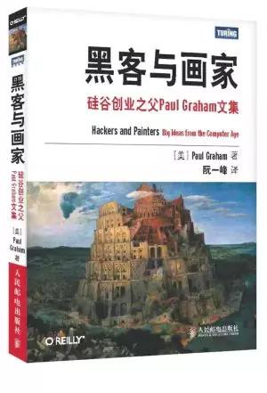

# 《黑客与画家》 Paul Graham 著

## 书评
本书是硅谷创业之父Paul Graham 的文集，主要介绍黑客即优秀程序员的爱好和动机，讨论黑客成长、黑客对世界的贡献以及编程语言和黑客工作方法等所有对计算机时代感兴趣的人的一些话题。书中的内容不但有助于了解计算机编程的本质、互联网行业的规则，还会帮助读者了解我们这个时代，迫使读者独立思考。
## 目录

## 第 1 章 为什么书呆子不受欢迎
## 第 2 章 黑客与画家
## 第 3 章 不能说的话
## 第 4 章 良好的坏习惯
## 第 5 章 另一条路
## 第 6 章 如何创造财富
## 第 7 章 关注贫富分化
## 第 8 章 防止垃圾邮件的一种方法
## 第 9 章 设计者的品味
## 第 10 章 编程语言解析
## 第 11 章 一百年后的编程语言
## 第 12 章 拒绝平庸
## 第 13 章 书呆子的复仇
## 第 14 章 梦寐以求的编程语言
## 第 15 章 设计与研究