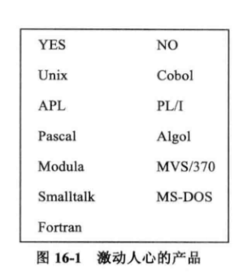

# 《人月神话》

## 书评

Brooks 博士为人们管理复杂项目提供了最具洞察力的见解，既有很多发人深省的观点，又有大量软件工程的实践。本书内容来自 Brooks 博士在 IBM 公司 SYSTEM／360 家族和 OS／360 中的项目管理经验，该项目堪称软件开发项目管理的典范。

## 第 1 章 焦油坑

1. 编程系统产品（Programming Systems Product）开发的工作量是供个人使用的、独立开发的构件程序的九倍。我估计软件构件产品化引起了 3 倍工作量，将软件构件整合成完整系统所需要的设计、集成和测试又强加了 3 倍的工作量，这些高成本的构件在根本上是相互独立的。
2. 编程行业“满足我们内心深处的创造渴望和愉悦所有人的共有情感”，提供了五种乐趣：
   - 创建事物的快乐
   - 开发对其他人有用的东西的乐趣
   - 将可以活动、相互啮合的零部件组装成类似迷宫的东西，这个过程所体现出令人神魂颠倒的魅力
   - 面对不重复的任务，不间断学习的乐趣
   - 工作在如此易于驾驭的介质上的乐趣——纯粹的思维活动，其存在、移动和运转方式完全不同于实际物体
3. 同样，这个行业具有一些内在固有的苦恼：
   - 将做事方式调整到追求完美，是学习编程的最困难部分
   - 由其他人来设定目标，并且必须依靠自己无法控制的事物（特别是程序）；权威不等同于责任
   - 实际情况看起来要比这一点好一些：真正的权威来自于每次任务的完成
   - 任何创造性活动都伴随着枯燥艰苦的劳动，编程也不例外
   - 人们通常期望项目在接近结束时， （bug、工作时间）能收敛得快一些，然而软件项目的情况却是越接近完成，收敛得越慢
   - 产品在即将完成时总面临着陈旧过时的威胁

## 第 2 章 人月神话

1. 缺乏合理的时间进度是造成项目滞后的最主要原因，它比其他所有因素加起来影响还大。
2. 良好的烹饪需要时间，某些任务无法在不损害结果的情况下加快速度。
3. 所有的编程人员都是乐观主义者：“一切都将运作良好”。
4. 由于编程人员通过纯粹的思维活动来开发，所以我们期待在实现过程中不会碰到困难。
5. 但是，我们的构思是有缺陷的，因此总会有 bug。
6. 我们围绕成本核算的估计技术，混淆了工作量和项目进展。 人月是危险和带有欺骗性的神话，因为它暗示人员数量和时间是可以相互替换的。
7. 在若干人员中分解任务会引发额外的沟通工作量——培训和相互沟通。
8. 关于进度安排，我的经验是为 1/3 计划、1/6 编码、1/4 构件测试以及 1/4 系统测试。
9. 作为一个学科，我们缺乏数据估计。
10. 因为我们对自己的估计技术不确定，所以在管理和客户的压力下，我们常常缺乏坚持的勇气。
11. Brook 法则：向进度落后的项目中增加人手，只会使进度更加落后。
12. 向软件项目中增派人手从三个方面增加了项目必要的总体工作量：任务重新分配本身和所造成的工作中断；培训新人员；额外的相互沟通。

## 第 3 章 外科手术队伍

1. 同样有两年经验而且在受到同样的培训的情况下，优秀的专业程序员的工作效率是较差程序员的十倍。（Sackman、Erikson 和 Grand）
2. Sackman、Erikson 和 Grand 的数据显示经验和实际表现之间没有相互联系。我怀疑这种现象是否普遍成立。
3. 小型、精干队伍是最好的——尽可能的少。
4. 两个人的团队，其中一个项目经理，常常是最佳的人员使用方法。[留意一下上帝对婚姻的设计。]
5. 对于真正意义上的大型系统，小型精干的队伍太慢了。
6. 实际上，绝大多数大型编程系统的经验显示出，一拥而上的开发方法是高成本、速度缓慢、不充分的，开发出的产品无法进行概念上的集成。
7. 一位首席程序员、类似于外科手术队伍的团队架构提供了一种方法——既能获得由少数头脑产生的产品完整性，又能得到多位协助人员的总体生产率，还彻底地减少了沟通的工作量。

## 第 4 章 贵族专制、民主政治和系统设计

1. “概念完整性是系统设计中最重要的考虑因素”。
2. “功能与理解上的复杂程度的比值才是系统设计的最终测试标准”，而不仅仅是丰富的功能。[该比值是对易用性的一种测量，由简单和复杂应用共同验证。]
3. 为了获得概念完整性，设计必须由一个人或者具有共识的小型团队来完成。 4. “对于非常大型的项目，将设计方法、体系结构方面的工作与具体实现相分离是获得概念完整性的强有力方法。”[同样适用于小型项目。]
4. “如果要得到系统概念上的完整性，那么必须控制这些概念。这实际上是一种无需任何歉意的贵族专制统治。”
5. 纪律、规则对行业是有益的。外部的体系结构规定实际上是增强，而不是限制实现小组的创造性。
6. 概念上统一的系统能更快地开发和测试。
7. 体系结构（architecture） 、设计实现（implementation）、物理实现（realization）的许多工作可以并发进行。[软件和硬件设计同样可以并行。]

## 第 5 章 画蛇添足

1. 尽早交流和持续沟通能使结构师有较好的成本意识，以及使开发人员获得对设计的信心，并且不会混淆各自的责任分工。
2. 结构师如何成功地影响实现：
   - 牢记是开发人员承担创造性的实现责任；结构师只能提出建议。
   - 时刻准备着为所指定的说明建议一种实现的方法，准备接受任何其他可行的方法。
   - 对上述的建议保持低调和平静。
   - 准备对所建议的改进放弃坚持。
   - 听取开发人员在体系结构上改进的建议。
3. 第二个系统是人们所设计的最危险的系统，通常的倾向是过分地进行设计。
4. OS/360 是典型的画蛇添足（second-system effect）的例子。[Windows NT 似乎是 90 年代的例子。]
5. 为功能分配一个字节和微秒的 优先 权值是一个很有价值的规范化方法。

## 第 6 章 贯彻执行

1. 即使是大型的设计团队，设计结果也必须由一个或两个人来完成，以确保这些决定是一致的。
2. 必须明确定义体系结构中与先前定义不同的地方，重新定义的详细程度应该与原先的说明一致。
3. 出于精确性的考虑，我们需要形式化的设计定义，同样，我们需要记叙性定义来加深理解。
4. 必须采用形式化定义和记叙性定义中的一种作为标准，另一种作为辅助措施；它们都可以作为表达的标准。
5. 设计实现，包括模拟仿真，可以充当一种形式化定义的方法；这种方法有一些严重的缺点。
6. 直接整合是一种强制推行软件的结构性标准的方法。[硬件上也是如此——考虑内建在 ROM 中的 Mac WIMP 接口。]
7. “如果起初至少有两种以上的实现，那么（体系结构）定义会更加整洁，会更加规范。”
8. 允许体系结构师对实现人员的询问做出电话应答解释是非常重要的，并且必须进行日志记录和整理发布。[电子邮件是一种可选的介质。]
9. “项目经理最好的朋友就是他每天要面对的敌人——独立的产品测试机构/小组。”

## 第 7 章 为什么巴比伦塔会失败？

1. 巴比伦塔项目的失败是因为缺乏 交流 ，以及交流的结果 —— 组织 。

### 交流

2. “因为左手不知道右手在做什么，从而进度灾难、功能的不合理和系统缺陷纷纷出现。”由于对其他人的各种假设，团队成员之间的理解开始出现偏差。
3. 团队应该以尽可能多的方式进行相互之间的交流：非正式、常规项目会议，会上进行简要的技术陈述、共享的正式项目工作手册。[以及电子邮件。]

### 项目工作手册

4. 项目工作手册“不是独立的一篇文档，它是对项目必须产生的一系列文档进行组织的一种结构。”
5. “项目 所有 的文档都必须是该（工作手册）结构的一部分。”
6. 需要 尽早 和 仔细 地设计工作手册结构。
7. 事先制订了良好结构的工作手册“可以将后来书写的文字放置在合适的章节中”，并且可以提高产品手册的质量。
8. “ 每一 个 团队成员应该了解 所有 的材料（工作手册）。”[我想说的是，每个团队成员 应该能够 看到所有材料，网页即可满足要求。]
9. 实时更新是至关重要的。
10. 工作手册的使用者应该将注意力集中在上次阅读后的变更，以及关于这些变更重要性的评述。
11. OS/360 项目工作手册开始采用的是纸介质，后来换成了微缩胶片。
12. 今天[即使在 1975 年]，共享的电子手册是能更好达到所有这些目标、更加低廉、更加简单的机制。
13. 仍然需要用变更条和修订日期[或具备同等功能的方法]来标记文字；仍然需要后进先出（LIFO）的电子化变更小结。
14. Parnas 强烈地认为使每个人看到每件事的目标是 完全 错误 的；各个部分应该被封装，从而没有人需要或者允许看到其他部分的内部结构，只需要了解接口。
15. Parnas 的建议的确是灾难的处方。[ Pa rn as 让我认 可了该观点，使我彻底地改变了想法。 ]

### 组织架构

16. 团队组织的目标是为了减少必要的交流和协作量。
17. 为了减少交流，组织结构包括了人力划分 （divisionof labor）和限定职责范围（specialization of function）。
18. 传统的树状组织结构反映了 权力 的结构原理——不允许双重领导。
19. 组织中的 交流 是网状，而不是树状结构，因而所有的特殊组织机制（往往体现成组织结构图中的虚线部分）都是为了进行调整，以克服树状组织结构中交流缺乏的困难。
20. 每个子项目具有两个领导角色—— 产品负责人 、 技术主管 或 结构师 。这两个角色的职能有着很大的区别，需要不同的技能。
21. 两种角色中的任意组合可以是非常有效的：
    - 产品负责人和技术主管是同一个人。
    - 产品负责人作为总指挥，技术主管充当其左右手。
    - 技术主管作为总指挥，产品负责人充当其左右手。

## 第 8 章 胸有成竹

1. 仅仅通过对编码部分的估计，然后乘以任务其他部分的相对系数，是无法得出对整项工作的精确估计的。
2. 构建独立小型程序的数据不适用于编程系统项目。
3. 程序开发呈程序规模的指数增长。
4. 一些发表的研究报告显示指数约为 1.5。[ Bo eh m 的数据并不完全一致，在 1.05 和 1.2 之间变化。 1 ]
5. Portman 的 ICL 数据显示相对于其他活动开销，全职程序员仅将 50％的时间用于编程和调试。
6. IBM 的 Aron 数据显示，生产率是系统各个部分交互的函数，在 1.5K 千代码行/人年至 10K 千代码行/人年的范围内变化。
7. Harr 的 Bell 实验室数据显示对于已完成的产品，操作系统类的生产率大约是 0.6KLOC/人年，编译类工作的生产率大约为 2.2KLOC/人年。
8. Brooks 的 OS/360S 数据与 Harr 的数据一致：操作系统 0.6 ～ 0.8KLOC/人年，编译器 2 ～ 3 KLOC/人年。
9. Corbato 的 MIT 项目 MULTICS 数据显示，在操作系统和编译器混合类型上的生产率是 1.2KLOC/人年，但这些是 PL/I 的代码行，而其他所有的数据是汇编代码行。
10. 在基本语句级别，生产率看上去是个常数。
11. 当使用适当的高级语言时，程序编制的生产率可以提高 5 倍。

## 第 9 章 削足适履

1. 除了运行时间以外，所占据的 内存空间 也是主要开销。特别是对于操作系统，它的很多程序是永久驻留在内存中。
2. 即便如此，花费在驻留程序所占据内存上的金钱仍是物有所值的，比其他任何在配置上投资的效果要好。规模本身不是坏事，但不必要的规模是不可取的。
3. 软件开发人员必须设立规模目标，控制规模，发明一些减少规模的方法——就如同硬件开发人员为减少元器件所做的一样。
4. 规模预算不仅仅在占据内存方面是明确的，同时还应该指明程序对磁盘的访问次数。
5. 规模预算必须与分配的功能相关联；在指明模块大小的同时，确切定义模块的功能。
6. 在大型的团队中，各个小组倾向于不断地局部优化，以满足自己的目标，而较少考虑队用户的整体影响。这种方向性的问题是大型项目的主要危险。
7. 在整个实现的过程期间，系统结构师必须保持持续的警觉，确保连贯的系统完整性。
8. 培养开发人员从系统整体出发、面向用户的态度是软件编程管理人员最重要的职能。
9. 在早期应该制订策略，以决定用户可选项目的粗细程度，因为将它们作为整体大包能够节省内存空间。[常常还可以节约市场成本。]
10. 临时空间的尺寸，以及每次磁盘访问的程序数量是很关键的决策，因为性能是规模的非线性函数。[这个整体决策已显得过时——起初是由于虚拟内存，后来则是成本低廉的内存。现在的用户通常会购买能容纳主要应用程序所有代码的内存。]
11. 为了取得良好的空间－时间折衷，开发队伍需要得到特定与某种语言或者机型的编程技能培训，特别是在使用新语言或者新机器时。
12. 编程需要技术积累，每个项目需要自己的标准组件库。
13. 库中的每个组件需要有两个版本，运行速度较快和短小精炼的。[现在看来有些过时。]
14. 精炼、充分和快速的程序。往往是 战略性 突破的结果，而不仅仅技巧上的提高。
15. 这种突破常常是一种新型算法。
16. 更普遍的是，战略上突破常来自于数据或表的重新表达。 数据的表现形式是编程的根本。

## 第 10 章 提纲挈领

1. “前提：在一片文件的汪洋中，少数文档形成了关键的枢纽，每个项目管理的工作都围绕着它们运转。它们是经理们的主要个人工具。”
2. 对于计算机硬件开发项目，关键文档是目标、手册、进度、预算、组织机构图、空间分配、以及机器本身的报价、预测和价格。
3. 对于大学科系，关键文档类似：目标、课程描述、学位要求、研究报告、课程表和课程的安排、预算、教室分配、教师和研究生助手的分配。
4. 对于软件项目，要求是相同的：目标、用户手册、内部文档、进度、预算、组织机构图和工作空间分配。
5. 因此，即使是小型项目，项目经理也应该在项目早期规范化上述的一系列文档。
6. 以上集合中每一个文档的准备工作都将注意力集中在对讨论的思索和提炼，而书写这项活动需要上百次的细小决定，正是由于它们的存在，人们才能从令人迷惑的现象中得到清晰、确定的策略。
7. 对每个关键文档的维护提供了状态监督和预警机制。
8. 每个文档本身就可以作为检查列表或者数据库。
9. 项目经理的基本职责是使每个人都向着相同的方向前进。
10. 项目经理的主要日常工作是沟通，而不是做出决定；文档使各项计划和决策在整个团队范围内得到交流。
11. 只有一小部分管理人员的时间——可能只有 20%——用来从自己头脑外部获取信息。
12. 出于这个原因，广受吹捧的市场概念——支持管理人员的“完备信息管理系统”并不基于反映管理人员行为的有效模型。

## 第 11 章 未雨绸缪

1. 化学工程师已经认识到无法一步将实验室工作台上的反应过程移到工厂中，需要一个 实验性工厂（pilot planet） 来为提高产量和在缺乏保护的环境下运作提供宝贵经验。
2. 对于编程产品而言，这样的中间步骤是同样必要的，但是软件工程师在着手发布产品之前，却并不会常规地进行试验性系统的现场测试。[现在，这已经成为了一项普遍的实践，beta 版本。它不同于有限功能的原型，alpha 版本，后者同样是我所倡导的实践。]
3. 对于大多数项目，第一个开发的系统并不合用。它可能太慢、太大，而且难以使用，或者三者兼而有之。
4. 系统的丢弃和重新设计可以一步完成，也可以一块块地实现。这是个 必须完成的步骤。
5. 将开发的第一个系统——丢弃原型——发布给用户，可以获得时间，但是它的代价高昂——对于用户，使用极度痛苦；对于重新开发的人员，分散了精力；对于产品，影响了声誉，即使最好的再设计也难以挽回名声。
6. 因此， 为舍弃而计划，无论如何，你一定要这样做。
7. “开发人员交付的是用户满意程度，而不仅仅是实际的产品。”（Cosgrove） 8. 用户的实际需要和用户感觉会随着程序的构建、测试和使用而 变化 。
8. 软件产品易于掌握的特性和不可见性，导致了它的构建人员（特别容易）面临着永恒的需求变更。
9. 目标上（和开发策略上）的一些正常变化无可避免，事先为它们做准备总比假设它们不会出现要好得多。
10. 为变更计划软件产品的技术，特别是细致的模块接口文档——非常地广为人知，但并没有相同规模的实践。尽可能地使用表驱动技术同样是有所帮助的。[现在内存的成本和规模使这项技术越来越出众。]
11. 高级语言的使用、编译时操作、通过引用的声明整合和自文档技术能减少变更引起的错误。
12. 采用定义良好的数字化版本将变更量子（阶段）化。[当今的标准实践。]

### 为变更计划组织架构

14. 程序员不愿意为设计书写文档的原因，不仅仅是由于惰性。更多的是源于设计人员的踌躇——要为自己尝试性的设计决策进行辩解。（Cosgrove）
15. 为变更组建团队比为变更进行设计更加困难。
16. 只要管理人员和技术人才的天赋允许，老板必须对他们的能力培养给予极大的关注，使管理人员和技术人才具有互换性；特别是希望能在技术和管理角色之间自由地分配人手的时候。
17. 具有两条晋升线的高效组织机构，存在着一些社会性的障碍，人们必须警惕和积极地同它做持续的斗争。
18. 很容易为不同的晋升线建立相互一致的薪水级别，但要同等威信的建立需要一些强烈的心理措施：相同的办公室、一样的支持和技术调动的优先补偿。
19. 组建外科手术队伍式的软件开发团队是对上述问题所有方面的彻底冲击。对于灵活组织架构问题，这的确是一个长期行之有效的解决方案。

### 前进两步，后退一步——程序维护

20. 程序维护基本上不同于硬件的维护；它主要由各种变更组成，如修复设计缺陷、新增功能、或者是使用环境或者配置变换引起的调整。
21. 对于一个广泛使用的程序，其维护总成本通常是开发成本的 40％或更多。
22. 维护成本受用户数目的严重影响。用户越多，所发现的错误也越多。
23. Campbell 指出了一个显示产品生命期中每月 bug 数的有趣曲线，它先是下降，然后攀升。
24. 缺陷修复总会以（20－50）%的机率引入新的 bug。
25. 在每次修复之后，必须重新运行先前所有的测试用例，从而确保系统不会以更隐蔽的方式被破坏。
26. 能消除、至少是能指明副作用的程序设计方法，对维护成本有很大的影响。
27. 同样，设计实现的人员越少、接口越少，产生的错误也就越少。

### 前进一步，后退一步——系统熵随时间增加

28. Lehman 和 Belady 发现模块数量随大型操作系统（OS/360）版本号的增加呈线
    性增长，但是受到影响的模块以版本号指数的级别增长。
29. 所有修改都倾向于破坏系统的架构，增加了系统的混乱程度。即使是最熟练的
    软件维护工作，也只是放缓了系统退化到不可修复混乱的进程，从中必须要重新进行设计。
    [许多程序升级的真正需要，如性能等，尤其会冲击它的内部结构边界。原有边界引发的不
    足常常在日后才会出现。]

## 第 12 章 干将莫邪

1. 项目经理应该制订一套策略，以及为通用工具的开发分配资源，与此同时，他还必须意识到专业工具的需求。
2. 开发操作系统的队伍需要自己的目标机器，进行调试开发工作。相对于最快的速度而言，它更需要最大限度的内存，还需要安排一名系统程序员，以保证机器上的标准软件是即时更新和实时可用的。
3. 同时还需要配备调试机器或者软件，以便在调试过程中，所有类型的程序参数可以被自动计数和测量。
4. 目标机器的使用需求量是一种特殊曲线：刚开始使用率非常低，突然出现爆发性的增长，接着趋于平缓。
5. 同天文工作者一样，系统调试总是大部分在夜间完成。
6. 抛开理论不谈，一次分配给某个小组连续的目标时间块被证明是最好的安排方法，比不同小组的穿插使用更为有效。
7. 尽管技术不断变化，这种采用时间块来安排匮乏计算机资源的方式仍得以延续 20 年[在 1975 年]，是因为它的生产率最高。[在 1995 年依然如此]
8. 如果目标机器是新产品，则需要一个目标机器的逻辑仿真装置。这样，可以 更快 地得到辅助调试平台。即使在真正机器出现之后，仿真装置仍可提供 可靠 的调试平台。
9. 主程序库应该被划分成（1）一系列独立的私有开发库；（2）正处在系统测试下的系统集成子库；（3）发布版本。正式的分离和进度提供了控制。
10. 在编制程序的项目中，节省最大工作量的工具可能是文本编辑系统。
11. 系统文档中的巨大容量带来了新的不理解问题[例如，看看 Unix]，但是它比大多数未能详细描述编程系统特性的短小文章更加可取。
12. 自顶向下、彻底地开发一个性能仿真装置。尽可能早地开始这项工作，仔细地听取 “它们表达的意见”。

### 高级语言

13. 只有懒散和惰性会妨碍高级语言和交互式编程的广泛应用。[如今它们已经在全世界使用。]
14. 高级语言不仅仅提升了生产率，而且还改进了调试：bug 更少，以及更容易寻找。
15. 传统的反对意见——功能、目标代码的尺寸、目标代码的速度，随着语言和编译器技术的进步已不再成为问题。
16. 现在可供合理选择的语言是 PL/I。[不再正确。]

### 交互式编程

17. 某些应用上，批处理系统决不会被交互式系统所替代。[依然成立。]
18. 调试是系统编程中很慢和较困难的部分，而漫长的调试周转时间是调试的祸根。
19. 有限的数据表明了系统软件开发中，交互式编程的生产率至少是原来的两倍。

## 第 13 章 整体部分

1. 第 4、 5、 6 章所意味的煞费苦心、详尽体系结构工作不但使产品更加易于使用，而且使开发更容易进行以及 bug 更不容易产生。
2. V.A.Vyssotsky 提出，“许许多多的失败完全源于那些产品未精确定义的地方。”
3. 在编写任何代码之前，规格说明必须提交给测试小组，以详细地检查说明的完整性和明确性。开发人员自己不会完成这项工作。（Vyssotsky）
4. “十年内[1965 ～ 1975]，Wirth 的自顶向下进行设计[逐步细化]将会是最重要的新型形式化软件开发方法。”
5. Wirth 主张在每个步骤中，尽可能使用级别较高的表达方法。
6. 好的自顶向下设计从四个方面避免了 bug。
7. 有时必须回退，推翻顶层设计，重新开始。
8. 结构化编程中，程序的控制结构仅由支配代码块（相对于任意的跳转）的给定集合所组成。这种方法出色地避免了 bug，是一种正确的思考方式。
9. Gold 结果显示了，在交互式调试过程中，第一次交互取得的工作进展是后续交互的三倍。这实际上获益于在调试开始之前仔细地调试计划。[我认为在 1995 年 依然 如此。]
10. 我发现对良好终端系统的正确使用，往往要求每两小时的终端会话对应于两小时的桌面工作：1 小时会话后的清理和文档工作；1 小时为下一次计划变更和测试。
11. 系统调试（相对于单元测试）花费的时间会比预料的更长。
12. 系统调试的困难程度证明了需要一种完备系统化和可计划的方法。
13. 系统调试仅仅应该在所有部件能够运作之后开始。（这既不同于为了查出接口 bug 所采取 “合在一起尝试” 的方法；也不同于在所有构件单元的 bug 已知，但未修复的情况下，即开始系统调试的做法。）[对于多个团队尤其如此。]
14. 开发大量的辅助调试平台（scaffolding 脚手架）和测试代码是很值得的，代 码量甚至可能会有测试对象的一半。
15. 必须有人对变更进行控制和文档化，团队成员应使用开发库的各种受控拷贝来工作。
16. 系统测试期间，一次只添加一个构件。
17. Lehman 和 Belady 出示了证据，变更的阶段（量子）要么很大，间隔很宽；要么小和频繁。后者很容易变得不稳定。[Microsoft 的一个团队使用了非常小的阶段（量子）。结果是每天晚上需要重新编译生成增长中的系统。]

## 第 14 章 祸起萧墙

1. “项目是怎样延迟了整整一年的时间？⋯ 一次一天。”
2. 一天一天的进度落后比起重大灾难，更难以识别、更不容易防范和更加难以弥补。
3. 根据一个严格的进度表来控制项目的第一个步骤是 制订 进度表，进度表由里程碑和日期组成。
4. 里程碑必须是具体的、特定的、可度量的事件，能进行清晰能定义。
5. 如果里程碑定义得非常明确，以致于无法自欺欺人时，程序员很少会就里程碑的进展弄虚作假。
6. 对于大型开发项目中的估计行为，政府的承包商所做的研究显示：每两周进行仔细修订的活动时间估计，随着开始时间的临近不会有太大的变化；期间内对时间长短的 过高 估计，会随着活动的进行持续下降； 过低 估计直到计划的结束日期之前大约三周左右，才有所变化。
7. 慢性进度偏离是士气杀手。[Microsoft 的 Jim McCarthy 说：“如果你错过了一个最终期限（deadline），确保制订下一条 deadline。2”]
8. 进取 对于杰出的软件开发团队，同优秀的棒球队伍一样，是不可缺少的必要品德。
9. 不存在关键路径进度的替代品，使人们能够辨别计划偏移的情况。
10. PERT 的准备工作是 PERT 图使用中最有价值的部分。它包括了整个网状结构的展开、任务之间依赖关系的识别、各个任务链的估计。这些都要求在项目早期进行非常专业的计划。
11. 第一份 PERT 图总是很恐怖的，不过人们总是不断进行努力，运用才智制订下一份 PERT 图。
12. PERT 图为前面那个泄气的借口，“其他的部分反正会落后”，提供了答案。
13. 每个老板同时需要采取行动的异常信息以及用来进行分析和早期预警的状态数据。
14. 状态的获取是困难的，因为下属经理有充分的理由不提供信息共享。
15. 老板的不良反应肯定会对信息的完全公开造成压制；相反，仔细区分状态报告、毫无惊慌地接收报告、决不越俎代庖，将能鼓励诚实的汇报。
16. 必须有评审的机制，从而所有成员可以通过它了解真正的状态。出于这个目的，里程碑的计划和完成文档是关键。
17. Vyssotsky：我发现在里程碑报告中很容易记录“计划（老板的日期）”和“估计（最基层经理的日期）”的日期。项目经理必须停止对这些日期的怀疑。”
18. 对于大型项目，一个对里程碑报告进行维护的 计划和控制（Plan and Control）
    小组是非常可贵的。

## 第 15 章 另外一面

1. 对于软件编程产品来说，程序向用户所呈现的面貌与提供给机器识别的内容同样重要。
2. 即使对于完全开发给自己使用的程序，描述性文字也是必须的，因为它们会被用户－作者所遗忘。
3. 培训和管理人员基本上没有能向编程人员成功地灌输对待文档的积极态度——文档能在整个生命周期对克服懒惰和进度的压力起促进激励作用。
4. 这样的失败并不都是因为缺乏热情或者说服力，而是没能正确地展示 如何 有效和经济地编制文档。
5. 大多数文档只提供了很少的 总结 性内容。必须放慢脚步，稳妥地进行。
6. 由于关键的用户文档包含了跟软件相关的基本决策，所以它的绝大部分需要在程序编制之前书写，它包括了 9 项内容（参见相应章节）。
7. 每一份发布的程序拷贝应该包括一些测试用例，其中一部分用于校验输入数据，一部分用于边界输入数据，另一部分用于无效的输入数据。
8. 对于必须修改程序的人而言，他们所需要程序内部结构文档，同样要求一份清晰明了的概述，它包括了 5 项内容（参见相应章节）。
9. 流程图是被吹捧得最过分的一种程序文档。详细逐一记录的流程图是一件令人生厌的事情，而且高级语言的出现使它显得陈旧过时。（流程图是 图形化 的高级语言。）
10. 如果这样，很少有程序需要一页纸以上的流程图。[在这一点上，MILSPEC 军用标准实在错得很厉害。]
11. 即使的确需要一张程序结构图，也并不需要遵照 ANSI 的流程图标准。
12. 为了使文档易于维护，将它们合并至源程序是至关重要的，而不是作为独立文档进行保存。
13. 最小化文档负担的 3 个关键思路：
    - 借助那些必须存在的语句，如名称和声明等，来附加尽可能多的“文档”信息。
    - 使用空格和格式来表现从属和嵌套关系，提高程序的可读性。
    - 以段落注释，特别是模块标题的形式，向程序中插入必要的记叙性文字。
14. 程序修改人员所使用的文档中，除了描述事情如何以外，还应阐述它为什么那样。对于加深理解， 目的 是非常关键的，但即使是高级语言的语法，也不能表达目的。
15. 在线系统的高级语言（ 应该 使用的工具）中，自文档化技术发现了它的绝佳应用和强大功能。

## 第 16 章 没有银弹

> 在未来的十年内，无论是在技术还是管理方法上，都看不出有任何突破性的进步，能够保证在十年内大幅度地提高软件的生产率、可靠性和简洁性。

### 摘要

所有软件活动包括根本任务，即打造由抽象软件实体构成的复杂概念结构；次要任务，使用编程语言表达这些抽象实体，在空间和时间限制内将它们映射成机器语言。软件生产率在近年内取得的巨大进步来自对后天障碍的突破，例如硬件的限制、笨拙的编程语言、机器时间的缺乏等等。这些障碍使次要任务实施起来异常艰难，相对必要任务而言，软件工程师在次要任务上花费了多少时间和精力？除非它占了所有工作的 9/10，否则即使全部次要任务的时间缩减到零，也不会给生产率带来数量级上的提高。

因此，现在是关注软件任务中的必要活动的时候了，也就是那些和构造异常复杂的抽象概念结构有关的部分。我建议：

- 仔细地进行市场调研，避免开发已上市的产品。
- 在获取和制订软件需求时，将快速原型开发作为迭代计划的一部分。
- 有机地更新软件，随着系统的运行、使用和测试，逐渐添加越来越多的功能。
- 不断挑选和培养杰出的概念设计人员。

### 介绍

在所有恐怖民间传说的妖怪中，最可怕的是人狼，因为它们可以完全出乎意料地从熟悉的面孔变成可怕的怪物。为了对付人狼，我们在寻找可以消灭它们的银弹。

大家熟悉的软件项目具有一些人狼的特性（至少在非技术经理看来），常常看似简单明了的东西，却有可能变成一个落后进度、超出预算、存在大量缺陷的怪物。因此，我们听到了近乎绝望的寻求银弹的呼唤，寻求一种可以使软件成本像计算机硬件成本一样降低的尚方宝剑。

但是，我们看看近十年来的情况，没有银弹的踪迹。没有任何技术或管理上的进展，能够独立地许诺在生产率、可靠性或简洁性上取得数量级的提高。本章中，我们试图通过分析软件问题的本质和很多候选银弹的特征，来探索其原因。

不过，怀疑论者并不是悲观主义者。尽管我们没有看见令人惊异的突破，并认为这种银弹实际上是与软件的内在特性相悖，不过还是出现了一些令人振奋的革新。这些方法的规范化、持续地开拓、发展和传播确实是可以在将来使生产率产生数量级上的提高。虽然没有通天大道，但是路就在脚下。

解决管理灾难的第一步是将大块的“巨无霸理论”替换成“微生物理论”，它的每一步——希望的诞生，本身就是对一蹴而就型解决方案的冲击。它告诉工作者进步是逐步取得的，伴随着辛勤的劳动，对规范化过程应进行持续不懈的努力。由此，诞生了现在的软件工程。

### 根本困难

不仅仅是在目力所及的范围内，没有发现银弹，而且软件的特性本身也导致了不大可能有任何的发明创新——能够像计算机硬件工业中的微电子器件、晶体管、大规模集成一样——提高软件的生产率、可靠性和简洁程度。我们甚至不能期望每两年有一倍的增长。

首先，我们必须看到这样的畸形并不是由于软件发展得太慢，而是因为计算机硬件发展得太快。从人类文明开始，没有任何其他产业技术的性价比，能在 30 年之内取得 6 个数量级的提高，也没有任何一个产业可以在性能提高或者降低成本方面取得如此的进步。这些进步来自计算机制造产业的转变，从装配工业转变成流水线工业。

其次，让我们通过观察预期的软件技术产业发展速度，来了解中间的困难。效仿亚里士多德，我将它们分成根本的——软件特性中固有的困难，次要的——出现在目前生产上的，但并非那些与生俱来的困难。

我们在下一章中讨论次要问题。首先，我们来关注根本问题。

一个相互牵制关联的概念结构，是软件实体必不可少的部分，它包括：数据集合、数据条目之间的关系、算法、功能调用等等。这些要素本身是抽象的，体现在相同的概念构架中，可以存在不同的表现形式。尽管如此，它仍然是内容丰富和高度精确的。

**我认为软件开发中困难的部分是规格化、设计和测试这些概念上的结构，而不是对概念进行表达和对实现逼真程度进行验证**。当然，我们还是会犯一些语法错误，但是和绝大多数系统中的概念错误相比，它们是微不足道的。

如果这是事实，那么软件开发总是非常困难的。天生就没有银弹。

让我们来考虑现代软件系统中这些无法规避的内在特性：复杂度、一致性、可变性和不可见性。

**复杂度**。规模上，软件实体可能比任何由人类创造的其他实体要复杂，因为没有任何两个软件部分是相同的（至少是在语句的级别）。如果有相同的情况，我们会把它们合并成供调用的子函数。在这个方面，软件系统与计算机、建筑或者汽车大不相同，后者往往存在着大量重复的部分。

数字计算机本身就比人类建造的大多数东西复杂。计算机拥有大量的状态，这使得构思、描述和测试都非常困难。软件系统的状态又比计算机系统状态多若干个数量级。

同样，软件实体的扩展也不仅仅是相同元素重复添加，而必须是不同元素实体的添加。大多数情况下，这些元素以非线性递增的方式交互，因此整个软件的复杂度以更大的非线性级数增长。

软件的复杂度是必要属性，不是次要因素。因此，抽掉复杂度的软件实体描述常常也去掉了一些本质属性。数学和物理学在过去三个世纪取得了巨大的进步，数学家和物理学家们建立模型以简化复杂的现象，从模型中抽取出各种特性，并通过试验来验证这些特性。这些方法之所以可行——是因为模型中忽略的复杂度不是被研究现象的必要属性。当复杂度是本质特性时，这些方法就行不通了。

上述软件特有的复杂度问题造成了很多经典的软件产品开发问题。由于复杂度，团队成员之间的沟通非常困难，导致了产品瑕疵、成本超支和进度延迟；由于复杂度，列举和理解所有可能的状态十分困难，影响了产品的可靠性；由于函数的复杂度，函数调用变得困难，导致程序难以使用；由于结构性复杂度，程序难以在不产生副作用的情况下用新函数扩充；由于结构性复杂度，造成很多安全机制状态上的不可见性。

复杂度不仅仅导致技术上的困难，还引发了很多管理上的问题。它使全面理解问题变得困难，从而妨碍了概念上的完整性；它使所有离散出口难以寻找和控制；它引起了大量学习和理解上的负担，使开发慢慢演变成了一场灾难。

**一致性**。并不是只有软件工程师才面对复杂问题。物理学家甚至在非常“基础”的级别上，面对异常复杂的事物。不过，物理学家坚信必定存在着某种通用原理，或者在夸克中，或者在统一场论中。爱因斯坦曾不断地重申自然界一定存在着简化的解释，因为上帝不是专横武断或反复无常的。

软件工程师却无法从类似的信念中获得安慰，他必须控制的很多复杂度是随心所欲、毫无规则可言的，来自若干必须遵循的人为惯例和系统。它们随接口的不同而改变，随时间的推移而变化，而且，这些变化不是必需的，仅仅由于它们是不同的人——而非上帝——设计的结果。

许多情况下，因为是开发最新的软件，所以它必须遵循各种接口。另一些情况下，软件的开发目标就是兼容性。在上述的所有情况中，很多复杂性来自保持与其他接口的一致，对软件的任何再设计，都无法简化这些复杂特性。

**可变性**。软件实体经常会遭受到持续的变更压力。当然，建筑、汽车、计算机也是如此。不过，工业制造的产品在出厂之后不会经常地发生修改，它们会被后续模型所取代，或者必要更改会被整合到具有相同基本设计的后续产品系列。汽车的更改十分罕见，计算机的现场调整时有发生。然而，它们和软件的现场修改比起来，都要少很多。

其中部分的原因是因为系统中的软件包含了很多功能，而功能是最容易感受变更压力的部分。另外的原因是因为软件可以很容易地进行修改——它是纯粹思维活动的产物，可以无限扩展。日常生活中，建筑有可能发生变化，但众所周知，建筑修改的成本很高，从而打消了那些想提出修改的人的念头。

所有成功的软件都会发生变更。现实工作中，经常发生两种情况。当人们发现软件很有用时，会在原有应用范围的边界，或者在超越边界的情况下使用软件。功能扩展的压力主要来自那些喜欢基本功能，又对软件提出了很多新用法的用户们。

其次，软件一定是在某种计算机硬件平台上开发，成功软件的生命期通常比当初的计算机硬件平台要长。即使不是更换计算机，则有可能是换新型号的磁盘、显示器或者打印机。软件必须与各种新生事物保持一致。

简言之，软件产品扎根于文化的母体中，如各种应用、用户、自然及社会规律、计算机硬件等等。后者持续不断地变化着，这些变化无情地强迫着软件随之变化。

**不可见性**。软件是不可见的和无法可视化的。例如，几何抽象是强大的工具。建筑平面图能帮助建筑师和客户一起评估空间布局、进出的运输流量和各个角度的视觉效果。这样，矛盾变得突出，忽略的地方变得明显。同样，机械制图、化学分子模型尽管是抽象模型，但都起了相同的作用。总之，都可以通过几何抽象来捕获物理存在的几何特性。

软件的客观存在不具有空间的形体特征。因此，没有已有的表达方式，就像陆地海洋有地图、硅片有膜片图、计算机有电路图一样。当我们试图用图形来描述软件结构时，我们发现它不仅仅包含一个，而是很多相互关联、重叠在一起的图形。这些图形可能描绘控制流程、数据流、依赖关系、时间序列、名字空间的相互关系等等。它们通常不是有较少层次的扁平结构。实际上，在上述结构上建立概念控制的一种方法是强制将关联分割，直到可以层次化一个或多个图形。

除去软件结构上的限制和简化方面的进展，软件仍然保持着无法可视化的固有特性，从而剥夺了一些具有强大功能的概念工具的构造思路。这种缺憾不仅限制了个人的设计过程，也严重地阻碍了相互之间的交流。

### 以往解决次要困难的一些突破

如果回顾一下软件领域中取得的最富有成效的三次进步，我们会发现每一次都是解决了软件构建上的巨大困难，但是这些困难不是本质属性，也不是主要困难。同样，我们可以对每一次进步进行外推，来了解它们的固有限制。

高级语言。勿庸置疑，软件生产率、可靠性和简洁性上最有力的突破是使用高级语言编程。大多数观察者相信开发生产率至少提高了五倍，同时可靠性、简洁性和理解程度也大为提高。

那么，高级语言取得了哪些进展呢？首先，它减轻了一些次要的软件复杂度。抽象程序包含了很多概念上的要素：操作、数据类型、流程和相互通讯，而具体的机器语言程序则关心位、寄存器、条件、分支、通道、磁盘等等。

高级语言所达到的抽象程度包含了（抽象）程序所需要的要素，避免了更低级的元素，它消除了并不是程序所固有的整个级别的复杂度。高级语言最可能实现的是提供所有编程人员在抽象程序中能想到的要素。可以肯定的是，我们思考数据结构、数据类型和操作的速度稳固提高，不过是以非常缓慢的速度。另外，程序开发方法越来越接近用户的复杂度。

然而，对于较少使用那些复杂深奥语言要素的用户，高级语言在某种程度上增加而不是减少了脑力劳动上的负担。

**分时**。大多数观察者相信分时提高了程序员的生产率和产品的质量，尽管它带来的进步不如高级语言。

分时解决了完全不同的困难。分时保证了及时性，从而使我们能维持对复杂程度的一个总体把握。批处理编程的较长周转时间意味着不可避免会遗忘一些细枝末节，如果我们停下编程，调用编译程序或者执行程序，思维上的中断使我们不得不重新进行思考，它在时间上的代价非常高昂。最严重的结果可能是失去对复杂系统的掌握。

较长的周转时间和机器语言的复杂度一样，是软件开发过程的次要困难，而不是本质困难。分时所起作用也非常有限。主要效果是缩短了系统的响应时间。随着它接近于零，到达人类可以辨识的基本能力——大概 100 毫秒时，所获得的好处就接近于无了。

统一编程环境。第一个集成开发环境——Unix 和 Interlisp 现在已经得到了广泛应用，并且使生产率提高了 5 倍。为什么？

它们主要通过提供集成库、统一文件格式、管道和过滤器，解决了共同使用程序的次要困难。这样，概念性结构理论上的相互调用、提供输入和互相使用，在现实中可以非常容易地实现。

因为每个新工具可以通过标准格式在任何一个程序中应用，这种突破接着又激发整个工具库的开发。

由于这些成功，环境开发是当今软件工程研究的主要题目。我们将在下章中讨论期望达到的目标和限制。

### 银弹的希望

现在，让我们来讨论一下当今可能作为潜在银弹的最先进的技术进步。它们各自针对什么样的问题？它们是属于必要问题，或者依然是解决我们剩下的次要困难？它们是提供了创新，还是仅仅是增量改进？

**Ada 和其他高级编程语言**。近来，最被吹捧的开发进展之一是编程语言 Ada，一种 80 年代的高级语言。Ada 实际上不仅仅反映了语言概念上的突破性进展，而且蕴涵了鼓励现代设计和模块化概念运用的重要特性。由于 Ada 采用的是抽象数据类型、层次结构的模块化理念，所有 Ada 理念可能比语言本身更加先进。Ada 使用设计来承载需求，作为这一过程的自然产物，它可能过于丰富了。不过，这并不是致命的，因为它的词汇子集可以解决学习问题，硬件的进展能提供更高的 MIPS（每秒百万指令集），减少编译的成本。软件系统结构化的先进理念实际上非常好地利用了 MIPS 上的进展。20 世纪 60 年代，曾在内存和速度成本上广受谴责的操作系统，如今已被证明是一种能使用某些 MIPS 和廉价内存的非常优秀的系统。

然而，Ada 仍然不是消灭软件生产率怪兽的银弹。毕竟，它只是另一种高级语言，这类语言出现最大的回报来自出现时的冲击，它通过使用更加抽象的语句来开发，降低了机器的次要复杂度。一旦这些难题被解决，就只剩下非常少的问题，解决剩余部分的获益必然也要少一些。

我预言，在以后的十年中，当 Ada 的效率被大家评估认可时，它会带来相当大的变化，这并不是因为任何特别的语言特性，不是由于这些语言特性被合并在一起，也不是因为 Ada 开发环境会不断发展进步。Ada 的最大贡献在于编程人员培训方式的转变，即对开发人员需要进行现代软件设计技术培训。

**面向对象编程**。软件专业的一些学生坚持面向对象编程是当今若干新潮技术中最富有希望的 3。我也是其中之一。达特茅斯的 MarkSherman 提出，必须仔细地区别两个不同的概念：抽象数据类型和层次化类型，后者也被称为类（class）。抽象数据类型的概念是指对象类型应该通过一个名称、一系列合适的值和操作来定义，而不是理应被隐藏的存储结构。抽象数据类型的例子是 Ada 包（以及私有类型）和 Modula 的模块。

层次化类型，如 Simula-67 的类，是允许定义可以被后续子类型精化的通用接口。这两个概念是互不相干的——可以只有层次化，没有数据隐藏；也可能是只有数据隐藏，而没有层次化。两种概念都体现了软件开发领域的进步。

它们的出现都消除了开发过程中的非本质困难，允许设计人员表达自己设计的内在特性，而不需要表达大量句法上的内容，这些内容并没有添加什么新的信息。对于抽象数据类型和层次化类型，它们都是解决了高级别的次要困难和允许采用较高层次的表现形式来表达设计。

不过，这些提高仅仅能消除所有设计表达上的次要困难。软件的内在问题是设计的复杂度，上述方法并没有对它有任何的促进。除非我们现在的编程语言中，不必要的低层次类型说明占据了软件产品设计 90％，面向对象编程才能带来数量级上的提高。对面向对象编程这颗“银弹”，我深表怀疑。

**人工智能**。很多人期望人工智能上的进展可以给软件生产率和质量带来数量级上的增长，但我不这样认为。追究其原因，我们必须剖析“人工智能”意味着什么，以及它如何应用。

Parnas 澄清了术语上的混乱：

现在有两种差异非常大的 AI 定义被广泛使用。AI-1：使用计算机来解决以前只能通过人类智慧解决的问题。AI-2：使用启发式和基于规则的特定编程技术。在这种方法中，对人类专家进行研究，判断他们解决方法的启发性思维或者经验法则 ⋯⋯。程序被设计成以人类解决问题的方式来运作。

第一种定义的意义容易发生变化 ⋯⋯ 今天可能适合 AI-1 定义的程序，一旦我们了解了它的运行方式，理解了问题，就不再认为它是人工智能 ⋯⋯ 不幸的是，我无法识别这个领域的特定知识体系 ⋯⋯ 绝大多数工作是针对问题域的，我们需要一些抽象或者创造性来解决上述问。

我完全同意这种批评意见。语音识别技术与图象识别技术的共同点非常少，它们与专家系统中应用的技术不同。例如，我觉得很难去发现图象识别技术能给编程开发实践带来什么样的差异。同样，语音识别也差不多——软件开发上的困难是决定说什么，而不是如何说。表达的简化仅仅能提供少量的促进作用。

至于 AI-2 专家系统技术，应该用专门的章节来讨论。

**专家系统**。人工智能领域最先进的、被最大范围使用的部分，是开发专家系统的技术。很多软件科学家正非常努力地工作着，想把这种技术应用在软件的开发环境中。那么它的概念是什么，前景如何？

专家系统是包含归纳推论引擎和规则基础的程序，它接收输入数据和假设条件，通过从基础规则推导逻辑结果，提出结论和建议，向用户展示前因后果，并解释最终的结果。推论引擎除了处理推理逻辑以外，通常还包括复杂逻辑或者概率数据和规则。

对于解决相同的问题，这种系统明显比传统的程序算法要先进很多。

- 推导引擎技术的开发独立于应用程序，因此可以用于多个用户。在该引擎上花费较大的工作是很合理的。实际上，这种引擎技术非常先进。
- 基于应用的、可变更的部分，在基础规则中以一种统一的风格编码，并且为规则基础的开发、更改、测试和文档化提供了若干工具。这实际上对一些应用程序本身的复杂度进行了系统化。

Edward Feigenbaum 指出这种系统的能力不是来自某种前所未有的推导机制，而是来自非常丰富的知识积累基础，所以更加精确地反映了现实世界。我认为这种技术提供的最重要进步是具体应用的复杂性与程序本身相分离。

如何把它应用在软件开发工作中？可以通过很多途径：建议接口规则、制订测试策略、记录各种 bug 产生的频率、提供优化建议等等。

例如，考虑一个虚构的测试顾问系统。在最根本的级别，诊断专家系统和飞行员的检查列表很相似，对可能难以寻找的原因提供基本的建议。建立基础规则时，可以依据更多的复杂问题征兆报告，从而使这些建议更加精确。可以想象，该调试辅助程序起初提供的是一般化建议，随着基础规则包括越来越多的系统结构信息时，它产生的推测和推荐的测试也越来越准确。该类型的专家系统可能与传统系统彻底分离，系统中的规则基础可能与相应的软件产品具有相同的层次模块化结构，因此当产品模块化修改时，诊断规则也能相应地进行模块化修改。

产生诊断规则也是在为模块和系统编制测试用例集时必须完成的任务。如果它以一种适当通用的方式来完成，对规则采用一致的结构，拥有一个良好可用的推测引擎，那么事实上它就可以减少测试用例设计的总体工作量，以及帮助整个软件生命周期的维护、修改和测试。同样，我们可以推测其他的顾问专家系统——可能是它们中的某一些，或者是较简单的系统——能够用在软件开发的其他部分。

在较早实现的用于软件开发的专家顾问系统中，存在着很多困难。在我们假设的例子中，一个关键的问题是寻找一种方法，能从软件结构的技术说明中，自动或者半自动地产生诊断规则。另外，更加重要也是更加困难的任务是：寻觅能够清晰表达、深刻理解为什么的分析专家；开发有效的技术——抽取专家们所了解的知识，把它们精炼成基础规则。这项工作的工作量是知识获取工作量的两倍。构建专家系统的必要前提条件是拥有专家。

专家系统最强有力的贡献是给缺乏经验的开发人员提供服务，用最优秀开发者的经验和知识积累为他们提供了指导。这是非常大的贡献。最优秀和一般的软件工程实践之间的差距是非常大的，可能比其他工程领域中的差距都要大，一种传播优秀实践的工具特别重要。

**“自动”编程**。近四十年中，人们一直在预言和编写有关“自动编程”的文字，从问题的一段陈述说明自动产生解决问题的程序。现在，仍有一些人期望这样的技术能够成为下一个突破点。

Parnas 暗示这是一个用于魔咒的术语，声称它本身是语义不完整的。

一句话，自动编程总是成为一种热情，使用现在并不可用的更高级语言编程的热情。

他指出，大多数情况下所给出的技术说明本质上是问题的解决方法，而不是问题自身。

可以找到一些例外情况。例如，数据发生器的开发技术就非常实用，并经常地用于排序程序中。系统评估若干参数，从问题解决方案库中进行选择，生成合适的程序。

这样的应用具有非常良好的特性：

问题通过相对较少的参数迅速地描述出特征。
存在很多已知的解决方案，提供了可供选择的库。
在给定问题参数的前提下，大量广泛的分析为选择具体的解决技术提供了清晰的规则。

具有上述简洁属性的系统是一个例外，很难看到该方法能普及到更广泛的寻常软件系统，甚至难以想象这种突破如何能够进行推广。

**图形化编程**。在软件工程的博士论文中，一个很受欢迎的主题是图形化和可视化编程，计算机图形在软件设计上的应用。这种方法的推测部分来自 VLSI 芯片设计的类比，计算机图形化在设计中扮演了高生产力的角色。部分源于——人们将流程图作为一种理想的设计介质，并为绘制它们提供了很多功能强大的实用程序——这证实了图形化的可行性。

不过，上述方法中至今还没有出现任何令人信服和激动的进步。我确信将来也不会出现。

首先，如同我先前所提出的，流程图是一种非常差劲软件结构表达方法。实际上，它最好被视为是冯．诺依曼、戈尔德斯廷和勃克斯试图为他们所设计的计算机提供的一种当时迫切需要的高级控制语言。如今的流程图已经变得复杂，一张图有若干页，有很多连接结点。这种表现形式实在令人同情。流程图已经成为完全不必要的设计工具——程序员在开发之后，而不是之前绘制描述程序的流程图。

其次，现在的屏幕非常小，像素级别，无法同时表现软件图形的所有正式、详细的范围和细节。现在所谓“类似桌面”的工作站实际上像是“飞机坐舱座椅”。飞机上，任何坐在两个肥胖乘客之间，反复挪动一大兜文件的人会意识到这中间的差别——每次只能看到很少的内容。真正的桌面提供了很多文件的总览，让大家可以随意地使用它们。此外，当人们的创造力一阵阵地涌现时，开发人员大多数都会舍弃工作台，使用空间更为广阔的地板。要使我们面对的工作空间满足软件开发工作的需要，硬件技术必须进一步发展。

更加基本的是，如同我们上面所争论的，软件非常难以可视化。即使用图形表达出了流程图、变量范围嵌套情况、变量交叉引用、数据流、层次化数据结构等等，也只是表达了某个方面，就像盲人摸象一样。如果我们把很多相关的视图叠加在所产生的图形上，那么很难再抽取出全局的总体视图。对 VLSI 芯片设计方法的类推是一种误导——芯片设计是对两维对象的层次设计，它的几何特性反映了它的本质特性，而软件系统不是这样。

**程序验证**。现代编程的许多工作是测试和修复 bug。是否有可能出现银弹，能够在系统设计级别、源代码级别消除 bug 呢？是否可以在大量工作被投入到实现和测试之前，通过采用证实设计正确性的“深奥”策略，彻底提高软件的生产率和产品的可靠性？

我并不认为在这里能找到魔法。程序验证的确是很先进的概念，它对安全操作系统内核等这类应用是非常重要的。不过，这项技术并不能保证节约劳动力。验证要求如此多的工作量，以致于只有少量的程序能够得到验证。

程序验证不意味着零缺陷的程序。这里并没有什么魔术，数学验证仍然可能是有错误的。因此，尽管验证可能减少程序测试的工作量，但却不能省略程序测试。

更严肃地说，完美的程序验证只能建立满足技术说明的程序。这时，软件工作中最困难的部分已经接近完成，形成了完整和一致的说明。开发程序的一些必要工作实际上已经变成对技术规格说明进行测试。

**环境和工具**。向更好的编程开发环境开发中投入，我们可以期待得到多少回报呢？人们的本能反应是首先着手解决高回报的问题：层次化文件系统，统一文件格式以获得一致的编程接口和通用工具等。特定语言的智能化编辑器在现实中还没有得到广泛应用，不过它们最有希望实现的是消除语法错误和简单的语义错误。

开发环境上，现在已经实现的最大成果可能是集成数据库的使用，用来跟踪大量的开发细节，供每个程序员精确地查阅信息，以及在整个团队协作开发中保持最新的状态。

显然，这样的工作是非常有价值的，它能带来软件生产率和可靠性上的一些提高。但是，由于它自身的特性，目前它的回报很有限。

工作站。随着工作站的处理能力和内存容量的稳固和快速提高，我们能期望在软件领域取得多大的收获呢？现在的运算速度已经可以完全满足程序编制和文档书写的需要。编译还需要一些提高，不过一旦机器运算速度提高十倍，那么程序开发人员的思考活动将成为日常工作的主要活动。实际上，这已经是现在的情况。

我们当然欢迎更加强大的工作站，但是不能期望有魔术般的提高。

### 针对概念上根本问题的颇具前途的方法

虽然现在软件上没有技术上的突破能够预示我们可以取得像在硬件领域上一样的进展，但在现实的软件领域中，既有大量优秀的工作，也有不引人注意的平稳进步。

所有针对软件开发过程中次要困难的技术工作基本上能表达成以下的生产率公式：

任务时间=Σ（频率）i×（时间）i

如果和我所认为的一样，工作的创造性部分占据了大部分时间，那么那些仅仅是表达概念的活动并不能在很大程度上影响生产率。

因此，我们必须考虑那些解决软件上必要困难的活动——即，准确地表达复杂概念结构。幸运的是，其中的一些非常有希望。

**购买和自行开发**。构建软件最可能的彻底解决方案是不开发任何软件。

情况每一天都有些好转，越来越多的软件提供商，为各种眼花缭乱的应用程序提供了质量更好、数量更多的软件产品。当我们的软件工程师正忙于生产方法学时，个人计算机的惊天动地的变化为软件创造了广阔的市场。每个报摊上都有大量的月刊，根据机器的类型，刊登着从几美元到几百美元的各种产品的广告和评论。更多专业厂商为工作站和 UNIX 市场提供了很多非常有竞争力的产品，甚至很多工具软件和开发环境软件都可以随时购买使用。对于独立的软件模块市场，我已在其他的地方提出一些建议。

以上提到的任何软件，购买都要比重新开发要低廉一些。即使支付 100,000 美元，购买的软件也仅仅是一个人年的成本。而且软件是立即可用的！至少对于现有的产品、对于那些专注于该领域开发者的成果而言，它们是可以立刻投入使用的。并且，它们往往配备了书写良好的文档，在某种程度上比自行开发的软件维护得更加完备。

我相信，这个大众市场将是软件工程领域意义最深远的开发方向。软件成本一直是开发的成本，而不是复制的成本。所以，即使只在少数使用者之间实现共享，也能在很大程度上减少成本。另一种看法是使用软件系统的 n 个拷贝，将会使开发人员的生产率有效地提高 n 倍。这是一个领域和行业范围的提高。

当然，关键的问题还是可用性。是否可以在自己的开发工作中使用商用的软件包？这里，有一个令人吃惊的问题。在 1950 ～ 1960 年期间，一个接一个的研究显示，用户不会在工资系统、物流控制、帐务处理等系统中使用商用软件包。需求往往过于专业，不同情况之间的差别太大。在 80 年代，我们发现这些软件包的需求大为增加，并得到了大规模的使用。什么导致了这样的变化？

并不是软件包发生了变化。它们可能比以前更加通用和更加客户化一些，但并不太多。同样，也不是应用发生了变化。即使有，今天的商业和学术上的需要也比 20 年以前更加不同和复杂。

重大的变化在于计算机硬件/软件成本比率。在 1960 年，2 百万美元机器的购买者觉得他可以为定制的薪资系统支付 250,000 美元。现在，对 50,000 美元的办公室机器购买者而言，很难想象能为定制薪资系统再支付费用。因此，他们把上述系统的模块进行调整，添加到可用的软件包中。计算机现在如此的普遍，上述的改编和调整是发展的必然结果。

我的上述观点也存在一些戏剧性的例外——软件包的通用化方面并没有发生什么变化，除了电子表格和简单的数据库系统。这些强大的工具，出现得如此之晚和如此醒目，导致无数应用中的一些并不十分规范。大量的文章、甚至书籍讲述了如何使用电子表格应付很多意想不到的问题。原先作为客户程序，使用 Cobol 或者报表生成程序编写的大量应用，如今已经被这些工具所取代。

现在很多用户天天操作计算机，使用着各种各样的应用程序，但并不编写代码。事实上，他们中间很多人无法为自己的计算机编写任何程序，不过他们非常熟练地使用计算机来解决新问题。

我认为，对于现在的很多组织机构来说，最有效的软件生产率策略是在生产一线配备很多个人计算机，安装好通用的书写、作图、文件管理和电子表格程序，以及配备能熟练使用它们的人员，并且把这些人员散布到各个岗位。类似的策略——通用的数学和统计软件包，以及一些简单的编程能力，同样地适用于很多实验室的科学工作者。

**需求精炼和快速原型**。开发软件系统的过程中，最困难的部分是确切地决定搭建什么样的系统。概念性工作中，没有其他任何一个部分比确定详细的技术需求更加困难，详细的需求包括了所有的人机界面、与机器和其他软件系统的接口。需求工作对系统的影响比其他任何一个部分的失误都大，当然纠正需求的困难也比其他任何一个部分要大。

因此，软件开发人员为客户所承担的最重要的职能是不断重复地抽取和细化产品的需求。事实上，客户不知道他们自己需要什么。他们通常不知道哪些问题是必须回答的。并且，连必须确定的问题细节常常根本不予考虑，甚至只是简单地回答——“开发一个类似于我们已有的手工处理过程的新软件系统”——实际上都过于简单。客户决不会仅仅要求这些。复杂的软件系统往往是活动的、变化的系统。活动的动态部分是很难想象的。所以，在计划任何软件活动时，要让客户和设计人员之间进行多次广泛的交流沟通，并将其作为系统定义的一部分。这是非常必要的。

这里，我将向前多走一步，下一个定论。在尝试和开发一些客户定制的系统之前，即使他们和软件工程师一起工作，想要完整、精确、正确地抽取现代软件产品的需求——这，实际上也是不可能的。

因此，现在的技术中最有希望的，并且解决了软件的根本而非次要问题的技术，是开发作为迭代需求过程的一部分——快速原型化系统的方法和工具。

软件系统的快速原型对重要的系统界面进行模拟，并演示待开发系统的主要功能。原型不必受到相同硬件速度、规模或者成本约束的限制。原型通常展示了应用程序的功能主线，但不处理任何如无效输入、退出清除等异常情况。原型的目的是明确实际的概念结构，从而客户可以测试一致性和可用性。

现在的软件开发流程基于如下的假设——事先明确地阐述系统，为系统开发竞标，实际进行开发，最后安装。我认为这种假设根本上就是不正确的，很多软件问题就来自这种谬误。因此，如果不进行彻底地调整，就无法消除那些软件问题。其中，一种改进是对产品和原型不断往复地开发和规格化。

**增量开发——增长，而非搭建系统**。我现在还记得在 1958 年，当听到一个朋友提及搭建（building），而不是编写（writing）系统时，我所感受到的震动。一瞬间，我的整个软件开发流程的视野开阔了。这种暗喻是非常有力和精确的。现在，我们已经理解软件开发是如何类似于其他的建造过程，并开始随意地使用其他的暗喻，如**规格说明、构件装备、脚手架（测试平台）（specifications,assemblyofcomponents,andscaffolding）**。

暗喻“搭建系统”的使用已经有些超出了它的有效期限，是重新换一种表达方式的时候了。如果现在的开发情况和我考虑的一样，那些概念性的结构非常复杂，以致于难以事先精确地说明和零缺陷地开发，那么我们必须采用彻底不同的方法。

让我们转向自然界，研究一下生物的复杂性，而不是人们的僵硬工作。我们会发现它们的复杂程度令我们敬畏。光是大脑本身，就比任何对它的描述都要复杂，比任何的模拟仿真都要强大，它的多样性、自我保护和自我更新能力异常丰富和有力。其中的秘密就是逐步发育成长，而不是一次性搭建。

所以，我们的软件系统也必须如此。很多年前，HarlanMill 建议所有软件系统都应该以增量的方式开发。即，首先系统应该能够运行，即使未完成任何有用功能，只能正确调用一系列伪子系统。接着，系统一点一点被充实，子系统轮流被开发，或者是在更低的层次调用程序、模块、子系统的占位符（伪程序）等。

从我在软件工程试验班上开始推动这种方法起，其效果不可思议。在过去几十年中，没有任何方法和技术能如此彻底地改变我自己的实践。这种方法迫切地要求自顶向下设计，因为它本身是一种自顶向下增长的软件。增量化开发使逆向跟踪很方便，并非常容易进行原型开发。每一项新增功能，以及针对更加复杂数据或情况的新模块，从已经规划的系统中有机地增长。

这种开发模式对士气的推动是令人震惊的。当一个可运行系统——即使是非常简单的系统出现时，开发人员的热情就迸发了出来。当一个新图形软件系统的第一副图案出现在屏幕上时，即使是一个简单的长方形，工作的动力也会成倍地增长。在开发过程中的每个阶段，总有可运行的系统。我发现开发团队可以在四个月内，**培育（grow）出比搭建（building）复杂得多**的系统。

大型项目同样可以得到与我所参与的小型项目相同的好处。

**卓越的设计人员**。关键的问题是如何提高软件行业的核心，一如既往的是——人员。

我们可以通过遵循优秀而不是拙劣的实践，来得到良好的设计。优秀的设计是可以传授的。程序员的周围往往是最出色的人员，因此他们可以学习到良好的实践。因此，美国的重大策略是颁布各种优秀的现代实践。新课程、新文献。像软件工程研究所 SEI 等新机构的出现都是为了把我们的实践从不足提升到更高的水平。其正确性是勿庸置疑的。

不过，我不认为我们可以用相同的方式取得下一次进步。低劣设计和良好设计之间的区别可能在于设计方法中的完善性，而良好设计和卓越设计之间的区别肯定不是如此。卓越设计来自卓越的设计人员。软件开发是一个创造性的过程。

完备的方法学可以培养和释放创造性的思维，但它无法孕育或激发创造性的过程。

其中的差异并不小——就像萨列里和莫扎特。一个接一个的研究显示，非常卓越的设计者产生的成果更快、更小、更简单、更优雅，实现的代价更少。卓越和一般之间的差异接近于一个数量级。

简单地回顾一下，尽管很多杰出、实用的软件系统是由很多人共同设计开发，但是那些激动人心、拥有广大热情爱好者的产品往往是一个或者少数伟大设计师们的思想。考虑一下 Unix、APL、Pascal、Modula、Smalltalk 的界面、甚至 Fortran；与之对应的产品是 Cobol、PL/I、Algol、MVS/370 和 MS/DOS（图 16-1）。

因此，尽管我强烈地支持现在的技术转移和开发技能的传授，但我认为我们可以着手的最重要工作是寻求培养卓越设计人员的途径。

没有任何软件机构可以忽视这项挑战。尽管公司可能缺少良好的管理人员，但决不会比良好设计人员的需求更加迫切，而卓越的管理人员和设计人员都是非常缺乏的。大多数机构花费了大量的时间和精力来寻找和培养管理人员，但据我所知，它们中间没有任何的一家在寻求和培育杰出的设计人员上投入相同的资源，而产品的技术特色最终依赖于这些设计人员。

我的第一项建议是每个软件机构必须决定和表明，杰出的设计人员和卓越的管理人员一样重要，他们应该得到相同的培养和回报。不仅仅是薪资，还包括各个方面的认可——办公室规模、安排、个人的设备、差旅费用、人员支持等——必须完全一致。

如何培养杰出的设计人员？限于篇幅，不允许进行较长的介绍，但有些步骤是显而见的。

- 尽可能早地、有系统地识别顶级的设计人员。最好的通常不是那些最有经验的人员。
- 为设计人员指派一位职业导师，负责他们技术方面的成长，仔细地为他们规划职业生涯。
- 为每个方面制订和维护一份职业计划，包括与设计大师的、经过仔细挑选的学习过程、正式的高级教育和以及短期的课程——所有这些都穿插在设计和技术领导能力的培养安排中。
- 为成长中的设计人员提供相互交流和学习的机会。

## 第 17 章 再论“没有银弹”

### 人狼和其他恐怖传说

《没有银弹－软件工程中的根本和次要问题》（第 16 章）最初是在 IFIP 86 年都柏林大会的约稿，接着在一系列的刊物上发表。《计算机》杂志上翻印了该文章，封面是一副类似于《伦敦人狼》影片的恐怖剧照。同时，还有一栏补充报道《杀死人狼》，描述了银弹将要完成的（现代）神话。在出版以前，我并未注意到补充报道和文字，也没有料到一篇严肃的技术性文字会被这样润色。

Computer 杂志的编辑们是取得他们想要的效果的专家，不过，似乎有很多人阅读了那篇文章。因此，我为那一章选择了另一幅人狼插图，一幅对这种近乎滑稽物种的古老素描。我希望这副并不刺眼的图案有相同的正面效果。

### 存在着银弹——就在这里

《没有银弹》中声称和断定，在近十年内，没有任何单独的软件工程进展可以使软件生产率有数量级的提高（引自 1986 年的版本）。现在已经是第九个年头，因此也该看看是否这些预言得到了应验。

《人月神话》一文被大量地引用，很少存在异议；相比之下，《没有银弹》却引发了众多的辩论，编辑收到了很多文章和信件，至今还在延续。他们中的大多数攻击其核心论点和我的观点——没有神话般的解决方案，以及将来也不会有。他们大都同意《没有银弹》一文中的多数观点，但接着断定实际存在着杀死软件怪兽的银弹——由他们所发明的银弹。今天，当我重新阅读一些早期的反馈，我不禁发现在 1986——1987 年间，曾被强烈推崇的秘方并没有出现所声称的戏剧性效果。

在购买计算机软件和硬件时，我喜欢听取那些真正使用过产品并感到满意的用户的推荐。同样，当某个名副其实的中立客户走到面前声称，“我使用了这种方法、工具或者产品，它使我的软件生产率提高了 10 倍。” 我很乐意接受银弹已经出现的观点

很多书信作者进行了若干正确的修订和澄清，其中一些还提供了很有针对性的分析和辩驳，对此我非常感激。本章我将同大家分享这些改进，以及对反面意见进行讨论。

### 含糊的表达将会导致误解

某些作者指出我没有将一些观点表达清楚。

次要（Accident）。在第 16 章的摘要中，我已经尽我所能地清晰表达了《没有银弹》一文的主要观点。然而，仍有些观点由于术语“accident（偶然）”和“accidental（次要）”而被混淆，这些术语来自亚里斯多德的古老用法。术语“accidental”，我不是指“偶然发生”，也不是指“不幸的”，而是更接近于“附带的”或者“从属的”。

我并不是贬低软件构建中的次要部分，相反，我认同英国剧作家、侦探小说作者和神学家 D.赛耶斯看待创造性活动的观点，创造性活动包括（1）概念性结构的形式规格化，（2）使用现实的介质来实现，（3）在实际的使用中，与用户交互。在软件开发中，我称为“必要（essence）”的部分是构思这些概念上的结构；我称为“次要（accident）”的部分指它的实现过程。

**现实问题**。对我而言（尽管不是所有人），关键论点的正确与否归结为一个现实问题：整个软件开发工作中的哪些部分与概念性结构的精确和有序表达相关，哪些部分是创造那些结构的思维活动？根据缺陷是概念性的（例如未能识别某些异常），或者是表达上的问题（例如指针错误或者内存分配错误）等，可以将这些缺陷的寻找和修复工作进行相应的划分。

在我看来，开发的次要或者表达部分现在已经下降到整个工作的一半或一半以下。由于这部分是现实的问题，所以原则上可以应用测量技术来研究。这样，我的观点也可以通过来更科学和更新的估计来纠正。值得注意的是，还没有人公开发表或者写信告诉我，次要部分的任务占据了工作的 9/10。

《没有银弹》无可争辩地指出，如果开发的次要部分少于整个工作的 9/10，那么即使不占用任何时间（除非出现奇迹），也不会给生产率带来数量级的提高。因此，必须着手解决开发的根本问题。

由于《没有银弹》，BruceBlum 把我的注意力引向 Herzberg、Mausner 和 Sayderman7 等人在 1959 年的研究。他们发现动机因素可以提高生产率。另一方面，环境和次要因素，无论起到多么积极的作用，仍无法提高生产率。但是在产生负面影响时，它们会使生产率降低。《没有银弹》认为很多软件开发过程已经消除了以下负面因素：十分笨拙的机器语言、漫长的批处理周转时间以及无法忍受的内存限制。

**因为是根本困难所以没有希望**？1990 年 BradCox 的一篇非常出色的论文《这就是银弹》（There Is a Silver Bullet），有说服力地指出重用和交互的构件开发是解决软件根本困难的一种方法。我由衷地表示赞同。

不过，Cox 在两点上误解了《没有银弹》。首先，他断定软件困难来自“编程人员缺乏构建当今软件的技术”。而我认为根本困难是固有的概念复杂性，无论是任何时间，使用任何方法设计和实现软件的功能，它都存在。其次，他（以及其他人）阅读《没有银弹》，并认定文中的观点是没有任何处理软件开发中根本困难的希望——这不是我的本意。作为本质上的困难，构思软件概念性的结构本身就有复杂性、一致性、可变性及不可见性的特点。不过实际上，每一种困难产生的麻烦都是可以改善的。

**复杂性是层次化的**。例如，复杂性是最严重的内在困难，并不是所有的复杂性都是不可避免的。我们的很多软件，但不是全部，来自应用本身随意的复杂特性。来自一家国际管理咨询公司，MYSIGMA Sodahl 的 Lars Sodahl 和合作伙伴曾写道：

就我的经验而言，在系统工作中所遇到的大多数困难是组织结构上的一些失误征兆。试图为这些现实建模，建立同等复杂的程序，实际上是隐藏，而不是解决这些杂乱无章的情况。

Northrop 的 SteveLukasik 认为即使是组织机构上的复杂性也不是任意的，可能容易受到策略调整的影响。

> 我曾作为物理学家接受过培训，因此倾向于用更简单的概念来描述“复杂”事物。现在你可能是正确的，我无法断定所有的复杂事物都容易用有序的规律表达……同样的道理，你不能断定它们不能。
>
> ……昨天的复杂性是今天的规律。分子的无序性启迪了气体动力学理论和热力学的三大定律。现在，软件没有揭示类似的规律性原理，但是解释为什么没有的重担在你的身上。我不是迟钝和好辩的。我相信有一天软件的“复杂性”将以某种更高级的规律性概念来表达（就像物理学家的不变式）。

我并没有着手于 Lukasik 提倡的更深层次的分析。作为一个学科，我们需要更广泛的信息理论，它能够量化静态结构的信息内容，就像针对交互流的香农信息论一样。这已经超越了我的能力。作为对 Lukasik 的简单回应，我认为系统复杂性是无数细节的函数，这些细节必须精确而且详细地说明——或者是借助某种通用规则，或者是逐一阐述，但决不仅仅是统计说明。仅靠若干人不相干的工作，是不大可能产生足够的一致性，能用通用规律进行精确描述。

不过，很多复杂性并不完全是因为和外部世界保持一致，而是因为实现的本身，例如数据结构、算法、互联性等。而在更高的级别开发（发展）软件，使用其他人的成果，或者重用自己的程序——都能避免面对整个层次的复杂性。《没有银弹》提出了全力解决复杂性问题的方法，这种方法可以在现实中取得十分乐观的进展。它倡导向软件系统增加必要的复杂性：

- 层次化，通过分层的模块或者对象。
- 增量化，从而系统可以持续地运行。

### Harel 的分析

DavidHarel，在 1992 年的论文《批评银弹》（Biting the Silver Bullet）中，对已出版的《没有银弹》进行了很多最仔细的分析。

悲观主义、乐观主义与现实主义。Harel 同时阅读了《没有银弹》和 1984 年 Parnas 的文章《战略防卫系统的软件问题》（Software Aspects of Strategic Defense Systems），认为它们“太过黯淡”。因此，他试图在论文《走向系统开发的光明未来》（Toward a Brighter Future System Development）中展现其明亮的一面。Cox 同 Halel 一样认为《没有银弹》一文过于悲观，从而他提出“但是，如果从一个新视点去观察相同的事情，你会得到一个更加乐观的结论”。他们的论调都有一些问题。

首先，我的妻子、同事和我的编辑发现我犯乐观主义错误的几率远远大于悲观主义。毕竟，我的从业背景是程序员，乐观主义是这个行业的职业病。

《没有银弹》一文明确地指出“我们看看近十年来的情况，没有银弹的踪迹……怀疑论者并不是悲观主义者……虽然没有通天大道，但是路就在脚下。”它预言了如果 1986 年的很多创新能持续开拓和发展，那么实际上它们的共同作用能使生产率获得数量级的提高。从 1986 年到 1996 年，已经 10 年过去了，这个预言即使说明了什么，那也是过于乐观，而不是过于悲观。

就算《没有银弹》总体看来有些悲观，那么到底存在什么问题？是否爱因斯坦关于任何物体运动的速度无法超过光速的论断过于“黯淡”或者“令人沮丧”呢？那么哥德尔关于某些事物无法计算的结论，又如何呢？《没有银弹》一文认为“软件的特性本身导致了不大可能有任何的银弹”。Tuski 在 IFIP 大会上发表了一篇论文作为出色的回应，文中指出：

> 在所有被误导的科学探索中，最悲惨的莫过于对一种能够将一般金属变成金子的物质，即点金石的研究。这个由统治者不断地投入金钱，被一代代的研究者不懈追求的、炼金术中至高无上的法宝，是一种从理想化想象和普遍假设中——以为事情会像我们所认为的那样——提取出的精华。它是人类纯粹信仰的体现，人们花费了大量的时间和精力来认可和接受这个无法解决的问题。即使被证明是不存在，那种寻找出路和希望能一劳永逸的愿望，依然十分的强烈。而我们中的绝大多数总是很同情这些明知不可为而为之的人，因此它们总是得以延续。所以，将圆形变方的论文被发表，恢复脱发的洗液被研制和出售，提高软件生产率的方法被提出并成功地推销。
>
> 我们太过倾向于遵循我们自己的乐观主义（或者是发掘我们出资人的乐观主义）。我们太喜欢忽视真理的声音，而去听从万灵药贩卖者的诱惑。

我和 Turski 都坚持认为这个白日梦限制了向前的发展，浪费了精力。

**“消极”主题**。Harel 认识到《没有银弹》中的消极来自三个主题：

- 根本和次要问题的清晰划分；
- 独立地评价每个候选银弹；
- 仅仅预言了 10 年，而不是期望在足够长的时间内出现任何重大的进步。

第一个主题，它是整篇文章的主要观点。我仍然认为上述划分对于理解为什么软件难以开发是绝对关键的。对于应该做出哪些方面的改进，它也是十分明确的指南。

至于独立地考虑不同的候选银弹，《没有银弹》并非如此。各种各样的技术一个接一个地被提出，每一种都过分宣扬自身的效果。因此，依次独立的评估它们是非常公平的。我持反对态度的并不是这些技术，而是那种它们能起到魔术般作用的观点。Glass、Vessey 和 Conger 1992 年在他们的论文中提供了充足的证据，指出对银弹的无谓研究仍未结束。

关于选择 10 年还是 40 年作为预言的期限，选择较短的时间是承认我们并没有足够强的能力可以预见到十年以后的事情。我们中间有谁可以在 1975 年预见到 80 年代的微型计算机革命呢？

对于 10 年的期限，还有其他的一些原因：各种银弹都宣称它们能够立刻取得效果。我回顾了一下，发现没有任何一种银弹声称“向我的秘方投资，在十年后你将获得成功”。另外，硬件的性能/价格比可能每 10 年就会有成百倍的增长，尽管这种比较不很合适，但是直觉上的确如此。我们确信会在下一个 40 年中取得稳步的发展。不过，以 40 年代价取得数量级的进展，很难被认为是不可思议的进步。

Harel 想象的试验。Harel 建议了一种想象的试验，他假设《没有银弹》是发表在 1952 年，而不是 1986 过表达的论断相同。他使用反证法来证明将根本和次要问题分开是不恰当的。

这种观点站不住脚。首先，《没有银弹》一开始就声称，50 年代的程序开发中曾占支配地位的次要困难，如今已经不存在了，并且消除这些困难已经产生了提高若干数量级的效果。将辩论推回到 40 年前是不合理的，在 1952 年，甚至很难想象开发的次要问题不会占据开发工作的主要部分。

其次，Harel 所设想 50 年代行业所处状态是不准确的：当时已经不是构建大型复杂系统的时代，程序员的工作模式已经成为常规个人程序的开发（在现代的编程语言中，大概是 100 ～ 200 行代码）。在已有技术和方法学的前提下，这些任务是令人恐怖的，处处都是错误、故障和落后的完成期限。

接着，他阐述了在传统的小型个人程序中，那些假设的错误、故障和落后的最终期限如何在接下来的 25 年中，得到数量级的改进和提高。

事实上，20 世纪 50 年代该领域的实际情况并不是小型个人程序。在 1952 年，Univac 还在使用大约 8 人开发的复杂程序处理 1950 年的人口普查。其他机器则用于化学动力学、中子漫射计算、导弹性能计算等等。汇编语言、重定位的链接和装载程序、浮点解释系统等，还经常被使用。1955 年，人们开发 50 ～ 100 人年的商用程序。1956 年，通用电气在路易斯维尔的设备车间使用着超过 80,000 指令的薪资系统。1957 年，SAGEANFSQ/7 防空计算机系统已经运转了两年，这个系统分布在 30 个不同的地点，是基于通讯、自消除故障的热备实时系统。因此，几乎无法坚持说个人程序的技术革命，能够用来描述 1952 年以来的软件工程上的努力。

**银弹就在这里**。Harel 接着提出了他自己的银弹，一种称为“香草（Vanilla）框架”的建模技术。文中并没有对方法提供足够评估的详细描述，不过给出了一些论文和参考资料。建模所针对的确实是软件开发的根本困难，即概念性要素的设计和调试，因此 Vanilla 框架有可能是革命性的。我也希望如此。Ken Brooks 在报告中提到，在实际工作中应用时，它的确是一种颇有帮助的方法学。

**不可见性**。Harel 强烈地主张软件的概念性要素本质上是拓扑的，这些关系可以用空间/图形方式来自然地表达：

> 使用适当的可视化图形可以给工程师和程序员带来可观的成效。而且，这种效果并不仅仅局限于次要问题，开发人员思考和探索的质量也得到了改进。未来的成功系统的开发将围绕在可视化图形表达方式的周围。首先，我们会使用“合适的”实体和关系来形成概念，然后表达成一系列逐步完善的模型，不断地系统化阐明和精化设计概念。模型用若干可视化语言的适当组合来描述，它必须是多种语言的组合，因为系统模型具有若干方面的内容，每方面象变戏法般产生不同类型的思维图像。
>
> ……就使自己成为良好可视化表达方式而言，建模过程的某些方面并不会立刻出现改观。例如，变量和数据结构上的算法操作可能还是会采用文字性描述。

我和 Harel 颇为一致。我认为软件要素并不存在于三维空间中，因此并不存在概念性设计到图形简单两维或三维上的映射。他承认，我也同意——这需要多种图形，每种图形覆盖某个特定的方面，而且有些方面无法用图形来表达。

Harel 采用图形来辅助思考和设计的热情彻底地感染了我。我一直喜欢向准程序员提问，“下个十一月在哪？”如果觉得问题过于模糊，接着我会问，“告诉我，你自己关于时间历法的模型。”优秀程序员具有很强的空间想象能力，他们常常有时间的几何模型，而且无需考虑，就能理解第一个问题。他们往往拥有高度个性化的模型。

### Jone 的观点——质量带来生产率

Capers Jones 最开始在一系列备忘录里，而后在一本书里，提出了颇有洞察力的观点。很多和我有书信往来的人向我提到了他的观点，《没有银弹》如同当时的很多文章，关注于生产率——单位输入对应的软件产出。Jone 提出，“不。关注质量，生产率自然会随着提高。19”他认为，很多代价高昂的后续项目投入了大量的时间和精力来寻找和修复规格说明中、设计和实现上的错误。他提供的数据显示了缺乏系统化质量控制和进度灾难之间的密切关系。我认同这些数据。不过，Boehm 指出，如果一味追求完美质量，生产率会像 IBM 的航天软件一样再次下降。

Coqui 也提出相似的主张：系统化软件开发方法的发展是为了解决质量问题（特别是避免大型的灾难），而不是出于生产率方面的考虑。

但是注意：70 年代，在软件生产上应用工程原理的目标是提高软件产品的质量、可测试性、稳定性以及可预见性——而不是软件产品的开发效率。

在软件生产上应用工程原理的驱动力是担心拥有无法控制的“艺术家们”而可能导致的巨大灾难，他们往往对异常复杂系统开发承担责任。

### 那么，生产率的情形如何？

**生产率数据**。生产率的数据非常难以定义、测量和寻找。Capers Jones 相信两个相隔十年、完全等同的 COBOL 程序，一个采用结构化方法开发，另一个不使用结构化方法，它们之间的差距是 3 倍。

Ed Yourdon 说，“由于工作站和软件工具，我看到了人们的工作获得了 5 倍的提高。”Tom DeMarco 认为“你的期望——十年内，由于所有的技术而使生产率得到数量级的提高——太乐观了。我没有看到任何机构取得数量级的进步。”

**塑料薄膜包装的成品软件——购买**，而非开发。我认为 1986 年《没有银弹》中的一个估计被证实是正确的：“我相信，这个大众市场是……软件工程领域意义最深远的开发方向。”从学科的角度说，不管和内部还是外部客户软件的开发相比，大众市场软件都几乎是一个崭新的领域。当软件包的销量一旦达到百万或者即使只是几千，这时关键的支配性问题就变成了质量、时机、产品性能和支撑成本，而不再是对于客户系统异常关键的开发成本。

**创造性活动的强大工具**。提高信息管理系统（MIS）编程人员生产率最戏剧化的方法是到一家计算机商店去，购买理应由他们开发的商业成品。这并不荒唐可笑。价格低廉、功能强大的薄膜包装软件已经能满足要求，而以前这会要求进行定制软件包的开发。比起复杂的大型产品工具，它们更加像电锯、电转和砂磨机。把它们组合成兼容互补的集合，像 Microsoft Works 和集成更好的 ClarisWorks 一样，能够带来巨大的灵活性。另外，象供人们使用的组合工具箱，其中的某些工具会经常被使用，以致于熟能生巧。这种工具必须注重常人使用的方便，而不是专业。

Ivan Selin，美国管理系统公司主席，在 1987 年曾写信给我：

> 我有些怀疑你的关于软件包没有真正地改变很多……的观点。我觉得你太过轻易地抛开了你的观察所蕴涵的事实；你观察到——[软件包]“可能比以前更加通用和更加容易定制一些，但并不太多。”即使在表面上接受了这种论述，我相信用户察觉到软件包更加通用和易于本地化，这种感觉使用户更容易接受软件包。在我公司发现的大多数情况中，是[最终用户]，而不是软件人员，不愿意使用软件包，因为他们认为会失去必要的特性或功能。因此，对他们而言，易于定制是一个非常大的卖点。

我认为 Selin 是十分正确的——我低估了软件包客户化的程度和它的重要性。

### 面向对象编程——这颗铜质子弹可以吗

**使用更大的零件来构建**。本章一开始的描述提醒我们，当很多零件需要装配，而且每个零件可能很复杂时，如果它们的接口设计得很流畅，大量丰富的结构就能快速地组合在一起。

面向对象编程的第一个特征是，它强制的模块化和清晰的接口。其次，它强调了封装，即外界无法看到组件的内部结构；它还强调了继承和层次化类结构以及虚函数。面向对象还强调了强抽象数据类型化，它确保某种特定的数据类型只能由它自身的相应函数来操作。

现在，无需使用整个 Smalltalk 或者 C++的软件包，就可以获得这些特点中的任意一个——其中一些甚至出现在面向对象技术之前。面向对象方法吸引人的地方类似于复合维他命药丸：一次性（即编程人员的培训）得到所有的好处。面向对象是一种非常有前途的概念。

**面向对象技术为什么发展缓慢**？《没有银弹》后的九年中，对面向对象技术的期望稳步增长。为什么增长如此缓慢？理论过多。James Coggins 已经在《C++的报告》做了四年“The Best of comp.lang.C++”专栏的作者，他提出了这样的解释：

> 问题是 OO 的程序员经历了很多错综复杂混乱的应用，他们所关注的是低层次，而不是高层次的抽象。例如，他们开发了很多象链表或集合这样的类，而不是用户接口、射线束模型或者有限元素模型。不幸的是，C++中帮助程序员避免错误的强类型检查，使得从小型事物中构建大型物体非常困难。

他回归到基本的软件问题，主张一种解决软件不能满足要求的方法，即通过客户的参与和协作来提高脑力劳动的规模。他赞同自顶向下的设计：

> 如果我们设计大粒度的类，关注用户已经接触的概念，则在进行设计的时候，他们能够理解设计并提出问题，并且可以帮助设计测试用例。我的眼科客户并不关心堆栈，他们关心描述眼角膜形状的勒让德多项式。在这方面，小规模的封装带来的好处比较少。

David Parnas 的论文是面向对象概念的起源之一，他用不同的观点看这个问题。他写信给我：

> 答案很简单。因为 OO 和各种复杂语言的联系已经很紧密。人们并没有被告诉 OO 是一种设计的方法，并向他们讲授设计方法和原理，大家只是被告知 OO 是一种特殊工具。而我们可以用任何工具写出优质或低劣的代码。除非我们给人们讲解如何设计，否则语言所起的作用非常小。结果是人们使用这种语言做出不好的设计，没有从中获得什么价值。而一旦获得的价值少，它就不会流行。

**先行投入资金，后期获得收益**。面向对象技术包含了很多方法学上的进步。面向对象技术的前期投入很多——主要是培训程序员用很新的方法思考，同时还要把函数打造成通用的类。我认为它的好处是客观实在的，并非仅仅是推测。面向对象应用在整个开发周期中，但是真正的获益只有在后续开发、扩展和维护活动中才能体现出来。Coggin 说：“面向对象技术不会加快首次或第二次的开发，产品族中第五个项目的开发才会异乎寻常的迅速。”

为了预期中的，但是有些不确定的收益，冒着风险投入金钱是投资人每天在做的事情。不过，在很多软件公司中，这需要真正的管理勇气，一种比技术竞争力或者优秀管理能力更少有的精神。我认为极度的前期投入和收益的推后是使 OO 技术应用迟缓的最大原因。即使如此，在很多机构中，C++仍毫无疑问地取代了 C。

### 重用的情况怎样

解决软件构建根本困难的最佳方法是不进行任何开发。软件包只是达到上述目标的方法之一，另外的方法是程序重用。实际上，类的容易重用和通过继承方便地定制是面向对象技术最吸引人的地方。

事情常常就是这样。当某人在新的做事方法上取得了一些经验，新模式就不再象一开始那么简单。

当然，程序员经常重用他们自己的手头工作。Jones 提到：

> 大多数有丰富经验的程序员拥有自己的私人开发库，可以使他们使用大约 30％的重用代码来开发软件。公司级别的重用能提供 70％的重用代码量，它需要特殊的开发库和管理支持。公司级别的重用代码也意味着需要对项目中的变更进行统计和度量，从而提高重用的可信程度。

W.Huang 建议用责任专家的矩阵管理来组织软件工厂，从而培养重用自身代码的日常工作习惯。

JPL 的 Van Snyder 向我指出，数学软件领域有着软件重用的长期传统：

> 我们推测重用的障碍不在生产者一边，而在消费者一边。如果一个软件工程师，潜在的标准化软件构件消费者，觉得寻找能满足他需要的构件，进行验证，比自行编写的代价更加昂贵时，重复的构件就会产生。注意我们上面提到的“觉得”。它和重新开发的真正投入无关。
>
> 数学软件上重用成功的原因有两个：（1）它很晦涩难懂，每行代码需要大量高智商的输入；（2）存在丰富的标准术语，也就是用数学来描述每个构件的功能。因此，重新开发数学软件构件的成本很高，而查找现有构件功能的成本很低。数学软件界存在一些长期的传统——例如，专业期刊和算法搜集，用适度成本提供算法，出于商业考虑开发的高质量算法（尽管成本有些高，但依旧适度）等——使查找和发现满足某人需要的构件比其他很多领域要容易。其他领域中，有时甚至不可能简洁地提出明确的要求。这些因素合在一起，使数学软件的重用比重新开发更有吸引力。

同样的原因，在很多其他领域中也可以发现相同的重用现象，如那些为核反应、天气模型、海洋模型开发软件的代码编制工作。这些领域都是在相同的课本和标准概念下逐步地发展起

**现在公司级别的重用情况如何**？存在着大量的研究。美国国内的实践相对较少，有报道声称国外重用较多。

Jones 报告，在他公司的客户中，所有拥有 5000 名以上程序员的机构都进行正式的重用研究，而 500 名以下程序员的组织，只有不到 10％着手重用研究 26。报告指出，最具有重用潜质的企业中，重用性研究（而非部署）“是活跃和积极的，即使没有完全成功。”EdYourdon 报告，有一家马尼拉的软件公司，200 名程序员中有 50 名从事供其他人使用的重用模块的开发，“我所见到的个案非常少——是由于机构上因素而进行重用研究，而不是技术上的原因”。

DeMarco 告诉我，大众市场软件包提供了数据库系统等通用功能，充分地减轻了压力，减少了处在重用模块边缘的开发。“不管怎样，重用的模块一般是一些通用功能。”

Parnas 写道：

> 重用是一件说起来容易，做起来难的事情。它同时需要良好的设计和文档。即使我们看到了并不十分常见的优秀设计，但如果没有好的文档，我们也不会看到能重用的构件。

Ken Brooks 关于预测产品通用化的一些困难的评论：“我不断地进行修改，即使在第五次使用我自己的个人用户界面库的时候。”

真正的重用似乎才刚刚开始。Jones 报告，在开放市场上仅有少量的重用代码模块，它们的价格在常规开发成本的 1％～ 20％。DeMacro 说：

> 对整个重用现象，我变得有些气馁。对于重用，现有理论几乎是整体缺乏。时间证明了使模块能够重用的成本非常高。

Yourdon 估计了这个高昂的费用：“一个良好的经验法则是可重用的构件的工作量是‘一次性’构件的两倍。”在第一章的讨论中，我观察到了真正产品化构件所需的成本。因此，我对工作量比率的估计是三倍。

显然，我们正在看到很多重用的形式和变化，但离我们所期望的还远，还有很多需要学习的地方。

### 学习大量的词汇——对软件重用的一个可预见但还没有被预言的问题

思索的层次越高，所需要处理的基本思考要素也就越多。因此，编程语言比机器语言更加复杂，而自然语言的复杂程度更高。高级语言有更广泛的词汇量、更复杂的语法以及更加丰富的语义。

作为一个科目，我们并没有就程序重用的实际情况，仔细考虑它蕴涵的意义。为了提高质量和生产率，我们需要通过经过调试的大型要素来构建系统，在编程语言中，这些函数的级别远远高于语句。所以，无论采用对象类库还是函数库的方式，我们必须面对我们编程词汇规模彻底扩大的事实。对于重用，词汇学习并不是思维障碍中的一小部分。

现在人们拥有成员超过 3000 个的类库。很多对象需要 10 到 20 个参数和可选变量的说明。如果想获得所有潜在的重用，任何使用类库编程的人员必须学习其成员的语法（外部接口）和语义（详细的功能行为）。

这项工作并不是没有希望的。一般人日常使用的词汇超过 10,000 个，受过教育的人远多于这个数目。另外，我们在自然而然地学习着语法和非常微妙的语义。我们可以正确地区分巨大、大、辽阔、大量和庞大。人们不会说：庞大的沙漠或者辽阔的大象。

对软件重用问题，我们需要研究适当的学问，了解人们如何拥有语言。一些经验教训是显而易见的：

- 人们在上下文中学习，因此我们需要出版一些复合产品的例子，而不仅仅是零部件的库；
- 人们只会记忆背诵单词，而语法和语义是在上下文中通过使用逐渐地学习的；
- 人们根据语义上的分类对词汇组合规则进行分组，而不是通过比较对象子集。

### 子弹的本质——形势没有发生改变

现在，我们回到基本问题。复杂性是我们这个行业的属性，而且复杂性是我们主要的限制。R.L.Glass 在 1988 年的文字精确地总结了我在 1995 年的看法：

> 又怎么样呢？Parnas 和 Brooks 不是已经告诉我们了吗？软件开发是一件棘手的事情，前方并不会有魔术般的解决方案。现在是从业者研究和分析革命性进展的时刻，而不是等待或希望它的出现。
>
> 软件领域中的一些人发现这是一幅使人泄气的图画。他们是那些依然认为突破近在眼前的人

但是我们中的一些——那些非常固执，以致于可以认为是现实主义者的人——把它看成是清新的空气。我们终于可以将焦点集中在更加可行的事情上，而不是空中的馅饼。现在，有可能，我们可以在软件生产率上取得逐步的进展，而不是等待不大可能到来的突破。

## 原著结束语

- E.1 软件系统可能是人类创造中最错综复杂的事物（从不同类型组成部分数量的角度出
  发）。
- E.2 软件工程的焦油坑在将来很长一段时间内会继续地使人们举步维艰，无法自拔。
