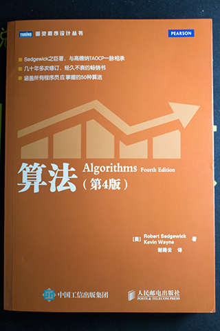

# 《算法（第4版）》


## 书评

## 第一章 基础

## 第二章 排序
```java
public abstract class BaseSort {
    public abstract void sort(Comparable[] a);

    public void show(Comparable[] a) {
        for (Comparable b : a) {
            System.out.print(b + " ");
        }
        System.out.println();
    }

    /**
     * 比较 v 和 w
     * 若 v<w，返回 true，否则返回 false
     */
    protected boolean less(Comparable v, Comparable w) {
        return v.compareTo(w) < 0;
    }

    /**
     * 交换数组 a 中的 i 和 j
     */
    protected void exch(Comparable[] a, int i, int j) {
        Comparable t = a[i];
        a[i] = a[j];
        a[j] = t;
    }
}
```
### 2.1 初级排序算法

选择排序
```java
public class SelectionSort extends BaseSort {
    @Override
    public void sort(Comparable[] a) {
        for (int i = 0; i < a.length; i++) {
            int min = i;
            for (int j = i + 1; j < a.length; j++) {
                if (less(a[j], a[min])) min = j;
            }
            exch(a, i, min);
        }
    }
}
```

插入排序
```java
public class InsertionSort extends BaseSort {
    @Override
    public void sort(Comparable[] a) {
        for (int i = 1; i < a.length; i++) {
            for (int j = i; j > 0 && less(a[j], a[j - 1]); j--) {
                exch(a, j, j - 1);
            }
        }
    }
}
```

希尔排序
```java
public class ShellSort extends BaseSort {
    @Override
    public void sort(Comparable[] a) {
        int N = a.length;
        int h = 1;
        while (h < N / 3) h = 3 * h + 1;
        while (h >= 1) {
            for (int i = h; i < N; i++) {
                for (int j = i; j >= h && less(a[j], a[j - h]); j -= h) {
                    exch(a, j, j - h);
                }
            }
            h = h / 3;
        }
    }
}
```	

### 2.2 归并排序

### 2.3 快速排序


### 2.4 优先队列

## 第三章 查找

## 第四章 图

## 第五章 字符串

## 第六章 背景
 