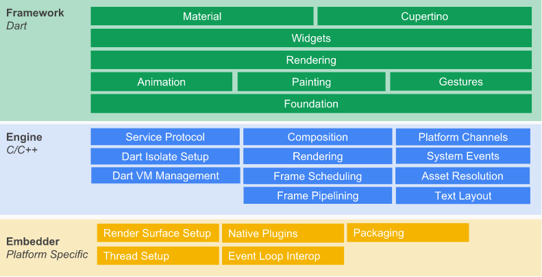

# Android

|     技术栈     |                                                            官方文档                                                            |
| :------------: | :----------------------------------------------------------------------------------------------------------------------------: |
| Android Studio |                    [https://developer.android.google.cn/studio](https://developer.android.google.cn/studio)                    |
|    Flutter     | [https://flutter.dev/docs/get-started/flutter-for/android-devs](https://flutter.dev/docs/get-started/flutter-for/android-devs) |

---

## 移动端当前存在的问题

关于移动端的跨平台方案，由于国内外的发展差异，国内外相关研究的差异较大。在 iOS 端，由 Apple 主导定制标准，国内外状况较为一致；而 Android 端，国外 Android 主要由 Google 提供 Android 内核及相应的 OS（即常说的原生 Android 系统），国内 Android 则是由各大厂在 Android 内核基础上定制各自的 OS（即非原生系统），这种情况导致 Android 碎片化。

对企业来说，成本是一个不得不考虑的问题。如果两个人才能完成的事情能由一人来完成，这样的开发模式无疑会大大让企业减少人力成本上的开销。对移动端开发来讲，如果能“一套代码，多端运行”，必然会给企业带来人力成本上的节省。

2011 年，Cordova 是一个商业跨平台的应用架构。对于某些中小型企业，人力成本是一个重要的指标。在 iOS 和 Android 应用发布的早期，单独的 iOS 或者 Android 开发者数量很少，而在移动端之前传统的 PC 端开发中，Web 技术在 PC 端已经达到很高的成熟度，Cordova 的出现解决了当时的一个难题：“一次开发，多端使用”。

2015 年，Facebook 在推出 React Native 的时候，“Learn once, write anywhere”口号的目的是让 React 框架应用到移动端开发中。其技术重点和难点主要在于使用 JavaScript 调用 Native 的组件，从而让 JavaScript 开发达到原生的体验。

2016 年，Alibaba 开源 Weex，Weex 的口号是”Write Once, Run Everywhere“。由于其比较符合国内的使用习惯，Weex 与原生应用的互相嵌套比 React Native 有更为明显的优势。

2017 年，微信推出小程序应用，小程序在生态的建设上非常出色，它定义了规则和能力，提供了集成开发环境，并且配套了详细的审核机制，让小程序和小游戏并行助力企业和自媒体以及个人发展。小程序的成功还在于它形成了行业的标准，微信小程序后，国内企业相继推出了支付宝小程序、头条小程序。

2018 年，Google 开源 Flutter 与上述框架最本质的区别是：Flutter 使用系统级 API 进行渲染，客户端仅需要提供一块画布就可以支持应用展示。这一点使其脱离了原生的渲染，开发者可以获得高度一致的渲染体验。

## Flutter 的特点

Flutter 是 Google 推出的移动 UI 框架，Flutter 的底层原理架构如图所示：



Widgets 并不完全映射到 Android View，但是当开发者熟悉 Flutter 的工作原理时，开发者可以将它们视为"the way you declare and construct UI"。但是，这与 View 是有一些区别的。首先，Widgets 具有不同的生命周期：它们是不可变的。相比之下，Android View 会被绘制一次，并且在 invalidate 调用之前不会重绘。

这些描述被“夸大”到引擎盖下的实际 View 对象中。Flutter 包括 Material Components 库。这些是实现 Material Design 准则的 Widgets。Material Design 是一个灵活的设计系统，适用于所有平台，包括 iOS。但 Flutter 具有足够的灵活性和表现力，可以实现任何设计语言。例如，在 iOS 上，您可以使用 Cupertino Widgets 来生成看起来像 Apple’s iOS Design Language 的界面。

- `跨平台`：现在 Flutter 至少可以跨 5 种平台，甚至支持嵌入式开发。我们常用的有 MacOS、Windows、Linux、Android、iOS，甚至可以在谷歌最新的操作系统 Fuchsia 上运行。到目前为止，Flutter 算是支持平台最多的框架了，良好的跨平台性，直接带来的好处就是减少开发成本。
- `丝滑般的体验`： 使用 Flutter 内置高大上的 Material Design 和 Cupertino 风格组件、丰富的 motion API、平滑而自然的滑动效果和平台感知，为用户带来全新体验。
- `响应式框架`：使用 Flutter 的、响应式框架和一系列基础组件，可以轻松构建用户界面。使用功能强大且灵活的 API（针对 2D、动画、手势、效果等）能解决艰难的 UI 挑战。
- `支持插件`：通过 Flutter 的插件可以访问平台本地 API，如相机、蓝牙、WiFi 等。借助现有的 Java、Swift、Objective C、C++代码实现对原生系统的调用。
- `60fps超高性能`：Flutter 采用 GPU 渲染技术，所以性能极高。Flutter 编写的应用是可以达到 60fps（每秒传输帧数），这也就是说，它完全可以胜任游戏的制作。官方宣称用 Flutter 开发的应用甚至会超过原生应用的性能。
  Flutter 包括一个现代的响应式框架、一个 2D 渲染引擎、现成的组件和开发工具。这些组件可以帮助你快速地设计、构建、测试和调试应用程序。Flutter 的核心概念有：组件、构建、状态、框架等。

## Dart 语言

Dart 语言是 Google 发布于 2011 年的一门现代编程语言，其目标是成为一门易于学习、易于扩展、并且可以部署到任何地方的应用编程语言。

Dart 语言的诞生的背景原因之一是当时的 JavaScript 语言存在一些问题，一些语言层面上的问题，Dart 语言希望能避免掉这些问题，它是一种非强制性的静态语言。由于 Flutter 应用使用 Dart 语言进行开发，Dart 语言重新进入到人们的视野当中，编程语言的流行与否，其语言特性只是占了其中的一小部分，语言背后的“生态圈”至关重要，Dart 语言没有替换掉 JavaScript，JavaScript 也凭借版本更新渐渐减少其语言层面上的缺陷带来的负面影响。而相信 Dart 语言作为 Flutter 应用开发的官方语言将在编程语言界中获得一席之地。

Dart 语言的一些特性适合 Flutter 开发，Flutter 使用界面逻辑嵌套在代码中的开发方式，Dart 语言万物皆对象，界面代码使用 Dart 语言可以通过对象的属性来进行解析。当前，Dart 语言已经能运行于服务端、移动端和 Fuchsia 操作系统。

## 开发环境搭建

1. 下载 SDK
   - 官网下载：https://flutter.dev/docs/get-started/install/windows
   - github 下载：https://github.com/flutter/flutter/releases
2. 配置系统变量
   ```sh
   export PUB_HOSTED_URL=https://pub.flutter-io.cn
   export FLUTTER_STORAGE_BASE_URL=https://storage.flutter-io.cn
   ```
3. 运行 Flutter 命令

   ```sh
   $ flutter doctor
   Doctor summary (to see all details, run flutter doctor -v):
    [√] Flutter (Channel stable, v1.9.1+hotfix.6, on Microsoft Windows [Version 10.0.18362.418], locale zh-CN)

    [√] Android toolchain - develop for Android devices (Android SDK version 28.0.3)
    [√] Android Studio (version 3.5)
    [!] IntelliJ IDEA Ultimate Edition (version 2019.1)
        X Flutter plugin not installed; this adds Flutter specific functionality.
        X Dart plugin not installed; this adds Dart specific functionality.
    [!] VS Code
        X Flutter extension not installed; install from
        https://marketplace.visualstudio.com/items?itemName=Dart-Code.flutter
    [!] VS Code, 64-bit edition (version 1.39.2)
        X Flutter extension not installed; install from
        https://marketplace.visualstudio.com/items?itemName=Dart-Code.flutter
    [!] Connected device
        ! No devices available

    ! Doctor found issues in 4 categories.
   ```

4. Android Studio 安装 Flutter 插件
   
5. 创建 Flutter 工程
   
   
   
6. 启动 flutter 应用
   
