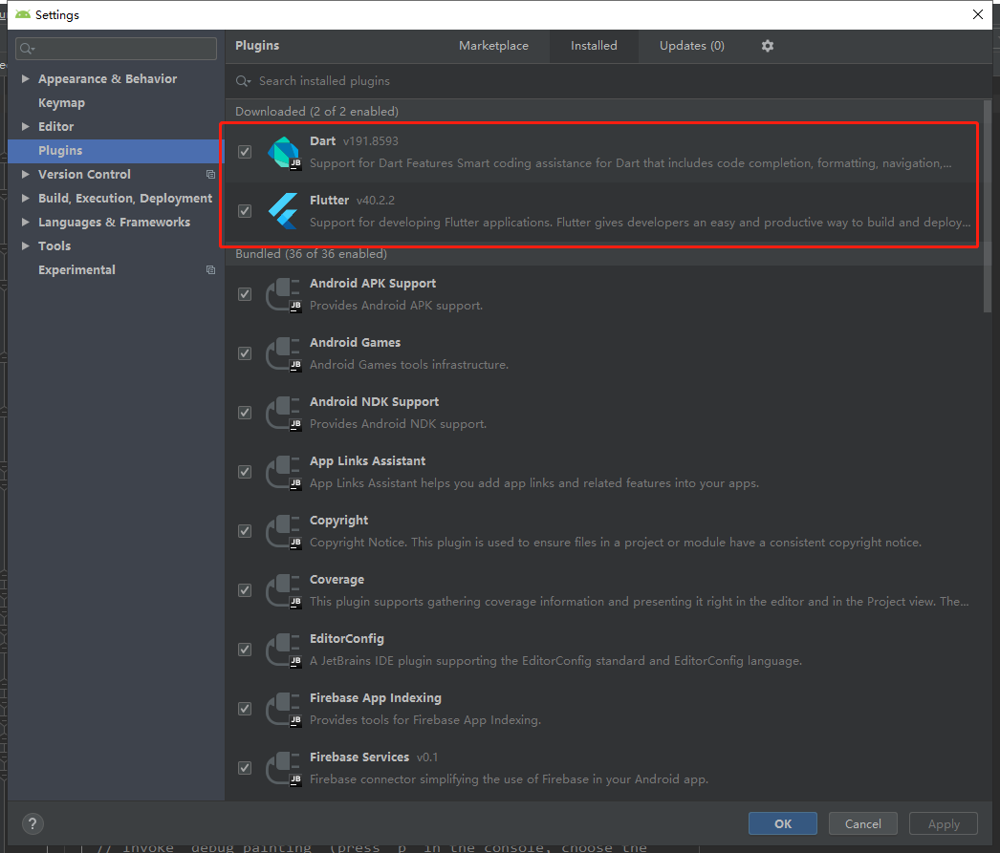
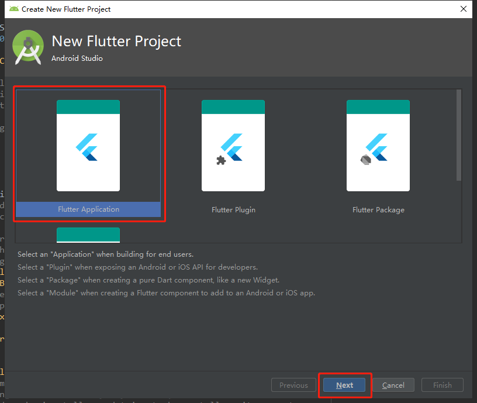
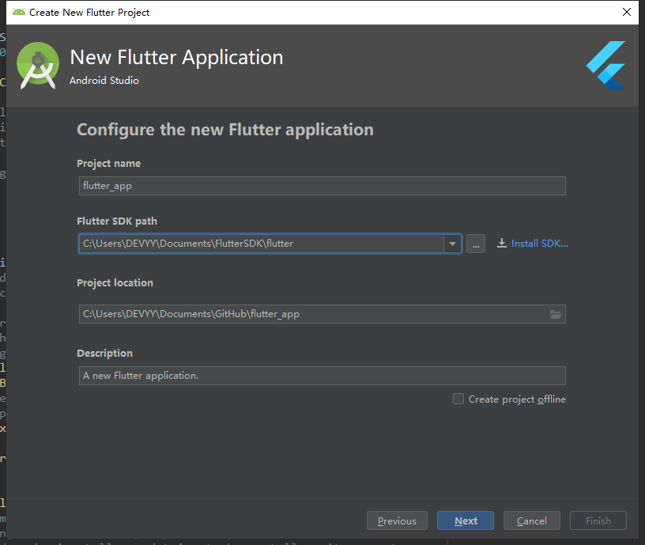
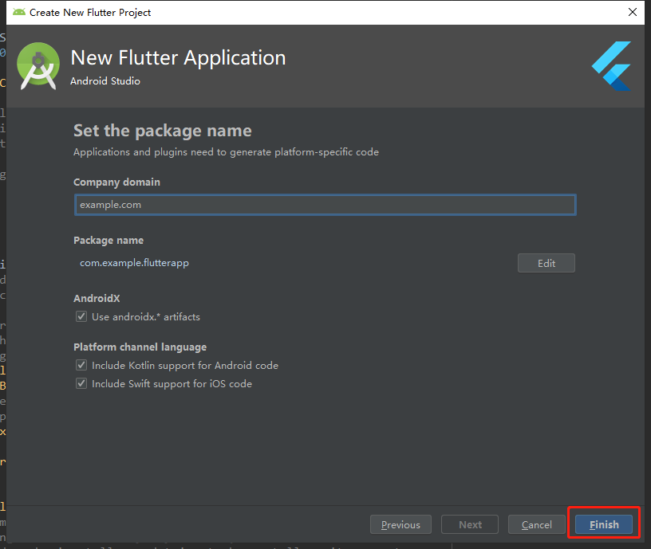
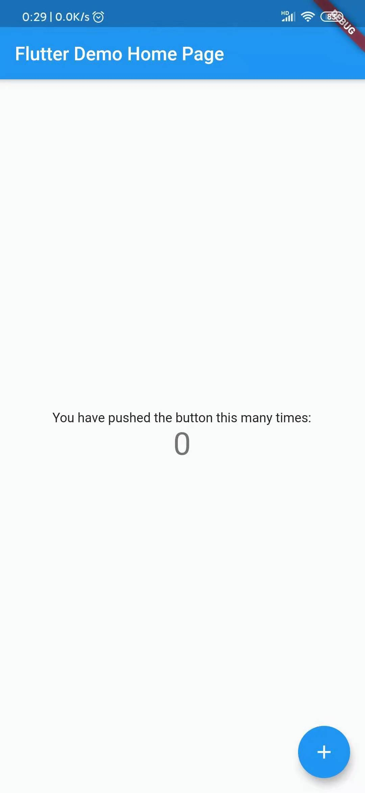

# Android

|     技术栈     |                                                            官方文档                                                            |
| :------------: | :----------------------------------------------------------------------------------------------------------------------------: |
| Android Studio |                    [https://developer.android.google.cn/studio](https://developer.android.google.cn/studio)                    |
|    Flutter     | [https://flutter.dev/docs/get-started/flutter-for/android-devs](https://flutter.dev/docs/get-started/flutter-for/android-devs) |

---

## Flutter 的特点

- `跨平台`：现在 Flutter 至少可以跨 5 种平台，甚至支持嵌入式开发。我们常用的有 MacOS、Windows、Linux、Android、iOS，甚至可以在谷歌最新的操作系统 Fuchsia 上运行。到目前为止，Flutter 算是支持平台最多的框架了，良好的跨平台性，直接带来的好处就是减少开发成本。
- `丝滑般的体验`： 使用 Flutter 内置高大上的 Material Design 和 Cupertino 风格组件、丰富的 motion API、平滑而自然的滑动效果和平台感知，为用户带来全新体验。
- `响应式框架`：使用 Flutter 的、响应式框架和一系列基础组件，可以轻松构建用户界面。使用功能强大且灵活的 API（针对 2D、动画、手势、效果等）能解决艰难的 UI 挑战。
- `支持插件`：通过 Flutter 的插件可以访问平台本地 API，如相机、蓝牙、WiFi 等。借助现有的 Java、Swift、Objective C、C++代码实现对原生系统的调用。
- `60fps超高性能`：Flutter 采用 GPU 渲染技术，所以性能极高。Flutter 编写的应用是可以达到 60fps（每秒传输帧数），这也就是说，它完全可以胜任游戏的制作。官方宣称用 Flutter 开发的应用甚至会超过原生应用的性能。
  Flutter 包括一个现代的响应式框架、一个 2D 渲染引擎、现成的组件和开发工具。这些组件可以帮助你快速地设计、构建、测试和调试应用程序。Flutter 的核心概念有：组件、构建、状态、框架等。

## 开发环境搭建

1. 下载 SDK
   - 官网下载：https://flutter.dev/docs/get-started/install/windows
   - github 下载：https://github.com/flutter/flutter/releases
2. 配置系统变量
   ```sh
   export PUB_HOSTED_URL=https://pub.flutter-io.cn
   export FLUTTER_STORAGE_BASE_URL=https://storage.flutter-io.cn
   ```
3. 运行 Flutter 命令

   ```sh
   $ flutter doctor
   Doctor summary (to see all details, run flutter doctor -v):
    [√] Flutter (Channel stable, v1.9.1+hotfix.6, on Microsoft Windows [Version 10.0.18362.418], locale zh-CN)

    [√] Android toolchain - develop for Android devices (Android SDK version 28.0.3)
    [√] Android Studio (version 3.5)
    [!] IntelliJ IDEA Ultimate Edition (version 2019.1)
        X Flutter plugin not installed; this adds Flutter specific functionality.
        X Dart plugin not installed; this adds Dart specific functionality.
    [!] VS Code
        X Flutter extension not installed; install from
        https://marketplace.visualstudio.com/items?itemName=Dart-Code.flutter
    [!] VS Code, 64-bit edition (version 1.39.2)
        X Flutter extension not installed; install from
        https://marketplace.visualstudio.com/items?itemName=Dart-Code.flutter
    [!] Connected device
        ! No devices available

    ! Doctor found issues in 4 categories.
   ```

4. Android Studio 安装 Flutter 插件
   
5. 创建 Flutter 工程
   
   
   
6. 启动 flutter 应用
   
