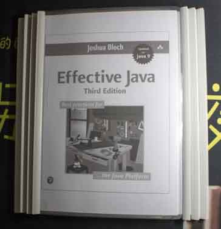

# Effecitive Java ( Third Edition ) 



## 书评

本书被誉为 Java四大名著 之一。鉴于第三版还没有出中文版，本着 “读新不读旧” 的原则，直接读起了 英文原版。

第三版 新增了 Java 7 ~ 9 的新特性。条目从 78条 增添到 90条。

本书主要内容是作者推荐的 Java 编程时候应该遵循的原则。采用 “观点 + 理由” 的结构。

此书是本人真正意义上的第一本 英文编程类书籍。

值得纪念。
```
单例模式是一个非常经典的模式

特别是涉及到 线程安全 和 反射攻击 的时候

作者认为单元素的枚举类型通常是实现单例的最佳方法，即：

public enum Elvis{
    INSTANCE;

    public void leaveTheBuilding(){ ... }
}
```
## CHAPTER 1 : Introduction【简介】

## CHAPTER 2 : Creating and Destroying Objects【创建和销毁对象】

- [Item 1 : Consider static factory methods instead of constructors【考虑用静态工厂方法代替构造器】](chap2/item1.md)
- [Item 2 : Consider a builder when faced with many constructor parameters【遇到多个构造器时考虑 builder】](chap2/item2.md)
- [Item 3 : Enforce the singleton property with a private constructor or an enum type【使用私有构造器或枚举类型实现单例模式】](chap2/item3.md)
- [Item 4 : Enforce noninstantiability with a private constructor【使用私有构造器实现不可实例化】](chap2/item4.md)
- [Item 5 : Prefer dependency injection to hardwiring resources【DI（依赖注入）优于】](chap2/item5.md)
- [Item 6 : Avoid creating unnecessary objects【避免创建不必要的对象】](chap2/item6.md)
- [Item 7 : Eliminate obsolete object references【消除过时的对象引用】](chap2/item7.md)
- [Item 8 : Avoid finalizers and cleaners【避免使用 finalizers 和 cleaners】](chap2/item8.md)
- [Item 9 : Prefer try-with-resources to try-finally【try-with-resources 优先于 try-finally】](chap2/item9.md)

## CHAPTER 3 : Methods Common to All Objects【对于所有对象都通用的方法】

### Item 10 : Obey the general contract when overriding equals【重写 equals() 方法请遵守通用约定】

### Item 11 : Always override hashCode when you override equals【重写 equals() 时重写 hashCode()】

### Item 12 : Always override toString【总是重写 toString()】

### Item 13 : Override clone judiciously【谨慎重写 clone()】

### Item 14 : Consider implementing Comparable【考虑实现 Comparable 接口】


## CHAPTER 4 : Classes and Interfaces【类 和 接口】


### Item 15 : Minimize the accessibility of classes and members【使类和成员的可访问性最小化】

### Item 16 : In public classes, use accessor methods, not public fields【在公有类中使用访问方法而非公有域】

### Item 17 : Minimize mutability【使可变性最小化】

### Item 18 : Favor composition over inheritance【复合优先于继承】

### Item 19 : Design and document for inheritance or else prohibit it【要么为继承而设计，并提供文档，要么就禁止继承】

### Item 20 : Prefer interfaces to abstract classes【接口优于抽象类】

### Item 21 : Design interfaces for posterity【为子类设计接口】

### Item 22 : Use interfaces only to define types【接口只用于定于类型】

### Item 23 : Prefer class hierarchies to tagged classes【类层次优于标签类】

### Item 24 : Favor static member classes over nonstatic【优先考虑静态成员类】

### Item 25 : Limit source files to a single top-level class【将源文件限制为一个顶级类】

## CHAPTER 5 : Generics【泛型】

### Item 26 : Don't use raw types【不要使用原生类型】

原生态类型是指 Java 5 之前未有泛型的年代的类型。

	Set<Object> 是个参数化类型，表示可以包含任何对象类型的一个集合。
	Set<?> 是一个通配符类型，表示只能包含某种未知对象的一个集合
	Set 则是个原生态类型。

### Item 27 : Eliminate unchecked warnings【消除非受检警告】

@SuppressWarnings("unchecked")

### Item 28 : Perfer lists to arrays【列表优先于数组】

类型转换问题

使用数组可能会在运行时出错，而使用 List 则会在编译时发现出错。

### Item 29 : Favor generic types【优先考虑泛型】

### Item 30 : Favor generic methods【优先考虑泛型方法】

### Item 31 : Use bounded withcards to increase API flexibility【利用有限制通配符来提升 API 的灵活性】

	public void pushAll(Iterable<? extends E> src){
        for(E e : src){
            push(e);
        }
    }
    
    public void popAll(Collection<? super E> dst){
        while (!isEmpty()){
            dst.add(pop());
        }
    }

> PECS stands for producer-extends, consumer-super.

> In other words, if a parameterized type represents a T producer, use <? extends T>;
if it represents a T consumer, use <? super T>. In our Stack example, pushAll’s
src parameter produces E instances for use by the Stack, so the appropriate type
for src is Iterable<? extends E>; popAll’s dst parameter consumes E instances
from the Stack, so the appropriate type for dst is Collection<? super E>. The
PECS mnemonic captures the fundamental principle that guides the use of wildcard
types. Naftalin and Wadler call it the Get and Put Principle [Naftalin07, 2.4].

PECS 表示 producer-extends, consumer-super.

换句话说，如果参数化类型表示一个 T 生产者，就使用 <? extends T>；如果它表示一个 T 消费者，就使用 <? super T>。

在我们的 Stack 示例中，pushAll 的 src 参数产生 E 实例供 Stack 使用，因此 src 相应的类型为 Iterable<? extends E>；

popAll 的 dst 参数通过 Stack 消费 E 实例，因此 dst 相应的类型为 Collection<? super E>。

### Item 32 : Combine generics and varargs judiciously【合并泛型和可变长参】

### Item 33 : Consider typesafe heterogeneous containers【优先考虑类型安全的异构类型】

## CHAPTER 6 : Enums and Annotations【枚举和注解】

Java 5 提供了 枚举类型 和 注解类型。

### Item 34 : Use enums instead of int constants【用 enum 代替 int 常量】

public static final int/String int常量/String常量

### Item 35 : Use instance fileds insteads of ordinals【用实例域代替序数】

ordinal() 方法

### Item 36 : Use EnumSet instead of bit fileds【用 EnumSet 代替位域】

### Item 37 : Use EnumMap instead of ordinal indexing【用 EnumMap 代替 序数索引】

### Item 38 : Emulate extensible enums with interfaces【用接口模拟可伸缩的枚举】

### Item 39 : Perfer annotations to naming patterns【注解优先于命名模式】

### Item 40 : Consistently use the Override annotation【坚持使用 Override 注解】

### Item 41 : Use market interfaces to define types【用标记接口定义类型】

## CHAPTER 7: Lambdas and Streams【Lambdas表达式 和 流】

Java 8 新特性

### Item 42 : Perfer lambdas to anonymous classes【Lambdas表达式 优先于 匿名类】

### Item 43 : Perfer methods references to lambdas【方法引用 优先于 Lambdas表达式】

### Item 44 : Favor the use of standard functional interfaces【优先使用标准的函数接口】

### Item 45 : User streams judiciously【谨慎地使用流】

### Item 46 : Perfer side-effect-free functions in streams【在流中优先使用无副作用的函数】

### Item 47 : Perfer Collection to Stream as a return type【优先使用 Collection 而不是 Stream 作为返回类型】

### Item 48 : Use caution when making streams parallel【谨慎地使用并行流】

## CHAPTER 8 : Methods【方法】

### Item 49 : Check parameters for validity【检查参数的有效性】

### Item 50 : Make defensive copies when needed【必要时进行保护性拷贝】

### Item 51 : Design method signatures carefully【谨慎设计方法签名】

### Item 52 : Use overloading judiciously【慎用重载】

### Item 53 : Use varargs judiciously【慎用可变参数】

### Item 54 : Return empty collections or arrays, not null【返回零长度的数组或集合，而不是 null】

### Item 55 : Return optionals judiciously【谨慎地返回 optionals】

Java 8 新特性

### Item 56 : Write doc comments for all exposed API elements【为所有导出的 API 元素写文档注释】

## CHAPTER 9 : General Programming【通用程序设计】

### Item 57 : Minimize the scope of local variables【将局部变量的作用域最小化】

### Item 58 : Prefer for-each loops to traditional for loops【for-each循环优先于传统for循环】

### Item 59 : Know and use the libraries【了解和使用类库】

### Item 60 : Avoid float and double if exact answers are required【如果需要精确的答案，避免使用float和double】

### Item 61 : Prefer primitive types to boxed primitives【基本类型优先于装箱基本类型】

### Item 62 : Avoid strings where other types are more appropriate【如果其他类型更适合，则尽量避免使用String】

### Item 63 : Beware the performance of string concatenation【当心字符串连接的性能】

### Item 64 : Refer to objects by their interfaces【通过接口引用对象】

### Item 65 : Prefer interface to reflection【接口优先于反射机制】

### Item 66 : Use native methods judiciously【谨慎地使用本地方法】

### Item 67 : Optimize judiciously【谨慎地进行优化】

### Item 68 : Adhere to generally accepted naming conventions【遵守普遍接受的命名惯例】

## CHAPTER 10 : Exceptions【异常】

### Item 69 : Use exceptions only for exceptional conditions【只针对异常的情况才使用异常】

### Item 70 : Use checked exceptions for recoverable conditions and runtime exceptions for programming errors【在可重现环境中使用受检异常，在程序错误中使用运行时异常】

### Item 71 : Avoid unnecessary use of checked exceptions【避免不必要地使用受检的异常】

### Item 72 : Favor the use of standard exceptions【优先使用标准的异常】

### Item 73 : Throw exceptions appropriate to the abstraction【抛出与抽象相对应的异常】

### Item 74 : Document all exceptions thrown by each method【每个方法抛出的异常都要有文档】

### Item 75 : Include failure-capture information in detail messages【在细节消息中包含能捕获失败的信息】

### Item 76 : Strive for failure atomicity【努力使失败保持原子性】

### Item 77 : Don't ignore exceptions【不要忽略异常】

## CHAPTER 11 : Concurrency 并发

### Item 78 : Synchronize access to share mutable data【同步访问共享的可变数据】

- 术语：atomic 原子。Java 语言规范中保证读或写一个（非 long 或 double）变量时是原子的。
- 术语：liveness failure : the program fails to make progress. 活性失败：程序无法前进。
- 术语：safety failure : the program computes the wrong results. 安全性失败：程序计算出错误的结果。

volatile 关键字。虽然 volatile 修饰符不执行互斥访问，但它可以保证任何一个线程在读取该域的时候都将看到最近刚刚被写入的值。

如果读和写操作没有都被同步，同步就不会起作用。

自增 AtomicLong 类型（java.util.concurrent.atomic）

### Item 79 : Avoid excessive synchronization【避免过度同步】

- 不要从同步区域内调用外来方法
- 尽量减少同步区域内的工作量
- 在设计类时，有足够理由在内部同步类时，才在内部同步
### Item 80 : Prefer executors, tasks, and streams to threads【executors, tasks 优先于线程】

- Executors.newCachedThreadPool 
- Executors.newFixedThreadPool
- fork-join 
### Item 81 : Prefer concurrency utilities to wait and notify【并发工具优先于 wait 和 notify】

- System.nanoTime
- System.currentTimeMillis
### Item 82 : Document thread safety【线程安全化的文档化】

常见线程安全性级别：

- Immutable 不可变的
- Unconditionally thread-safe 无条件的线程安全
- Conditionally thread-safe 有条件的线程安全
- No thread-safe 非线程安全
- Thread-hostile 线程对立

### Item 83 : Use lazy initialization【慎用延迟初始化】

### Item 84 : Don't depend on the threadscheduler【不要依赖线程调度器】

## CHAPTER 12 : Serialization

### Item 85 : Perfer alternatives to Java serialization【选择要优先于 Java 序列化】

### Item 86 : Implement Serializable with great caution【谨慎地实现 Serializable 接口】

### Item 87 : Consider using a custom serialized form【考虑使用自定义的序列化形式】

### Item 88 : Write readObject methods defensively【保护性地编写 readObject 方法】

### Item 89 : For instance control, prefer enum types to readResolve【对于实例控制，枚举类型优先于 readResolve】

### Item 90 : Consider serialization proxies instead of serialized instances【考虑用序列化代理代替序列化实例】
