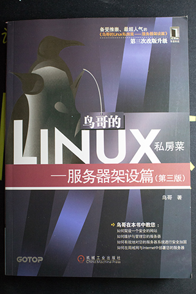

# 《鸟哥的Linux私房菜——服务器架设篇（第三版）》 鸟哥 著

## 书评

# 第一篇 服务器搭建前的进修专区
## 第 1 章 搭建服务器前的准备工作
## 第 2 章 网络的基本概念
## 第 3 章 局域网架构简介
## 第 4 章 连接 Internet
## 第 5 章 Linux 中常用的网络命令
## 第 6 章 Linux 网络排错

# 第二篇 主机的简易安全防护措施
## 第 7 章 网络安全与主机基本防护：限制端口、网络升级与 SELinux
## 第 8 章 路由的概念与路由器设置
## 第 9 章 防火墙与 NAT 服务器
## 第 10 章 申请合法的主机名

# 第三篇 局域网内常见服务器的搭建
## 第 11 章 远程连接服务器 SSH/XDMCP/VNC/XRDP
## 第 12 章 网络参数管理者：DHCP服务器
## 第 13 章 文件服务器之一：NFS服务器
## 第 14 章 账号管理：NIS服务器
## 第 15 章 时间服务器：NTP服务器
## 第 16 章 文件服务器之二：SAMBA服务器
## 第 17 章 局域网控制者：Proxy服务器
## 第 18 章 网络驱动器设备：iSCSI服务器

# 第四篇 常见因特网服务器的搭建
## 第 19 章 主机名控制者：DNS服务器
## 第 20 章 WWW 服务器
## 第 21 章 文件服务器之三：FTP 服务器
## 第 22 章 邮件服务器：Postfix