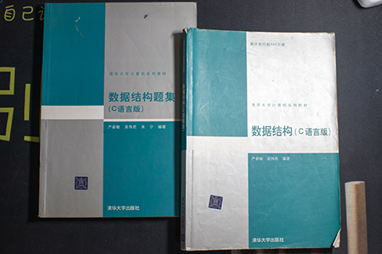

# 《数据结构（C语言版）》 严蔚敏 吴伟民 编著

## 书评

此书源于一位师兄，为师兄的校选教材。到了本人这一届换成了自编教材，emm。。。

## 目录

## 第 1 章 绪论
## 第 2 章 线性表
## 第 3 章 栈和队列
## 第 4 章 串
## 第 5 章 数组和广义表
## 第 6 章 树和二叉树
## 第 7 章 图
## 第 8 章 动态存储管理
## 第 9 章 查找
## 第 10 章 内部排序
## 第 11 章 外部排序
## 第 12 章 文件