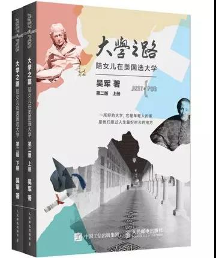

# 《大学之路》 吴军 著

## 书评
作者吴军曾在清华大学读书和任教，之后在美国约翰·霍普金斯大学获得博士学位，又因事业有成而成为该校工学院的董事，得以多年来参与美国知名大学的管理，并且将女儿培养进入麻省理工学院。作者以他和女儿走访过的英美十几所知名大学为样本，结合他多年来对美国高等教育的系统研究，以及访问这些大学教师和校友的一手资料，加上自己的深入思考与独到感悟，精心撰写《大学之路》。
## 目录