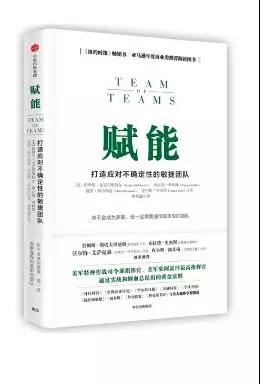

# 《赋能：打造应对不确定性的敏捷团队》 斯坦利·麦克里斯特尔 著

## 书评
在错综复杂的新生态下，预测已经成为不可能，运营的关键已从控制—命令式转变为赋能——分布式，唯有如此才能在新生态下取得成功。 

一手打造了全球最强战斗力的美军特种作战司令部指挥官的斯坦利•麦克里斯特尔，摒弃掉存在了一个多世纪的常规思维，在一场残酷的战争中对特遣部队进行重塑，将其打造成新物种：一张在沟通上极度透明、在决策上去中心化的网络。“深井”间的壁垒被摧毁。领导者们看着运转最小团队的最佳操作方式，并且找到方法把这些操作方式推广到上成千上万的人身上，同时运用一些10年前还无法想象的技术将这些人捏合成一个整体。
## 目录