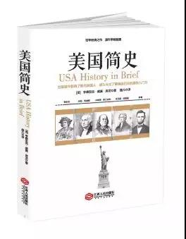

# 《美国简史》 亨德里克·威廉·房龙 著

## 书评
这个时期，简单了解一下美国，非常有必要。一书是由荷兰裔美国知名历史学家、作家房龙所著，于1927年出版上市，仅3个月就销售了20万册，时至今日多次再版重印，流传很广。本书共有五十三章，从哥伦布发现新大陆开始写起，一直写到20世纪20年代，再现了美国的创建和发展的酸甜苦辣历程。其中对历史事件、西方文明以及美国的政治生活都有详细的讲述。
## 目录