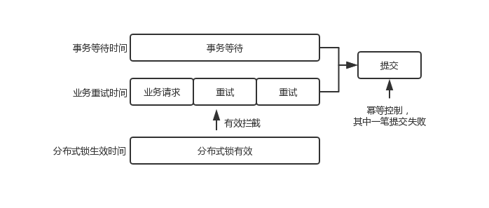
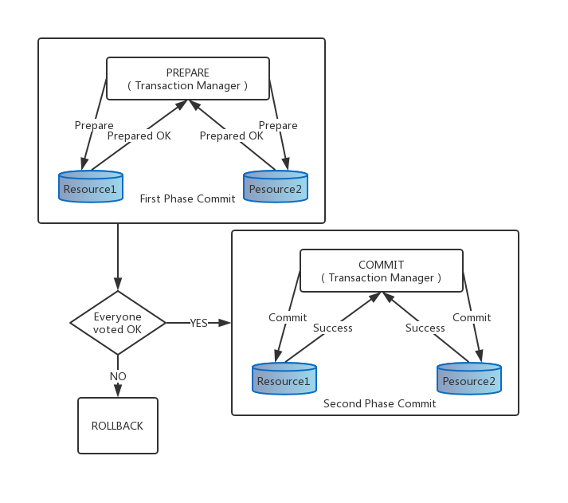

# 《逆流而上：阿里巴巴技术成长之路》 阿里巴巴集团成长集编委会 著

## 书评

## 目录

## 第 1 章 基础架构高可用
### 1.1 明察秋毫，域名解析排查技巧
### 1.2 智能定位，网络端到端静默丢包点迅速锁定
### 1.3 灵活调度，对接运营商网络流量的容灾策略
### 1.4 抽丝剥茧，深挖云盘挂起背后的真相
### 1.5 存储的底线，SSD 数据不一致

## 第 2 章 中间件使用常见隐患与预防
### 2.1 高并发“热点”缓存数据快速“退火”
### 2.2 自我保护，让系统坚如磐石
### 2.3 机房容灾，VIPServer 软负载流量调度实例
### 2.4 山洪暴发，高流量触发 Tomcat bug 引起集群崩溃

## 第 3 章 数据库常见问题
### 3.1 性能杀手，SQL 执行计划
### 3.2 波诡云谲，数据可延迟
### 3.3 风暴来袭，AliSQL 连接池调优
### 3.4 防患于未然，ORM 规约变更案例
### 3.5 云数据库，SQL 优化经典案例

## 第 4 章 业务研发经典案例
### 4.1 幂等控制，分布式锁超时情况和业务重试的并发
#### 背景说明

某日，做产品 X 的开发接到客户公司电话，说是对账出了 1 分钱的差错，无法处理。本着“客户第一”的宗旨，开发立马上线查看情况。查完发现，按照产品 X 当日的年化收益率，正常情况下用户在转入 57 元后一共收益 3 分钱，合计是 57.03 元。但是该客户当日却有一笔消费 57.04 元，导致客户公司系统对多出的 1 分钱处理不了。再进一步分析，发现用户收益结转时多了 1 分钱的收益，并且已消费……

也就是，本来用户只有 3 分钱收益，结果多发了 1 分钱给他，也就是公司造成 1 分钱的损失！用户在产品 X 里当天收益本应该是 0.03 元，怎么会变成 0.04 元呢？多出的 1 分钱收益从哪里来的呢？

#### 数据库记录分析

带着上面的一系列疑问，开发人员首先排除了产品 X 收益的数据库记录。通过查询数据库发现，该用户收益结转在同一天内存在 2 笔交易记录。交易记录 1 创建时间为 8:00:23，记录 2 创建时间为 8:00:29，交易记录 1 和 2 的最后修改时间均为 8:00:29，如图所示

正常情况下产品 X 收益每天只会结转一次，而这个用户当日有两笔收益转账记录。开发人员怀疑，很可能是出现了并发问题。

继续跟踪第一笔“TXID a” 的记录，开发确认线上日志存在超时情况，失败原因是数据库连接数已满，线程等待提交。

分布式锁超时时间是 5s，第一笔记录从创建时间到修改提交经历了 6s，由此可见是在分布式锁失效之后，获得了数据库链接，进行提交成功。

有了以上三个排查思路后，我们可以开始逆推整个过程。

#### 过程逆推

根据数据库记录逆推当时的运行情况，如下图所示

（1）由于数据库连接数被占满，流水 1 创建的事务处于等待提交状态。

（2）系统 A 发现交易失败，重试次数不满 8 次的，立即发起重试，触发生成流水 2 的请求。

（3）5s 以内均被分布式锁拦截，无法提交。

（4）经过 5s 后，系统 B 的分布式锁失效，此时事务仍在等待未提交。

（5）6s 时，流水 2 成功越过数据库查询幂等校验发起事务，此时流水 1 拿到数据库连接，流水 1 和 2 两个事务同时提交。

（6）由于数据库未做唯一索引，且支付受理模块打穿下层幂等原则，生成两个 TXID，导致两事务同时提交成功。

（7）收益结转重复记账，用户多了一笔收入。

#### 深入分析

完成了整个问题的过程逆推后，开发人员进一步分析，发现问题真正的原因还是在系统设计上，如图所示，系统 A 的事务允许一定时间的等待，而上层业务的重试时间又比这个等待的时间要短。这就存在一个问题：系统 A 的事务还在等待中，业务就又发起了重试。如果实在这个应用场景下（可能业务上对重试要求更高一些），那么对幂等控制的要求就更高了。而仅仅通过一个分布式锁来控制，如果分布式锁的超时时间设置的比事务允许等待的时间短，那么再锁失效之后就一定会同时提交两笔请求。

继续对整个过程抽象化，开发人员得出一个结论：分布式锁在以下条件同时满足的情况下并发控制会被打穿。

（1）上层业务系统层面有重试机制。

（2）业务请求存在一定时间之后提交成功的情况，例如本例中第一次请求在事务等待 6s 后获得了数据库链接，提交数据库成功。

（3）下游系统缺乏其他有效的幂等控制手段。

#### 思考

了解了问题的来龙去脉后，接下来要怎么解决这类问题呢？我们想了以下几个方案。

（1）调整 B 系统上的 tr 和分布式锁超时时间，tr 超时调整为 10s，分布式锁超时时间调整为 30s。

（2）防止做收益结账产生并发控制幂等，调整了收益结账流水号的生成规则：前 8 位取 X 收益结传入的交易号的前 8 位，第 10 位系统版本设置为 “9”，最后 8 位 seq 取交易号的最后 8 位，降低问题出现几率。

#### 方案一：调整超时时间

调整超时时间后，业务重试时间与分布式锁有效时间的分布时间轴如图所示，即在事务允许等待后提交成功的时间之外，再进行重试，另外分布式锁在整个阶段有效，防止提交。

方案一验证有效。

#### 方案二：

如图所示，单纯靠分布式锁不是控制并发幂等的方式，最稳妥的方式还是在提交记录的时候通过数据库严格控制幂等。确保不论如何设置超时时间，都不会出现幂等控制的问题。

方案二验证有效。

### 4.2 另类解法，分布式一致性

#### 背景

在大型互联网系统中，基于成本的考虑，普遍会使用 MySQL 数据库；同时由于业务量很大，通常会按照用户维度对数据做垂直拆分，即大家常说的分库分表。

在阿里巴巴的红包系统中，红包的发放操作会涉及两个数据库的事务操作，一个数据库进行预算的扣减，另一个进行用户红包数据的写入，那么如何保证这两个事务操作的一致性呢？

#### 问题原因及分析

开发人员首先想到的就是使用 MySQL 的 XA 协议，它使用的是两阶段提交协议，如图所示。由事务协调者来保证所有的事务参与者都完成了第一阶段的准备工作，如果所有参与者都准备好了，那么就通知所有的参与者进行提交，MySQL 数据仅能扮演参与者的角色，协调者（事务管理器）需要由另外的应用担任。

两阶段提交协议对于红包系统来说，在 XA 事务中的第一阶段，预算端需要做的事情是冻结要扣除的预算，红包数据端需要插入一条不可用的红包数据。在 XA 事务的第二阶段，如果事务需要提交，那么预算端需要将第一阶段的冻结的预算转化为时间的扣除，红包数据端需要将刚才插入的那一套哦不可用的红包数据变为可用；如果事务需要回滚，那么预算端需要将第一阶段的冻结的预算进行撤销操作，红包数据端需要删除刚才插入的不可用的红包数据。

对于任何一次不论是成功还是失败的发放操作，预算端都会涉及两次针对于预算记录的事务操作。众所周知的是，该条记录的操作会存在热点写的问题，使用 XA 事务的方案会将热点写问题放大一倍。在业务场景中，使用 XA 事务的方案看起来有些过于“悲观”了，事实上红包发放的成功与否几乎完全取决于预算是否扣减成功。回到业务的根本需求上来，有以下两个关键点。

（1）希望预算扣减成功与产生用户红包数据这两件事要么同时成功，要么同时失败，只要预算足够，那么理论上是肯定成功的。

（2）不可能将每一个发放操作编程一个一个顺序的独立事务，这样不但性能非常差，同时后面的事务也并不关心预算的具体剩余金额。所以时间上在发放操作中，很有可能看到一个是中间态的预算剩余金额，这是允许的。

如果能存在一个机制，它能保证预算扣减成功后 100% 会通知到我们。这样就可以利用这个机制去产生用户红包数据，如果产生失败，那么我们可以对已经扣减的预算进行一笔反向操作。

#### 解决过程

最终的解决方案是开发人员设计一个轻型的一致性消息组件，把预算扣减成功等诸多业务操作事件写入数据库中，该消息组件保证事件与业务操作处在同一个数据库中，所以仅仅是一次简单的本地事务操作。该消息组件会对写入的事件进行分支，通知每一个事件订阅者（比如在当前的场景中就是进行用户红包数据写入），然后对事件的处理结果进行记录。

在一个成功的红包发放操作中，对于预算端来说，进行了一次预算的扣减，一次事件的写入，可能会进行一次事件读取，一次事件状态更新；对于用户红包数据端，仅需要进行一次用户红包数据的写入。可以看到，对于预算扣减的热点数据操作，新的方案并没有放大它。同时，失败的红包发放操作就更简单了，仅仅是一次失败的预算扣减，没有事件，没有用户红包端的任何操作。

另外，在实际使用中开发人员发现，使用这样的一套方案还可以降低系统的编码以及运维的复杂度，不再需要为预算端设计冻结操作以及用户红包数据端设计不可用数据，也不需要引入另外一套独立的事务协调系统。

这套系统命名为 MiniBus，即微型总线。如图所示，它包括以下三部分。

（1）事件发布者 Publisher。由业务逻辑在业务事务中调用，将事件写入到业务相同的数据库中。

（2）事件配置 Metadata。管理事件的基本信息，订阅关系等。

（3）事件调试器 Scheduler。读取待分发的事件，根据订阅关系进行分发，调用相应的事件处理器，然后记录事件分发的结果。

该方案并不仅仅解决了红包发放操作中的事务一致性问题，事实上，只要业务上满足如下的两个要求，它都适用。

（1）短暂的中间状态是可以接受的。

（2）要求最终一致性。

同时，还有如下 4 个方面的优点。

（1）较 XA 方案更易于编码和理解，已有代码的改造成本很低。

（2）数据库消耗增加较少。

（3）系统简单，外部依赖少，易于维护。

（4）兼容数据库上的其他 SQL 优化。

#### 小结

好的技术方案都是对于业务场景的深刻理解和权衡之后获得的，虽然通用的方案是首选，但它并不是唯一的好的选择。

### 4.3 大道至简，从故障模型的边界状态切换到原始状态
### 4.4 疑案追踪，JSON 序列化不一致
### 4.5 从现象到本质，不保证顺序的 Class.getMethods JVM 实现
### 4.6 破解超时迷局，前夕启动初期 load 飙高问题
### 4.7 洞悉千丝万缕，浅谈 JIT 编译优化的误区

## 第 5 章 运行管理域稳定性建设
### 5.1 洞若观火，让故障无处遁形
### 5.2 体系化思考，高效解决运营商问题
### 5.3 以战养兵，以故障演练提升系统稳定性