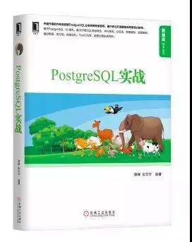

# 《PostgreSQL 实战》 谭峰 张文升 编著

## 书评
本书基于PostgreSQL 10编写，重点介绍PostgreSQL的丰富特性以及生产实践运维技巧。全书共18章，分为基础篇、核心篇、进阶篇三部分。基础篇包括第1到4章，主要介绍PostgreSQL基础知识，例如安装、客户端工具、数据类型、SQL高级特性等，为读者阅读核心篇和进阶篇做好准备；核心篇包括第5到9章，主要介绍PostgreSQL核心内容，例如体系结构、并行查询、事务与并发控制、分区表、NoSQL特性等；进阶篇包括第10到18章，主要介绍PostgreSQL进阶内容，例如性能优化、物理复制、逻辑复制、备份与恢复、高可用、版本升级、Oracle数据库迁移PostgreSQL实战、PostGIS等。
## 目录