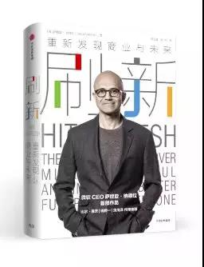

# 《刷新：重新发现商业与未来》（*Hit Refresh*）

## 书评
微软CEO萨提亚•纳德拉首部作品。互联网时代的霸主微软，曾经错失了一系列的创新机会。但是在智能时代，这家科技公司上演了一次出人意料的“大象跳舞”。

2017年，微软的市值已经超过6000亿美元，在科技公司中仅次于苹果和谷歌，高于脸谱网。除了传统上微软一直占有竞争优势的软件领域，在云计算、人工智能等领域，微软也获得强大的竞争力。通过收购领英，微软还进入社交网络领域。
## 目录