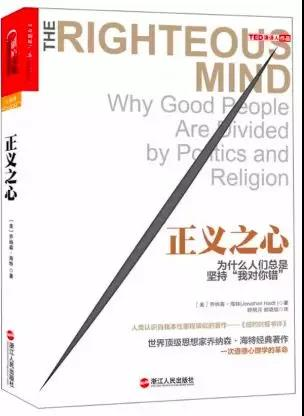

# 《正义之心：为什么人们总是坚持“我对你错”》（*The Righteous Mind*）

## 书评
著名心理学家、坦普尔顿积极心理学奖获得者、伟大的思想家、积极心理学先锋派领袖、热销书《象与骑象人》作者、TED演讲人乔纳森海特力作。

在《正义之心》中，海特教授从道德的社会直觉模型讲到道德的6个基础，继而详细阐述我们具有群体归属性的正义之心，书中立足于详尽的科学研究回答了人们该如何跨越宗教与政治分歧，从而达成互相理解以促成合作型社会的建立这一目标。这是一本令人惊奇又极富挑战性和说服力的经典著作，读者会在阅读过程中瞠目结舌，最后恍然大悟、心服口服。
## 目录