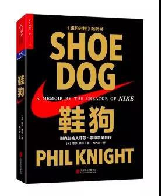

# 《鞋狗》 菲尔·奈特 著

## 书评
懦夫从不启程，弱者死于路中，只剩我们前行。

在《鞋狗》中，耐克创始人菲尔·奈特亲自讲述了耐克“从0到1”的过程：作为一位美国俄勒冈州的普通人，他出于对跑步的热爱决定进入跑鞋销售领域，从50美元起步，带领一支个性古怪的“杂牌军”，游走于随时破产的边缘，却最终缔造了一个强大的体育商业帝国，让耐克标志成为少数几个可以被全世界人毫不费力认出的商标之一。

创业过程中，合作伙伴的背叛、开户银行的翻脸、竞争对手的构陷、国家权力的紧逼、狡猾的融资技巧、粗犷放纵的企业文化、近乎不要命的扩张策略……菲尔·奈特用朴实、幽默的语言，真实袒露了一群“鞋狗”创业路上的挚爱、执着与疯狂。
## 目录