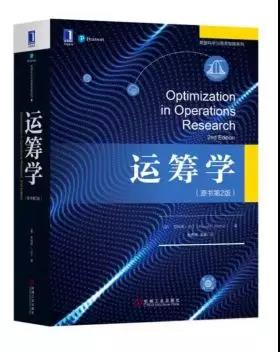

# 《运筹学》 罗纳德 L.拉丁 著

## 书评
本书是罗纳德L.拉丁所著的经典教材，本书宗旨是给不同学科背景的读者提供运筹学学习的全面指南。涵盖运筹学的全部内容（整数、非整数算法，网络编程，动态数学建模等），加入了众多主题和案例，每种算法和分析都配有一个小故事和计算练习。修订版本提升了本书作为本科生教材的难度，与研究生阶段的内容衔接更为紧密，同时又可作为研究、专业人员的自学和参考用书。已被普渡大学、加州大学欧文分校、华盛顿大学等高校采用。
## 目录