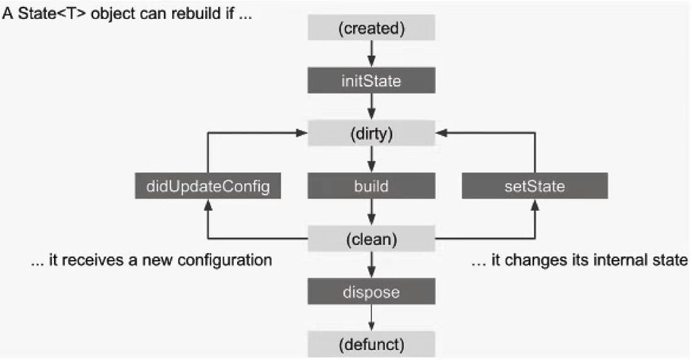
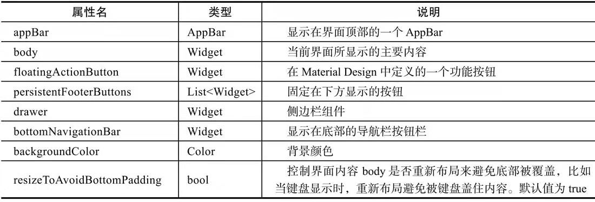
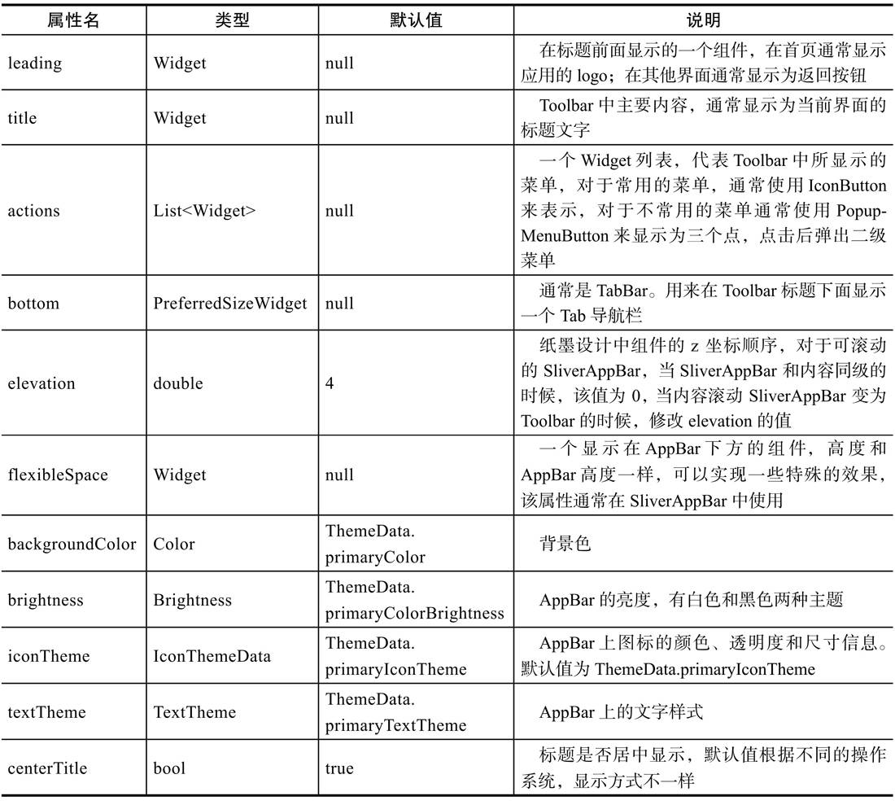
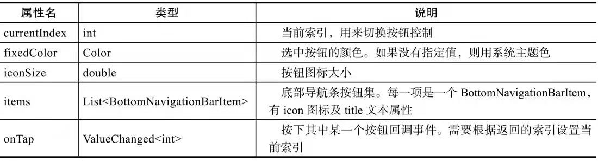
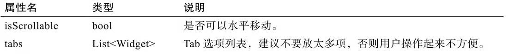
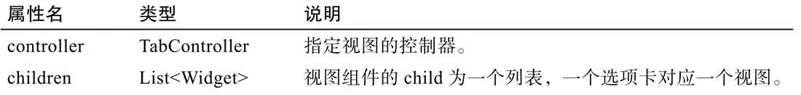
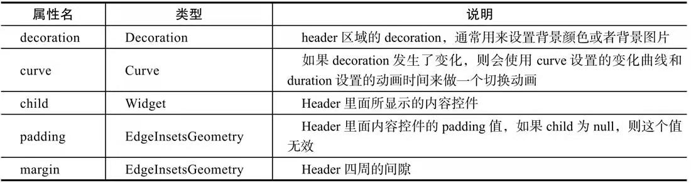
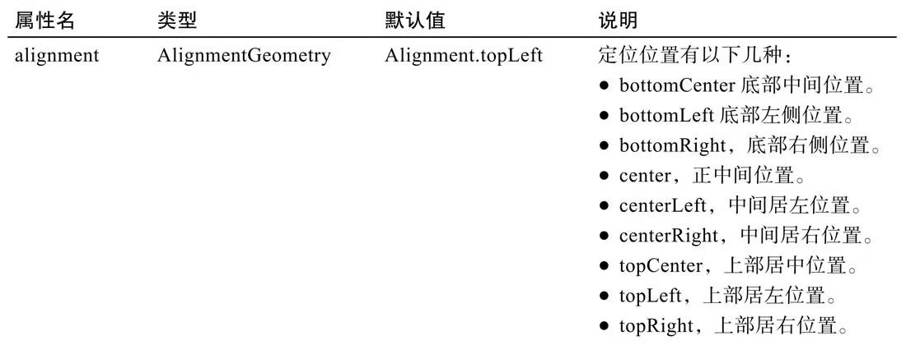
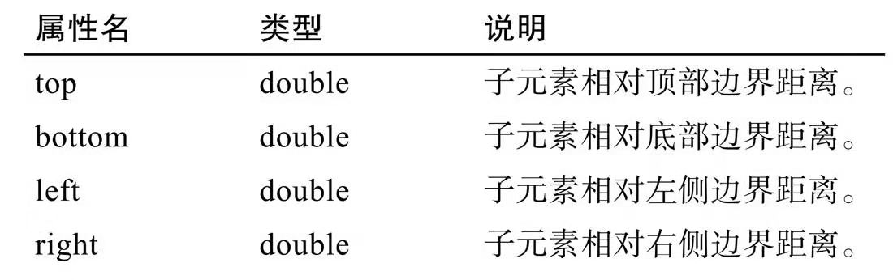

# 《Flutter 技术入门与实战》 亢少军 著

## 书评

## 目录

## 第 1 章 开启 Flutter 之旅
Flutter 中的状态：

开发环境搭建详见：https://github.com/gdut-yy/DevOps/blob/master/readme/Flutter.md

Android Studio 安装 Flutter 插件
## 第 2 章 Flutter 基础知识

## 第 3 章 Dart 语言简述
Dart 诞生于 2011 年 10 月 10 日，谷歌 Dart 语言项目的领导人 Lars Bak 在丹麦举行的 Goto 会议上宣布，Dart 是一种“结构化的Web编程”语言，Dart 编程语言在所有现代浏览器和环境中提供高性能。

1. 常量和固定值
    - `const`：是一个编译时的常量。
    - `final`：的值只能被设定一次。
2. 基本数据类型
    - `Number`：int、double
    - `String`：
    - `Boolean`：强 bool 类型
    - `List`：var list = [1,2,3];
    - `Map`：
3. 函数
    - 可选参数：中括号
    - 参数默认值：
4. 运算符
    - `as`：类型转换
    - `is`：当对象是相应类型时返回 true
    - `is!`：当对象不是相应类型时返回 true
5. 条件表达式
    - `condition ? expr1 : expr2`：如果条件为真，返回 expr1，否则返回 expr2
    - `expr1 ? ? expr2`：如果 expr1 为非空，则返回其值；否则，计算并返回 expr2 的值
6. 级联操作
    - `..`
7. 流程控制语句
    - `if` 和 `else`
    - `for`
    - `while` 和 `do-while`
    - `break` 和 `continue`
    - `switch` 和 `case`
    - `assert`：Dart语言通过使用assert语句来中断正常的执行流程，当assert判断的条件为false时发生中断。assert判断的条件是任何可以转化为boolean类型的对象，即使是函数也可以。如果assert的判断为true，则继续执行下面的语句；反之则会抛出一个断言错误异常AssertionError。
    - `try-catch` 和 `throw`

## 第 4 章 常用组件
- 列表组件
- 表单组件
## 第 5 章 Material Design 风格组件
### 5.1.1 MaterialApp

### 5.1.2 Scaffold

### 5.1.3 AppBar

### 5.1.4 BottomNavigationBar

### 5.1.5 TabBar TabBarView

### 5.1.6 Drawer

## 第 6 章 Cupertino 风格组件
## 第 7 章 页面布局
### 7.1 基础布局处理
- Container（容器布局）
- Center（居中布局）
- Padding（填充布局）
- Align（对齐布局）
- Row（水平布局）
- Column（垂直布局）
- FittedBox（缩放布局）
- Stack/Alignment
    
- Stack/Positioned
    
- IndexedStack
- OverflowBox

### 7.2 宽高尺寸处理
- SizedBox（设置具体尺寸）
- ConstraintedBox（限定最大最小宽高布局）
- LimitedBox（限定最大宽高布局）
- AspectRatio（调整宽高比）
- FractionSizedBox（百分比布局）

### 7.3 列表及表格布局
- ListView
- GridView
- Table

### 7.4 其他布局处理
- Transform（矩阵转换）
- Baseline（基准线布局）
- Offstage（控制是否显示组件）
- Wrap（按宽高自动换行布局）
## 第 8 章 手势
## 第 9 章 资源和图片
## 第 10 章 路由及导航
## 第 11 章 组件装饰和视觉效果
## 第 12 章 动画
## 第 13 章 Flutter 插件开发
## 第 14 章 开发工具及使用技巧
## 第 15 章 测试与发布应用
## 第 16 章 综合案例 —— 即时通讯 App 界面实现
