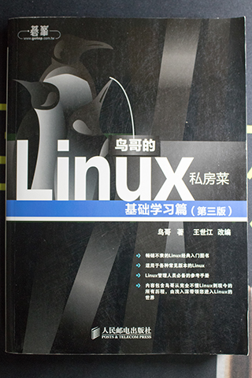

# 《鸟哥的Linux私房菜——基础学习篇（第三版）》 鸟哥 著

## 书评

现在的云服务提供商基本都有提供 Ubuntu 和 CentOS 两个 Linux 发行版

猜测是因为鸟哥的原因，国内大部分服务器都是使用 CentOS 发行版

# 第一部分 Linux的规划与安装
## 第 0 章 计算机概论
## 第 1 章 Linux是什么
## 第 2 章 Linux如何学习
## 第 3 章 主机规划与磁盘分区
## 第 4 章 安装 CentOS 5.x 与多重引导小技巧
## 第 5 章 首次登陆与在线求组 man page

# 第二部分 Linux 文件、目录与磁盘格式
## 第 6 章 Linux的文件权限与目录配置
## 第 7 章 Linux文件与目录管理
## 第 8 章 Linux磁盘与文件系统管理
## 第 9 章 文件与文件系统的压缩与打包

# 第三部分 学习shell与shell script
## 第 10 章 vim程序编辑器
## 第 11 章 认识与学习bash
## 第 12 章 正则表达式与文件格式化处理
## 第 13 章 学习shell script

# 第四部分 Linux使用者管理
## 第 14 章 Linux账号管理与ACL权限设置
## 第 15 章 磁盘配额（Quota）与高级文件系统管理
## 第 16 章 例行性工作（crontab）
## 第 17 章 程序管理与 SELinux 初探
## 第 18 章 认识系统服务（daemons）
## 第 19 章 认识与分析日志文件

# 第五部分 Linux系统管理员
## 第 20 章 启动流程、模块管理与Loader
## 第 21 章 系统设置工具（网络与打印机）与硬件检测
## 第 22 章 软件安装：源码与Tarball
## 第 23 章 软件安装：RPM、SRPM与YUM功能
## 第 24 章 X Window设置介绍
## 第 25 章 Linux备份策略
## 第 26 章 Linux内核编译与管理