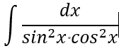

## 1
UNO牌 1-7 A-F 每人一张 报的数递增且需能整除自己的数字 

报数如下：求数字6对应的是（第7个报了49）

	A. 15
	B. 19
	C. 25
	D. 30
	E. 36
	F. 46

## 2
699, 1629, 11161219, 311611121119, ?

	A. 41321613121319
	B. 31321613111319
	C. 13211613111319
	D. 13211631123119
	E. 32633239
	F. 427722332210
## 3

双向循环链表

## 4
不定积分

## 5
快递员 甲、乙、丙 

快递 A、B、C、D、E

每个快递员至少一个快递

求 A、B同时被甲拿到的概率

## 6

| 部门 | 打印占比 | 卡纸占比 |
| :-: | :-: | :-: |
| BU1 | 0.5 | 0.04 |
| BU2 | 0.4 | 0.0125 |
| BU3 | 0.1 | 0.25 |

	A. 打印机卡纸率 0.3025
	B. 打印机卡纸率 0.01
	C. 打印机卡纸率 015
	D. 打印卡纸，BU1-0.4,BU2-0.1，BU3-0.5
	E. 打印卡纸，BU1-0.3,BU2-0.2，BU3-0.5
	F. 打印卡纸，BU1-0.3,BU2-0.2，BU3-0.7

## 7

输入图片大小为200×200，依次经过一层卷积（kernel size 5×5，padding 1，stride 2），pooling（kernel size 3×3，padding 0，stride 1），又一层卷积（kernel size 3×3，padding 1，stride 1）之后，输出特征图大小为：

	A. 96
	B. 97
	C. 98
	D. 99
	E. 100
	F. 101

解析：

97

阿里巴巴2017秋招研发工程师笔试题 原题

## 8

最小二乘回归，增加正则参数的值

	A. 不会影响训练误差
	B. 不会增加训练误差
	C. 不会影响测试误差
	D. 不会增加测试误差
	E. 有可能增加或减少训练误差
	F. 有可能增加或减少测试误差

## 9

深度为7的满二叉树，共64个节点。小明在最左的叶子节点，小红在右边63个的其中一个。

求小明走到小红节点的数学期望（从一个节点走到相邻节点路程为1）

	A. 15.9
	B. 16.7
	C. 13.2
	D. 11.8
	E. 18.3
	F. 19.6

## 10

内存块大小 1、3、5、7 KB

某进程需要 15KB 25KB 40KB

求最少内存块

	A. 14
	B. 15
	C. 16
	D. 17
	E. 18
	F. 19