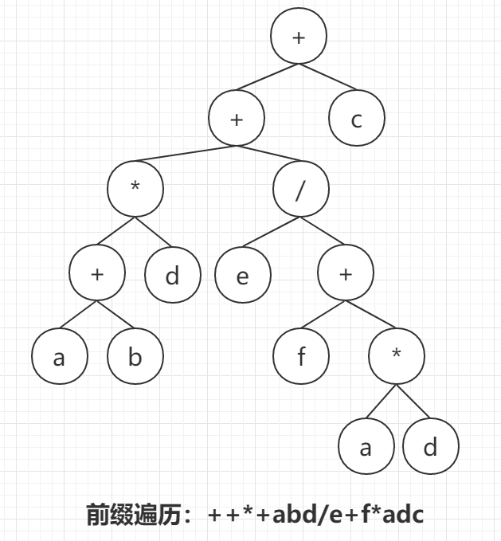

# 网易2019校招Java研发工程师笔试卷（0908）

## 表达式二叉树 前序遍历：求后缀表达式
	++*+abd/e+f*adc

	表达式：(a+b)*d+e/(f+a*d)+c

	后缀表达式：ab+d*efad*+/+c+

## alias mydir = "ls"

alias命令用来设置指令的别名。我们可以使用该命令可以将一些较长的命令进行简化。使用alias时，用户必须使用单引号''将原来的命令引起来，防止特殊字符导致错误。

alias命令的作用只局限于该次登入的操作。若要每次登入都能够使用这些命令别名，则可将相应的alias命令存放到bash的初始化文件/etc/bashrc中。
## 路由器节点带宽 20Mbps 分组长2M字节 1秒平均分组200个，求传输时延？

	0.5
	0.8
	3
	1

## 192.168.120.1/20 子网地址 掩码 最大主机数

192.168.‭0111 1000.0000 0001

最大主机数 2^12=4096

掩码：192.168.240.0‬

## ./test.sh 与 bash test.sh
	
	sh a.sh
	bash a.sh

都是打开一个subshell去读取、执行a.sh，而a.sh不需要有"执行权限"

通常在subshell里运行的脚本里设置变量，不会影响到父shell的。

 
	./a.sh

打开一个subshell去读取、执行a.sh，但a.sh需要有"执行权限"

## （问答）Java的继承与实现，特点。

## （问答）clone 与 serialization 集合类为什么没有 cloneable接口 和 serialization接口。