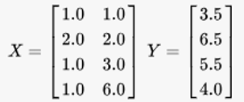

# 网易游戏 移动开发工程师2019秋招
### 请用自己熟悉的语言实现用最小二乘法求解多元线性回归的参数

## 题目描述
请用自己熟悉的语言实现一个方法

solve(X,Y)

功能时利用最小二乘法求解多元线性回归的参数，其中X，Y是待拟合的数据，X是自变量，Y是因变量。

例如：

对于如下输入

因为 X 的列数为 2，所以我们建立二元回归模型如下：

y = a + bx0 + cx1

根据最小二乘法可以求出，a=1.92, b=2.23, c=0.05

下面的python代码给出了程序的主体部分，可以参考或拷贝。

	import sys, math
	
	def solve(X, Y):
	    '''
	    Solve multiple linear regression based on least square algorithm
	    
	    Inputs:
	    - X: A 2-D array of shape (num_of_examples, dimension_of_x + 1)
	    - Y: A 1-D array of shape (num_of_examples,)
	    
	    Returns:
	    - coefficents: A 1-D array of shape (dimension_of_x + 1,).
	    '''
	    pass
	
	if __name__ == '__main__':
	    X = []
	    Y = []
	
	    while True:
	        line = sys.stdin.readline().strip('\r\n')
	
	        if line == '':
	            break
	
	        nums = line.split(',')
	        nums = [float(n) for n in nums]
	
	        X.append([1.0] + nums[:-1])
	        Y.append(nums[-1])
	
	    coefs = solve(X, Y)
	
	    formatted_coefs = []
	    for coef in coefs:
	        coef = math.floor(formatted_ceefs * 100) / 100
	        formatted_coefs.append('%.2f' % coef)
	
	    print(','.join(formatted_coefs))

## 输入描述
假设要拟合的函数是 y=f(x)

输入的每一行表示一个待拟合的数据点（x, y），不同数字用逗号分隔，最后一个数字是y值

## 输出描述
输出为求解出的参数数值，用逗号分隔（常数项放在首位），精确到小数点后两位（截断）

## 示例1
### 输入
	1.0,1.0,3.5
	2.0,2.0,6.5
	1.0,3.0,5.5
	1.0,6.0,4.0
### 输出
	1.92,2.23,0.05
### 说明
	输入数据一行有三个数字，说明待求解的是二元线性回归的参数，
	
	y = a + bx0 + cx1

----