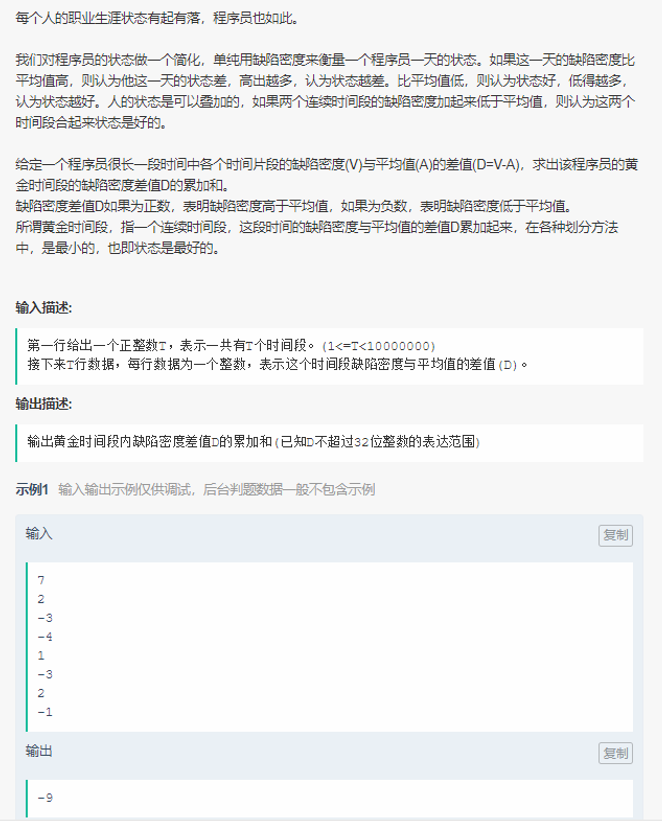

----

	/**
	* long long int
	* O(n^2) 超运行时间 case通过率 60%
	* O(n) 超内存 case通过率 80%
	*
	* int 
	* O(n) case通过率 90%
	*/
	
	#include<bits/stdc++.h>
	
	using namespace std;
	typedef long long ll;
	
	int main() {
	    std::ios::sync_with_stdio(false);
	    cin.tie(0);
	
	    ll T;
	    cin >> T;
	    vector<int> vec;
	    int in;
	    for(int i=0; i<T; i++) {
	        cin >> in;
	        vec.push_back(in);
	    }
	
	    ll thisSum = 0;
	    ll minSum = 0;
	    for(ll i=0; i<T; i++) {
	        thisSum += vec[i];
	
	        if(thisSum < minSum) {
	            minSum = thisSum;
	        } else if (thisSum > 0) {
	            thisSum = 0;
	        }
	    }
	    cout << minSum << endl;
	
	    return 0;
	}