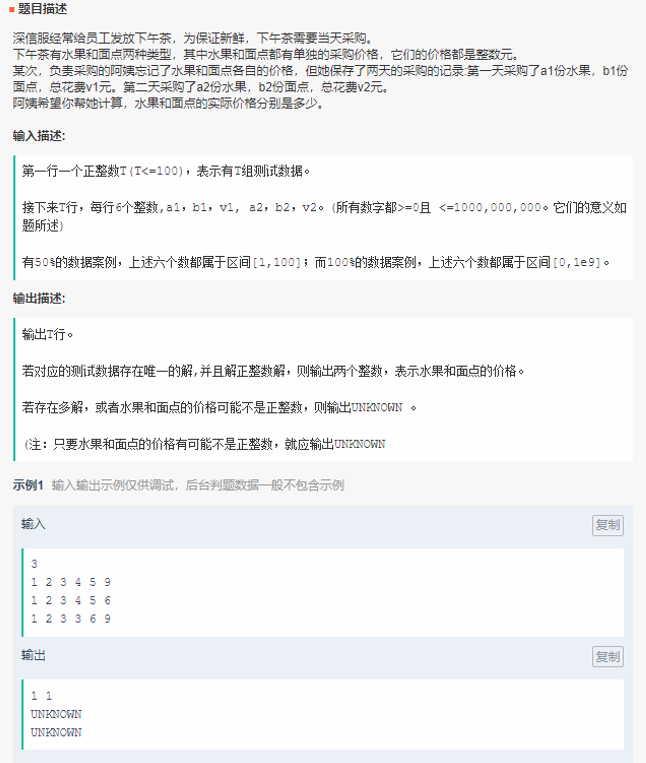

----

校招群 AC 代码：

	#include<iostream>
	#include<stdio.h>
	#include<vector>
	using namespace std;
	void shuchu(vector<int>vec) {
	    if ((vec[0] * vec[4] - vec[1] * vec[3]) == 0) {
	        cout << "UNKNOWN" << endl;
	        return;
	    }
	    int a = vec[0] * vec[4] - vec[1] * vec[3];
	    int c = (vec[4] * vec[2]) + (-vec[1] * vec[5]);
	    int d = -vec[3] * vec[2] + vec[0] * vec[5];
	    if (c % a != 0 || d % a != 0||c/a<0||d/a<0) {
	        cout << "UNKNOWN" << endl;
	        return;
	    } else
	        cout << c / a << ' ' << d / a<<endl;
	
	}
	int main() {
	    int m;
	    cin >> m;
	    vector<vector<int>>vec(m,vector<int>(6, 0));
	    for (int i = 0; i<m; i++)
	        for (int j = 0; j<6; j++) {
	            int num1;
	            cin >> num1;
	            vec[i][j] = num1;
	        }
	    for (int i = 0; i<m; i++) {
	        shuchu(vec[i]);
	
	    }
	    return 0;
	}
