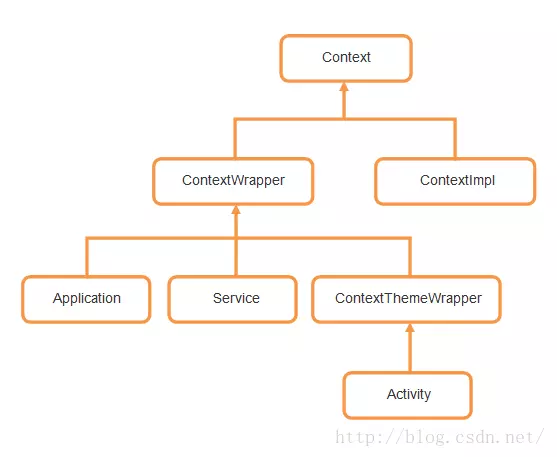

## Context 子类

## Activity 子类

## Wrapper 子类

## View 与 SurfaceView

概念:

view在UI线程去更新自己；而SurfaceView则在一个子线程中去更新自己

surfaceView是在一个新起的单独线程中可以重新绘制画面，而View必须在UI的主线程中更新画面

在UI的主线程中更新动画，时间一旦太长就会出现问题

surfaceView 在新的线程中更新画面所以不会阻塞你的UI主线程，但是涉及到线程同步，需要surfaceView中 thread处理，一般就需要有一个event queue的设计来保存touch event 

触摸产生的动画用view，比如打消消乐

一直在动的动画用surfaceView，比如有一款跑步的app里面的效果

## Tween 动画、Frame 动画（过气动画，不知道为什么要考）

## Android 五种安全机制

	进程沙箱隔离机制
	应用程序签名机制
	权限声明机制
	访问控制机制
	进程通信机制
	内存管理机制

## Looper、Handler 和 HandlerThread