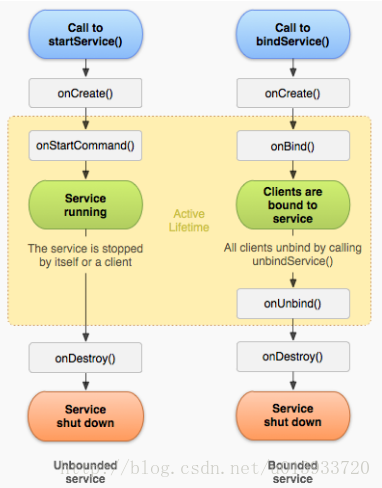

单选 15 道，问答 7 道，编程 3 道

## （问答）Android 不同 Service 的生命周期

## （问答）数据库为什么要用锁；死锁发生的必要条件；A、B两个线程和a、b两个对象发生死锁的例子

### 1、锁对实现数据库并发控制是一个好的方案。

### 2、

**死锁产生的4个必要条件：**

**互斥条件：**进程要求对所分配的资源（如打印机）进行排他性控制，即在一段时间内某 资源仅为一个进程所占有。此时若有其他进程请求该资源，则请求进程只能等待。

**不剥夺条件：**进程所获得的资源在未使用完毕之前，不能被其他进程强行夺走，即只能 由获得该资源的进程自己来释放（只能是主动释放)。

**请求和保持条件：**进程已经保持了至少一个资源，但又提出了新的资源请求，而该资源 已被其他进程占有，此时请求进程被阻塞，但对自己已获得的资源保持不放。

**循环等待条件：**存在一种进程资源的循环等待链，链中每一个进程已获得的资源同时被 链中下一个进程所请求。　

这四个条件是死锁的必要条件，只要系统发生死锁，这些条件必然成立，而只要上述条件之一不满足，就不会发生死锁。

死锁的四个条件 ：1、互斥     2、保持锁并请求锁    3、不可抢夺    4、循环等待

### 3、A、B线程在运行开始时分别持有a、b对象，A拥有a，对象a被A上锁了，B拥有b，对象b被B上锁了，此时，线程A在要往后运行需要对象b，而线程B要往后运行需要对象a，此时A、B线程都希望获得对方的资源，但是手上的资源都不愿拿出来，这个时候就形成了“僵局”，进入了死锁。

## （问答）链表优点，缺点；判断是否相交（两种方法）；判断是否有环（一种方法）

### 1、内存中地址不是连续的，优点是插入删除比较方便，长度可以实时变化；缺点是不支持随机查找，查找元素需要遍历。

### 2、
**（方法一）**链表相交之后，后面的部分节点全部共用，所以我们可以用2个指针分别从这两个链表头部走到尾部，最后判断尾部指针的地址信息是否一样，若一样则代表链表相交！ 

**（方法二）**相交之后部分的长度是相等的，所以我们让长链表的长度减去短链表的长度，得到相差的长度，之后让长链表从头结点开始走过这个长度，与短链表同时向后走，若指针相等，则链表相交；若走到NULL，则链表不相交。 

### 3、最常用方法：定义两个指针，同时从链表的头节点出发，一个指针一次走一步，另一个指针一次走两步。如果走得快的指针追上了走得慢的指针，那么链表就是环形链表；如果走得快的指针走到了链表的末尾（next指向 NULL）都没有追上第一个指针，那么链表就不是环形链表。

## （编程）双色球。随机数 1~33 取6个不重复； 1~16 随机抽取一个

## （编程）判断字符串中的大括号小括号是否配对
**栈实现：** 

将字符逐个取出，若遇到左括号，则进栈；若遇到右括号，这时侯栈为空的话括号就不匹配，不为空，则出栈，并判断左括号与右括号是否对；当字符串判断完后，栈应为空，否则括号不匹配。

## （编程）有序数组中找出给定数字重复的次数，时间复杂度要求 O(log n)