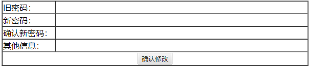

# RCS项目测试岗位笔试题

## 一、不定项选择题 
### 评分标准：选错得0分，全选对得4分，部分选对得1分。
### 1．关于测试各个阶段的说法正确的是（ ）
	A、测试阶段主要包括单元测试阶段、集成测试阶段、系统测试阶段、验收测试阶段。
	B、单元测试主要测试对象为各个接口和子接口，目的是验证各个接口是否满足概要设计的要求。
	C、系统测试主要测试方法为黑盒测试，缺点是问题发现晚，修改定位成本高，但是由于是交付的重要关卡，因此所有问题都需要被解决。
	D、验收测试主要包含alpha测试和beta测试。

### 2．关于需求，下列说法正确的有（ ）
	A、需求工程包括需求开发和需求管理。
	B、需求评审责任人为产品经理和开发经理。
	C、测试需求分析应该全部覆盖整个需求，包括业务流、功能点、非功能点等。
	D、测试需求分析不涉及具体的详细测试数据。

### 3．测试需求分析的基本步骤正确的为：（ ）
	a)	分析系统软件、硬件、外设、网络、数据、支持软件等外部因素的影响
	b)	细化和分解业务流程
	c)	挖掘非功能需求和其他质量特性
	d)	细化业务流中的独立模块
	e)	明确系统框架和业务流程
	f)	明确业务、模块互相之间的关系和影响关系

	A、aebdfc B、acebdf C、eabdfc D、ebdfca

### 4．影响软件质量的关键因素包括（ ）
	A、技术 B、组织 C、流程 D、规模

### 5．关于软件质量模型特性以下说法正确的是（ ）
	A、	任何质量特性都应该遵循法律法规条文规定。
	B、	软件的保密安全性主要目的是保护信息和数据的安全，属于软件功能性特性的一种。
	C、	为提高软件的可维护性，软件编码应遵循高内聚、低耦合的编码原则。
	D、软件质量保证指的是完成并保证质量需求规格说明书中的所写明的所有内容和项目。

### 6、某个输入域中对于输入内容限制长度为(6,22]，针对此长度限制进行测试数据准备，需要测试的最少数据为（ ）
	A、5，6，7，11，21，22，23 
	B、6，7，11，21，22
	C、6，7，11，22，23 
	D、5，6，11，22，23

### 7、现有一个程序，实现功能如下：可以输入两列字符，第一列字符要求必须是A或B，第二列字符必须是数字，在两列字符同时满足输入要求的情况下会进行文件修改。如果第一列字符不正确，则给出提示信息L；如果第二列字符不正确，则给出提示信息M。针对此程序使用因果图法进行测试用例设计，以下说法正确的是（ ）
	A、 第一列字符的包含的两个条件之间的关系是“排他性约束”关系。
	B、 第一列字符的条件和提示信息L之间的关系为“恒等”。
	C、 两列字符的条件和结果修改文件之间的关系为“与”。
	D、 使用因果图法针对此问题进行的设计缺陷是无法发现需求本身的问题。

### 8、关于判定表方法，如下说法正确的是（ ）
	A、判定表是通过条件之间的全排列组合遍历进行用例设计的方法，可以有效避免遗漏。
	B、在需求各个条件桩之间无明显先后逻辑顺序，并且能分析明确各个条件下对应的结果的情况下就一定适合用判定表法进行设计。
	C、判定表条件桩n和条件项m之间的关系是m=2n
	D、因果图是有约束的全排列组合，是判定表的补充方法。

### 9、小明在测试中发现了一个WIFI环境下QQ邮箱无法登陆的BUG，在提交BUG时，以下对于此BUG的简要描述最为合理的是（ ）
	A、 QQ邮箱无法登陆。
	B、 WIFI网络环境下，进入系统预制的电子邮件，输入用户名12345@qq.com和密码123456后点击登陆，登陆失败。
	C、 WIFI网络环境下，使用系统预制电子邮件应用登陆QQ邮箱失败。
	D、 WIFI网络环境下，可能由于域名和服务器地址的原因导致QQ邮箱无法登陆成功。

### 10、测试人员小A发现一个手机不能正常通话的问题，对于此BUG的处理，以下做法错误的是（ ）
	A、 小A与开发人员沟通，开发人员反馈说是由于自己疏忽导致代码中一个函数调用错误并马上修正后截图给小A看，并告诉小A下次出版本一定不会有问题了，小A看到代码已经修改于是接着进行下一项测试。
	B、 小A将此问题提交给自己的测试经理，并由测试经理判断问题有效性后走给开发经理进行处理。
	C、 由于此问题非常明显是真正的功能问题，小A可以将问题直接提交给开发人员修改。
	D、 小A已经将问题正确的提交，2天后问题已经修改完成，当前问题重新回到小A的名下进行回归测试时，小A发现问题并没有修改，经过与开发人员进行沟通了解到是因为代码没有及时同步到服务器上导致小A回归的版本没有体现代码修改，因此问题还存在，得到开发人员下个版本肯定会体现的承诺后，小A将问题关闭。

### 11、关于软件测试瀑布模型和双V模型的特点描述正确的有（ ）
	A、瀑布模型简单高效，在整个软件生命周期内开发测试串行，不够灵活。
	B、双V模型注重测试开发合作，开发设计与测试设计同步进行。
	C、测试准备阶段主要输出成果为测试计划、测试方案、测试用例。
	D、测试执行阶段主要输出成果为预测试报告、测试用例执行结果、测试报告、缺陷报告。

### 12、如下一段程序：

	print “ please in put a number:”
	Long = input()
	for i in range(0,Long):
	    for j in range(0,i+1):
	        print '*',
	print

程序运行后，输入10，程序的执行结果为（ ）

	A、 10*10的正方形    B、 9*9的在正方形
	C、 10*10的三角形    D、 9*9的三角形

### 13、如下一段程序：
	l = [365, 'everyday', 0.618, True]
	l[2] = "Modify"
	l.append(1024)
	l.append("This is a Test")
	del l[1]
	del l[3]
	print l[1]
	print str(l[3])[:-1]

程序运行之后输出的结果正确的是（ ）和（ ）

	A、1     B、This is a Test     C、Modify 
	D、T     E、102     F、This is a Tes

### 14、关于测试覆盖评估，以下说法正确的是（ ）
	A、系统测试通过需求覆盖率评估，单元你测试通过逻辑覆盖率评估。
	B、逻辑覆盖评估中的条件数就是判定框中比较运算符的数量。
	C、逻辑覆盖评估中判定数就是流程图中菱形框的数量，而分支数正好是判定数的两倍。
	D、逻辑覆盖方法中路径覆盖是相对覆盖全面的方法，对于语句和分支都能完全覆盖，仅仅可能会遗漏少数条件。

### 15、以下行为，属于违反安全测试的是（ ）
	A、普通文本输入域没有限制script脚本的输入。
	B、开发人员为方便调试在后台代码中增加了一个管理权限的账号，但是对用户的使用无任何影响。
	C、手机通话过程中进行通话录音会先有”滴“的一声提示。
	D、小明在网站上登陆账号后浏览未登陆用户不可见，会员才允许访问的商品时，将当前商品链接发送给小红，小红可以直接看到当前的商品信息。

## 二、测试技能和思维描述题

### 1.某个程序密码修改的界面和流程如下：

点击确定修改按钮后条件流程如下：
a)	判断旧密码是否为空，如果为空则提示输入旧密码不能为空；
b)	新密码可以为空，如果新密码不为空，则判断新密码和确认新密码两次输入是否一致，如果不一致，则提示新密码输入不一致；
c)	判断旧密码是否正确，如果旧密码不正确，则提示密码错误；
d)	其他信息如果有内容，则同步修改其他信息。
1)	根据上述流程画出业务流程图

2)	根据上述流程图设计出测试用例

### 2、请找出如下python程序中的错误，并写出错误改正后的程序（10分）。

	sentence = 'I am a English teacher. What\'s your name? My name is James.'
	  list1 = sentence.split('.')
	  list2 = list1[0].split(' ')
	for i in range(len(list2))
	    {
	      print 'The number %d string is %d' % (i+1,list2[i])
	    }
	j=0
	while j < len(list1){
	    print list1[j]
	    j+=1
	    }
	print list1
	print list2

### 3、数据库基础题
表1：course表

| couid | couname |
|-|-|
| Cou01 | 高数 |
| Cou02 | 计算机 |
| Cou03 | 英语 |

表2：grade表

| stuid | stuname | couid | coursegrade |
|-|-|-|
| Stu01 | 张三 | Cou01 | 75 |
| Stu02 | 李四 | Cou01 | 81 |
| Stu03 | 王五 | Cou02 | 72 |

1)	使用数据库命令创建上述两个表（5分）

2)	使用子查询（嵌套查询）实现，查询选修“高等数学”课的全部学生的总成绩（5分）

