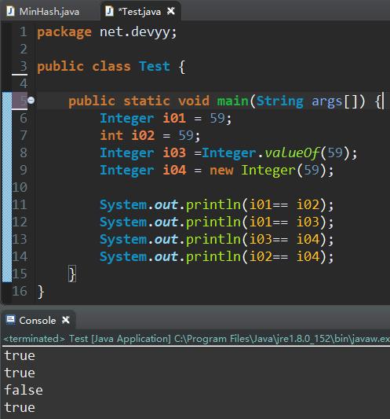
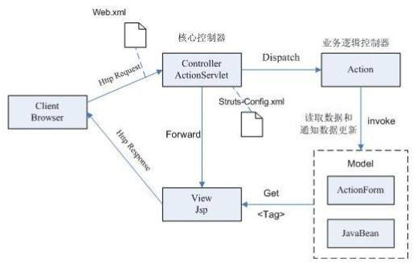

# Java工程师能力评估

## 1、
	下面有关JVM内存，说法错误的是？
	
	A. 程序计数器是一个比较小的内存区域，用于指示当前线程所执行的字节码执行到了第几行，是线程隔离的
	B. 虚拟机栈描述的是Java方法执行的内存模型，用于存储局部变量，操作数栈，动态链接，方法出口等信息，是线程隔离的
	C. 方法区用于存储JVM加载的类信息、常量、静态变量、以及编译器编译后的代码等数据，是线程隔离的
	D. 原则上讲，所有的对象都在堆区上分配内存，是线程之间共享的
	
	正确答案: C
	
	解析：
	大多数 JVM 将内存区域划分为 Method Area（Non-Heap）（方法区） ,Heap（堆） , Program Counter Register（程序计数器） ,   VM Stack（虚拟机栈，也有翻译成JAVA 方法栈的）,Native Method Stack  （ 本地方法栈 ），其中Method Area 和  Heap 是线程共享的  ，VM Stack，Native Method Stack  和Program Counter Register  是非线程共享的。

## 2、
	下面有关jdbc statement的说法错误的是？
	
	A. JDBC提供了Statement、PreparedStatement 和 CallableStatement三种方式来执行查询语句，其中 Statement 用于通用查询， PreparedStatement 用于执行参数化查询，而 CallableStatement则是用于存储过程
	B. 对于PreparedStatement来说，数据库可以使用已经编译过及定义好的执行计划，由于 PreparedStatement 对象已预编译过，所以其执行速度要快于 Statement 对象”
	C. PreparedStatement中，“?” 叫做占位符，一个占位符可以有一个或者多个值
	D. PreparedStatement可以阻止常见的SQL注入式攻击
	
	正确答案: C

	解析：
	a.Statement:  
	普通的不带参的查询SQL；支持批量更新,批量删除;  
	b.PreparedStatement:  
	可变参数的SQL,编译一次,执行多次,效率高;  
	安全性好，有效防止Sql注入等问题;  
	支持批量更新,批量删除;  
	c.CallableStatement:  
	继承自PreparedStatement,支持带参数的SQL操作;  
	支持调用存储过程,提供了对输出和输入/输出参数(INOUT)的支持;  

## 3、

	下面有关SPRING的事务传播特性，说法错误的是？
	
	A. PROPAGATION_SUPPORTS：支持当前事务，如果当前没有事务，就以非事务方式执行
	B. PROPAGATION_REQUIRED：支持当前事务，如果当前没有事务，就抛出异常
	C. PROPAGATION_REQUIRES_NEW：新建事务，如果当前存在事务，把当前事务挂起
	D. PROPAGATION_NESTED：支持当前事务，新增Savepoint点，与当前事务同步提交或回滚
	
	正确答案: B
	
	解析：
	PROPAGATION_REQUIRED--支持当前事务，如果当前没有事务，就新建一个事务。这是最常见的选择。 
	PROPAGATION_SUPPORTS--支持当前事务，如果当前没有事务，就以非事务方式执行。 
	PROPAGATION_MANDATORY--支持当前事务，如果当前没有事务，就抛出异常。 
	PROPAGATION_REQUIRES_NEW--新建事务，如果当前存在事务，把当前事务挂起。 
	PROPAGATION_NOT_SUPPORTED--以非事务方式执行操作，如果当前存在事务，就把当前事务挂起。 
	PROPAGATION_NEVER--以非事务方式执行，如果当前存在事务，则抛出异常。 

## 4、

	下面有关servlet和cgi的描述，说法错误的是？
	
	A. servlet处于服务器进程中，它通过多线程方式运行其service方法
	B. CGI对每个请求都产生新的进程，服务完成后就销毁
	C. servlet在易用性上强于cgi，它提供了大量的实用工具例程，例如自动地解析和解码HTML表单数据、读取和设置HTTP头、处理Cookie、跟踪会话状态等
	D. cgi在移植性上高于servlet，几乎所有的主流服务器都直接或通过插件支持cgi
	
	正确答案: D

	解析：
	CGI(Common Gateway Interface) 
	
	Servlet 与 CGI 的比较
	和CGI程序一样，Servlet可以响应用户的指令(提交一个FORM等等)，也可以象CGI程序一样，收集用户表单的信息并给予动态反馈(简单的注册信息录入和检查错误)。
	然而，Servlet的机制并不仅仅是这样简单的与用户表单进行交互。传统技术中，动态的网页建立和显示都是通过CGI来实现的，但是，有了Servlet,您可以大胆的放弃所有CGI(perl?php?甚至asp!)，利用Servlet代替CGI,进行程序编写。
	    对比一：当用户浏览器发出一个Http/CGI的请求，或者说 调用一个CGI程序的时候，服务器端就要新启用一个进程 (而且是每次都要调用)，调用CGI程序越多(特别是访问量高的时候)，就要消耗系统越多的处理时间，只剩下越来越少的系统资源，对于用户来说，只能是漫长的等待服务器端的返回页面了，这对于电子商务激烈发展的今天来说，不能不说是一种技术上的遗憾。
	而Servlet充分发挥了服务器端的资源并高效的利用。每次调用Servlet时并不是新启用一个进程 ，而是在一个Web服务器的进程敏感词享和分离线程，而线程最大的好处在于可以共享一个数据源，使系统资源被有效利用。
	    对比二：传统的CGI程序，不具备平台无关性特征，系统环境发生变化，CGI程序就要瘫痪，而Servlet具备Java的平台无关性，在系统开发过程中保持了系统的可扩展性、高效性。
	    对比三：传统技术中，一般大都为二层的系统架构，即Web服务器+数据库服务器，导致网站访问量大的时候，无法克服CGI程序与数据库建立连接时速度慢的瓶颈，从而死机、数据库死锁现象频繁发生。而我们的Servlet有连接池的概念，它可以利用多线程的优点，在系统缓存中事先建立好若干与数据库的连接，到时候若想和数据库打交道可以随时跟系统"要"一个连接即可，反应速度可想而知。

## 5、

	下面有关servlet service描述错误的是？
	
	A. 不管是post还是get方法提交过来的连接，都会在service中处理
	B. doGet/doPost 则是在 javax.servlet.GenericServlet 中实现的
	C. service()是在javax.servlet.Servlet接口中定义的
	D. service判断请求类型，决定是调用doGet还是doPost方法
	
	正确答案: B
	
	解析：
	doGet/doPost 则是在 javax.servlet.http.HttpServlet 中实现的。

## 6、

	下列有关Servlet的生命周期，说法不正确的是？
	
	A. 在创建自己的Servlet时候，应该在初始化方法init()方法中创建Servlet实例
	B. 在Servlet生命周期的服务阶段，执行service()方法，根据用户请求的方法，执行相应的doGet()或是doPost()方法
	C. 在销毁阶段，执行destroy()方法后会释放Servlet 占用的资源
	D. destroy()方法仅执行一次，即在服务器停止且卸载Servlet时执行该方法
	
	正确答案: A

	解析：
	Servlet的生命周期分为5个阶段：加载、创建、初始化、处理客户请求、卸载。
	(1)加载：容器通过类加载器使用servlet类对应的文件加载servlet
	(2)创建：通过调用servlet构造函数创建一个servlet对象
	(3)初始化：调用init方法初始化
	(4)处理客户请求：每当有一个客户请求，容器会创建一个线程来处理客户请求
	(5)卸载：调用destroy方法让servlet自己释放其占用的资源

## 7、

	下面有关servlet中init,service,destroy方法描述错误的是？
	
	A. init()方法是servlet生命的起点。一旦加载了某个servlet，服务器将立即调用它的init()方法
	B. service()方法处理客户机发出的所有请求
	C. destroy()方法标志servlet生命周期的结束
	D. servlet在多线程下使用了同步机制，因此，在并发编程下servlet是线程安全的
	
	正确答案: D

	解析：
	servlet在多线程下其本身并不是线程安全的。
	如果在类中定义成员变量，而在service中根据不同的线程对该成员变量进行更改，那么在并发的时候就会引起错误。最好是在方法中，定义局部变量，而不是类变量或者对象的成员变量。由于方法中的局部变量是在栈中，彼此各自都拥有独立的运行空间而不会互相干扰，因此才做到线程安全。

## 8、

	下面有关struts1和struts2的区别，描述错误的是？
	
	A. Struts1要求Action类继承一个抽象基类。Struts 2 Action类可以实现一个Action接口
	B. Struts1 Action对象为每一个请求产生一个实例。Struts2 Action是单例模式并且必须是线程安全的
	C. Struts1 Action 依赖于Servlet API，Struts 2 Action不依赖于容器，允许Action脱离容器单独被测试
	D. Struts1 整合了JSTL，Struts2可以使用JSTL，但是也支持OGNL
	
	正确答案: B
	
	解析：
	从action类上分析:
	1.Struts1要求Action类继承一个抽象基类。Struts1的一个普遍问题是使用抽象类编程而不是接口。 
	2.Struts 2 Action类可以实现一个Action接口，也可实现其他接口，使可选和定制的服务成为可能。Struts2提供一个ActionSupport基类去实现常用的接口。Action接口不是必须的，任何有execute标识的POJO对象都可以用作Struts2的Action对象。
	从Servlet 依赖分析: 
	3.Struts1 Action 依赖于Servlet API ,因为当一个Action被调用时HttpServletRequest 和 HttpServletResponse 被传递给execute方法。 
	4.Struts 2 Action不依赖于容器，允许Action脱离容器单独被测试。如果需要，Struts2 Action仍然可以访问初始的request和response。但是，其他的元素减少或者消除了直接访问HttpServetRequest 和 HttpServletResponse的必要性。
	从action线程模式分析: 
	5.Struts1 Action是单例模式并且必须是线程安全的，因为仅有Action的一个实例来处理所有的请求。单例策略限制了Struts1 Action能作的事，并且要在开发时特别小心。Action资源必须是线程安全的或同步的。 
	6.Struts2 Action对象为每一个请求产生一个实例，因此没有线程安全问题。（实际上，servlet容器给每个请求产生许多可丢弃的对象，并且不会导致性能和垃圾回收问题）

## 9、

	关于AWT和Swing说法正确的是？
	
	A. Swing是AWT的子类
	B. AWT在不同操作系统中显示相同的风格
	C. AWT不支持事件类型，Swing支持事件模型
	D. Swing在不同的操作系统中显示相同的风格
	
	正确答案: D

	解析：
	AWT ：是通过调用操作系统的native方法实现的，所以在Windows系统上的AWT窗口就是Windows的风格，而在Unix系统上的则是XWindow风格。 AWT 中的图形函数与 操作系统 所提供的图形函数之间有着一一对应的关系，我们把它称为peers。 也就是说，当我们利用 AWT 来构件图形用户界面的时候，我们实际上是在利用 操作系统 所提供的图形库。由于不同 操作系统 的图形库所提供的功能是不一样的，在一个平台上存在的功能在另外一个平台上则可能不存在。为了实现Java语言所宣称的"一次编译，到处运行"的概念，AWT 不得不通过牺牲功能来实现其平台无关性，也就是说，AWT 所提供的图形功能是各种通用型操作系统所提供的图形功能的交集。由于AWT 是依靠本地方法来实现其功能的，我们通常把AWT控件称为重量级控件。
	Swing ：是所谓的Lightweight组件，不是通过native方法来实现的，所以Swing的窗口风格更多样化。但是,Swing里面也有heaveyweight组件。比如JWindow，Dialog,JFrame
	Swing是所谓的Lightweight组件，不是通过native方法来实现的，所以Swing的窗口风格更多样化。但是,Swing里面也有heaveyweight组件。比如JWindow，Dialog,JFrame
	Swing由纯Java写成，可移植性好，外观在不同平台上相同。所以Swing部件称为轻量级组件（ Swing是由纯JAVA CODE所写的，因此SWING解决了JAVA因窗口类而无法跨平台的问题，使窗口功能也具有跨平台与延展性的特性，而且SWING不需占有太多系统资源，因此称为轻量级组件！！！）

## 10、

	看以下代码： 
	文件名称：forward.jsp 
	
	<html>  
	     <head><title> 跳转  </title> </head> 
	     <body>  
	         <jsp:forward page="index.htm"/>     
	     </body>
	</html> 

	如果运行以上jsp文件，地址栏的内容为
	
	A. http://127.0.0.1:8080/myjsp/forward.jsp
	B. http://127.0.0.1:8080/myjsp/index.jsp
	C. http://127.0.0.1:8080/myjsp/index.htm
	D. http://127.0.0.1:8080/myjsp/forward.htm
	
	正确答案: A

	解析：
	forward和redirect是最常问的两个问题
	forward，服务器获取跳转页面内容传给用户，用户地址栏不变
	redirect，是服务器向用户发送转向的地址，redirect后地址栏变成新的地址

## 11、

	下面哪一项不是加载驱动程序的方法？
	
	A. 通过DriverManager.getConnection方法加载
	B. 调用方法 Class.forName
	C. 通过添加系统的jdbc.drivers属性
	D. 通过registerDriver方法注册
	
	正确答案: A
	
	解析：
	选项A：DriverManager.getConnection方法返回一个Connection对象，这是加载驱动之后才能进行的
	
	加载驱动方法：
	1.Class.forName("com.microsoft.sqlserver.jdbc.SQLServerDriver");
	2.DriverManager.registerDriver(new com.mysql.jdbc.Driver());
	3.System.setProperty("jdbc.drivers", "com.mysql.jdbc.Driver");

## 12、

	关于sleep()和wait()，以下描述错误的一项是（ ）
	
	A. sleep是线程类（Thread）的方法，wait是Object类的方法；
	B. sleep不释放对象锁，wait放弃对象锁
	C. sleep暂停线程、但监控状态仍然保持，结束后会自动恢复
	D. wait后进入等待锁定池，只有针对此对象发出notify方法后获得对象锁进入运行状态
	
	正确答案: D
	
	解析：
	Java中的多线程是一种抢占式的机制，而不是分时机制。抢占式的机制是有多个线程处于可运行状态，但是只有一个线程在运行。
 
	共同点 ： 
	1. 他们都是在多线程的环境下，都可以在程序的调用处阻塞指定的毫秒数，并返回。 
	2. wait()和sleep()都可以通过interrupt()方法 打断线程的暂停状态 ，从而使线程立刻抛出InterruptedException。 
	如果线程A希望立即结束线程B，则可以对线程B对应的Thread实例调用interrupt方法。如果此刻线程B正在wait/sleep/join，则线程B会立刻抛出InterruptedException，在catch() {} 中直接return即可安全地结束线程。 
	需要注意的是，InterruptedException是线程自己从内部抛出的，并不是interrupt()方法抛出的。对某一线程调用 interrupt()时，如果该线程正在执行普通的代码，那么该线程根本就不会抛出InterruptedException。但是，一旦该线程进入到 wait()/sleep()/join()后，就会立刻抛出InterruptedException 。 
	不同点 ：  
	1.每个对象都有一个锁来控制同步访问。Synchronized关键字可以和对象的锁交互，来实现线程的同步。 
	sleep方法没有释放锁，而wait方法释放了锁，使得其他线程可以使用同步控制块或者方法。 
	2.wait，notify和notifyAll只能在同步控制方法或者同步控制块里面使用，而sleep可以在任何地方使用 
	3.sleep必须捕获异常，而wait，notify和notifyAll不需要捕获异常 
	4.sleep是线程类（Thread）的方法，导致此线程暂停执行指定时间，给执行机会给其他线程，但是监控状态依然保持，到时后会自动恢复。调用sleep不会释放对象锁。
	5.wait是Object类的方法，对此对象调用wait方法导致本线程放弃对象锁，进入等待此对象的等待锁定池，只有针对此对象发出notify方法（或notifyAll）后本线程才进入对象锁定池准备获得对象锁进入运行状态。

## 13、
	
	根据下面的程序代码，哪些选项的值返回true？
	 
	public class Square {  
	    long width;  
	    public Square(long l) {   
	        width = l;  
	    }  
	    public static void main(String arg[]) {   
	        Square a, b, c;  
	        a = new Square(42L);   
	        b = new Square(42L);   
	        c = b;   
	        long s = 42L;  
	    } 
	}
		
	A. a == b
	B. s == a
	C. b == c
	D. a.equals(s)

	正确答案: C	

## 14、

	在jdk1.5的环境下，有如下4条语句：
	
	Integer i01 = 59;
	int i02 = 59;
	Integer i03 =Integer.valueOf(59);
	Integer i04 = new Integer(59)。
	以下输出结果为false的是：
	
	A. System.out.println(i01== i02);
	B. System.out.println(i01== i03);
	C. System.out.println(i03== i04);
	D. System.out.println(i02== i04);
	
	正确答案: C
	
	解析：

## 15、

	下面哪个不对？
	
	A. RuntimeException is the superclass of those exceptions that can be thrown during the normal operation of the Java Virtual Machine.
	B. A method is not required to declare in its throws clause any subclasses of RuntimeExeption that might be thrown during the execution of the method but not caught
	C. An RuntimeException is a subclass of Throwable that indicates serious problems that a reasonable application should not try to catch.
	D. NullPointerException is one kind of RuntimeException
	
	正确答案: C

	解析：
	运行时异常： 都是RuntimeException类及其子类异常，如NullPointerException(空指针异常)、IndexOutOfBoundsException(下标越界异常)等，这些异常是不检查异常，程序中可以选择捕获处理，也可以不处理。这些异常一般是由程序逻辑错误引起的，程序应该从逻辑角度尽可能避免这类异常的发生。
	运行时异常的特点是Java编译器不会检查它，也就是说，当程序中可能出现这类异常，即使没有用try-catch语句捕获它，也没有用throws子句声明抛出它，也会编译通过。 
	非运行时异常 （编译异常）： 是RuntimeException以外的异常，类型上都属于Exception类及其子类。从程序语法角度讲是必须进行处理的异常，如果不处理，程序就不能编译通过。如IOException、SQLException等以及用户自定义的Exception异常，一般情况下不自定义检查异常。

## 16、

	关于以下程序代码的说明正确的是?
	
	public class HasStatic{
		private static int x=100;
		public static void main(String args[]){
			HasStatic hs1=new HasStatic();
			hs1.x++;
			HasStatic  hs2=new HasStatic();
			hs2.x++;
			hs1=new HasStatic();
			hs1.x++;
			HasStatic.x--;
			System.out.println("x="+x);
		}
	} 
	
	
	A. 程序通过编译，输出结果为：x=103
	B. 10行不能通过编译，因为x是私有静态变量
	C. 5行不能通过编译，因为引用了私有静态变量
	D. 程序通过编译，输出结果为：x=102
	
	正确答案: D

	解析：

## 17、

	关于struts项目中的类与MVC模式的对应关系，说法错误的是
	
	A. Jsp文件实现视图View的功能
	B. ActionServlet这一个类是整个struts项目的控制器
	C. ActionForm、Action都属于Model部分
	D. 一个struts项目只能有一个Servlet
	
	正确答案: C D

	解析：

## 18、

	下面有关jsp中静态include和动态include的区别，说法错误的是？  
	
	A. 动态INCLUDE:用jsp:include动作实现 
	B. 静态INCLUDE:用include伪码实现，定不会检查所含文件的变化，适用于包含静态页面<%@ include file="included.htm" %>
	C. 静态include的结果是把其他jsp引入当前jsp，两者合为一体;动态include的结构是两者独立，直到输出时才合并
	D. 静态include和动态include都可以允许变量同名的冲突.页面设置也可以借用主文件的
	
	正确答案: D

	解析：
	动态 INCLUDE 用 jsp:include 动作实现 <jsp:include page="included.jsp" flush="true" /> 它总是会检查所含文件中的变化 , 适合用于包含动态页面 , 并且可以带参数。各个文件分别先编译，然后组合成一个文件。
	
	静态 INCLUDE 用 include 伪码实现 , 定不会检查所含文件的变化 , 适用于包含静态页面 <%@ include file="included.htm" %> 。先将文件的代码被原封不动地加入到了主页面从而合成一个文件，然后再进行翻译，此时不允许有相同的变量。 
	
	以下是对 include 两种用法的区别 ， 主要有两个方面的不同 ;
	    一 : 执行时间上 :
	    <%@ include file="relativeURI"%> 是在翻译阶段执行
	    <jsp:include page="relativeURI" flush="true" /> 在请求处理阶段执行 .
	    二 : 引入内容的不同 :
	    <%@ include file="relativeURI"%>
	    引入静态文本 (html,jsp), 在 JSP 页面被转化成 servlet 之前和它融和到一起 .
	    <jsp:include page="relativeURI" flush="true" /> 引入执行页面或 servlet 所生成的应答文本 .

## 19、

	给定以下JAVA代码，这段代码运行后输出的结果是（）
	
	public class Test
	{
	    public static int aMethod(int i)throws Exception
	    {
	        try{
	            return i / 10;
	        }
	        catch (Exception ex)
	        {
	            throw new Exception("exception in a Method");
	        } finally{
	            System.out.printf("finally");
	        }
	    }
	 
	    public static void main(String [] args)
	    {
	        try
	        {
	            aMethod(0);
	        }
	        catch (Exception ex)
	        {
	            System.out.printf("exception in main");
	        }
	        System.out.printf("finished");
	    }
	}   
	
	
	A. exception in main finished
	B. finally finished
	C. exception in main finally
	D. finally exception in main finished

	正确答案: B

	解析：
	

## 20、

	对于JVM内存配置参数：
	-Xmx10240m -Xms10240m -Xmn5120m -XXSurvivorRatio=3
	,其最小内存值和Survivor区总大小分别是（）
	
	A. 5120m，1024m
	B. 5120m，2048m
	C. 10240m，1024m
	D. 10240m，2048m

	正确答案: D

	解析：
	-Xmx：最大堆大小
	-Xms：初始堆大小
	-Xmn：年轻代大小
	-XXSurvivorRatio：年轻代中Eden区与Survivor区的大小比值
	年轻代5120m， Eden:Survivor=3，Survivor区大小=1024m（Survivor区有两个，即将年轻代分为5份，每个Survivor区占一份），总大小为2048m。
	-Xms初始堆大小即最小内存值为10240m
