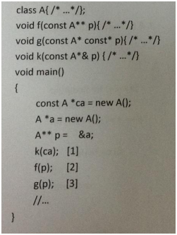
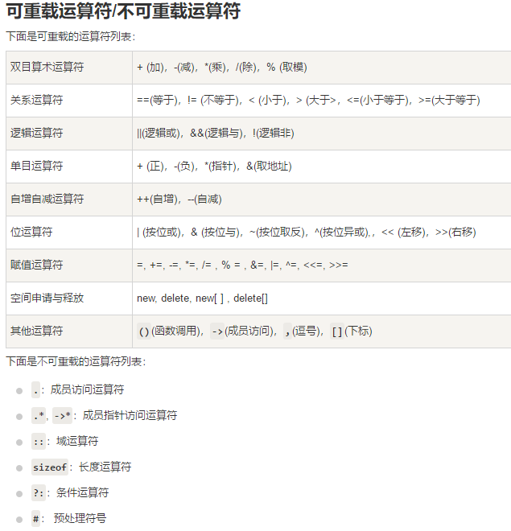

# 摩拜2018校招客户端开发笔试卷

## 1
	以下操作中，数组比链表速度更快的是____
	
	正确答案: A C E   你的答案: C (错误)
	
	A. 原地逆序
	B. 头部插入
	C. 返回中间节点
	D. 返回头部节点
	E. 选择随机节点
## 2
	关于下列操作哪个复杂度为O(1)?
	
	正确答案: C D   你的答案: A D (错误)
	
	A. vector<>中插入元素(动态数组)
	B. set中查找元素
	C. hash_map中查找元素
	D. deque尾部删除元素
## 3
	以下关于内联函数，说法正确的是：
	
	正确答案: A B C   你的答案: C (错误)
	
	A. 一般用于加快程序执行速度
	B. 可能减小可执行文件大小
	C. 可能增加可执行文件大小
	D. 以上说法都不正确

解析：

## 4
	float x 与“零值”比较的if语句为？
	
	正确答案: C   你的答案: C (正确)
	
	A. if (x == 0)
	B. if (x &lt; 0.00001f)
	C. if (fabs(x) &lt; 0.00001f) 或 if（Math.abs(x) &lt; 0.00001f）
	D. if (x &gt; -0.00001f)
## 5
	假设把整数关键字K Hash到有N个槽的散列表，以下哪些散列函数比较合适（）
	
	正确答案: B   你的答案: B (正确)
	
	A. H(K)=k/N
	B. H(k)=k mod N
	C. H(k)=1
	D. H(k)=(k+Random(N))mod N，其中Random(N)返回0到N-1的整数
## 6
	关于浅复制和深复制的说法，下列说法正确的是
	
	正确答案: A B C D   你的答案: A B C D (正确)
	
	A. 浅层复制：只复制指向对象的指针，而不复制引用对象本身。
	B. 深层复制：复制引用对象本身。
	C. 如果是浅复制，修改一个对象可能会影响另外一个对象
	D. 如果是深拷贝，修改一个对象不会影响到另外一个对象
## 7
	下列程序编译时会出现错误，请根据行号选择错误位置( )
	
	#include <iostream>
	using namespace std;
	class A{
	  int a1;
	protected:
	  int a2;
	public:
	  int a3;
	};
	class B: public A{
	  int b1;
	protected:
	  int b2;
	public:
	  int b3;
	};
	class C:private B{
	  int c1;
	protected:
	  int c2;
	public:
	  int c3;
	};
	int main(){
	  B obb;
	  C obc;
	  cout<<obb.a1;//1
	  cout<<obb.a2;//2
	  cout<<obb.a3;//3
	  cout<<obc.b1;//4
	  cout<<obc.b2;//5
	  cout<<obc.b3;//6
	  cout<<obc.c3;//7
	  return 0;
	}
	
	正确答案: A D   你的答案: A D (正确)
	
	A. 1,2
	B. 2,5,7
	C. 3,4,7
	D. 4,5,6
## 8
	MVC是一种常见的架构。以下描述错误的是？
	
	正确答案: A B C   你的答案: A B C (正确)
	
	A. 只有Web系统才能使用MVC
	B. 只有能够保存正在数据库里面的实体才能称之为模型（Model）
	C. 只有以HTML形式显示的页面才是视图（View）
	D. 模型变更之后，只有控制器（Controller）才能驱动视图变更或重新渲染视图
## 9
	下面（）数据结构常用于函数调用。
	
	正确答案: B   你的答案: B (正确)
	
	A. 队列
	B. 栈
	C. 链表
	D. 数组
## 10
	如下代码段，哪种描述是正确的（）

	  
	正确答案: B   你的答案: A (错误)
	
	A. 全部正确
	B. 2错，1,3正确
	C. 1,2错，3正确
	D. 1正确，2,3,错
## 11
	以下关于进程和线程描述中，错误的是（）
	
	正确答案: B   你的答案: A (错误)
	
	A. 进程之间可以并发执行
	B. 创建或撤销进程或者线程时，系统都要为之分配和回收资源
	C. 同一个进程的多个线程之间可以并发执行
	D. 线程是进程的一个执行单元

解析：

进程是资源分配的基本单位；

线程是系统调度的基本单位；

多线程不共享：栈，寄存器。

线程不是资源分配调度的单元。 所以不需要单独再进行资源分配
## 12
	以下对于方法覆盖的说法正确的有（）
	
	正确答案: B C D   你的答案: B C D E (错误)
	
	A. 方法覆盖发生在同一类中
	B. 方法的覆盖发生在子类型中
	C. 方法名一定要一样
	D. 参数类型一定要一样
	E. 返回类型一定要一样
	F. 访问权限只能一样
## 13
	HTTP中Get与Post的区别中不包含下面哪一项？
	
	正确答案: D   你的答案: D (正确)
	
	A. GET请求的数据会附在URL之后，POST把提交的数据则放置在是HTTP包的包体中
	B. GET方式提交的数据最多只能是1024字节，理论上POST没有限制，可传较大量的数据
	C. 在ASP中，服务端获取GET请求参数用Request.QueryString，获取POST请求参数用Request.Form
	D. GET的安全性要比POST的安全性高
## 14
	在使用super 和this关键字时，以下描述正确的是
	
	正确答案: A   你的答案: B (错误)
	
	A. 在子类构造方法中使用super（）显示调用父类的构造方法，super（）必须写在子类构造方法的第一行，否则编译不通过
	B. super（）和this（）不一定要放在构造方法内第一行
	C. this（）和super（）可以同时出现在一个构造函数中
	D. this（）和super（）可以在static环境中使用，包括static方法和static语句块
## 15
	访问修饰符作用范围由大到小是
	
	正确答案: C   你的答案: D (错误)
	
	A. private-protected-default-public
	B. private-default-protected-public
	C. public-protected-default-private
	D. public-default-protected-private
## 16
	TCP的三次握手过程中，accept发生在三次握手的哪个阶段？
	
	正确答案: A   你的答案: A (正确)
	
	A. 三次握手之后
	B. 第一次握手
	C. 第二次握手
	D. 第三次握手
## 17
	属于网络层协议的是?
	
	正确答案: B C   你的答案: A B C (错误)
	
	A. TCP
	B. IP
	C. ICMP
	D. X.25
## 18
	下面哪些运算符不能被重载？
	
	正确答案: A B D   你的答案: B C D (错误)
	
	A. 做用域运算符“::”
	B. 对象成员运算符“.”
	C. 指针成员运算符“->”
	D. 三目运算符“? :”

解析：

## 19
	stl::deque是一种什么数据类型？
	
	正确答案: A   你的答案: B (错误)
	
	A. 动态数组
	B. 链表
	C. 堆栈
	D. 树
## 20
	下面关于const正确的是？
	
	正确答案: A C D   你的答案: A C (错误)
	
	A. 欲阻止一个变量被改变，可以使用const关键字。
	B. 在定义该const变量时，不用将其初始化。
	C. 在一个函数声明中，const可以修饰形参，表明它是一个输入参数，在函数内部不能改变其值
	D. 对于类的成员函数，有时候必须指定其返回值为const类型，以使得其返回值不为“左值”
## 21
	建立TCP需要三次握手才能建立，而断开连接则需要几次
	
	正确答案: C   你的答案: C (正确)
	
	A. 1
	B. 3
	C. 4
	D. 5