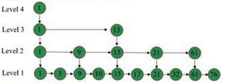
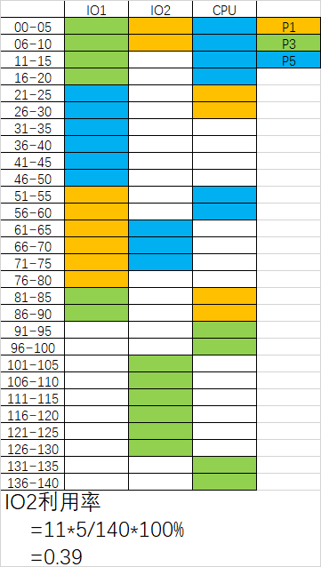
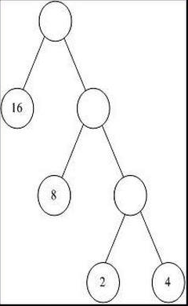
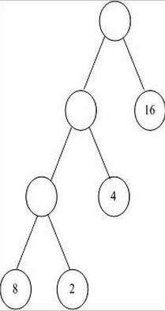
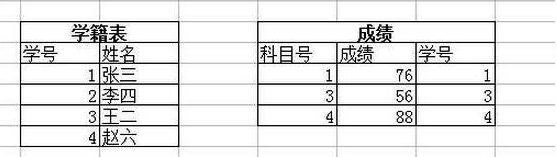

# 腾讯2016研发工程师笔试题（三）

## 1
	我们常说的mvc框架是指的什么的?
	
	正确答案: D   你的答案: D (正确)
	
	A. 模块(module)-视图(view)-组件(component)
	B. 模型(model)-视图(view)-组件(component)
	C. 模块(module)-视图(view)-控制器(controller)
	D. 模型(model)-视图(view)-控制器(controller)
## 2
	对某二叉树进行先序遍历的结果是ABDEFC，中序遍历的结果是DBFEAC，则后序遍历的结果是（）
	
	正确答案: B   你的答案: B (正确)
	
	A. DBFEAC
	B. DFEBCA
	C. BDFECA
	D. BDEFAC
## 3
	有一个如下的结构体：
	
	struct A{
		long a1;
		short a2;
		int a3;
		int *a4;
	};
	
	请问在64位编译器下用sizeof(struct A)计算出的大小是多少？
	
	正确答案: A   你的答案: C (错误)
	
	A. 24
	B. 28
	C. 16
	D. 18
## 4
	以下不属于tcp连接断开的状态是？
	
	正确答案: C   你的答案: C (正确)
	
	A. TIME_WAIT
	B. FIN_WAIT_1
	C. SYNC_SENT
	D. FIN_WAIT_2

## 5
	下面关于ICMP协议的描述中，正确的是（）
	
	正确答案: C   你的答案: C (正确)
	
	A. ICMP协议根据MAC地址查找对应的IP地址
	B. ICMP协议把公网的IP地址转换为私网的IP地址
	C. ICMP协议用于控制数据报传送中的差错情况
	D. ICMP协议集中管理网络中的IP地址分配
## 6
有如下一个类似跳表的数据结构：每层都是已经排好序的链表，level1层的链表有所有元素，levelN层的链表只有levelN-1的1半的元素，levelN层的结点指向levelN-1层中相同的结点。请问查找一个元素的时间复杂度是：

	
	正确答案: A   你的答案: A (正确)
	
	A. O(logn)
	B. O(n)
	C. O(nlogn)
	D. O(n^2)
## 7
在一个单CPU的处理机中，有P1，P3，P5三个作业，有两个IO设备IO1，IO2，并且能够实现抢先式多任务并行工作的多道程序环境中，投入运行优先级由高到低P5，P1，P3三个作业，他们使用设备的先后顺序和占用设备的时间分别为：    

P1:IO2(10ms) CPU(10ms) IO1(30ms）CPU(10ms)    
P3:IO1(30ms) CPU(10ms) IO2(30ms）CPU(10ms)   
P5:CPU(20ms) IO1(30ms) CPU(10ms) IO2(15ms）   

忽略其他的时间损耗，3个作业投入到全部完成的情况下。请问下列哪些选项为IO2的设备利用率？
	
	正确答案: E   你的答案: E (正确)
	
	A. 0.55
	B. 0.26
	C. 0.48
	D. 0.5
	E. 0.39

解析：

## 8
	C语言里i=5,j=7,请问i|j等于多少？
	
	正确答案: D   你的答案: D (正确)
	
	A. 1
	B. 3
	C. 5
	D. 7
## 9
	请选择下面代码的输出结果
	
	int main(int argc,char*argv[])
	{
	    int a=10;
	    int b=4;
	    int c=a/b;
	    int d=c*a*b++;
	    std:cout<<d<<std::endl;
	    return 0;
	}
	
	正确答案: B   你的答案: B (正确)
	
	A. 60
	B. 80
	C. 100
	D. 125

## 10
	请问下列代码的输出结果有可能是哪些（）？
	
	#include<stdint.h>
	#include<stdio.h>
	union X
	{
	    int32_t a;
	    struct 
	    {
	        int16_t b;
	        int16_t c;
	    };
	};
	int main(){
	    X x;
	    x.a=0x20150810;
	    printf("%x,%x\n",x.b,x.c);
	    return 0;
	}
	
	正确答案: A C   你的答案: C (错误)
	
	A. 2015,810
	B. 50810,201
	C. 810,2015
	D. 20150,810

解析：

	0x20150810
	如果按照大端模式存储：从低地址到高地址：20 15 08 10
	                                  输出从低地址到高地址：20 15 08 10
	如果按照小端模式存储：从低地址到高地址：10 08 15 20 
	                                  输出从高地址到低地址：08 10 20 15

## 11
	如下代码，result变量的输出结果是多少？
	
	#include<iostream>
	using namespace std;
	int i=1;
	class MyCls{
	public:
	    MyCls():m_nFor(m_nThd),m_nSec(i++),m_nFir(i++),m_nThd(i++){
	        m_nThd=i;
	    }
	    void echo(){
	        cout<<"result:"<<m_nFir+m_nSec+m_nThd+m_nFor<<endl;
	    }
	private:
	    int m_nFir;
	    int m_nSec;
	    int m_nThd;
	    int &m_nFor;
	};
	int main()
	{
	    MyCls oCls;
	    oCls.echo();
	    return 0;
		}
	
	正确答案: B   你的答案: 空 (错误)
	
	A. 10
	B. 11
	C. 9
	D. 12
	E. 8
## 12
	在动态分区分配方案中，某一作业完成后，系统收回其主存空间，并与相邻空闲区合并，为此需要修改空闲区表，造成空闲区数减1的情况是()
	
	正确答案: D   你的答案: B C (错误)
	
	A. 无上邻空闲区，也无下邻空闲区
	B. 有上邻空闲区，但无下邻空闲区
	C. 有下邻空闲区，但无下邻空闲区
	D. 有上邻空闲区，也有下邻空闲区	
## 13
	对于移动平均算法，是计算某变量之前n个数值的算术平均，正确的说法是：
	
	正确答案: A   你的答案: A (正确)
	
	A. 空间复杂度是O(l)
	B. 空间复杂度是O(n)
	C. 空间复杂度是O(logn)
	D. 空间复杂度是O(nlogn)
## 14
	某一速率为100M的交换机有20个端口，其一个端口上连着一台笔记本电脑，此电脑从迅雷上下载一部1G的电影需要的时间可能是多久？
	
	正确答案: D E   你的答案: B C D E (错误)
	
	A. 10S
	B. 20S
	C. 40S
	D. 100S
	E. 200S

解析：

DE
交换机为独占带宽，即每个端口数据通过率为为最大100Mb/s。注意单位是Mb。因此最短时间为：
1GB/(100Mb/s)=1024MB/(12.5MB/s)=81.92s。
## 15
	在linux编程中，以下哪个TCP的套接字选项与nagle算法的开启和关闭有关？
	
	正确答案: B   你的答案: 空 (错误)
	
	A. TCP_MAXSEG
	B. TCP_NODELAY
	C. TCP_SYNCNT
	D. TCP_KEEPALIVE

解析：

当有一个TCP数据段不足MSS，比如要发送700Byte数据，MSS为1460Byte的情况。nagle算法会延迟这个数据段的发送，等待，直到有足够的数据填充成一个完整数据段。也许有人会问，这有什么影响呢？没有太大的影响，总体上来说，这种措施能节省不必要的资源消耗。但是要发送的总体数据很小时，这种措施就是拖后腿了。比如，用户请求一个网页，大约十几KB的数据，TCP先发送了八九个数据包，剩下几百字节一直不发送，要等到另一个RTT才发送，这时候前面发送数据的ACK已经返回了。这样的用户体验是很不好的。 所以，现在很多服务器都选择主动关闭nagle算法，因为带宽够大，资源消耗不是问题，速度反而是个大问题。
从上述描述中，禁用 nagle，实质就是不在延迟 TCP_NODELAY
## 16
	某二叉树的先根遍历序列和后根遍历序列正好相反，则该二叉树具有的特征是()
	
	正确答案: A   你的答案: A (正确)
	
	A. 高度等于其结点数
	B. 任一结点无左孩子
	C. 任一结点无右孩子
	D. 空或只有一个结点
## 17
	已知关系R（F,G,H,I,J）及其上的函数相关性集合，F=(F->G,J->F,HJ->I),该关系的候选关键字是：
	
	正确答案: B   你的答案: B (正确)
	
	A. FJ
	B. HJ
	C. HI
	D. IJ
## 18
	win32系统里，下面几个sizeof的运行结果是（）
	
		int intValue=1024;
		char str[]="Tencent";
		const char* ch=str;
		sizeof(intValue)=__a___;
		sizeof(str)=__b____;
		sizeof(ch)=____c___;
	
	正确答案: D   你的答案: D (正确)
	
	A. a=1,b=1,c=1
	B. a=4,b=4,c=4
	C. a=4,b=7,c=4
	D. a=4,b=8,c=4
## 19
	若系统中有五台打印机，有多个进程均需要使用两台，规定每个进程一次仅允许申请一台，则在不发生死锁的情况下至多允许______个进程参与竞争
	
	正确答案: B   你的答案: D (错误)
	
	A. 5
	B. 4
	C. 3
	D. 2

解析：

哲学家就餐问题：当5个进程的时候如果都同时申请到了1台，就发生死锁了。如果是4个进程，那必然有一个能申请到2台。
## 20
	在正方体上任取三个顶点连成三角形，则所得的三角形是直角非等腰三角形的概率为？
	
	正确答案: D   你的答案: D (正确)
	
	A. 1/14
	B. 4/7
	C. 2/7
	D. 3/7

## 21
以下哪个是由权值集合(16,8,4,2)构造的哈夫曼树(最优二叉树):

A. 

B. 

C. 

D. 

## 22
	关于红黑树和AVL树，以下哪种说法不正确？
	
	正确答案: D   你的答案: D (正确)
	
	A. 两者都属于自平衡二叉树
	B. 两者查找,插入，删除的时间复杂度相同
	C. 包含n个内部节点的红黑树的高度是O(log(n))
	D. JDK的TreeMap是一个AVL的实现

## 23
	客户端C和服务器S之间建立一个TCP连接，该连接总是以1KB的最大段长发送TCP段，客户端C有足够的数据要发送。当拥塞窗口为16KB的时候发生超时，如果接下来的4个RTT往返时间内的TCP段的传输是成功的，那么当第4个RTT时间内发送的所有TCP段都得到了ACK时，拥塞窗口大小是：
	
	正确答案: C   你的答案: C (正确)
	
	A. 7KB
	B. 8KB
	C. 9KB
	D. 16KB
## 24
	关于epoll和select的区别，哪些说法是正确的？
	
	正确答案: A B C   你的答案: 空 (错误)
	
	epoll和select都是I/O多路复用的技术，都可以实现同时监听多个I/O事件的状态
	epoll相比select效率更高，主要是基于其操作系统支持的I/O事件通知机制，而select是基于轮询机制
	epoll支持水平触发和边沿触发两种模式
	select能并行支持I/O比较小，且无法修改

解析：

select和epoll这两个机制都是多路I/O机制的解决方案，select为POSIX标准中的，而epoll为Linux所特有的。
epoll的最大好处是不会随着FD的数目增长而降低效率，在select中采用轮询处理，其中的数据结构类似一个数组的数据结构，而epoll是维护一个队列，直接看队列是不是空就可以了。
nginx就是使用epoll来实现I/O复用支持高并发，目前在高并 发的场景下，nginx越来越收到欢迎。
select的一 个缺点在于单个进程能够监视的文件描述符的数量存在最大限制
epoll:
(1)IO的效率不会随着监视fd的数量的增长而下降。epoll不同于select和poll轮询的方式，而是通过每个fd定义的回调函数来实现的。只有就绪的fd才会执行回调函数;
(2)支持电平触发和边沿触发（只告诉进程哪些文件描述符刚刚变为就绪状态，它只说一遍，如果我们没有采取行动，那么它将不会再次告知，这种方式称为边缘触发）两种方式，理论上边缘触发的性能要更高一些，但是代码实现相当复杂。
(3)有着良好的就绪事件通知机制
select:
(1)单个进程可监视的fd数量受到了限制，在32位机器上，他所能管理的fd数量最大为1024;
(2)对socket进行扫描时是线性扫描，当socket文件描述符数量变多时，大量的时间是被白白浪费掉的。
## 25
	Internet的网络层含有的协议是？
	
	正确答案: A B C D   你的答案: A B C D (正确)
	
	A. IP
	B. ICMP
	C. ARP
	D. RARP
## 26
	以下是C++的不同数据类型值的比较语句，请问这些判断语句中作为条件部分的语句编写有问题的有:
	
	正确答案: C   你的答案: C (正确)
	
	A. 如果变量bVar是布尔类型：if(false==bVar){doSomeThing();}
	B. 如果变量nVar是int型：if(0==nVar){doSomeThing();}
	C. 如果变量fVar为浮点型：if(0.02=fVar){doSomeThing();}
	D. 如果变量sVar为字符串型：if（""==sVar){doSomeThing();}
## 27
	TCP链接中主动断开链接netstat观察可能出现的状态流转是：
	
	正确答案: C D   你的答案: C (错误)
	
	A. ESTABLISHED->CLOSE_WAIT->TIME_WAIT->CLOSED
	B. ESTABLISHED->TIME_WAIT->CLOSE_WAIT->CLOSED
	C. ESTABLISHED->FIN_WAIT_1->FIN_WAIT_2->TIME_WAIT->CLOSED
	D. ESTABLISHED->FIN_WAIT_1->TIME_WAIT->CLOSED
## 28
	以下涉及到内存管理的代码段中，有错误的是：
	
	正确答案: A B D   你的答案: B (错误)
	
A.

	int *a=new int(12);
	//..... 
	free(a);

B.	

	int *ip=static_cast<int*>(malloc(sizeof(int)));
	*ip=10;
	//.....
	delete ip;

C.	

	double *a=new double[1];
	//.... 
	delete a;

D.	

	int *ip=new int(12);
	for(int i=0;i<12;++i){
	ip[i]=i;
	}
	delete []ip;
## 29
	下面哪些特性可能导致代码体积膨胀:
	
	正确答案: A B C   你的答案: B (错误)
	
	A. 宏定义
	B. 模板
	C. 内联函数
	D. 递归

解析：

A选项宏定义本质是文本替换，肯定是可能导致代码体积膨胀的

B选项模板在编译时生成对应的类/函数，所以也是可能的。

C选项重点解释，内联也是在编译时替换，所以也 可能导致代码体积膨胀。
但是注意了：
若这个函数被调用了一次，那么 内联 直接被插入到函数调用出，就直接没有了这个函数符号了，若加上优化，这一句代码可能会被优化没有，所以，也可能使 代码体积减小 。

D选项是容易爆栈，不是代码区。
## 30
	小明设计了如下的学籍管理系统：
	已知关系：学籍(学号，学生姓名) PK=学号
	成绩（科目号，成绩，学号） PK=科目代码，FK=学号
	已有表记录如下，请给出能够插入的成绩记录

	
	正确答案: B D   你的答案: A C (错误)
	
	A. (1，99，2)
	B. (5，68，1)
	C. (3，70，3)
	D. (7，45，null)