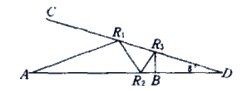
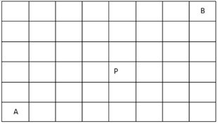

# 阿里巴巴2016研发工程师笔试题（一）

## 1
如图所示，从A点发出一束激光，于AD直线和CD直线反射多次后，垂直达到了B点（B点可能在AD上也可能在CD上，入射角等于反射角），如角CDA=8°，那么最多反射次数是____。（从B点原路反射回点A次数不纳入计算，图中给出3次反射的例子）
 

正确答案: B   你的答案: B (正确)

	A. 6
	B. 10
	C. 12
	D. 38
	E. 40
	F. 不存在

## 2
假定CSomething是一个类，执行下面这些语句之后，内存里创建了____个CSomething对象。

	CSomething a();
	CSomething b(2);
	CSomething c[3];
	CSomething &ra = b;
	CSomething d=b;
	CSomething *pA = c;
	CSomething *p = new CSomething(4);

正确答案: E   你的答案: F (错误)

	A. 10
	B. 9
	C. 8
	D. 7
	E. 6
	F. 5
## 3
假设淘宝网上某商品A在任一时刻t内若有人浏览，则该商品在下一时刻t+1内无人浏览的概率为0.35（即下一时刻的浏览情况仅与当前时段相关），定义此条件概率为 P(O_{t+1}=0|O_t=1)=0.35(即用“1”代表有人浏览的事件，用“0”代表无人浏览的事件），类似得定义P(O_{t+1}=1|O_t=1)=0.65，P(O_{t+1}=0|O_t=0)=0.4，P(O_{t+1}=1|O_t=0)=0.6。若此商品A在t=0时有人浏览，它在t=100000时有人浏览的概率是____。

正确答案: C   你的答案: 空 (错误)

	A. 0.5371
	B. 0.4582
	C. 0.6316
	D. 0.1435
	E. 0.3276
	F. 0.7132	
## 4
猜数字游戏的过程是你输入一个4位数（数字选取0~9，不会重复），电脑会告诉你两个信息：A个数字和位置均正确，B个数字正确但位置错误。例如正确答案是7890你输入0789，电脑会告诉你0A4B，表示有0个数字和位置完全正确，但有4个数字正确但位置错误。现在牛妹猜了三次的结果分别是：1234=>0A4B，2341=>1A3B，3412=>2A2B，那么牛妹最少还要猜____次才能保证一定得到4A0B的结果。

正确答案: D   你的答案: B (错误)

	A. 0
	B. 1
	C. 2
	D. 3
	E. 4
	F. 5
## 5
对一棵二叉树进行后续遍历，其输出结果为A，B，C，这样的二叉树有____棵。

正确答案: D   你的答案: B (错误)

	A. 1
	B. 2
	C. 3
	D. 5
	E. 7
	F. 9

## 6
下面数据结构能够支持随机的插入和删除操作、并具有较好的性能的是____。

正确答案: B   你的答案: B (正确)

	A. 数组和链表
	B. 链表和哈希表
	C. 哈希表和队列
	D. 队列和堆栈
	E. 堆栈和双向队列
	F. 双向队列和数组
## 7
有一个类A，其数据成员如下：

	class A {
	...
	private:
	     int a;
	public:
	     const int b;
	     float* &c;
	     static const char* d;
	     static double* e;
	};

则构造函数中，成员变量一定要通过初始化列表来初始化的是：______。

正确答案: B   你的答案: B (正确)

	A. a b c
	B. b c
	C. b c d e
	D. b c d
	E. b
	F. c
## 8
在如下8*6的矩阵中，请计算从A移动到B一共有____种走法。要求每次只能向上或向右移动一格，并且不能经过P。
 

正确答案: B   你的答案: 空 (错误)

	A. 456
	B. 492
	C. 568
	D. 626
	E. 680
	F. 702
## 9
一个英雄基础攻击力为100，携带了三件暴击武器，武器A有40%的概率打出2倍攻击，武器B有20%的概率打出4倍攻击，武器C有10%概率打出6倍攻击，各暴击效果触发是独立事件，但是多个暴击效果在一次攻击中同时触发时只有后面武器的暴击真正生效，例如一次攻击中武器A判定不暴击，武器B和武器C都判定触发暴击，那么这次攻击实际是600攻击力。那么这个英雄攻击力的数学期望是____。

正确答案: C   你的答案: 空 (错误)

	A. 186.6
	B. 200
	C. 232.8
	D. 256.8
	E. 320
	F. 332.6
## 10
以下函数中，和其他函数不属于一类的是____。

正确答案: C   你的答案: A (错误)

	A. fwrite
	B. putc
	C. pwrite
	D. putchar
	E. getline
	F. scanf

## 11
某操作系统采用分页存储管理方式，下图给出了进程A和进程B的页表结构。如果物理页的大小为512字节，那么进程A与进程B的物理内存总共使用了____字节。

	进程A页表：                         进程B页表：
	
	逻辑页    物理页                     逻辑页    物理页
	
	0            9                       0            1
	
	1            2                       1            3
	
	2            4                       2            4
	
	3            6                       3            7
	
	4                                    4            2
	
	5                                    5

正确答案: B   你的答案: 空 (错误)

	A. 4608
	B. 3584
	C. 4096
	D. 5120
	E. 2560
	F. 2048
## 12
现有1G数据需要排序，计算资源只有1G内存可用，下列排序方法中最可能出现性能问题的是____。

正确答案: C   你的答案: C (正确)

	A. 堆排序
	B. 插入排序
	C. 归并排序
	D. 快速排序
	E. 选择排序
	F. 冒泡排序

## 13
凯撒（Caesar)密码是一种基于字符替换的对称式加密方法，它是通过对26个英文字母循环移位和替换来进行编码的。设待加密的消息为"Alibaba Group"，加密后的密文是"RCzsrsr XIFLG"，则采用的密匙k是____。

正确答案: E   你的答案: E (正确)

	A. 10
	B. 11
	C. 13
	D. 15
	E. 17
## 14
有1,2,3,......无穷个格子，你从1号格子出发，每次1/2概率向前跳一格，1/2概率向前跳两格，走到格子编号为4的倍数时结束，结束时期望走的步数为____。

正确答案: F   你的答案: 空 (错误)

	A. 2
	B. 2.4
	C. 2.8
	D. 3
	E. 3.2
	F. 3.6
	G. 4
## 15
从1,2,3,......,49,50里选择一个集合S，使得若x属于S，则2x不属于S，则S最多能有____个元素。

正确答案: D   你的答案: D (正确)

	A. 25
	B. 27
	C. 30
	D. 33
	E. 36
	F. 37
## 16
Linux下两个进程可以同时打开同一个文件，这时如下描述错误的是：

正确答案: D   你的答案: F (错误)

	A. 两个进程中分别产生生成两个独立的fd
	B. 两个进程可以任意对文件进行读写操作，操作系统并不保证写的原子性
	C. 进程可以通过系统调用对文件加锁，从而实现对文件内容的保护
	D. 任何一个进程删除该文件时，另外一个进程会立即出现读写失败
	E. 两个进程可以分别读取文件的不同部分而不会相互影响
	F. 一个进程对文件长度和内容的修改另外一个进程可以立即感知
## 17
考虑以下二分查找的代码：

	#include <stdio.h>
	int bsearch(int array[], int n, int v)
	{
	    int left, right, middle;
	    left = 0, right = n - 1;
	    while (left <= right) {
	        middle = left + (right - left) / 2;
	        if (array[middle] > v ) {
	            right = middle;
	        } else if (array[middle] < v) {
	            left = middle;
	        } else {
	            return middle;
	        }
	  } 
	    return -1;
	}

对于输入array为：{2, 6, 8, 10, 13, 25, 36, 45, 53, 76, 88, 100, 127}， n = 13, v = 127时,
运行bsearch函数，while循环调用的次数为____。

正确答案: F   你的答案: C (错误)

	A. 1
	B. 3
	C. 4
	D. 5
	E. 6
	F. 无数次
## 18
在一个axb的整数矩阵中，寻找最长的严格递减数字序列。数列可以沿着横或竖的方向，但不能重叠，该问题的最优复杂度是____。举例来说，以下是一个3x5的矩阵，其结果如下：
 

正确答案: A   你的答案: 空 (错误)

	A. O(M*N)
	B. O(M+N)
	C. O(Mlogn)
	D. O(N*logM)
	E. O(M^2*N^2)
	F. O(max(M,N))
## 19
设一棵二叉树有 3 个叶子节点，有 8 个度为 1 的节点，则该二叉树中总的节点数为______。

正确答案: B   你的答案: B (正确)

	A. 12
	B. 13
	C. 14
	D. 15
	E. 16
	F. 17
## 20
一台机器对200个单词进行排序花了200秒(使用冒泡排序)，那么花费800秒，大概可以对多少个单词进行排序

正确答案: A   你的答案: A (正确)

	A. 400
	B. 500
	C. 600
	D. 700
	E. 800
	F. 900