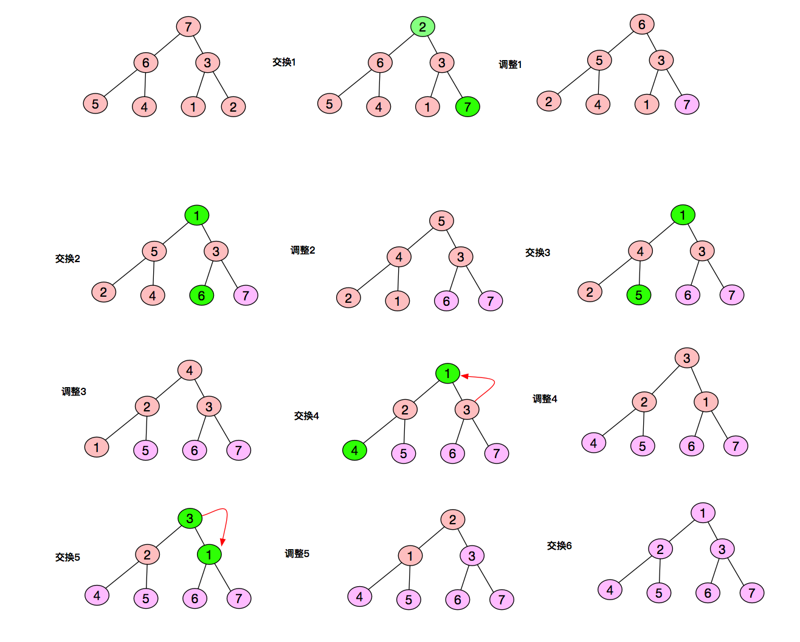

# 阿里巴巴2016研发工程师笔试题（二）

## 1
如果下列的公式成立：78+78=123，则采用的是_______进制表示的。

正确答案: C   你的答案: C (正确)

	A. 11
	B. 12
	C. 13
	D. 14
	E. 15
	F. 以上都不对

解析：

解方程，7x+8 + 7x + 8 = x^2 +2x + 3 得 x=13 ,故答案 C
## 2
在jdk1.5之后，下列 java 程序输出结果为______。

	int i=0;
	Integer j = new Integer(0);
	System.out.println(i==j);
	System.out.println(j.equals(i));

正确答案: B   你的答案: B (正确)

	A. true,false
	B. true,true
	C. false,true
	D. false,false
	E. 对于不同的环境结果不同
	F. 程序无法执行

解析：

本题是一个自动拆装箱的考题(自动拆装箱JDK需在1.5上），下面的讨论都不针对新开辟对象的情况：

1、基本型和基本型封装型进行“==”运算符的比较，基本型封装型将会自动拆箱变为基本型后再进行比较，因此Integer(0)会自动拆箱为int类型再进行比较，显然返回true；

2、两个Integer类型进行“==”比较，如果其值在-128至127，那么返回true，否则返回false, 这跟Integer.valueOf()的缓冲对象有关，这里不进行赘述。

3、两个基本型的封装型进行equals()比较，首先equals()会比较类型，如果类型相同，则继续比较值，如果值也相同，返回true

4、基本型封装类型调用equals(),但是参数是基本类型，这时候，先会进行自动装箱，基本型转换为其封装类型，再进行3中的比较。
## 3
下列java程序的输出结果为____。

	public class Example{
	    String str=new String("hello");
	    char[]ch={'a','b'};
	    public static void main(String args[]){
	        Example ex=new Example();
	        ex.change(ex.str,ex.ch);
	        System.out.print(ex.str+" and ");
	        System.out.print(ex.ch);
	    }
	    public void change(String str,char ch[]){
	        str="test ok";
	        ch[0]='c';
	    }
	}

正确答案: B   你的答案: A (错误)

	A. hello and ab
	B. hello and cb
	C. hello and a
	D. test ok and ab
	E. test ok and cb
	F. test ok and c
## 4
有关下述Java代码描述正确的选项是____。

	public class TestClass {
	   private static void testMethod(){
	        System.out.println("testMethod");
	   }
	   public static void main(String[] args) {
	        ((TestClass)null).testMethod();
	   }
	}

正确答案: F   你的答案: F (正确)

	A. 编译不通过
	B. 编译通过，运行异常，报NullPointerException
	C. 编译通过，运行异常，报IllegalArgumentException
	D. 编译通过，运行异常，报NoSuchMethodException
	E. 编译通过，运行异常，报Exception
	F. 运行正常，输出testMethod
## 5
袋子中分别一叠纸币，其中5元面值的纸币6张，10元面值的纸币5张，20元面值的纸币4张，从袋子中任意取4张纸币，则每种面值至少取到一张的概率为____。

正确答案: C   你的答案: C (正确)

	A. 8/91
	B. 25/91
	C. 48/91
	D. 53/91
	E. 60/91
	F. 63/91

(6C2 5C1 4C1 + 6C1 5C2 4C1 + 6C1 5C1 4C2) / 15C4 = 48/91
## 6
有一个扔骰子得返现的游戏：你扔一个骰子，扔到多少就可以得到和点数相同的返现。例如你扔到3，可以得到3元返现；扔到1，可以得到1元返现。当你扔完第一次骰子，看到点数后，你需要做出如下选择：

1、拿这个点数对应的返现，放弃扔第二次骰子；

2、再扔一次骰子，但此时你只能拿第二次扔的点数对应的返现。

那么，玩一轮这个游戏的期望收益是____元。

正确答案: D   你的答案: A (错误)

	A. 3.5
	B. 3.75
	C. 4
	D. 4.25
	E. 4.5
	F. 4.75

解析：

题目应该有种意思表达第一轮在4以下，就进行第二轮，所以期望为; 1/2*(7/2)+4/6+5/6+6/6=4.25
## 7
一个长度为100的循环链表，指针A和指针B都指向了链表中的同一个节点，A以步长为1向前移动，B以步长为3向前移动，一共需要同时移动多少步A和B才能再次指向同一个节点____。

正确答案: E   你的答案: E (正确)

	A. 99
	B. 100
	C. 101
	D. 49
	E. 50
	F. 51
## 8
某操作系统采用分页存储管理方式，下图给出了进程A的页表结构。如果物理页的大小为512字节，那么进程A逻辑地址为0x0457（十六 进制）的变量存放在____号物理内存页中。

	进程A页表：
	
	逻辑页    物理页
	
	0            9
	
	1            2
	
	2            4
	
	3            6
	
	4            5
	
	5            8

正确答案: C   你的答案: A (错误)

	A. 9
	B. 2
	C. 4
	D. 6
	E. 8
	F. 5

解析：

逻辑地址是按字节分的，512=2^9，也就是0x0457的后9位是页内地址，前7位为0000 010，也就是在第2页，对应物理页是4
## 9
在一个100人的团队活动中，主持人小猿亮出了一幅裙子的照片，大喊：”看出蓝黑色的举手！“，团队中有45人举手，然后小猿又喊：”看出白金色的举手！“，团队中有40人举手。机灵的小猿发现，有人从未举过手，有人举手了两次，两轮举手分出的四类人的数目恰好构成一个等差数列。请问有____人既能看出蓝黑色又能看出白金色。

正确答案: D   你的答案: D (正确)

	A. 0
	B. 15
	C. 30
	D. 35
	E. 50
	F. 55
## 10
将1,2,3,......,99,100任意排列成一个圈，相邻两数的差的绝对值求和最多为____。

正确答案: F   你的答案: B (错误)

	A. 100
	B. 198
	C. 200
	D. 500
	E. 2500
	F. 5000

解析：

最大排列为100 1 99 2 98 3.....51 49 50   所以和为99+98+97+..+1+(100-50)因为是一个圈所以，100和50相接，所以等于5000
## 11
已知二叉树中有45个叶节点，有25个度为1的节点，则二叉树的总结点数为____。

正确答案: C   你的答案: C (正确)

	A. 112
	B. 113
	C. 114
	D. 115
	E. 116
	F. 117
## 12
以下函数中，和其他函数不属于一类的是____。

正确答案: C   你的答案: C (正确)

	A. strcpy
	B. strncpy
	C. snprintf
	D. strcat
	E. strtok
	F. strncat

解析：

首先，使用场景不同。除了snprintf之外，其他的都是用于两个字符串之间进行比较、拷贝、拼接等操作的，而snprintf最主要是，要把一个用户变量按照一个format打印到字符串中。
其次，函数参数类型不同。除了snprintf之外，其他的都是定长参数，而snprintf是接受变长参数的。
最后，定义位置也不同，除了snprintf位于stdio.h之外，其他的都是string.h中的。
因此，snprintf和其他的一定不是一类的，单从头文件的划分就能看出来。

## 13
某单链表有5个元素，设单链表的节点结构为(data,next)，5个元素的data依次为（1、2、3、4、5），已知指针q指向节点3，指针p指向节点4，那么下面操作能将链表变为data依次为（1、2、3、5）的是____。（其中temp为节点类型指针，默认指向NULL）

正确答案: F   你的答案: F (正确)

	A. q=p->next;
	B. p=q->next;
	C. p->next=q->next;
	D. q->next=p->next; delete q;
	E. p->data=p->next->data; p->next=p->next->next; delete p->next;
	F. temp = p->next; p->next=temp->next; p->data=temp->data; delete temp;temp=NULL;
## 14
在1,2,3,.....1000中，有____个数各位乘积为0。

正确答案: D   你的答案: C (错误)

	A. 100
	B. 101
	C. 172
	D. 181
	E. 190
	F. 191

解析：

先求乘积不为0的。分一位数A：1-9 9个；两位数AB：9*9=81个，三位数ABC：9\*9\*9=729

总共9+81+729=819 

乘积为0的个数：1000-819=181
## 15
A、B、C、D四人应聘一个程序员职位，此职务的要求条件是：Java熟练；懂数据库开发；会Web开发；有C++经验。谁满足的条件最多，谁就被雇用。（1）把上面四个要求条件两两组合，每个组合都恰有一人满足。同时已知（2）A和Bjava熟练（3）B和C会Web（4）C和D懂数据库（5）D有C++经验那么，被雇用的是____。

正确答案: B   你的答案: B (正确)

	A. A
	B. B
	C. C
	D. D
	E. 四人机会均等
	F. 以上均错

## 16
一个单向链表队列中有一个指针p，现要将指针r插入到p之后，该进行的操作是____。

正确答案: C   你的答案: C (正确)

	A. p->next=p->next->next
	B. r->next=p;p->next=r->next
	C. r->next=p->next;p->next=r
	D. r=p->next;p->next=r->next
	E. r->next=p;p->next=r
	F. p=p->next->next
## 17
使用KMP算法在文本串S中找模式串P是一种常见的方法。假设S=P={xyxyyxxyx}，亦即将S对自己进行匹配，匹配过程中正确的next数组是____。

正确答案: C   你的答案: C (正确)

	A. 0,1,1,2,2,1,2,2,3
	B. 0,1,2,2,3,1,2,2,3
	C. 0,1,1,2,3,1,2,2,3
	D. 0,1,1,2,3,1,1,2,3
	E. 0,1,2,2,3,1,1,2,3
	F. 0,1,2,2,2,1,1,2,3
## 18
A为整数数组， N为A的数组长度，请问执行以下代码，最坏情况下的时间复杂度为____。

	void fun(int A[], int n) {                                                                       
	    for (int i = n - 1; i >= 1; i--) {                                                          
	        for (int j = 0; j < i; j++) {                                                            
	            if (A[j] > A[j+1]) {                                                                
	                int tmp = A[j + 1];                                                              
	                A[j + 1] = A[j];
	                A[j] = tmp;
	         }
	      }
	   }
	}

正确答案: B   你的答案: B (正确)

	A. O(N)
	B. O(N^2)
	C. O(Nlog(N))
	D. O(log(N))
	E. O(N^3)
	F. 无法确定
## 19
牛客某程序猿小杨每天接老婆下班回家。小杨在6点准时下班从公司开车出发，由于路上可能存在的堵车情况，小杨到老婆公司门口的时间点均匀的分布在6点20到6点30之间。老婆根据小杨的下班时间做了估计，到公司门口的时间点均匀的分布在6点25到6点30之间，如果小杨比老婆晚到公司门口将会挨骂，那么小杨被骂的概率是____。

正确答案: A   你的答案: A (正确)

	A. 1/4
	B. 1/3
	C. 1/2
	D. 2/3
	E. 3/4
	F. 以上都不对	
## 20
将整数数组（7-6-3-5-4-1-2）按照堆排序的方式原地进行升序排列，请问在整个排序过程中，元素3的数组下标发生过____次改变。

正确答案: C   你的答案: E (错误)

	A. 0
	B. 1
	C. 2
	D. 3
	E. 4
	F. 5

解析：

