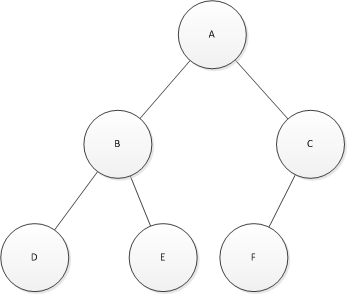
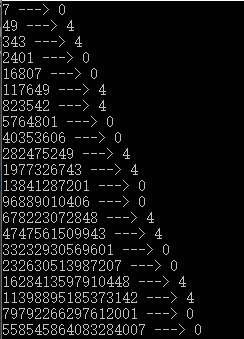

# 阿里巴巴2017实习生笔试题（一）

## 1
关于c++的inline关键字,以下说法正确的是()

正确答案: D   你的答案: C (错误)

	A. 使用inline关键字的函数会被编译器在调用处展开
	B. 头文件中可以包含inline函数的声明
	C. 可以在同一个项目的不同源文件内定义函数名相同但实现不同的inline函数
	D. 定义在Class声明内的成员函数默认是inline函数
	E. 优先使用Class声明内定义的inline函数
	F. 优先使用Class实现的内inline函数的实现
## 2
对N个数进行排序,在各自最优条件下以下算法复杂度最低的是()

正确答案: C D   你的答案: C (错误)

	A. 快速排序
	B. 堆排序
	C. 冒泡排序
	D. 插入排序
	E. 选择排序
	F. 归并排序
## 3
甲乙两个一样大小的杯子各自分别装着小于一半容积的水和酒精.现将甲杯子里的一部分水倒入乙杯子;之后将乙杯子的混合液倒入一些到甲杯子,此时甲杯子的液体恢复到最初的状态.假定水和酒精混合之后的体积等于混合之前的体积之和。 那么以下说法正确的是()

正确答案: A   你的答案: F (错误)

	A. 甲杯子里的酒精体积等于乙杯子里的水的体积
	B. 甲杯子里的酒精的体积等于乙杯子里的酒精的体积
	C. 甲杯子里的水的体积等于乙杯子里的酒精的体积
	D. 甲杯子里的水的体积等于乙杯子里的水的体积
	E. 甲杯子里的液体高于乙杯子里的液位
	F. 以上都不对
## 4
	main()
	{
	    char*a[]={"work","at","alibaba"};
	    char**pa=a;
	    pa++;
	    printf("%s",*pa);
	}

下列程序的执行结果是()

正确答案: A   你的答案: A (正确)

	A. at
	B. atalibaba
	C. ork
	D. orkatalibaba
	E. 编译错误
	F. 运行溢出
## 5
一个黑盒子里有若干红球和黑球,随机取出一个球是红球的概率是p.现在从黑盒子中拿出等量的红球和黑球后,随机取出一个球是红球的概率是q,如果p<q,那么以下说法正确的是()

正确答案: B   你的答案: B (正确)

	A. 最初红球的个数小于黑球的个数
	B. 最初红球的个数大于黑球的个数
	C. 最初红球的个数是黑球的的2倍
	D. 最初红球的个数是黑球的1/2
	E. 无法判断最初红球和黑球谁多谁少

## 6
以下二叉树的后序遍历结果是()

 
正确答案: D   你的答案: D (正确)

	A. (ABCDEF)
	B. (ABDECF)
	C. (FCEDBA)
	D. (DEBFCA)
	E. (FEDCBA)
	F. (EDBFCA)
## 7
在TCP/IP建立连接过程中,客户端和服务器端的状态转移说法错误的是?

正确答案: D   你的答案: D (正确)

	A. 经历SYN_RECV状态
	B. 经历SYN_SEND状态
	C. 经历ESTABLISHED状态
	D. 经历TIME_WAIT状态
	E. 服务器在收到syn包时将加入半连接队列
	F. 服务器接受到客户端的ack包后将从半连接队列删除
## 8
假设在n进制下,下面的等式成立,n值是()240*12=2880

正确答案: F   你的答案: F (正确)

	A. 19
	B. 18
	C. 17
	D. 16
	E. 15
	F. 以上都对

解析：

假设为n进值则 [2\*(n^2)+4\*(n^1)+0] \* [1\*n+2]=2\*（n^3）+8\*(n^2)+8\*(n^1) 

化简后居然为很等式 ，n为任一值
## 9
下面关于系统调用的描述中,错误的是()

正确答案: B   你的答案: B (正确)

	A. 系统调用把应用程序的请求传输给系统内核执行
	B. 系统调用中被调用的过程运行在"用户态"中
	C. 利用系统调用能够得到操作系统提供的多种服务
	D. 是操作系统提供给编程人员的接口
	E. 系统调用给用户屏蔽了设备访问的细节
	F. 系统调用保护了一些只能在内核模式执行的操作指令
## 10
关于linux的I/O复用接口select和epoll,下列说法错误的是()

正确答案: C   你的答案: D (错误)

	A. select调用时会进行线性遍历,epoll采用回调函数机制,不需要线性遍历
	B. select的最大连接数为FD_SETSIZE
	C. select较适合于有大量并发连接,且活跃链接较多的场景
	D. epoll较适用于有大量并发连接，但活跃连接不多的场景
	E. epoll的效率不随FD数目增加而线性下降
	F. epoll通过共享存储实现内核和用户的数据交互

解析：

### select
select能监控的描述符个数由内核中的FD_SETSIZE限制，仅为1024，这也是select最大的缺点，因为现在的服务器并发量远远不止1024。即使能重新编译内核改变FD_SETSIZE的值，但这并不能提高select的性能。

每次调用select都会线性扫描所有描述符的状态，在select结束后，用户也要线性扫描fd_set数组才知道哪些描述符准备就绪，等于说每次调用复杂度都是O（n）的，在并发量大的情况下，每次扫描都是相当耗时的，很有可能有未处理的连接等待超时。

每次调用select都要在用户空间和内核空间里进行内存复制fd描述符等信息。
### poll
poll使用pollfd结构来存储fd，突破了select中描述符数目的限制。

与select的后两点类似，poll仍然需要将pollfd数组拷贝到内核空间，之后依次扫描fd的状态，整体复杂度依然是O（n）的，在并发量大的情况下服务器性能会快速下降。
### epoll
epoll维护的描述符数目不受到限制，而且性能不会随着描述符数目的增加而下降。

服务器的特点是经常维护着大量连接，但其中某一时刻读写的操作符数量却不多。epoll先通过epoll_ctl注册一个描述符到内核中，并一直维护着而不像poll每次操作都将所有要监控的描述符传递给内核；在描述符读写就绪时，通过回掉函数将自己加入就绪队列中，之后epoll_wait返回该就绪队列。也就是说，epoll基本不做无用的操作，时间复杂度仅与活跃的客户端数有关，而不会随着描述符数目的增加而下降。

epoll在传递内核与用户空间的消息时使用了内存共享，而不是内存拷贝，这也使得epoll的效率比poll和select更高。
## 11
有无限的水源,一个5L无刻度桶和一个7L无刻度桶,则只利用这两个无刻度桶,将不能获得()L水

正确答案: F   你的答案: F (正确)

	A. 2
	B. 3
	C. 6
	D. 8
	E. 11
	F. 以上均能获得
## 12
7的2014次方这个整数的十位数字数是()

正确答案: D   你的答案: D (正确)

	A. 0
	B. 1
	C. 3
	D. 4
	E. 5
	F. 7

解析：

打表找规律 0 4 4 0 0 4 4 0 …… 0 4 4 0

4循环 
## 13
在100-999这900个自然数中,若将组成这个数的三个数字认为是三条线段的长度,那么是三条线段组成一个等腰三角形(包括等边)的共有()个.

正确答案: F   你的答案: 空 (错误)

	A. 45
	B. 91
	C. 121
	D. 142
	E. 156
	F. 165

解析：

	先考虑等边三角形情况 
	则a=b=c=1，2，3，4，5，6，7，8，9，此时n有9个 
	再考虑等腰三角形情况，若a，b是腰，则a=b 
	当a=b=1时，c＜a+b=2，则c=1，与等边三角形情况重复； 
	当a=b=2时，c＜4，则c=1，3（c=2的情况等边三角形已经讨论了），此时n有2个； 
	当a=b=3时，c＜6，则c=1，2，4，5，此时n有4个； 
	当a=b=4时，c＜8，则c=1，2，3，5，6，7，有6个； 
	当a=b=5时，c＜10，有c=1，2，3，4，6，7，8，9，有8个； 
	由加法原理知n有2+4+6+8+8+8+8+8=52个 
	同理，若a，c是腰时，c也有52个，b，c是腰时也有52个 
	所以n共有9+3×52=165个 
## 14
下面哪个不是线性表?

正确答案: D   你的答案: A (错误)

	A. 循环链表
	B. 队列
	C. 栈
	D. 关联数组
	E. 空字符串数组
	F. 双向链表

解析：

线性表，一对一关系，除首节点和尾节点外，每个结点都有一个直接前驱和后继结点。

关联数组，是数组的一组，在物理存储层面来讲，数组是连续的等大的存储单元构成，每个单元存储的数据类型都是一样的。

但是关联数组的特性是key-value，根据key来查找value，这也就意味着关联数组的每个元素可以无前后顺序是离散的不是线性连续的
## 15
下面的哪种排序算法在算复杂度平均不是O(nlogn)的?

正确答案: B   你的答案: B (正确)

	A. 快速排序
	B. 桶排序
	C. 合并排序
	D. 二叉树排序树排序
	E. 堆排序
## 16
某创业团队的一个很大的办公室(障碍和遮挡可以忽略)里有一个WIFI源,有1个工位由于距离WIFI源太远而接收不到信号.为了提高该工位的联网质量，准备在工位和WIFI信号源之间安装一个无线AP(相当于中继的,可以中转该工位上的计算机和WIFI之间的信号).只考虑从WIFI发出的信号，如果AP离WIFI源太近，就起不到中继的作用,如果AP离工位太远则可能连不上WIFI.因此AP有一个最佳的安装位置,那么关于AP最佳安装位置的说法正确的是()

正确答案: B   你的答案: B (正确)

	A. 如果WIFI源功率越大,那么AP最佳安装位置越靠近WIFI源
	B. 如果WiFi源功率越大,那么AP最佳的安装位置越靠近工位
	C. WIFI源功率和AP最佳安装位置无关.
	D. AP最佳安装位置在工位和WIFI信号源连线之外
	E. AP最佳安装位置在工位和WIFI信号源连线中点
	F. 以上说法都不对

## 17
有100个金币，分给10个人.第一个金币等概率地分给10个人之一.之后的每一个金币分配给第K个人的概率正比于这个人已经持有的金币数+1.在这样的分配机制下，关于每个人最终的金币个数的分布的说法错误的是()

正确答案: B   你的答案: B (正确)

	A. 每个人得到的金币的个数的期望是相等的
	B. 每个人的金币个数接近均匀分布
	C. 第一个金币给哪个人,哪个人的最终金币个数的期望就会更大
	D. 在中间的某个阶段金币个数越多的人，未来获得金币的可能性越大
## 18
在自由交换的情况下,只考虑偏好,小张用自己的小刀换了小王的橡皮.关于这个交换以下说法错误的是:

正确答案: F   你的答案: C (错误)

	A. 小张觉得橡皮比小刀更好
	B. 小王觉得小刀比橡皮更好
	C. 小张和小王总的财富里没有发生变化
	D. 小张和小王的效用值增加了
	E. 如果把小王换成小吴，那么这个交换可能就不会发生
	F. 小刀和橡皮等值
## 19
	struct st
	{
	    int *p;
	    int i;
	    char a;
	};
	int sz=sizeof(struct st);

如下C程序,在64位处理器上运行后sz的值是什么?

正确答案: C   你的答案: F (错误)

	A. 24
	B. 20
	C. 16
	D. 14
	E. 13
	F. 12

解析：

	考点：
	1.struct的对齐原则，注意不同的编译器有不同的效果。
	2.不同的数据类型在32位和64位下所占字节的区别
	32位编译器：
	      char ：1个字节
	      char*（即指针变量）: 4个字节（32位的寻址空间是2^32, 即32个bit，也就是4个字节。同理64位编译器）
	      short int : 2个字节
	      int： 4个字节
	      unsigned int : 4个字节
	      float: 4个字节
	      double: 8个字节
	      long: 4个字节
	      long long: 8个字节
	      unsigned long: 4个字节
	  64位编译器：
	      char ：1个字节
	      char*(即指针变量): 8个字节
	      short int : 2个字节
	      int： 4个字节
	      unsigned int : 4个字节
	      float: 4个字节
	      double: 8个字节
	      long: 8个字节
	      long long: 8个字节
	      unsigned long: 8个字节
	
	此处指针先占用8字节。int占用4字节，满足要求不用补齐，char占用一个字节，同时总的字节数必须满足8的倍数即16
## 20

	#include <iostream>       
	#include <vector>
	using namespace std;
	int main(void)
	{
	    vector<int>array;
	    array.push_back(100);
	    array.push_back(300);
	    array.push_back(300);
	    array.push_back(300);
	    array.push_back(300);
	    array.push_back(500);
	    vector<int>::iterator itor;
	    for(itor=array.begin();itor!=array.end();itor++)
	    {
	        if(*itor==300)
	        {
	            itor=array.erase(itor);
	        }
	    }
	    for(itor=array.begin();itor!=array.end();itor++)
	    {
	            cout<<*itor<<"";
	    }
	  return 0;
	}

下面这个代码输出的是()

正确答案: C   你的答案: E (错误)

	A. 100 300 300 300  300 500
	B. 100 3OO 300 300 500
	C. 100 300 300 500
	D. 100 300 500
	E. 100 500
	F. 程序错误

解析：

	vector::erase()：从指定容器删除指定位置的元素或某段范围内的元素 
	vector::erase()方法有两种重载形式 
	如下： 
	iterator erase(   iterator _Where); 
	iterator erase(   iterator _First,   iterator _Last); 
	如果是删除指定位置的元素时： 
	返回值是一个迭代器，指向删除元素下一个元素; 
	如果是删除某范围内的元素时：返回值也表示一个迭代器，指向最后一个删除元素的下一个元素;
	
	在本题中，当 *itor==300成立时，删除第一个值为300的元素，同时itor指向下一个元素（即是第二个值为300的元素），
	                            在for(;;itor++)执行itor，itor指向第三个值为300的元素，进入下一个循环
	         进入循环满足*itor==300，重复上面的过程，执行完循环，itor执行值为500的元素。
	所有整个过程中，只删除了2个值为300的元素。
## 21
下面关于一个类的静态成员描述中,不正确的是()

正确答案: C   你的答案: C (正确)

	A. 静态成员变量可被该类的所有方法访问
	B. 该类的静态方法只能访问该类的静态成员函数
	C. 该类的静态数据成员变量的值不可修改
	D. 子类可以访问父类的静态成员
	E. 静态成员无多态特性
## 22
给定的一个长度为N的字符串str,查找长度为P(P<N)的字符串在str中的出现次数.下面的说法正确的是()

正确答案: D   你的答案: D (正确)

	A. 不存在比最坏时间复杂度O(NP)好的算法
	B. 不存在比最坏时间复杂度O(N^2)好的算法
	C. 不存在比最坏时间复杂度O(P^2)好的算法
	D. 存在最坏时间复杂度为O(N+P)的算法
	E. 存在最坏时间复杂度为O(log(N+P))的算法
	F. 以上都不对

## 23
某体校选择校服,每套校服都包括短袖运动衫,长袖运动衫,厚外套,运动长裤和运动短裤组成.每种运动服有3个备选方案.老师请了部分学生来挑选自己喜欢的校服.结果发现任意3个学生都至少在一种运动服上选择互不相同,那么老师最多邀请了()名学生参加挑选.

正确答案: B   你的答案: 空 (错误)

	A. 7
	B. 8
	C. 9
	D. 10
	E. 11
	F. 12

解析：

懵逼树上懵逼果

## 24
有4副相同的牌,每副牌有4张不同的牌.先从这16张牌中,随机选4张出来.然后,在这4张牌中随机选择一张牌,然后把抽出的一张放回3张中,再随机选择一张牌.与上次选出的牌一样的概率是()

正确答案: C   你的答案: 空 (错误)
	
	A. 1/4
	B. 1/3
	C. 2/5
	D. 1/2
	E. 2/3
	F. 3/4

解析：

直接看第二次抽样即可，与第一次抽的是同一张牌的概率是1/4，不同张的概率是3/4，同一张的话肯定是一样，不同张的时候如果抽中一样的牌的概率是3/15，所以答案是1/4+3/4 * 3/15 = 2/5
