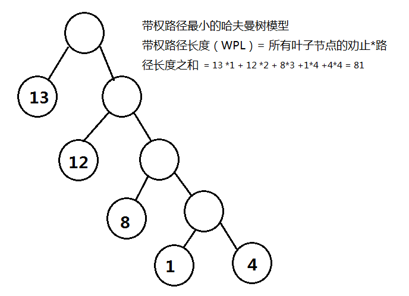

# 阿里巴巴2017实习生笔试题（二）

## 1
	下面哪一个不是动态链接库的优点？
	
	正确答案: B   你的答案: D (错误)
	
	A. 共享
	B. 装载速度快
	C. 开发模式好
	D. 减少页面交换

解析：

1 静态链接库的优点 
 (1) 代码装载速度快，执行速度略比动态链接库快； 
 (2) 只需保证在开发者的计算机中有正确的.LIB文件，在以二进制形式发布程序时不需考虑在用户的计算机上.LIB文件是否存在及版本问题，可避免DLL地狱等问题。 

2 动态链接库的优点 
 (1) 更加节省内存并减少页面交换；
 (2) DLL文件与EXE文件独立，只要输出接口不变（即名称、参数、返回值类型和调用约定不变），更换DLL文件不会对EXE文件造成任何影响，因而极大地提高了可维护性和可扩展性；
 (3) 不同编程语言编写的程序只要按照函数调用约定就可以调用同一个DLL函数；
 (4)适用于大规模的软件开发，使开发过程独立、耦合度小，便于不同开发者和开发组织之间进行开发和测试。

3 不足之处
 (1) 使用静态链接生成的可执行文件体积较大，包含相同的公共代码，造成浪费；
 (2) 使用动态链接库的应用程序不是自完备的，它依赖的DLL模块也要存在，如果使用载入时动态链接，程序启动时发现DLL不存在，系统将终止程序并给出错误信息。而使用运行时动态链接，系统不会终止，但由于DLL中的导出函数不可用，程序会加载失败；速度比静态链接慢。当某个模块更新后，如果新模块与旧的模块不兼容，那么那些需要该模块才能运行的软件，统统撕掉。这在早期Windows中很常见。
## 2
	n个数值选出最大m个数（3<m<n）的最小算法复杂度是
	
	正确答案: A   你的答案: B (错误)
	
	A. O(n)
	B. O(nlogn)
	C. O(logn)
	D. O(mlogn)
	E. O(nlogm)
	F. O(mn)

解析：

剑指offer第40题
1.最简单的方法：将n个数排序，排序后的前k个数就是最大的k个数，这种算法的复杂度是O（nlogn）

2.O（n）的方法：利用快排的patition思想，基于数组的第k个数来调整，将比第k个数小的都位于数组的左边，比第k个数大的都调整到数组的右边，这样调整后，位于数组右边的k个数最大的k个数(这k个数不一定是排好序的）

3.O(nlogk）的方法：先创建一个大小为k的最小堆，接下来我们每次从输入的n个整数中读入一个数，如果这个数比最小堆的堆顶元素还要大，那么替换这个最小堆的堆顶并调整。
## 3
	由权值分别为1、12、13、4、8的叶子节点生成一颗哈夫曼树，它的带权路径长度为()
	
	正确答案: F   你的答案: F (正确)
	
	A. 12
	B. 68
	C. 43
	D. 6
	E. 25
	F. 81

解析：

## 4
	阿里巴巴国际站的股票代码是1688，这个数字具有这样的特性，首先是个首位为1的4位数，其次恰巧有且仅有1个数字出现了两次。类似的数字还有：1861,1668等。这样的数字一共有()个。
	
	正确答案: F   你的答案: F (正确)
	
	A. 144
	B. 180
	C. 216
	D. 270
	E. 288
	F. 432
## 5
	工程师M发明了一种游戏：M将一个小球随机放入完全相同的三个盒子中的某一个，玩家选中装有球的盒子即获胜；开始时M会让玩家选择一个盒子（选择任何一个获胜概率均为1/3）;玩家做出选择后，M会打开没有被选择的两个盒子中的一个空盒，此时M会询问玩家是否更改选择（可以坚持第一次选择，也可以选择另一个没有打开的盒子），下列叙述正确的有（）。
	
	正确答案: E   你的答案: C (错误)
	
	A. 改选后，玩家获胜的概率还是1/3
	B. 若不改选，玩家的获胜概率是1/2
	C. 无论怎么选择，获胜的概率都是1/2
	D. 坚持原来的选择获胜概率更高
	E. 选择另一个没有被打开的盒子获胜概率更高
	F. 获胜概率取决于随机因素（如小球的实际位置）
## 6
	以下哪种方式，在读取磁盘上多个顺序数据块时的效率最高？
	
	正确答案: C   你的答案: E (错误)
	
	A. 中断控制方式
	B. DMA方式
	C. 通道方式
	D. 程序直接访问方式
	F. 循环检查I/O方式
	E. 以上访问方式都一样

解析：

答案选C，通道方式。

（1）程序直接访问方式跟循环检测IO方式，应该是一个意思吧，是最古老的方式。CPU和IO串行，每读一个字节（或字），CPU都需要不断检测状态寄存器的busy标志，当busy=1时，表示IO还没完成；当busy=0时，表示IO完成。此时读取一个字的过程才结束，接着读取下一个字。

（2）中断控制方式：循环检测先进些，IO设备和CPU可以并行工作，只有在开始IO和结束IO时，才需要CPU。但每次只能读取一个字。

（3）DMA方式：Direct Memory Access，直接存储器访问，比中断先进的地方是每次可以读取一个块，而不是一个字。

（4）通道方式：比DMA先进的地方是，每次可以处理多个块，而不只是一个块。
## 7
	下列不是进程间的通信方式的是（）
	
	正确答案: B   你的答案: B (正确)
	
	A. 管道
	B. 回调
	C. 共享内存
	D. 消息队列
	E. socket
	F. 信号量
## 8
	已知IBM的PowerPC是big-endian字节序列而Intel的X86是little-endian字节序，如果在地址啊存储的整形值时0x04030201，那么地址为a+3的字节内存储的值在PowerPC和Intel X86结构下的值分别是？
	
	正确答案: A   你的答案: A (正确)
	
	A. 1 4
	B. 1 3
	C. 4 1
	D. 3 1
	E. 4 4
	F. 1 1
## 9
	在TCP/IP建立连接过程中，客户端或服务器的状态转移说法错误的是？
	
	正确答案: D   你的答案: D (正确)
	
	A. 经历SYN_RECV状态
	B. 经历SYN_SEND状态
	C. 经历ESTABLISHED状态
	D. 经历TIME_WAIT状态
	E. 服务器在收到syn包时将加入半连接队列
	F. 服务器收到客户端的ack包后将从半连接队列删除
## 10

	已知一棵二叉树的先序和中序遍历序列如下：先序：A、B、C、D、E、F、G、H、I，J中序：C、B、A、E、F、D、I、H、J、G其后序遍历序列为：
	
	正确答案: E   你的答案: E (正确)
	
	A. C、B、D、E、A、G、I、H、J、F
	B. C、B、D、A、E、G、I、H、J、F
	C. C、E、D、B、I、J、H、G、F、A
	D. C、E、D、B、I、H、J、G、F、A
	E. C、B、F、E、I、J、H、G、D、A
	F. C、B、F、E、I、H、J、G、D、A

## 11
	设有四个元素A、B、C、D顺序进栈，在进栈过程中可以出栈，出栈次序错误的排列是
	
	正确答案: F   你的答案: F (正确)
	
	A. ABCD
	B. DCBA
	C. ACBD
	D. BCDA
	E. ACDB
	F. DCAB

## 12
	问题描述:
	
	#pragma pack(2)
	class BU
	{
	    int number;
	    union UBffer
	    {
	        char buffer[13];
	        int number;
	    }ubuf;
	    void foo(){}
	    typedef char*(*f)(void*);
	    enum{hdd,ssd,blueray}disk;
	}bu;
	
	sizeof(bu)的值是()
	
	正确答案: C   你的答案: E (错误)
	
	A. 20
	B. 21
	C. 22
	D. 23
	E. 24
	F. 非以上选项

解析：

	#pragma pack(2)
	class BU
	{
	    int number; 			// 4
	    union UBffer
	    {
	        char buffer[13];	// 13
	        int number; 		// 4
	    }ubuf; // union的大小取决于它所有的成员中，占用空间最大的一个成员的大小，并且需要内存对齐，
			   // 这里因为#pragma pack(2)，所以union的大小为14，
			   // 如果不写#pragma pack(2)，那么union大小为16【因为与sizeof（int）=4对齐】
	    void foo(){} 			//0
	    typedef char*(*f)(void*); 	//0
	    enum{hdd,ssd,blueray}disk; 	// 4
	}bu;

因此sizeof（union） = 4 + 14 + 0 + 0 + 4 = 22
## 13 
	同一个进程中的线程不共享的部分是()
	
	正确答案: F   你的答案: F (正确)
	
	A. 信号
	B. 堆
	C. 文件描述符
	D. 进程组id
	E. 代码段
	F. 栈空间
## 14
	下面关于系统调用的描述中,错误的是()
	
	正确答案: B   你的答案: B (正确)
	
	A. 系统调用把应用程序的请求传输给系统内核执行
	B. 系统调用中被调用的过程运行在"用户态"中
	C. 利用系统调用能够得到操作系统提供的多种服务
	D. 是操作系统提供给编程人员的接口
	E. 系统调用给用户屏蔽了设备访问的细节
	F. 系统调用保护了一些只能在内核模式执行的操作指令

## 15
	在动态分区分配方案中,系统回收主存,合并空闲空间时需修改空闲区表,以下哪种情况空闲区会减1?
	
	正确答案: F   你的答案: F (正确)
	
	A. 只要回收主存,空闲区数就会减一
	B. 空闲区数和主存回收无关
	C. 无上邻空闲区,也无下邻空闲区
	D. 有上邻空闲区,但无下邻空闲区
	E. 有下邻空闲区,但无上邻空闲区
	F. 有上邻空闲区,也有下邻空闲区
## 16
	下面关于虚拟局域网VLAN的叙述错误的是()
	
	正确答案: D   你的答案: D (正确)
	
	A. VLAN是由局域网网段构成的与物理位置无关的逻辑组
	B. 利用以太网交换机可以很方便地实现VLAN
	C. 每一个VLAN的工作站可处在不同的局域网中
	D. 不同VLAN内的用户可以相互之间直接通信
	E. vLAN可以强化网络安全和网络管理
	F. VLAN能灵活控制广播活动
## 17
	刚毕业的小王上班有两路公交车都可以从家到公司.如果只等A车,平均需要5分钟才等到;如果只等B车,平均需要7分钟才能等到.假定两辆车运行时间独立,那么小王平均需要等多长时间才能等到A车或B车?
	
	正确答案: C   你的答案: C (正确)
	
	A. 2分钟
	B. 2分35秒
	C. 2分55秒
	D. 3分钟
	E. 5分钟
	F. 6分钟
## 18
	一个黑色袋子中装有5个红球，5个蓝球，5个黄球，从中抽取三次，每次抽一个球，取完不放回，则每种颜色球各得一个的概率是（）
	
	正确答案: F   你的答案: F (正确)
	
	A. 1/5
	B. 1/4
	C. 1/3
	D. 12/91
	E. 20/91
	F. 25/91

## 19

	int* pint = 0; 
	pint += 6; 
	cout << pint << endl;
	
	以上程序的运行结果是：
	
	正确答案: C   你的答案: F (错误)
	
	A. 12
	B. 72
	C. 24
	D. 0
	E. 6
	F. 任意数

解析：

指向地址零加6，int是4位地址，值为24
## 20
	某种5号(AA)充电电池在充满电之后的电量是900毫安时和1100毫安时的可能性各为1/2。如果将将电池串联使用，常常会因为其中一部分电池先放电完毕，而且其它电池还有100毫安时以上的电量时，引起先放完电的电池损坏。那么以下说法正确的是：
	
	正确答案: C   你的答案: C (正确)
	
	A. 如果两节这样的电池串联使用，那么必然有1节电池会损坏。
	B. 如果有许多节这样的电池串联使用，则至少会有1节电池会损坏。
	C. 如果放电电量控制在900毫安时以内，则不会有电池损坏
	D. 当有2n节电池串联使用时，至多会有n节电池会损坏
	E. 当串联的电池个数是奇数时，不会有电池损坏。
	F. 电量少的电池一定会损坏。
## 21
	下面哪种协议在数据链路层？
	
	正确答案: F   你的答案: A (错误)
	
	A. ARP
	B. ICMP
	C. FTP
	D. UDP
	E. HTTP
	F. VPN

## 22
	一组记录排序码为(5 11 7 2 3 17),则利用堆排序方法建立的初始堆为
	
	正确答案: C   你的答案: C (正确)
	
	A. (11 5 7 2 3 17)
	B. (11 5 7 2 13 3)
	C. (17 11 7 2 3 5)
	D. (17 11 7 5 3 2)
	E. (17 7 11 3 5 2)
	F. (17 7 11 3 2 5)
## 23
	甲乙丙三人是阿里巴巴开发人员，ABC三人是阿里巴巴测试人员，每个开发都有对应的测试人员。主管介绍说：“A对应的开发是乙的好友，并在三个开发中最年轻；丙的年龄比C对应的开发大。”则开发和测试的对应关系为（）。
	
	正确答案: B   你的答案: B (正确)
	
	A. 甲-A，乙-B，丙-C
	B. 甲-A，乙-C，丙-B
	C. 甲-B，乙-A，丙-C
	D. 甲-B，乙-C，丙-A
	E. 甲-C，乙-A，丙-B
	F. 甲-C，乙-B，丙-A
## 24
	某机器人可以说真话或者假话。某程序设定其周末（周六周日）说真话，周四说谎话，其他日期随机。某测试打算验证该功能。他连续七天，每天问机器人“你在哪里出生的？”，在前六天得到了这样的答案：阿里，淘宝，阿里，淘宝，天猫，淘宝。那么第七天，机器人的回答应该是（）
	
	正确答案: A   你的答案: D (错误)
	
	A. 阿里
	B. 淘宝
	C. 天猫
	D. 阿里或淘宝
	E. 阿里或天猫
	F. 天猫或淘宝