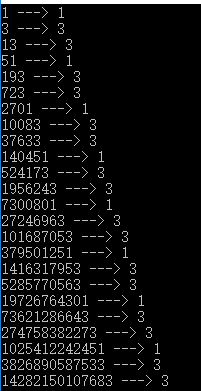
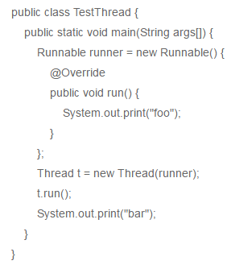
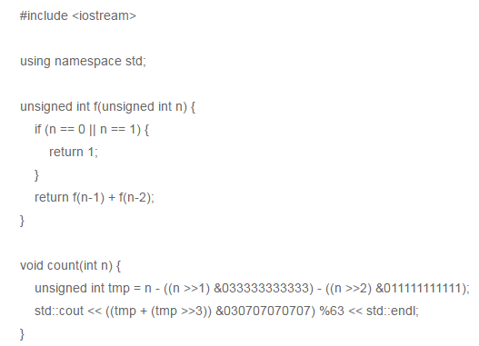

# 阿里巴巴2017秋招研发工程师笔试题

阿里的选择题比其他的选项要多一些（6个），第10题和第17题是机器学习的题目。

## 1
有个特殊的餐厅，对客人的要求是如果要离开餐厅一定要看下餐厅内有没有比你迟进来的人，一定要所有比你迟进来的人离开后你才能离开，有一天甲，乙，丙，丁四个客人先后进入了这家餐厅，那么他们离开的顺序不可能是：

正确答案: E   你的答案: E (正确)
	
	A. 丙，乙，甲，丁
	B. 甲，乙，丙，丁
	C. 乙，甲，丙，丁
	D. 乙，丙，甲，丁
	E. 丁，丙，甲，乙
	F. 丁，丙，乙，甲

解析：

栈的矫情考法
## 2
在关系型是数据库中，有两个不同的事务同时操作数据库中同一表的同一行，不会引起冲突的是：

正确答案: F   你的答案: F (正确)

	A. 其中一个DELETE操作，一个是SELECT操作
	B. 其中两个都是UPDATE
	C. 其中一个是SELECT，一个是UPDATE
	D. 其中一个SELECT
	E. 其中一个是DELETE，另一个是UPDATE
	F. 两个都是DELETE

解析：

当要删除的记录在数据库中不存在的时候，是不会报错的。
## 3
众所周知我们所处的宇宙的质能公式是E=mc 2 ，其中c是真空中的光速。和我们的宇宙平行的另一个宇宙meta，研究显示他们使用的质能公式是E=(2+ √3) m ，当一个物体的质量很大的时候，对应的能量E非常大，数据也非常的长。但meta宇宙里面的智慧生物非常的懒，他们只愿意把E取整，然后记录对应的能量E的最后一位整数，比如m=0时，他们会记录1，m=1时，他们会记录3，m=2时，他们会记录3.现在请问当m=80时，他们会记录多少？

正确答案: C   你的答案: C (正确)

	A. 1
	B. 2
	C. 3
	D. 4
	E. 5
	F. 6

解析：

个人是打表找规律的。

规律是 1 3 3 1 3 3 …… 1 3 3

## 4
页高速缓存是Linux kerne使用的主要的磁盘缓存技术。它允许系统把存放在磁盘上的一些数据保留在内存中，以便减少对磁盘的访问。进程对页高速缓存区中的数据修改之后，数据页被标记为“脏数据”在下列哪些条件下，脏数据不会被写入磁盘？

正确答案: B E   你的答案: B E (正确)

	A. 页高速缓存空间不足
	B. 突然断电
	C. 变脏以来，太久没有过更新
	D. 通过系统调用（sync（），fsync（），fdataasync（））来强行对将对快设备的更新同步到磁盘
	E. 内存足够大
	F. 磁盘足够大
## 5
设一组初始关键字记录关键字为（ 12,15,1,18,2,35,30,11 ），则以 12 为基准记录的一趟快速排序结束后的结果为

正确答案: D   你的答案: F (错误)

	A. 11，1，2，12，35，18，30，15
	B. 11，2，1，12，15，18，35，30
	C. 1，2，11，12，15，18，35，30
	D. 11，2，1，12，18，35，30，15
	E. 1，2，11，12，15，18，30，35
	F. 以上都不是

解析：

跟快排的具体实现方式有关
## 6
多项式 P(X)=a+bx+cx^2+dx^3 ，对于任意 x ，计算 P(X) 中最少需要用到乘法操作的次数是多少？

正确答案: A   你的答案: D (错误)

	A. 3
	B. 4
	C. 5
	D. 6
	E. 1
	F. 2

解析：

一般地， 一元n次多项式 的求值需要经过2n-1次乘法和n次加法，而 秦九韶算法 只需要 n次乘法和n次加法 。

题目中P(X)是3次多项式，所以3次乘法。
## 7
有一个班31人，女同学15人，男同学16人，现在要玩一个结组游戏，每组由男女两名同学构成，每个同学最多只能在一个组。结组的同学可以到老师那里领100元钱，然后按照预先分配的协议进行分配，钱最小可分单元为1元。未能结组的同学无法领到钱，不允许在组之间传递利益。那么一下命题正确的是：

正确答案: A   你的答案: A (正确)

	A. 男生和女生可以得到一样多的钱
	B. 男生最多得49元
	C. 男生最多得47元
	D. 男生最多得46元
	E. 男生最多得1元
	F. 男生最多得0元
## 8
现代的企业是建立在大规模协作的基础上的，员工之间，团队之间，部门之间，企业之间的协作都是成功的重要因素。好的企业在协作上是高效的。以下说法中不合适的是（）

正确答案: B   你的答案: B (正确)

	A. 一个项目能容纳的人员是有限的，当增加到一定规模项目进度反而会变慢。
	B. 一个项目协作为了办证信息对称，多方参与的情况下直接召集多方在一起开会就能协调好
	C. 协作建立的条件包括互补和共赢
	D. 能力结构类似的成员之间较多样互补型员工之间更容易产生竞争关系
	E. 协作中的权利和责任应当相称
	F. 如果有可能的话，信息交互较多的事务更合适在一个团队内或有一个人完成，相较于进行分工。
## 9
以下程序的运行结果是？

正确答案: A   你的答案: D (错误)

	A. foobar
	B. barfoo
	C. foobar或者barfoo都有可能
	D. Bar
	E. Foo
	F. 程序无法正常运行

解析：

调用start（）后，线程会被放到等待队列，等待CPU调度，并不一定要马上开始执行，只是将这个线程置于可动行状态。然后通过JVM，线程Thread会调用run（）方法，执行本线程的线程体。

1.start（）方法来启动线程，真正实现了多线程运行。这时无需等待run方法体代码执行完毕，可以直接继续执行下面的代码；

2.run（）方法当作普通方法的方式调用。程序还是要顺序执行，要等待run方法体执行完毕后，才可继续执行下面的代码， 这样就没有达到写线程的目的。
## 10
输入图片大小为200×200，依次经过一层卷积（kernel size 5×5，padding 1，stride 2），pooling（kernel size 3×3，padding 0，stride 1），又一层卷积（kernel size 3×3，padding 1，stride 1）之后，输出特征图大小为：

正确答案: C   你的答案: 空 (错误)

	A. 95
	B. 96
	C. 97
	D. 98
	E. 99
	F. 100
## 11
一个二叉树有100个子节点数为2的节点，100个子节点数为1的节点，那么个子节点数为0的节点（叶节点）的个数为：

正确答案: A   你的答案: A (正确)

	A. 101
	B. 100
	C. 200
	D. 300
	E. 99
	F. 1
## 12
某种类型的双核 CPU 的性能提升了 1/3 ，假定该提升是通过对每条指令缩短执行时间实现的，那么它每条指令执行时间缩短了 () 。

正确答案: A   你的答案: A (正确)

	A. 1/4
	B. 1/8
	C. 1/3
	D. 1/6
	E. 1/5
	F. 1/2

## 13
一个map-reduce任务由m个mapper和r个reducer构成，计算的效率可以认为正比于mr的乘积（数据管道的个数），在限定任务的mr乘积约等于10000的情况下，假定每个mapper和每个reducer的成本分别为1和7，那么最佳的资源分配最接近于以下哪个方案？

正确答案: C   你的答案: C (正确)

	A. mapper100个，reducer100个
	B. Mapper200个，reducer50个
	C. Mapper264个，reducer38个
	D. Mapper316个，reducer32个
	E. Mapper500个，reducer20个
	F. Mapper1000个，reducer10个
## 14
如果你有相关经验，很多景点的餐馆商铺经营方式很有趣。以下描述错误的是：

正确答案: F   你的答案: B (错误)

	A. 由于景点的大部分顾客是一次性的，因此商铺的信用在其他条件相同时可能更低
	B. 景点的餐馆为了招揽顾客使用托儿会比居民区的餐馆使用托儿效果好
	C. 景点常常卖一些当地特产，比如青岛的海边会有卖贝壳的，这些贝壳产自附近的海域
	D. 店铺使用托儿的有效原因是，人们常常做出多数人做出的选择，而忽视自己自然状态下的决策
	E. 一些景点在出口位置上安排一个商店，商店内的通道曲折，为的是顾客多花些时间看东西
	F. 景点内一些玩射箭的场所经营状况会比在居民区附近设置的类似场所好，原因是景点内的游人玩起来更在状态
## 15
一个机器人玩抛硬币的游戏，一直不停的抛一枚不均匀的硬币，硬币有A,B两面，A面的概率为3/4，B面的概率为1/4。问第一次出现连续的两个A年的时候，机器人抛硬币的次数的期望是多少？

正确答案: F   你的答案: C (错误)

	A. 9/4
	B. 11/4
	C. 15/4
	D. 4
	E. 5
	F. 28/9

解析：

假设T为扔的次数（期望）。 那么如果扔到B，则重新开始扔，即再扔T次。

第一次扔到B，则重新扔，即1/4*(1+T)；这时1+T是结束游戏所扔次数；

第一次扔到A，第二次扔到B，重新扔，即3/4*1/4*(2+T)；2+T是结束游戏所仍次数；

第一次扔到A，第二次扔到A，结束游戏。3/4*3/4*2；2为结束游戏所仍次数；

所以T=1/4*(1+T)+3/4 *1/4*(2+T)+3/4 *3/4 *2；算得T为28/9
## 16
小a和小b一起玩一个游戏，两个人一起抛掷一枚硬币，正面为H，反面为T。两个人把抛到的结果写成一个序列。如果出现HHT则小a获胜，游戏结束。如果HTT出现则小b获胜。小a想问一下他获胜的概率是多少？

正确答案: C   你的答案: B (错误)

	A. 3/4
	B. 1/2
	C. 2/3
	D. 5/9
	E. 1/3
	F. 1/4

## 17
假定某同学使用Naive Bayesian（NB）分类模型时，不小心将训练数据的两个维度搞重复了，那么关于NB的说法中正确的是：

正确答案: B D   你的答案: 空 (错误)

	A. 这个被重复的特征在模型中的决定作用会被加强
	B. 模型效果相比无重复特征的情况下精确度会降低
	C. 如果所有特征都被重复一遍，得到的模型预测结果相对于不重复的情况下的模型预测结果一样。
	D. 当两列特征高度相关时，无法用两列特征相同时所得到的结论来分析问题
	E. NB可以用来做最小二乘回归
	F. 以上说法都不正确

## 18
以下哪个行为，不会明显加剧客户端运行过程中的卡顿：

正确答案: C   你的答案: D (错误)

	A. 在主线程集中处理耗时的操作
	B. 在子线程集中处理耗时的操作
	C. 在其它进程集中处理耗时的操作
	D. 提高后台线程的优先级
	E. 降低主线程的优先级
	F. 页面存在多个重叠显示的控件

## 19
以下程序的输出是：
 

 
正确答案: D   你的答案: B (错误)

	A. 1，6
	B. 2，5
	C. 2，4
	D. 3，5
	E. 4，7
	F. 1，1

解析：

首先第一个f函数  是个斐波那契数列 可知  f(7)=21   f(9)=55

下边count函数 是用来统计n的二进制表示中1个数量。count函数的原理 你可以去查MIT HAKM 算法。

所以 答案是3 5