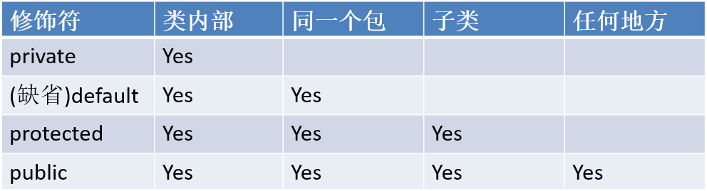

# Android 岗位相关笔试面试问题归纳

## 0 CS 基础

### 0.1 手写快排

	/**
	 * 快速排序
	 */
	public class QuickSort extends BaseSort {
	    @Override
	    public void sort(Comparable[] a) {
	        sort(a, 0, a.length - 1);
	    }
	
	    private static void sort(Comparable[] a, int low, int high) {
	        if (high <= low)
	            return;
	        int j = partition(a, low, high);
	        sort(a, low, j - 1);
	        sort(a, j + 1, high);
	    }
	
	    private static int partition(Comparable[] a, int low, int high) {
	        int i = low;
	        int j = high + 1;
	        Comparable v = a[low];
	        while (true) {
	            while (less(a[++i], v))
	                if (i == high)
	                    break;
	            while (less(v, a[--j]))
	                if (j == low)
	                    break;
	            if(i>=j)
	                break;
	            exch(a, i, j);
	        }
	        exch(a,low,j);
	        return j;
	    }
	}

	/**
     * 比较 v 和 w
     * 若 v<w，返回 true，否则返回 false
     */
    protected static boolean less(Comparable v, Comparable w) {
        return v.compareTo(w) < 0;
    }

    /**
     * 交换数组 a 中的 i 和 j
     */
    protected static void exch(Comparable[] a, int i, int j) {
        Comparable t = a[i];
        a[i] = a[j];
        a[j] = t;
    }

### 手写单例

	public class Singleton {	
	    private static volatile Singleton instance;	

	    private Singleton() {	
	    }
	
	    public static Singleton getInstance() {
	        if (instance == null) {
	            synchronized (Singleton.class) {
	                if (instance == null) {
	                    instance = new Singleton();
	                }
	            }
	        }
	        return instance;
	    }
	}

### 0.2 进程与线程

### TCP 三次握手 四次挥手

### 0.3 进程间通信
管道、消息队列、套接字、信号量、共享内存

## SQL 
### MySQL中myisam与innodb的区别，至少5点
	1.InnoDB支持事物，而MyISAM不支持事物
	2.InnoDB支持行级锁，而MyISAM支持表级锁
	3.InnoDB支持MVCC, 而MyISAM不支持
	4.InnoDB支持外键，而MyISAM不支持
	5.InnoDB不支持全文索引，而MyISAM支持。
	6.InnoDB不能通过直接拷贝表文件的方法拷贝表到另外一台机器， myisam 支持
	7.InnoDB表支持多种行格式， myisam 不支持
	8.InnoDB是索引组织表， myisam 是堆表

### innodb引擎的4大特性
	1.插入缓冲（insert buffer)
	2.二次写(double write)
	3.自适应哈希索引(ahi)
	4.预读(read ahead)

#### innodb的事务与日志的实现方式
(1)、有多少种日志

redo和undo
(2)、日志的存放形式

redo：在页修改的时候，先写到 redo log buffer 里面， 然后写到 redo log 的文件系统缓存里面(fwrite)，然后再同步到磁盘文件（ fsync）。
Undo：在 MySQL5.5 之前， undo 只能存放在 ibdata\*文件里面， 5.6 之后，可以通过设置 innodb_undo_tablespaces 参数把 undo log 存放在 ibdata*之外。
(3)、事务是如何通过日志来实现的，说得越深入越好

基本流程如下：
因为事务在修改页时，要先记 undo，在记 undo 之前要记 undo 的 redo， 然后修改数据页，再记数据页修改的 redo。 Redo（里面包括 undo 的修改） 一定要比数据页先持久化到磁盘。 当事务需要回滚时，因为有 undo，可以把数据页回滚到前镜像的
状态，崩溃恢复时，如果 redo log 中事务没有对应的 commit 记录，那么需要用 undo把该事务的修改回滚到事务开始之前。 如果有 commit 记录，就用 redo 前滚到该事务完成时并提交掉。

### 事物的4种隔离级别

读未提交(read uncommitted)
读已提交(read committed)
可重复读(repeatable read)
串行(serializable)

### 二叉搜索树、红黑树、B树、B+树

#### 二叉搜索树
二叉搜索树上的基本操作所花费的时间与这棵树的高度成正比。对于有n个结点的一棵完全二叉树来说，这些操作的最坏运行时间为 O(lg n)。然而，如果这棵树是 一条n个结点组成的线性链，那么同样的操作就要花费 O(n) 的最坏运行时间。

#### 红黑树

红黑树是许多“平衡”搜索树中的一种，可以保证在最坏情况下基本动态集合操作的时间复杂度为 O(lg n)。

红黑树确保没有一条路径会比其他路径长出2倍，因而是近似于平衡的。

一棵红黑树是满足下面红黑性质的二叉搜索树：

1. 每个结点或是红色的，或是黑色的。
2. 根结点是黑色的。
3. 每个叶结点（NIL）是黑色的。
4. 如果一个结点是红色的，则它的两个子结点都是黑色的。
5. 对每个结点，从该结点到其所有后代叶结点的简单路径上，均包含相同数目的黑色结点。

#### B 树

许多数据库系统使用 B 树或者 B 树的变种来存储信息。

B树与红黑树的不同之处在于 B 树的结点可以有很多孩子。

#### B+树

B+树是应文件系统所需而提出的一种B树的变型。一棵 m 阶 B+树和 m 阶 B树的差异在于：

（1）有n棵子树的结点中含有n个关键字       
（2）所有的叶子结点中包含了全部关键字的信息，及指向含这些关键字记录的指针，且叶子结点本身依关键字的大小自小而大顺序链接。    
（3）所有的非终端结点可以看作索引部分，结点中仅含其子树（根结点）中的最大（或最小）关键字。

### HTTP 状态码
 	301 redirect: 301 代表永久性转移(Permanently Moved)
	302 redirect: 302 代表暂时性转移(Temporarily Moved )
## 1 Java SE 基础

### 1.1 面向对象基本特征

此题有不同版本，有人说三个，有人说四个。

三个：封装、继承、多态

四个：抽象、封装、继承、多态

### 1.2 java 基本类型

- byte 8bit
- short 16bit
- int 32bit
- long 64bit
- float 32bit
- double 64bit
- char 16bit
- boolean ?bit

### 1.3 java 权限修饰符

### 1.5 重载与重写

- 重载（Overload）：如果多个方法（比如，StringBuilder 构造器方法）有相同的名字、不同的参数，便产生了重载。
- 重写（Override）：

### 接口和抽象类

### 1.4 String、StringBuffer 与 StringBuilder

- String：不可变
- StringBuffer：线程安全，效率较 StringBuilder 低
- StringBuilder：线程不安全

### 1.6 HashTable、HashMap 与 ConcurrentHashMap

### 1.7 ArrayList 与 LinkedList

## 2 Android 基础

### 2.1 Android 四大基本组件

### 2.2 Activity 生命周期

### 2.3 Service 启动方式

### 2.4 广播启动方式

### 2.5 Android IPC

	Bundle
	文件共享
	AIDL
	Messager
	ContentProvider
	Socket

### 2.6 ANR

系统都设计了哪些ANR：

1:KeyDispatchTimeout(5 seconds) --主要类型

按键或触摸事件在特定时间内无响应

2:BroadcastTimeout(10 seconds)

BroadcastReceiver 在特定时间内无法处理完成

3:ServiceTimeout(20 seconds) 

Service 在特定的时间内无法处理完成

除此之外,还有 ContentProvider,只是一般很少见。

广播和服务,在后台启动的时候,时间会是 60s,于是我们在分析问
题时候,尽量将 anr 的 log 分析,将查看的 log 从发生 anr 的时刻向
前找 1 分钟。

### ListView 与 RecyclerView